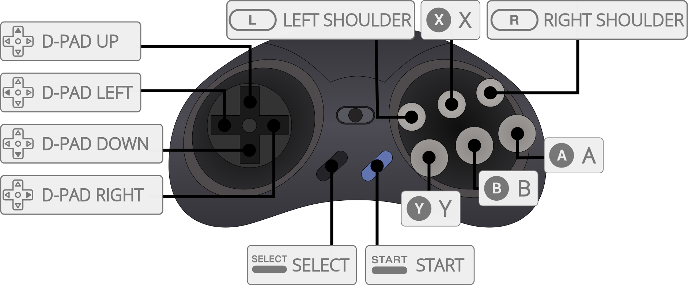

# Libretro Input API

## Overview

Libretro's input system is based on abstracted input device types which are polled via callbacks provided by the libretro API. For core developers, the value of these abstractions is that cores can be coded with an 'ideal' input type abstraction in mind while giving frontend developers and users the freedom to map that abstraction to any number of hardware or software input sources.

For example, native libretro cores and source ports could be written to poll the RetroPad, the gamepad abstraction, while the frontend allows the user to map the RetroPad to their physical keyboard or mouse. This is also an advantage for emulator cores, where the input abstraction is selected to match the type or types of input available on the emulated system. For example, the libretro pointer abstraction is available for emulating input for systems like the Nintendo DS; frontends can allow the user to map a mouse or other suitable input device in addition to a hardware touchscreen. Meanwhile, on platforms like smartphones and tablets, the user can utilize their touch hardware for a more authentic emulation experience without as much code for the core to maintain.

Libretro input device abstractions include:

 * RetroPad
    - Digital Gamepad or Joystick
    - Digital Gamepad or Joystick with Analog Controls
 * Mouse
 * Pointer
 * Keyboard
 * Lightgun

### Reference implementations
The [`libretro-test` core](https://github.com/libretro/libretro-samples/tree/master/tests/test) provides a reference implementation in the C programming language for many aspects of the libretro input API. As of March 2021, `libretro-test` does not yet incorporate the latest additions to the input API, but still serves as an important resource.

# Input Abstractions

## RetroPad
The **RetroPad** is a controller abstraction interface defined by the Libretro API. It is the primary input device for a libretro frontend. Unless a core absolutely requires the use of a keyboard with no possible fallback for gamepad-type controls, a [[Libretro core]] should always be implemented as such that it is directly controllable by the RetroPad.


In terms of button layout and functionality, the RetroPad is based on the original PlayStation gamepad and the Super Nintendo gamepad.


Above: An example of the RetroPad gamepad abstraction mapped to the Megadrive 6-Button gamepad.

### Digital RetroPad
`RETRO_DEVICE_JOYPAD`: A RetroPad abstraction with all digital controls can be used. The conceptual arrangement for the buttons for the RetroPad is inspired by the Super Nintendo controller and the Sony Playstation DualShock.

The minimum implementation required for the digital RetroPad abstraction:

* At least two shoulder buttons
* At least four face buttons
* At least one D-pad
* A `Start` button and a `Select`/`Back` button.

### Analog RetroPad
`RETRO_DEVICE_ANALOG`: An analog subtype of the RetroPad abstraction with one or more analog inputs can be used. Conceptually inspired by the Sony DualShock2, this adds two analog sticks to the digital RetroPad and allows all buttons to return analog values in the range of `[-0x7fff, 0x7fff]`, although some devices may return `-0x8000`. Positive X axis is right. Positive Y axis is down. Buttons are returned in the range `[0, 0x7fff]`.

**hiddenasbestos**, author of the current revision of the analog RetroPad API, [provides a reference implementation in C](https://github.com/libretro/libretro-common/pull/50#issue-153412324) that checks for analog button values before falling back to the digital `RETRO_DEVICE_JOYPAD`. This approach supports frontends that do not implement the analog input API.
```c
static uint16_t get_analog_button( retro_input_state_t input_state_cb,
                                   int player_index,
                                   int id )
{
    uint16_t button;

    // NOTE: Not all front-ends support analog buttons (or pre-date it) 
    // so we need to handle this in a graceful way.

    // First, try and get an analog value using the new libretro API constant
    button = input_state_cb( player_index,
                             RETRO_DEVICE_ANALOG,
                             RETRO_DEVICE_INDEX_ANALOG_BUTTON,
                             id );

    if ( button == 0 )
    {
        // If we got exactly zero, we're either not pressing the button, or the front-end
        // is not reporting analog values. We need to do a second check using the classic
        // digital API method, to at least get some response - better than nothing.

        // NOTE: If we're honestly just not holding the button, we're still going to get zero.

        button = input_state_cb( player_index,
                                 RETRO_DEVICE_JOYPAD,
                                 0,
                                 id ) ? 0x7FFF : 0;
    }

    return button;
}
```

## Mouse Input
`RETRO_DEVICE_MOUSE`: X and Y coordinates are reported relatively to last poll (poll callback) and it is up to the core to keep track of where the pointer coordinates with respect to the display.

## Pointer Input
`RETRO_DEVICE_POINTER`: The pointer abstraction represents pen, stylus, touch and other input devices for emulated devices that use absolute coordinates with respect to the screen.

Coordinates in X and Y are reported as `[-0x7fff, 0x7fff]`: `-0x7fff` corresponds to the far left/top of the screen, `0x7fff` to the far right/bottom of the screen. The "screen" is defined as area that is passed to the frontend and later displayed on the monitor. The frontend is free to scale/resize this screen as it sees fit but `(X, Y) = (-0x7fff, -0x7fff)` will always correspond to the top-left pixel of the display.

## Keyboard Input
`RETRO_DEVICE_KEYBOARD`: The libretro API allows a core to poll the frontend for the raw current pressed state of keys. There is also a callback available which is called by the frontend in response to keyboard events. `down` is set if the key is being pressed and `false` if it is being released.

Even though the frontend should try to synchronize keypresses with keycode events, cores should assume that multiple characters can be generated from a single keypress. In other words, keycode events should be treated separately from character events. Similarily if only a keycode event is generated with no corresponding character, the character should be `0`.

## Lightgun Input
`RETRO_DEVICE_LIGHTGUN`: The libretro lightgun abstraction reports X/Y coordinates in screen space (similar to the pointer) in the range `[-0x8000, 0x7fff]` in both axes, with zero being center and `-0x8000` being out of bounds. The core an query the on/off screen state of the lightgun. It features a trigger, start/select buttons, auxiliary action buttons and a directional pad. A forced off-screen shot can be requested for auto-reloading function in some games.
