# Helping With RetroArch Translations

<iframe width="560" height="315" src="https://www.youtube-nocookie.com/embed/V-j08aSegHM" title="YouTube video player" frameborder="0" allow="accelerometer; autoplay; clipboard-write; encrypted-media; gyroscope; picture-in-picture" allowfullscreen></iframe>

As libretro, it is very important for us that RetroArch can be easily understood by everyone. Making multiple languages available in RetroArch will ensure a better understanding of the options and a better experience for more people. Currently, RetroArch is in the process of being translated into over 35 languages. In the pursuit of streamlining the process and making it more accessible for new contributors we decided to utilise the crowdsourced translation service **Crowdin**[^1].

[^1]: https://crowdin.com/ - RetroArch and libretro are not affiliated in any way with Crowdin.

## What is Crowdin?

Crowdin is a closed-source cloud-based localization technology and services company. Its main attraction is an Online Translation Editor, with which texts can be translated and proofread. Crowdin’s free to use for translators and open-source projects, like RetroArch. You can reach the project page of RetroArch by clicking [here](https://crowdin.com/project/retroarch).

### How to register a new account in Crowdin

You need to create a Crowdin account in order to access the translation features of the site. You can do so by clicking [this link](https://accounts.crowdin.com/register) or by clicking the ‘**Sign up**’ button at the top right of the Crowdin site. Once you have created your Crowdin account, you can start translating.

<figure markdown>
   

   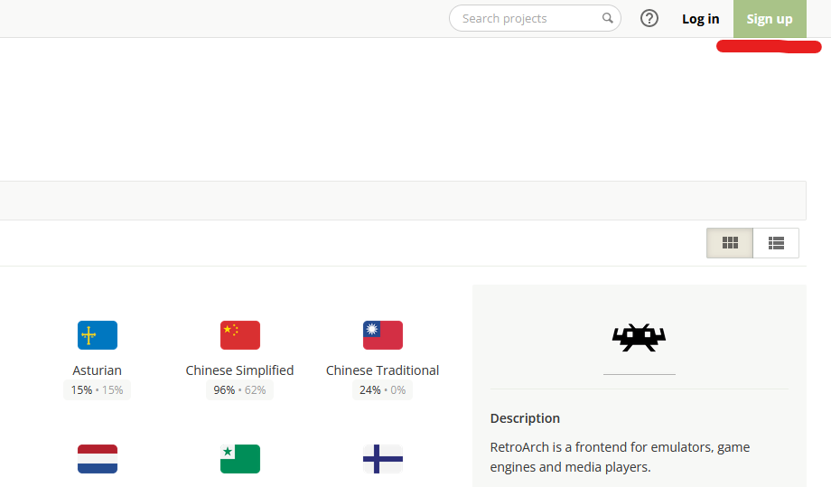{align=center}
   

   <figcaption>
      Figure 1: Click 'Sign up' to register a new account in Crowdin's service.
   </figcaption>
</figure>

### Enabling e-mail notifications/Joining a project

You can add translations and suggestions to the project regardless of whether you join it or not. But if you join the project, Crowdin will notify you via e-mail about any changes and developments regarding the translation efforts (like recently added texts, etc.). You will also have a link to the RetroArch project added to your profile page for quick access. If you want to join the project, just click the ‘**Join**’ button at the top right of the project page.

<figure markdown>
   

   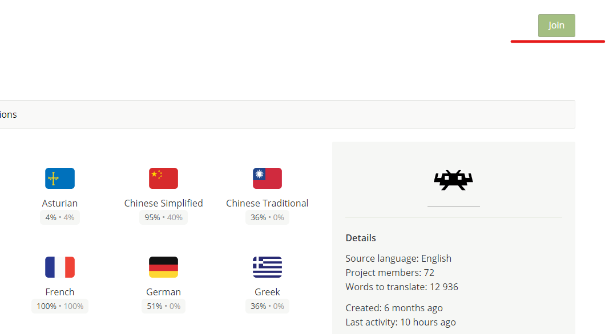
   

   <figcaption>
      Figure 2: Click 'Join' to follow the project and receive e-mail notifications.
   </figcaption>
</figure>

## Basic Instructions

### How to translate strings

After selecting the language you want to translate to (you may request additional languages at the `#retroarch-translations` channel of our Discord[^2]), you will be welcomed by the file selection page. At the moment the most important files are _msg\_hash\_us.json_, which contains the (options) texts of the RetroArch program, as well as _googleplay\_us.json_ and _steam\_us.json_, which contain RetroArch’s Google Store and Steam page descriptions, respectively.

[^2]: The official RetroArch Discord server: https://ra-link.web.app/discord

<figure markdown>
   

   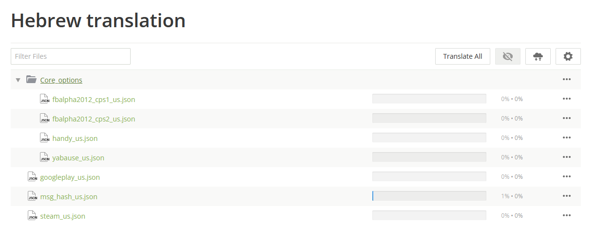
   

   <figcaption>
      Figure 3: The file selection page will show the amount of work that has been done in the chosen language.
   </figcaption>
</figure>

Pick the file that you want to work on and you will be taken to the translation page. This screen can seem overwhelming at first, but don't worry: it's actually a very simple process.

<figure markdown>
   

   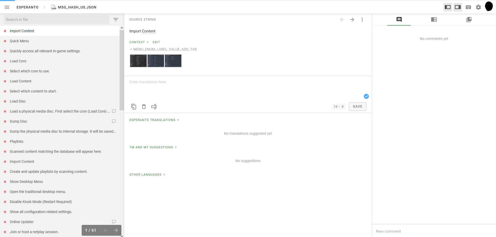
   

   <figcaption>
      Figure 4: The main translation page. On the left: search & source string selection; middle: translation area; on the right: empty comments section.
   </figcaption>
</figure>

On the column located at the left side of your browser you will see a list of strings (a string is a piece of text). They will be marked by either a green check mark, marking strings with approved translations (see 'The final say – Proofreaders' below), a green dot for translated strings, for which you may add an alternative translation and/or vote on existing ones, or a red dot for as of yet untranslated strings.

Click on any string to see them in the middle area. The **Source String** (the original English text) will be displayed at the top with a unique label, which can be used to search for this particular string, and possibly some context cues, like screenshots, right below it. There you will also find the ‘**Request**’ link, which is a shortcut for writing a comment asking for more information about the context. Below that is an area for writing the string’s translation. Once you have finished writing the translation for this string, click on the ‘**Save**’ button and your translation will be added to the list of suggested translations for this string right below. That’s it, simple as that.

In the very few cases where the source string can be kept as-is, you can click the ‘**Copy Source**’ button  to do so.

In the string list (on the left side of the screen) some strings have a balloon icon . This icon shows that the string has comments written by other translators and developers. Comments may include interesting and/or important information that could help you decide on how best to translate a specific string. You can also write comments in case you have questions or additional information regarding any particular string.

Please make sure that any comment you write is in __English__, as that is the official project language and the comments are visible to _everyone_. Comments will be displayed at Crowdin’s right column. In case there are no comments being displayed there, make sure that the left-most button of that column is active.

<figure markdown>
   

   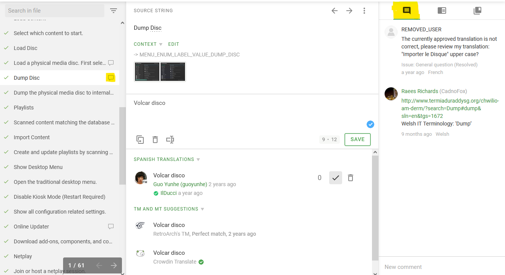
   

   <figcaption>
      Figure 5: The right-side column will display any available comments if its left tab is active.
   </figcaption>
</figure>

### Machine Translation, Translation Memory and Other Languages

Below the suggested translations in your language you will see two sections: “**TM and MT suggestions**” and “**Other Languages**”.

<figure markdown>
   

   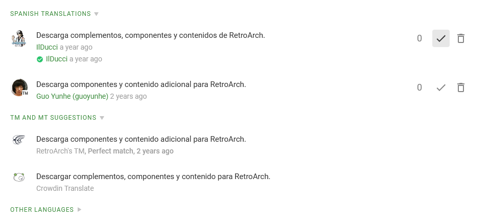
   

   <figcaption>
      Figure 6: The suggested translations area, located at the bottom half part of the page. This is the proofreaders view; no voting buttons, only approve & delete. Below that is the TM & MT section.
   </figcaption>
</figure>

In the first, translation suggestions from the **Translation Memory** are displayed: those are derived from **the history of any existing translations**, both current and old, that appear to be a good match to the current string. These translations were once suggested by translators and can serve either as a convenient way to copy an existing translation or as a base/inspiration for your own.

In addition to that there’s **Machine Translations**, provided by Crowdin Translate or Microsoft Translate. These are similar to what you’d expect from Google Translate: translations generated by an algorithm, without taking any context into account. **We strongly suggest that you use Machine Translations with caution, as they tend to fail at translating more exotic words & phrases and to be grammatically faulty.** Apart from that, they can be a useful source of inspiration for your own translations.

Lastly, in the **Other Languages** section you will find translations from, well, other languages. If you know additional languages or your language’s way of writing is close to another one, you can use these translations as a reference and additional source of context.

<figure markdown>
   

   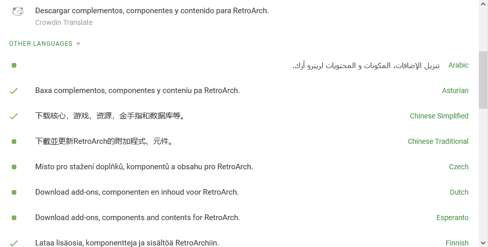
   

   <figcaption>
      Figure 7: The Other Languages section is located right below the "TM and MT translations" area. The green check marks on the left side point out approved translations.
   </figcaption>
</figure>

### Deciding the best translation – Voting

Since multiple translations can be suggested for each source string and language, but obviously only one can ultimately be displayed to the users, we need to somehow decide which one to pick. Thankfully, Crowdin does most of the work for us: first, all translations are ordered by their age, newest to oldest; and second, and more importantly, Crowdin utilises a voting system to allow translators to up-vote translations they like and down-vote lacklustre/flawed ones.

Voting is very simple:  At the bottom half of the middle section of the translation page you’ll find a list of suggested translations. To the right of each suggestion are a couple buttons which can be used to add a positive or negative vote, either elevating the translations priority or decreasing it, respectively. Those votes can be un-/redone at any time, so no worries if you should change your mind later.

### The final say – Proofreaders

But even with a voting system in place, at some point we would probably want to just decide on an official translation, which will be chosen regardless of the votes. That’s where proofreaders come into play.

First things first: **in order to become a proofreader, translators will need additional authorization by RetroArch’s translation managers.** We suggest you contact us at the `#retroarch-translations` channel, located in RetroArch’s Discord server[^2], in order to discuss this authorization.

As a proofreader, you don’t get to vote on the translations any more. Instead, if you find a translation to be suitable and free of errors you can click on the  button to _approve_ it. Approving a translation makes it the ‘default’ and elevates it above all others. Only one translation can be approved at a time for each source string and language. Translators can still vote on it, though, and it would be wise to rethink one's choice if the votes demand it.

In addition to approving translations, proofreaders also may delete _any_ suggested translation, not just their own. It should be easy to see why additional authorization is needed for this position.

### Seeing results in the app

For languages already included in RetroArch the translations are updated daily for the main app and weekly every Friday for cores.
Other languages will need to be incorporated into the code of RetroArch and the cores. Once at least 15% of the `msg_hash_us.h` file is translated, the Crowdin managers will start work on including this language in the app. If you'd like to take matters in your own hands, you can find instructions [here](new-translations.md).

## Advanced Instructions

### What are things like \n or %d?

Since RetroArch and libretro are C/C++ projects, the strings will sometimes contain 'special (sequences of) characters' used in code. Some people like to call them control codes, variables, etc., but the exact name is not important for translation purposes. Here are some of the most common examples:

<figure markdown>
   

   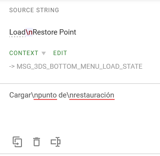
   

   <figcaption>
      Figure 8: Example for the line break character \n; this is text for the 3DS menu, which has very short lines.
   </figcaption>
</figure>

- **\n** is a line break/new line character: **it marks the end of the previous & the beginning of a new line.** Basically, it's like hitting the Enter button, but for programmers. Only used either for formatting/readability (use/remove them at your own discretion), or when line length is limited (use more or fewer than in the source string, as required; please pay attention to comments on that matter!).
- A percentage sign (%) followed directly by one (rarely more) lowercase letter(s) (for example: %d, %ld, %u, %lu, %f, %lf, %s...), or sometimes even a number, is usually a placeholder. They will be replaced in the code with something else: numbers, other texts (usually names/objects not requiring translation)... You may move them around the text, but you must use all of them, and in the same order, or it could result in an error in RetroArch and nobody wants that.

<figure markdown>
   

   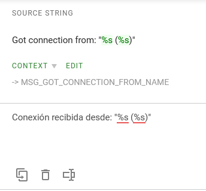
   

   <figcaption>
      Figure 9: Example for placeholders; in this case two text placeholders are used (%s -> string).
   </figcaption>
</figure>

This is not a complete list — there are quite a few more. But don't worry: in Crowdin these special elements are marked accordingly, and you will receive reminders should you forget to use them in your translations. And always remember: if there is something unclear about a source text, just ask about it in a comment on Crowdin or on Discord[^2]!

<figure markdown>
   

   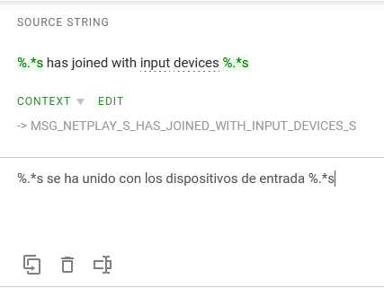
   

   <figcaption>
      Figure 10: A special placeholder for text. Don't worry about it's exact purpose, just remember that there exist many exceptions not explicitly listed in this section.
   </figcaption>
</figure>

### How to check the translations of other strings

The best way to check for other translations, without having to leave the current string you are editing, is by using the middle button of the bar to the right of your screen. Here you can type any word to search through your language's Translation Memory (TM). The TM not only contains automatic translations of the strings, but also previously accepted/approved translations. Make sure you check the date of the text you want to use as a reference.

<figure markdown>
   

   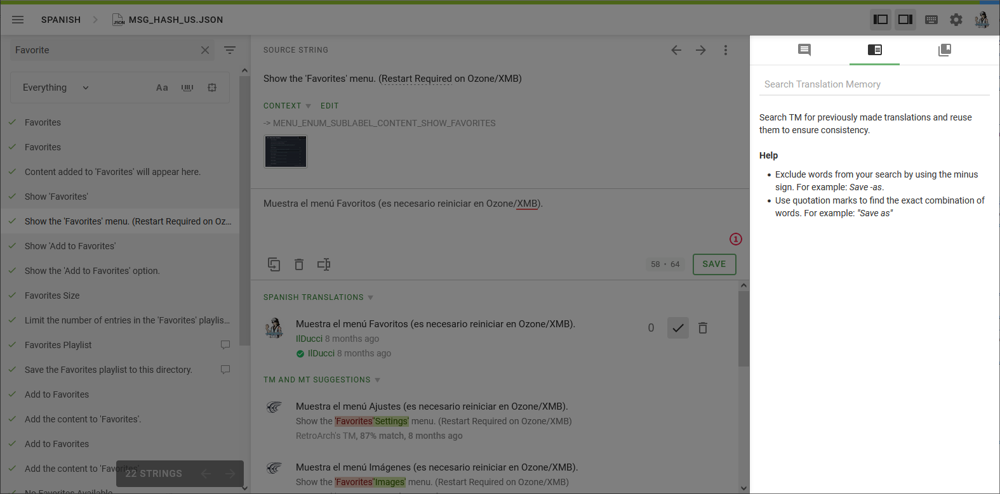
   

   <figcaption>
      Figure 11: You can find the Translation Memory on the middle tab of the right panel.
   </figcaption>
</figure>

<figure markdown>
   

   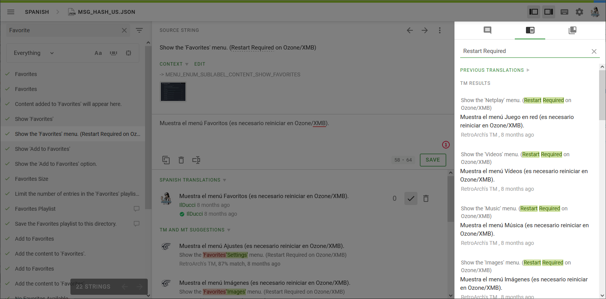
   

   <figcaption>
      Figure 12: The TM will show you source texts containing your search term and their current translation.
   </figcaption>
</figure>

### How to find previous translations of words/phrases

In the ‘Source String’ area you’ll find some words that are underlined. These are words that contain references to existing translations. Hover your mouse over these words to see the current translation references. As of the writing of this document, there are two types of references:

- **Glossary terms**: These terms have been selected/translated by other members of the translation team (or other language teams, depending on the case) and should be used as much as possible. If you'd like to change an existing glossary term translation, please talk about it with any active translators of your language first. If your language currently does not have translators, but its progress is very high, do not change the existing terms on your own. Please contact other people on e.g. Discord[^2] and try to reach a consensus.
- **Previous translations**: Crowdin will routinely check for repeated words and show what it thinks is a good translation based on previous input. These suggestions are marked with "Previously translated as:". This system is not perfect and should not be entirely trusted.

<figure markdown>
   

   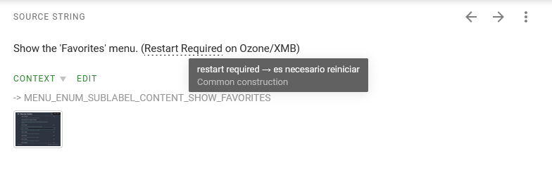
   

   <figcaption>
      Figure 13: A term with a glossary translation.
   </figcaption>
</figure>

<figure markdown>
   

   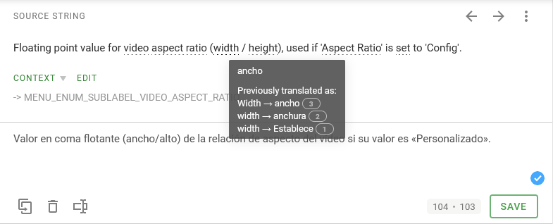
   

   <figcaption>
      Figure 14: A term with automatic translation suggestions based on previous input.
   </figcaption>
</figure>

### Adding translations to the glossary

**If your language has one or more active translators, please refrain from changing translated glossary terms of your language unless you have previously discussed it.** It's not fair to come around changing things without a proper debate.

If you want to add a localized equivalent to an existing English term, you can do the following:

1. Click on the right icon on the bar to the right of your screen.
2. If the term is not being used by the Source String you are at this moment, use the Search function of this bar.
3. Click on the Edit button under the term.
4. The **Edit Term** window will appear. Below the name of your language, add your desired translation at the **Term** area.
5. You can also add a localized description under the Term area. Use it to add details/more information about the term and what it is referring to, etc. Context is key.
6. Then click on the Save button.

<figure markdown>
   

   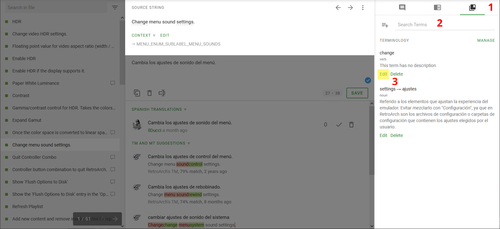
   

   <figcaption>
      Figure 15: You can find the Glossary Terms on the the right tab of the right panel.
   </figcaption>
</figure>

<figure markdown>
   

   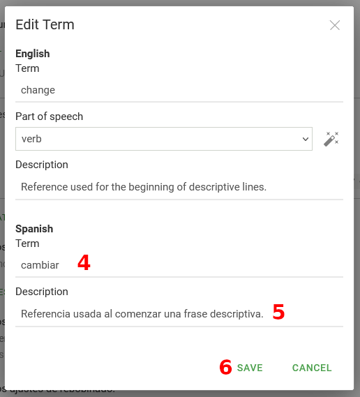
   

   <figcaption>
      Figure 16: The Edit Term window.
   </figcaption>
</figure>

**A word of warning**: do not change the source language's "**Part of speech**" section. Some terms have the option "Not selected" picked on purpose because Crowdin, sometimes, will not mark words as containing a Glossary term. For those in the know, Crowdin seems to have a syntax analysis function enabled for English, but it's far from perfect in its current state.

### Only for veteran users: Creating new terms in the glossary

First and foremost, in its current state, the English words in the glossary should cover the entire RetroArch translation. Unless you _ABSOLUTELY_ need it, please refrain from creating new terms.

**IMPORTANT**: search for the term you'd like to create first to avoid duplicates.

If you have to add a new term to the Glossary, and it's absolutely necessary, follow these instructions:

1. Open the **Glossary Terms** as before and click on the icon that's to the left of the search bar, the one that has a plus (+) icon.
2. The **Add Term** window will appear. Go to the Term text box in the English section and write the English words that you want to classify with a term.
    1. Alternatively, mark a term in a source string by selecting it with the mouse; a context menu should pop up. Click on “**Create Term**” & the Add Term window will open, with the selected term already filled in.
3. Add a description in English if possible. This will help translators of other languages understand the exact meaning of the term. Context is key.
4. Now go to the section that is below your language's name. Add your translation at the Term area.
5. You can also add a localized description under this Term area. Use it to add details/more information about the term and what it is referring to, etc. Once again, _context is key_.

<figure markdown>
   

      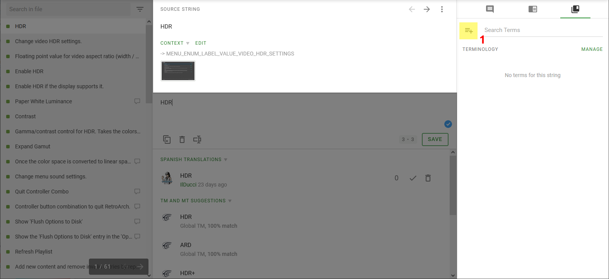
   

   <figcaption>
      Figure 17: To create a new term, click on the button highlighted in yellow.
   </figcaption>
</figure>

<figure markdown>
   

   
   

   <figcaption>
      Figure 18: The Add Term window differs little from the Edit Term window.
   </figcaption>
</figure>
