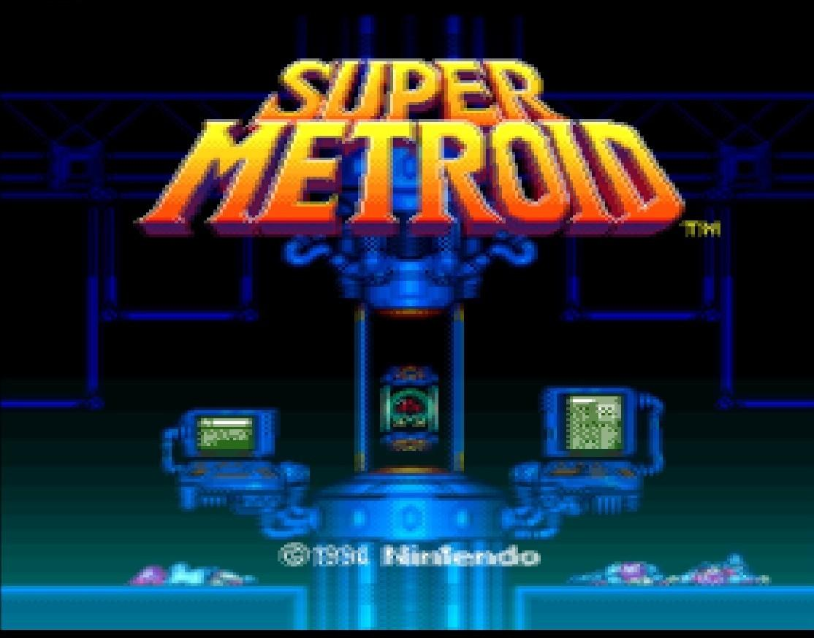

# Developing Legacy Cg Shaders

!!! Warning "Cg Shaders are deprecated"

Cg has been discontinued for years and is closed source. Developers cannot use Cg for newer APIs such as Vulkan, D3D12, and Metal. Cg cross-compilation to GLSL is unmaintainable. We cannot do the Cg transform in runtime on mobile due to lack of open source Cg runtime.

## New Slang Shader Specification

Unless you are developing shaders for a platform that cannot support the newer Slang standard, please consider [developing a Slang shader](slang-shaders.md) instead.

## Example Cg/HLSL program

If you were to process an image on a CPU, you would most likely do something like this:

```c
for(unsigned y = 0; y < height ; y++) {
   for(unsigned x = 0; x < width ; x++)
      out_pixel[y][x] = process_pixel(in_pixel[y][x], y,x);
}
```

We quickly realize that this is highly serial and slow. We see that `out_pixel[y][x]` isn’t dependent on `out_pixel[y + k][x + k]`, so we see that we can parallelize quite a bit.

Essentially, we only need to implement `process_pixel()` as a single function, which is called thousands, even millions of time every frame. The only purpose in life for `process_pixel()` is to process an input, and produce an output. No
state is needed, thus, a “pure” function in computer science terms.

For the Cg program, we need to implement two different functions. `main_vertex()` takes care of transforming every incoming vertex from camera space down to clip space. This essentially means projection of 3D (coordinates on GPU) down to 2D (your screen). Since we’re dealing with old school emulators here, which are already 2D, the vertex shading is very trivial.

Vertex shaders get various coordinates as input, and uniforms. Every vertex emitted by the emulator is run through `main_vertex` which calculates the final output position. For our emulators this is just 4 times, since we’re rendering a quad on the screen. 3D games would obviously have a lot more vertices.

While coordinates differ for each invocation, uniforms are constant through-out every call. Think of it as a global variable that you’re not allowed to change. Vertex shading can almost be ignored altogether, but since the vertex shader is run only 4 times, and the fragment shader is run millions of times per frame, it is a good idea to precalculate values in vertex shader that can later be used in fragment shader. There are some limitations to this which will be mentioned
later.

`main_fragment()` takes care of calculating a pixel color for every single out-put pixel on the screen. If you’re playing at 1080p, the fragment shader will have to be run `1920 * 1080` times! This is obviously straining on the GPU unless the shader is written efficiently. Obviously, main_fragment is where the real action happens. For many shaders we can stick with a “dummy” vertex shader which does some very simple stuff.

The fragment shader receives a handle to a texture (the game frame itself), and the texture coordinate for the current pixel, and a bunch of uniforms.
A fragment shader’s final output is a color, simple as that. Processing ends
here.

## Shader Hello World

We’ll start off with the basic vertex shader. No fancy things are being done. You’ll see a similar vertex shader in most of the Cg programs out there in the wild.

```c
void main_vertex (float4 pos : POSITION,
                  out float4 out_pos : POSITION,
				  uniform float4x4 modelViewProj,
				  float4 color : COLOR,
				  out float4 out_color : COLOR,
				  float2 tex : TEXCOORD,
				  out float2 out_tex : TEXCOORD
				  )

{
   out_pos = mul(modelViewProj, pos);
   out_color = color ;
   out_tex = tex ;
}
```

This looks vaguely familiar to C, and it is. Cg stands for “C for graphics” after all. We notice some things are happening, notable some new types.

### Cg types

#### Float

`float4` is a vector type. It contains 4 elements. It could be colors, positions, whatever. It's used for vector processing which the GPUs are extremely efficient at.

### Semantics

We see various semantics. The `POSITION` semantic means that the variable is tied to vertex coordinates. We see that we have an input `POSITION`, and an output (out) `POSITION`. We thus transform the input to the output with a matrix multiply with the current model-view projection. Since this matrix is the same for every vertex, it is a uniform. Remember that the variable names DO matter. modelViewProj has to be called exactly that, as the emulator will pass the MVP to this uniform. It is in the specification.

Since we have semantics for the `POSITION`, etc, we can call them whatever we want, as the Cg environment figures out what the variables mean.

The transformation happens here:

```c
out_pos = mul(modelViewProj , pos);
```

The `COLOR` semantic isn’t very interesting for us, but the example code in nVidias Cg documentation includes it, so we just follow along. `TEXCOORD` is the texture coordinate we get from the emulator, and generally we just pass it to the fragment shader directly. The coordinate will then be linearly interpolated across the fragments.

More complex shaders can output (almost) as many variables they want, that will be linearily interpolated for free
to the fragment shader. We also need a fragment shader to go along with the vertex shader, and here's a basic shader that only outputs the pixel as-is. This is pretty much the result you’d get if you didn’t run any shader (fixed-function) at all.

```c
float4 main_fragment ( uniform sampler2D s0 : TEXUNIT0, float2 tex : TEXCOORD) : COLOR
{
   return tex2D ( s0 , tex ) ;
}
```

This is arguably simpler than the vertex shader. Important to notice are:

  * `sampler2D` is a handle to a texture in Cg. The semantic here is `TEXUNIT0`, which means that it refers to the texture in texture unit 0. This is also part of the specification.
  * `float2 tex : TEXCOORD` is the interpolated coordinate we received from the vertex shader.
  * `tex2D(s0, tex);` simply does texture lookup and returns a `COLOR`, which is emitted to the framebuffer.

Practically every fragment does more than one texture lookup. For example, classic pixel shaders look at the neighbor pixels as well to determine the output. But where is the neighbor pixel? We’ll revise the fragment shader and try to make a really blurry shader to demonstrate. We now need to pull up some uniforms. We need to know how to modify our tex coordinates so that it points to a neighbor pixel.

```c
struct input
{
   float2 video_size ;
   float2 texture_size ;
   float2 output_size ;
   float frame_count ;
};

float4 main_fragment ( uniform sampler2D s0 : TEXUNIT0, uniform input IN , float2 tex : TEXCOORD) : COLOR
{
   float4 result = float4 ( 0. 0 ) ;
   float dx = 1.0 / IN. texture_size. x ;
   float dy = 1.0 / IN. texture_size. y ;

   // Grab some of the neighboring pixels and blend together for a very mushy blur.
   result += tex2D (s0 , tex + float2 (−dx, −dy));
   result += tex2D (s0 , tex + float2 (dx, −dy));
   result += tex2D (s0 , tex + float2 (0.0, 0.0));
   result += tex2D (s0 , tex + float2 (−dx, 0.0));
   return result / 4. 0 ;
}
```

Here we use `IN.texture_size` to determine the the size of the texture. Since GL maps the whole texture to the interval `[0.0, 1.0]`, `1.0 / IN.texture_size` means we get the offset for a single pixel, simple enough. Almost every shader uses this. We can calculate these offsets in vertex shader to improve performance since the coordinates are linearily interpolated anyways, but that is for another time.

## Putting it together

The final runnable product is a single `.cg` file with the `main_vertex` and `main_fragment` functions added together. Not very complicated. For the icing on the cake, you should add a license header.

```c
/* Stupid blur shader.
 * Author : Your friendly neighbor.
 * License : We don't have those things!
*/

struct input
{
   float2 video_size;
   float2 texture_size;
   float2 output_size;
   float frame_count;
};

void main_vertex (
   float4 pos : POSITION,
   out float4 out_pos : POSITION,
   uniform float4x4 modelViewProj ,
   float4 color : COLOR,
   out float4 out_color : COLOR,
   float2 tex : TEXCOORD,
   out float2 out_tex : TEXCOORD
)
{
out_pos = mul( modelViewProj , pos );
out_color = color ; out_tex = tex ;
}

float4 main_fragment ( uniform sampler2D s0 : TEXUNIT0,
                       uniform input IN,
					   float2 tex : TEXCOORD
					 ) : COLOR
{
   float4 result = float4 ( 0. 0 ) ;
   float dx = 1.0 / IN.texture_size.x;
   float dy = 1.0 / IN.texture_size.y;

   // Grab some of the neighboring pixels and blend
   // together f o r a very mushy blur.
   result += tex2D ( s0 , tex + float2 (−dx, −dy));
   result += tex2D ( s0 , tex + float2 (dx, −dy ));
   result += tex2D ( s0 , tex + float2 (0.0, 0.0));
   result += tex2D ( s0 , tex + float2 (−dx, 0.0));
   return result / 4.0;
}
```

## Result

As you can see, it’s not a practical shader, but it shows the blurring effect to the extreme.



-----------------------------------------------------------


## Shader file format

 * `#` begins a comment; the rest of the line is ignored.
 * Format is: `key = value`. There can be as many spaces as you like in between
 * Values can be wrapped inside `"` for multiword strings (`foo = "hai u"`)
 * `#include` includes a config file
 * Path is relative to where config file was loaded unless an absolute path is chosen
 * Key/value pairs from an `#include` are read-only and cannot be modified

-----------------------------------------------------------


## Cg shader spec

This spec is for the Cg shading language developed by nVidia. It wraps around OpenGL to make shaders written in Cg quite portable. Shaders written in Cg can also be used with Direct3D and PlayStation3. Cg shaders are also compatible with basic HLSL if some considerations are taken into account. They can even be automatically compiled into GLSL shaders, which makes Cg shaders a true “write once, run everywhere” shader format.

We encourage new shaders targeting Libretro frontends to be written in this format. RetroArch supports both single-pass Cg shaders as well as multi-pass shaders and uses a custom Cg preset format (`.cgp`).


### Another example Cg shader

```c
void main_vertex
(
   float4 position : POSITION,
   out float4 oPosition : POSITION,
   uniform float4x4 modelViewProj,
   float2 tex : TEXCOORD,
   out float2 oTex : TEXCOORD
)
{
   oPosition = mul(modelViewProj, position);
   oTex = tex;
}

float4 main_fragment (float2 tex : TEXCOORD, uniform sampler2D s0 : TEXUNIT0) : COLOR
{
   return tex2D(s0, tex);
}
```

### Example Cg preset

```c
shaders = 2
shader0 = 4xBR-v3.9.cg
scale_type0 = source
scale0 = 4.0
filter_linear0 = false
shader1 = dummy.cg
filter_linear1 = true
```

### Entry points:

   - Vertex: `main_vertex`
   - Fragment: `main_fragment`

### Texture unit

All shaders work on texture unit `0` (the default). 2D textures must be used. Power-of-two sized textures are recommended for optimal visual quality. The shaders must deal with the actual picture data not filling out the entire texture. Incoming texture coordinates and uniforms provide this information.

The texture coordinate origin is defined to be top-left oriented. A texture coordinate of `(0, 0)` will always refer to the top-left pixel of the visible frame. This is opposite of what most graphical APIs expect. The implementation must always ensure that this ordering is held for any texture that the shader has access to.

!!! Note
    Every texture bound for a shader must have black border mode set. Sampling a texel outside the given texture coordinates must always return a pixel with RGBA values `(0, 0, 0, 0)`.

### Uniforms

Some parameters will need to be passed to all shaders, both vertex and fragment program. A generic entry point for fragment shader will look like:

```c
float4 main_fragment (float2 tex : TEXCOORD0,
   uniform input IN, uniform sampler2D s_p : TEXUNIT0) : COLOR
{}
```

The input is a struct:

```c
struct input
{
   float2 video_size;
   float2 texture_size;
   float2 output_size;
   float frame_count;
   float frame_direction;
};
```

   - `TEXCOORD0`: Texture coordinates for the current input frame will be passed in `TEXCOORD0`. (`TEXCOORD` is a valid alias for `TEXCOORD0`).
   - `COLOR0`: Although legal, no data of interest is passed here. You cannot assume anything about data in this stream.
   - `IN.video_size`: The size of the actual video data in the texture, e.g for a SNES this will be generally `(256, 224)` for normal resolution frames.
   - `IN.texture_size`: This is the size of the texture itself. Optimally power-of-two sized.
   - `IN.output_size`: The size of the video output. This is the size of the viewport shown on screen.
   - `IN.frame_count`: A counter of the frame number. This increases with 1 every frame. This value is really an integer,    but needs to be float for CGs lack of integer uniforms.
   - `IN.frame_direction`: A number telling which direction the frames are flowing. For regular playing, this value should be `1.0`. While the game is rewinding, this value should be `-1.0`.
   - `modelViewProj`: This uniform needs to be set in vertex shader. It is a uniform for the current MVP transform.


### Pre-filtering

Most of these shaders are intended to be used with a non-filtered input. Nearest-neighbor filtering on the textures themselves are preferred. Some shaders, like scanline will most likely prefer bilinear texture filtering.


## Cg meta-shader format

### Rationale

The `.cg` files themselves contain no metadata necessary to perform advanced filtering. They also cannot process an effect in multiple passes, which is necessary for some effects. The CgFX format does exist, but it would need current shaders to be rewritten to a HLSL-esque format. It also suffers a problem mentioned below.

Rather than putting everything into one file (XML shader format), this format is config file based. This greatly helps testing shader combinations as there is no need to rearrange code in one big file. Another plus with this approach is that a large library of .cg files can be used to combine many shaders without needing to redundantly copy code over. It also helps testing as it is possible to unit-test every pass separately completely seamless.

## Format

The meta-shader format is based around the idea of a config file with the format: `key = value`. Values with spaces need to be wrapped in quotes: key = "value stuff".

No .ini sections or similar are allowed. Meta-shaders may include comments, prefixed by the "#" character, both on their own in an otherwise empty line or at the end of a key = value pair.

The meta-format has four purposes:

   -  Combine several standalone .cg shaders into a multipass shader.
   -  Define scaling parameters for each pass. I.e., a HQ2x shader might want to output with a scale of exactly 2x.
   -  Control filtering of textures. Many shaders will want nearest-neighbor filtering, and some will want linear.
   -  Define external lookup textures. Shaders can access external textures found in `.tga` files.

### Parameters

#### `shaders` (int)

This param defines how many .cg shaders will be loaded. This value must be at least one. The path to these shaders will be found as a string in parameters shader0, shader1, ... shaderN, and so on. The path is relative to the directory the meta-shader was loaded from.

#### `filter_linearN` (boolean)

This parameter defines how the texture of the result of pass `N` will be filtered. `N = 0` (pass 0) is the raw input frame, `N = 1` is result of the first pass, etc. (A boolean value here might be `true`/`false`/`1`/`0`). Should this value not be defined, the filtering option is implementation-defined.

#### `float_framebufferN` (boolean)

This parameters defines if shader `N` should render to a 32-bit floating point buffer. This only takes effect if shaderN is actually rendered to an FBO. This is useful for shaders which have to store FBO values outside `[0, 1]` range.

#### `frame_count_modN` (int)

This positive parameter defines which modulo to apply to `IN.frame_count`. `IN.frame_count` will take the value `frame_count % frame_count_modN`.

#### `scale_typeN` (string)

This can be set to one of these values:
   - `source`:   Output size of shader pass `N` is relative to the input size as found in `IN.video_size`. Value is `float`.
   - `viewport`: Output size of shader pass `N` is relative to the size of the window viewport. Value is `float`. **This value can change over time if the user resizes their window!**
   - `absolute`: Output size is statically defined to a certain size. Useful for hi-res blenders or similar.

If no scale type is assumed, it is assumed that it is set to `source` with `scaleN` set to `1.0`.

It is possible to set `scale_type_xN` and `scale_type_yN` to specialize the scaling type in either direction. `scale_typeN` however overrides both of these.

**Exceptions**

   - If no `scale_type` is set for the very last shader, it is assumed to output at the full resolution rather than assuming
   a scale of `1.0x`, and bypasses any frame-buffer object rendering.
   - If there is only one shader, it is also considered to be the very last shader. If any scale option is defined, it has to go through a frame-buffer object, and subsequently rendered to screen. The filtering option used when stretching
   is implementation defined. It is encouraged to not have any scaling parameters in last pass if you care about the filtering
   option here.
   - In first pass, should no scaling factor be defined, the implementation is free to choose a fitting scale. This means, that for a single pass shader, it is allowed for the implementation to set a scale, render to FBO, and stretch. (Rule above).


#### `scaleN`, `scale_xN`, `scale_yN` (float/int)

These values control the scaling params from `scale_typeN`. The values may be either floating or int depending on the type. `scaleN` controls both scaling type in horizontal and vertical directions.

If `scaleN` is defined, `scale_xN` and `scale_yN` have no effect. `scale_xN` and `scale_yN` controls scaling properties for the directions separately. Should only one of these be defined, the other direction will assume a source scale with value `1.0`, i.e. no change in resolution.

Should `scale_type_xN` and `scale_type_yN` be set to different values, the use of scaleN is undefined (i.e. if X-type is absolute (takes `int`), and Y-type is source (takes `float`).)


#### `textures` (multiple strings)

The textures param defines one or more lookup textures IDs. Several IDs are delimited with `;` such as `textures = "foo;bar"`.  These IDs serves as the names for a Cg sampler uniform, such as `uniform sampler2D foo;` and `uniform sampler2D bar;`

The path of the textures can be found in the IDs, i.e. `foo = image0.tga` and `bar = image1.tga`.  The paths of these textures are relative to the directory the meta-shader was loaded from.

It is also possible to control the filtering options of the lookup texture as a boolean option in `ID_linear = true/false`. For example `foo_linear = false` will force nearest neighbor filtering for texture `foo`.

!!! Note
    If `ID_linear` is not set, it is assumed to be linearly filtered.

The textures will be loaded "as-is", and coordinates `(0, 0)`, `(0, 1)`, `(1, 0)`, `(1, 1)` will correspond to the corners of the texture. Since the texture coordinates of the texture in TEXUNIT0 might not be as convenient, the texture coordinates for all lookup textures will be found in `TEXCOORD1`.

!!! Warning
    You cannot assume which texture unit the lookup textures will be bound to!

The implementation only guarantees to be able to load plain top-left non-RLE `.tga` files. It may provide possibilities to load `.png` and other popular formats.

## Multipass

It is sometimes feasible to process an effect in several steps.

```c
shaders = 2
shader0 = pass1.cg
shader1 = pass2.cg
scale_type0 = source
scale0 = 2.0
filter_linear0 = true
filter_linear1 = false
```

During multi-pass rendering, some additional uniforms are available.

With multi-pass rendering, it is possible to utilize the resulting output for every pass that came before it, including the unfiltered input. This allows for an additive approach to shading rather than serial style.

The unfiltered input can be found in the ORIG struct:

   - `uniform sampler2D ORIG.texture`: Texture handle. Must not be set to a predefined texture unit.
   - `uniform float2 ORIG.video_size`: The video size of original frame.
   - `uniform float2 ORIG.texture_size`: The texture size of original frame.
   - `in float2 ORIG.tex_coord`: An attribute input holding the texturecoordinates of original frame.
   - `PASS%u`: This struct holds the same data as the `ORIG` struct, although the result of passes {1, 2, 3 ...}, i.e.   `PASS1.texture` holds the result of the first shader pass. If rendering pass `N`, passes `{1, ..., N-2}` are available.   (`N-1` being input in the regular `IN` structure).
   - `PREV`: This struct holds the same data as the `ORIG` struct, and corresponds to the raw input image from the previous frame. Useful for motion blur.
   - `PREV1..6`: Similar struct as `PREV`, but holds the data for passes further back in time. `PREV1` is the frame before `PREV`, `PREV2` the frame before that again, and so on. This allows up to 8-tap motion blur.
