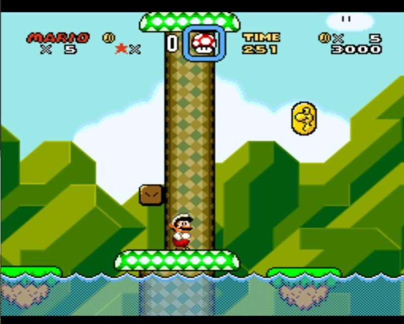
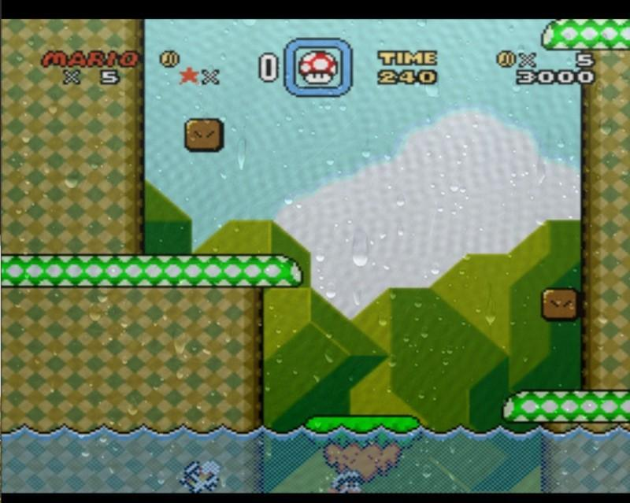

# Content-aware shaders

Content-aware shaders grab data from the core state itself, such as emulator RAM data. This is only implemented for SNES so far, but the idea is quite extendable and portable. The basic idea is that we capture RAM data in a certain way (semantic if you will) from the SNES, and pass it as a uniform to the shader. The shader can thus act on game state in interesting ways.

As a tool to show this feature, we’ll focus on replicating [the simple tech demo shown on YouTube](http://www.youtube.com/watch?v=4VzaE9q735k). What happens is that when Mario jumps in the water, the screen gets a "watery" effect applied to it, with a rain lookup texture, and a wavy effect. When he jumps out of the water, the water effect slowly fades away.

We thus need to know two things:

  - Is Mario currently in water or not?
  - If not, how long time was it since he jumped out?

Since shaders do not have state associated with it, we have to let the environment provide the state we need in a certain way. We’ll call this concept a semantic. To capture a RAM value directly, we can use the "capture" semantic. To record the time when the RAM value last changed, we can use the "transition" semantic.

We obviously also need to know where in RAM we can find this information. Luckily, [the folks over at SMW Central know the answer](http://www.smwcentral.net/?p=map&type=ram). We see:
```
$7E :0075 , byte , Flag , Player is in water flag. #$00 = No; #$01 = Yes.
```

Bank `$7E` and `$7F` are mapped to WRAM `$0000-$FFFF` and `$10000-$1FFFF` respectively. Thus, our WRAM address is `$0075`. In the config file, we can now set up the uniforms we’ll want to be captured.

```
imports = "mario_water ; mario_water_time"
mario_water_semantic = capture
# Capture the RAM value as−is.
mario_water_wram = 0075
# This value is hex!
mario_water_time_semantic = transition
# Capture the frame count when this variable last changed.
# Use with IN. frame_count , to create a fade−out effect.
mario_water_time_wram = 0075
```

The amount of possible "semantics" are practically endless. It might be worthwhile to attempt some possibility to run custom code that keeps track of the shader uniforms in more sophisticated ways later on. Do note that there is also a `%s_mask` value which will let you bitmask the RAM value to check for bit-flags more easily.

Now that we got that part down, let's work on the shader design. In the fragment shader we simply render both the full water effect, and the `«normal»` texture, and let a "blend" variable decide. We can say that `1.0` is full water effect, `0.0` is no effect. We can start working on our vertex shader. We will do something useful here for once.

```c
struct input
{
  float frame_count;
};

void main_vertex (
  float4 pos : POSITION,
  out float4 out_pos : POSITION,
  uniform float4x4 modelViewProj,
  float4 color : COLOR,
  out float4 out_color : COLOR,
  float2 tex : TEXCOORD0,
  out float2 out_tex : TEXCOORD0,
  float2 tex1 : TEXCOORD1,
  out float2 out_tex1 : TEXCOORD1,

  // Even if the data should have been int, Cg doesn't seem to support integer uniforms
  uniform float mario_water,
  uniform float mario_water_time,
  uniform input IN,
  // Blend factor is passed to fragment shader. We'll output the same value in every vertex,
  // so every fragment will get the same value for blend_factor since there is nothing to interpolate.
  out float blend_factor )
  {
    out_pos = mul( modelViewProj , pos );
    out_color = color;
    out_tex = tex;
    out_tex1 = tex1;
    float transition_time = 0.5 * (IN. frame_count mario_water_time ) / 60.0;
    // If Mario is in the water ( $0075 != 0), it's always 1...
    if ( mario_water > 0.0)
       blend_factor = 1.0;
    // Fade out from 1.0 towards 0.0 as transition_time grows larger.
    else
      blend_factor = exp(−transition_time );
  }
```

All fine and dandy so far, now we just need to use this blend_factor in our
fragment shader somehow... Let’s move on to the fragment shader where we
blend.

```c
float apply_wave ( float2 pos , float2 src , float cnt )
{
  float2 diff = pos − src ;
  float dist = 300.0 * sqrt(dot(diff , diff));
  dist −= 0.15 ∗ cnt;
  return sin(dist);
}

// Fancy stuff to create a wave.
float4 water_texture ( float4 output , float2 scale , float cnt )
{
  float res = apply_wave ( scale , src0 , cnt ) ;
  res += apply_wave ( scale , src1 , cnt ) ;
  res += apply_wave ( scale , src2 , cnt ) ;
  res += apply_wave ( scale , src3 , cnt ) ;
  res += apply_wave ( scale , src4 , cnt ) ;
  res += apply_wave ( scale , src5 , cnt ) ;
  res += apply_wave ( scale , src6 , cnt ) ;
  return output * (0.95 + 0.012 * res ) ;
}

float4 main_fragment
(
  uniform input IN ,
  float2 tex : TEXCOORD0, uniform sampler2D s0 : TEXUNIT0,
  uniform sampler2D rain , float2 tex1 : TEXCOORD1,

  in float blend_factor // Passed from vertex
) : COLOR
{
  float4 water_tex = water_texture ( tex2D (s0, tex), tex1, IN.frame_count );
  float4 normal_tex = tex2D (s0 , tex);
  float4 rain_tex = tex2D (rain , tex1);

  // First , blend normal and water texture together ,
  // then add the rain texture with alpha blending on top
  return lerp(lerp(normal_tex, water_tex, blend_factor), rain_tex, rain_tex.a * blend_factor * 0. 5);
}
```


### RetroArch config file

```
shaders = 1
shader0 = mario.cg
filter_linear0 = true
imports = "mario_water;mario_water_time"
mario_water_semantic = capture
mario_water_time_semantic = transition
mario_water_wram = 0075
mario_water_time_wram = 0075
textures = rain
rain = rain.tga
rain_linear = true
```


## How to test when developing for RetroArch

To develop these kinds of shaders, I’d recommend using RetroArch w/Cg support, and a debugging tool for your emulator of choice to peek at RAM values (build it for bSNES yourself with `options=debugger`). After written, the shader should translate nicely over to RetroArch with some slight changes to the config.


## Results

Here are some screenshots of the mario effect (in Super Mario World SNES) we developed. Obviously this is a very simple example showing what can be done. The imagination is the limit here.

### Prior to Mario jumping in water


### After Mario jumps in water

