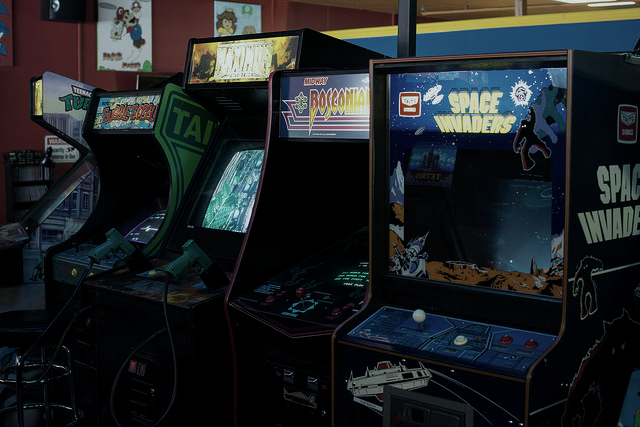

# Getting started with arcade emulation

Arcade emulation requires a different planning approach than console emulation. Arcade emulator terminology can also differ from the terms used in other kinds of emulation.

### Process
  1. **Understanding the terminology**
  2. **Choose an arcade emulator to match your system**
  3. **Use the correct version romsets for that emulator**

The libretro core ecosystem includes a variety of arcade emulators, each with specific strengths and each requiring its own distinct version of arcade "romsets" which the emulator supports. Every arcade emulator core is optimized for different hardware and different games. This guide is intended to help you decide which core to use and find out what romset version is required for that emulator.

---

## Step 1: Understanding the terminology

* **Arcade emulators**: Even more than consoles/computers, arcade machines had many manufacturers and generations since the first arcade machine back in 1971, hence why what we refer as "arcade emulators" are actually multi-system emulators able to emulate thousands of different systems at various levels of faithfulness. Note that while they are known for arcade emulation, they can also emulate consoles and computers.
* **Dump**: A dump is the digital representation of 1 chip present on a game board/cartridge.
* **Rom**: A rom refers to 1 file containing 1 single dump or several dumps concatenated together.
* **Romset**: Literally "rom set", meaning a set of roms. A romset is an archive containing one or several individual rom(s), **arcade emulators expect this game format**.
* **Romset version**: It's not unusual for a specific romset to exist in different versions. The reason for this is that sometimes the attempts at digitalizing chips failed, and instead of having a game totally unavailable due to a romset being only 90% complete, it was decided to implement workarounds in the emulator's code to make the game somehow playable. Every time one of those chips finally gets a proper dump, which can happen decades later, ongoing arcade emulators will update their code by removing the workarounds and loading the correct dump, hence why multiple versions can exist.
* **Samples**: Sometimes, instead of emulating the sound coming from the actual board of a game, an emulator will use recorded sounds. There can be several reasons for this : the chips weren't dumped, the emulator doesn't emulate that sound board (yet), or the emulator allows as an alternative to replace that emulation by high quality sound coming from another source (OST, ...).
* **CHD**: Some arcade games require data from an internal hard drive, CD-ROM, laserdisk, or other media in order to be emulated -- those forms of media are packaged as CHD files. CHD files should be copied to subfolders (going by the name of the romset) within the folder where the arcade romset has been installed.

Additionally, there exist different kind of romsets :

* **Bios romset**: A romset containing bioses required to run an arcade system. For example, the `neogeo` romset contains the bioses required to run SNK's NeoGeo cartridge system.
* **Parent romset**: There can be multiple revisions of an arcade cabinet, the romset dumped from the one believed to be the most recent is the parent romset. Parent romsets might require a bios romset to work.
* **Clone romset**: Either dumped from arcade cabinet revisions believed to be older, or unofficial revisions of that arcade cabinet (bootlegs, hacks). Clone romsets might require a parent to work.
* **Full non-merged romset**: The romset can be used standalone because the archive contains all the files required to run that romset, including any roms from its parent and bios romsets.
* **Non-merged romset**: The romset can be used standalone because the archive contains all the files required to run that game, including any roms from its parent romset. With this format, a separate bios romset might be needed to run the romset.
* **Split romset**: With this format, a clone romset never contains any of the roms present in its parent romset, and a parent romset never contains any of the roms present in its bios romset (if it exists).
* **Merged romset**: Clones are merged into the parent romset zip, meaning that more than one game is stored in the romset.

!!! info "ClrMamePro users"
    To rebuild Full Non-Merged romsets, use `Non-Merged` mode and deselect `Separate BIOS sets` via the `Advanced` button in the `Rebuild` and `Scanner` menus. ClrMamePro may display BIOS sets as missing in scans with these settings, but that is because all of the BIOS files will be distributed directly to the game romsets that need them.

!!! tip "Recommended romsets"
    Non-merged romsets are recommended if you intend to use only a few romsets, while split romsets are recommended if you intend to keep the whole collection of romsets supported by an emulator. Merged romsets aren't recommended at all since [it's tricky](https://forums.libretro.com/t/how-to-play-clones-of-merged-mame-roms/35695) to run the alternate revisions of the game within the libretro ecosystem. 

---

## Step 2: Choose an arcade emulator to match your system

There are two families of multi-system arcade emulators available as libretro cores: FinalBurn and MAME. These emulators are in turn available in multiple versions to allow users to best match a core to their device. There are also a few console emulators that can alternatively emulate the arcade hardware based on that console. There is no "best arcade core", recommending one is hard without knowing your device and what you intend to play, each of them being differently balanced.

### The criterias for choosing an arcade core

#### Integration within the libretro ecosystem
A better integration allows for more features to be available from the frontend you are using, like netplay, runahead, rewind, retroachievements, ... but also reduces the risk of bugs. The quality of the integration is directly linked to the availability of a support team for the core.

#### Accuracy
Theoretically, more recent version of the emulators should always be more accurate, which means the graphics, sound and gameplay of the games are more likely to be faithful to the original cabinet. In reality, for vintaged MAME cores, with fixes being backported to some vintages and not some others, the situation is not so predictable.

#### Input lag
Accuracy improvements can add or remove frames of input lag. It is believed that **FinalBurn Neo** and **MAME (current)** have the lowest input lag on average. Also note that **FinalBurn Neo** has virtually 0 frames of input lag since it has full support for the runahead and pre-emptive frames feature. As of november 2022, runahead is also available in **MAME (current)**, keep in mind that feature is not officially supported by upstream so it might never catch up with FBNeo quality-wise.

#### Performance
Being more accurate usually means the emulation will be more taxing on your cpu, so older versions of emulators will usually perform better at the cost of accuracy and are worth trying if you have performance issues with more recent versions. Accuracy is not the only reason for performance regression though, the emulator framework has an impact too, this is especially noticeable on MAME which had its framework constantly updated over the years.

#### Supported games
Arcade emulators keep adding support for new machines over the years, so the more recent versions support more games. This is a double-edged sword as far as performance is concerned, because it can require updates to already emulated components, to add previously unemulated/unnecessary feature of the component, which might impact its emulation performance even for the machines that didn't need this feature.

#### Emulator goal
MAME's goal is to emulate every existing machines, including machines unrelated to gaming (it can emulate printers, vending machines, ...), the most accurately possible, while documenting them thoroughly. FinalBurn's goal is mainly to offer a comfortable experience for the end-user as a gaming software, and can include optional features that didn't exist on original cabinet (alternate controls for a better experience with modern controllers, alternate high-quality music, ...). MAME 2003-Plus has pretty much the same goal as FinalBurn, with both emulators actually sharing a few contributors.

#### Support team
Last but not least, most of the arcade cores have no real maintainer and are mostly there as a frozen-in-time alternative if the cores that have a support team can't play properly the game you want. **FinalBurn Neo** and **MAME 2003-Plus** have a support team (please note that MAME 2003-Plus is a hard fork which isn't written by the MAME team). **MAME (current)** gets regular bumps but doesn't have a regular maintainer to take care of known issues. We don't recommend you try getting help from the MAME team for any of the MAME cores we provide, because you won't get any.

### Quick tour of every available core

#### FinalBurn Neo
* has the tightest integration within the libretro ecosystem
* is mostly accurate, can be more accurate than MAME (current) on a few games
* uses the latest known good romsets
* is reasonably fast
* has a support team
* doesn't support 3D games, support fewer 2D games than MAME
* keeps adding support for new games, including a lot of hacks and homebrews

#### MAME 2003-Plus
* has the second tightest integration within the libretro ecosystem
* while originally forked from MAME 2003, can be fairly accurate on some games since it incorporates some emulation fixes from recent versions of MAME
* is quite fast, this fork was originally meant by the author to run on a pentium III @ 733mhz (Xbox OG)
* doesn't have fixed romsets, doesn't always use latest known good romsets either
* has a support team
* supports a few classics that aren't supported yet in FinalBurn Neo
* keeps adding support for new games

#### MAME (current)
* is the slowest core and the one that consumes the most memory
* is usually the most accurate
* uses the latest known good romsets
* has the widest range of emulated machines
* has the shallowest libretro implementation, with concerning issues (see [broken shaders on vertical games](https://github.com/libretro/mame/issues/261))
* keeps adding support for new games

#### FinalBurn Alpha 2012
* has splitted cores for optimized memory usage if you are using a device with very very limited memory (wii, nds, ...)
* has fixed romsets
* is an older version of FinalBurn Neo, and as such should be faster while being less accurate and supporting less games, the libretro integration isn't as good either
* should only be considered as an alternative on ultra low-power devices

#### MAME 2000
* is the fastest arcade core
* is the most inaccurate arcade core
* has fixed romsets
* has the smallest list of supported games
* should only be considered as an alternative on ultra low-power devices

#### MAME 2003
* is slower than MAME 2000
* is more accurate than MAME 2000
* has fixed romsets
* support more games than MAME 2000
* probably shouldn't be used at all, MAME 2003-Plus is just plain better

#### MAME 2010
* is slower than MAME 2003
* is more accurate than MAME 2003
* has fixed romsets
* support more games than MAME 2003
* probably shouldn't be used at all, most of the interesting things it has to offer were backported to MAME 2003-Plus, including lots of game additions

#### MAME 2015
* is slower than MAME 2010
* is more accurate than MAME 2010
* has fixed romsets
* support more games than MAME 2010

#### MAME 2016
* is slower than MAME 2015
* is more accurate than MAME 2015
* has fixed romsets
* support more games than MAME 2015
* has the same shallow libretro implementation than MAME (current)

#### Flycast
* support arcade hardware based on Sega Dreamcast (NAOMI, NAOMI 2 and AtomisWave)
* is the only libretro core available for those 3 systems

#### Kronos
* support arcade hardware based on Sega Saturn (ST-V)
* MAME is also able to emulate ST-V

---

## Step 3: Use the correct version romsets for that emulator

The recommended format for arcade romsets is zip, it has the fastest loading and the widest support. 7zip might work or not. **If you extract an arcade romset, it won't work**.

As previously said, arcade emulators emulate thousands of different machines, so they need a mean to identify which machine run a given romset, it was decided to use the archive's filename for this purpose. **If you rename an arcade romset, it won't work**.

Each file within a romset is the dump of a chip with a specific purpose (program data, sound data, graphics data, ...), the emulator needs to identify each dump's role, it was decided to use their signature (crc) for this purpose (filenames can sometimes be used as a fallback to load bad/hacked dump). **If your romset doesn't contain the exact files the emulator requires, it won't work**.

!!! Warning
    When using romsets for the latest version of MAME or FBNeo, you should first make sure your version of those cores aren't outdated.

!!! tip
    In general, you will get better results with a full collection of romsets for your chosen emulator. Starting with individual arcade romsets is less likely to work because you generally won't know which emulator they target, or if they contain every required files to run the game (bios, parent). Full Non-Merged romsets are widely available for all of the "historic" MAME cores. **Full Non-Merged romsets are the simplest romset format to get started with because each romset zip contains all necessary files for one game.**

| Emulator | Required ROM Version | ClrMamePro dat file |
| :---: | :---: | :---: |
| FB Neo | FBNeo (latest version) | [here](https://github.com/libretro/FBNeo/blob/master/dats/FinalBurn%20Neo%20(ClrMame%20Pro%20XML%2C%20Arcade%20only).dat) |
| FB Alpha 2012 | FBA 0.2.97.24 | N/A |
| MAME 2000 | MAME 0.37b5 | [here](https://github.com/libretro/mame2000-libretro/blob/master/metadata/MAME%200.37b5%20XML.dat) |
| MAME 2003 | MAME 0.78 | [here](https://github.com/libretro/mame2003-libretro/blob/master/metadata/mame2003.xml) |
| MAME 2003-Plus | MAME 2003-Plus (latest version) | [here](https://github.com/libretro/mame2003-plus-libretro/blob/master/metadata/mame2003-plus.xml) |
| MAME 2010 | MAME 0.139 | [here](https://github.com/libretro/mame2010-libretro/blob/master/metadata/mame2010.xml) |
| MAME 2015 | MAME 0.160 | [here](https://github.com/libretro/mame2015-libretro/blob/master/metadata/mame2015-xml.zip) |
| MAME 2016 | MAME 0.174 | [here](https://github.com/libretro/mame2016-libretro/blob/master/metadata/MAME%200.174%20Arcade%20XML%20DAT.zip) |
| MAME (latest version) | MAME (latest version) | [here (click XML link)](https://www.mamedev.org/release.html) |

###  Optional : ClrMamePro tutorial
Clrmamepro is a tool to help validating your romsets against a given emulator.

!!! info "Credits"
    This tutorial is based on RetroPie's

#### Step 1 - Back up your ROMs
It is possible with ClrMamePro to change one or two options and when it runs it will delete all your existing ROMs. OK, not really - using the default options it will make backups of any files it removes, but it is still possible to mess up their ROMs beyond repair when getting started with ClrMamePro.

#### Step 2 - Download [ClrMamePro](http://mamedev.emulab.it/clrmamepro/#downloads)

#### Step 3 - Acquire DAT files
You can download most DAT files from above.

#### Step 4 - Run ClrMamePro for the first time
* Run it.  The welcome screen explains that common first steps are to 1) Create a Profile, 2) Set up your paths and 3) Scan your ROMs. We will be doing things slightly differently, in order to leave your source ROMs intact.  
* Click OK to the Welcome screen
* Click **"Add DatFile..."**, search and open the DAT file you downloaded
* Accept the default profile location of [PROFILES], click **"OK"**
* Select **"[NEW DATFILES]"** in the left-hand pane and select the one jou just added in the right-hand panel
* Click **"Load / Update"**
* ClrMamePro will ask you how to generate the settings for this datfile, click **"Default"** (it is possible it will throw a warning but just select **"ok to all"** and continue on)
* You are now at the main window for clrmamepro.  We still need to set our paths, so click **"Settings"**
* Verify **"ROM-Paths"** is the selected option in the upper-left corner drop down menu
* Click the **"Add..."** button
* Create a folder where you'll store your romsets, select it and click **"OK"**
* Close the settings window with the **"X"** button in the upper right

At this point, you could scan the ROMs folder you just selected, but we just created this folder and it is empty.  Instead, we will rebuild into this folder.

#### Step 5 - Rebuild a ROM set

* In the main ClrMamePro window, select **"Rebuilder"**
* The destination should already be filled in for you - it is the same as the ROM path you defined above
* Use the browse button **"..."** to select your source path. For example you might have a folder where you stored various arcade ROM sets you got from various sources - point ClrMamePro to that directory as your source.
* When rebuilding there are three options: **Non-Merged, Merged, and Split**. Pick the one you prefer. If you select "Non-Merged" in this menu, it is recommended to click the "Advanced" button and deselect "Separate BIOS sets", so that ROM sets will also be self-sufficient with BIOS.
* Click **"Rebuild..."**.  Depending on the size of the directory you chose as a source, this could take some time
* When ClrMamePro is finished rebuilding, you will see a window with statistics showing how many matching files were found, how many files were created and how many were skipped.  Click "OK" 
* Repeat for any other source paths you might have.  You can rebuild from multiple sources, but leave the Destination path the same
* When finished, close the Rebuilder with the **"X"** in the upper right corner of the window

Time to find out how well your source ROMs matched up...

#### Step 6 - Scan a ROM set
* In the main ClrMamePro window, select **"Scanner"**
* Leave all settings at default and click **"New Scan..."**
* When ClrMamePro finishes scanning, you will see a "Statistics" window with high level information and a "Scan Results" window with detailed information about your missing ROMs

#### Notes

* Typically you cannot completely 'roll forward' from an old ROM collection version to a new version, since these will often feature entirely new roms or dumps that weren't present in your older version. The same is true for 'rolling back' from a new version to an older version, but there are 'rollback' sets available that collect all the previously deleted ROMs from old versions that you can use to fill in the gaps.
* Be careful with the "Fix" settings in the Scanner window and the "Remove Matched Sourcefiles" setting in the Rebuilder window. These settings will remove and rename your ROMs.
* If ClrMamePro does delete any ROMs (because you told it to), you should be able to find backups in C:\clrmamepro\backup as long as you didn't change the default settings.
* ClrMamePro is very stable.  It has been around for a long time, it is regularly updated and it is widely used.  If it reports problems reading your ROMs, you most likely have corrupt ROM archives (zip files) or a failing hard drive.
* If you feel the need to reset ClrMamePro's settings, just delete your existing profile(s) and reload your DAT file, selecting **"Default"** settings for the new profile.  Almost all of ClrMamePro's settings are per-profile.

---

### RetroArch Playlist Scanner Support

~~The RetroArch content database supports arcade romsets in Full Non-Merged and Split formats. In order to be recognized by the scanner, Full Non-Merged and Split romsets must also be [processed by TorrentZip to standardize their CRC](https://sourceforge.net/projects/trrntzip/).~~

Manual scan is the recommended method for setting up arcade playlists in RetroArch. [Here](https://neo-source.com/index.php?topic=3725.0) is a guide written for creating FBNeo playlists, but you can easily adapt it for MAME usage.

!!! info "Credits"
    The arcade cabinets image is based on an image by Rob DiCaterino, licensed for reuse under a Creative Commons (CC BY 2.0) License. Original image and license: https://www.flickr.com/photos/goodrob13/17385639015/
