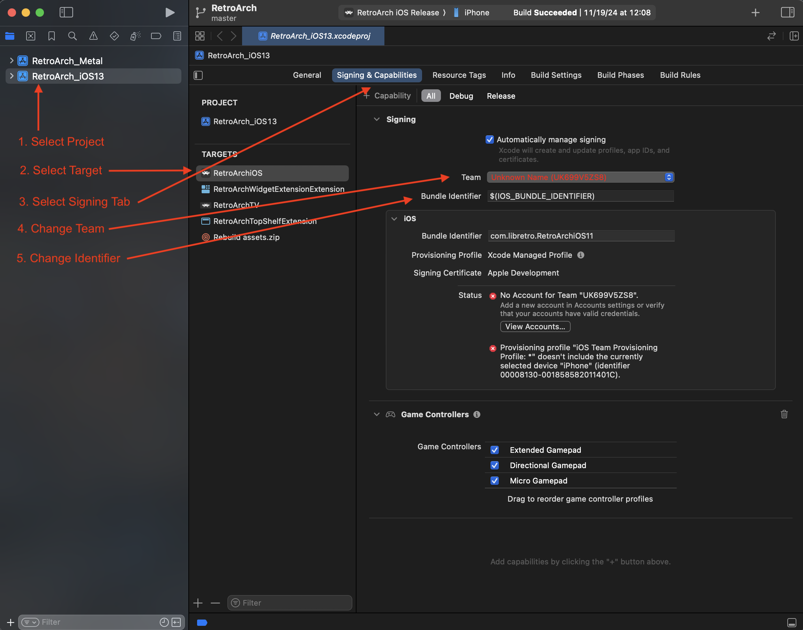

# iOS/tvOS Installation Guide

The following is a non-developer guide to install RetroArch on non-jailbroken iOS or tvOS devices. We're going to try to improve the process and possibly include the iOS cores in a download, but until then, here is a way to build RetroArch to get it running on your iPhone, iPod Touch, iPad, or Apple TV.

!!! note
    If you just want to sideload from an IPA file, then you can find a working build (version 1.9.0) [here for tvOS](http://buildbot.libretro.com/stable/{{ unit.stable }}/apple/tvos/RetroArch-tvOS.ipa) and [here for iOS](http://buildbot.libretro.com/stable/{{ unit.stable }}/apple/ios/RetroArch.ipa)

## Building From Source using Xcode

This is probably the most straightforward way to install RetroArch without having to resort to 3rd party tools. It does however require:

- a Mac capable of running the latest Xcode
- Xcode (downloaded from the App Store)
- an Apple ID

### Clone the RetroArch repository

Open Terminal (it's in `/Applications/Utilities`) and run the following command:

```shell
git clone https://github.com/libretro/RetroArch.git
```

### Download the Emulator Cores

Emulator cores are needed to use RetroArch as they contain the code that drives the emulation of the system of the game you want to play.

Normally you'd compile the cores, but since you're not a developer, I'll provide a link to my personal set of precompiled cores for iOS: [Download Cores from Mega.nz](https://mega.nz/#!ScRDECzC!f8Gow0Zww5kbkl4XPlCJ2lK0sFqcZ1rWSL5QYLvO0O4)

### Extract the Cores

Unzip the above archive of cores into the following directory in the RetroArch project: `pkg/apple/iOS/modules`. The core files should have the extension of `.dylib`.

### Open RetroArch in Xcode

Open the Xcode project located at `pkg/apple/iOS/RetroArch_iOS11_Metal.xcodeproj`.

### Sign in with your Apple ID

- Open Xcode Preferences (Xcode -> Preferences)
- Click the "Accounts" tab
- Hit the "+" at the bottom left and choose "Apple ID" and sign in with your Apple ID
- Once you’ve successfully logged in, a new team called "(Your Name) Personal Team" with the role "User" will appear beneath your Apple ID.

### Pair Xcode with your iOS or tvOS Device

Follow the [instructions in this Apple support article](https://support.apple.com/en-gb/HT208088) to pair your device in Xcode. When finished, you should see your specific device when you go, in Xcode, to Windows -> Devices & Simulators.

### Xcode Project Setup

Before you can build or run RetroArch on your device, you'll need to change the project's code-signing settings to build it with your Apple Developer Team.

Click on the project name, select the target you're interested in (RetroArchiOS11 for iOS, RetroArch TV for tvOS) and click on the "Signing & Capabilities" tab.

Change the "Team" to your Personal Team that you created above. Change the "Identifier" string to an arbitrary identifier in reverse-DNS notation, like `com.whatever.retroarch` and hit `Enter`. At this point Xcode should automatically create the necessary Provisioning Profile. If it does not, then you may not have correctly registered and paired your iOS or tvOS device in the last step. Note that there might be separate settings for Debug and for Release here, so change them both if needed.

Next, change the project target to be your device, specifically. To do this, click at the center-left area of the Xcode window where it says `RetroArch iOS` (hover tooltip: `Set the active scheme`) and choose the desired combination of platform and _your device specifically_.

Finally, build and run:



### Using RetroArch

On an iOS device, you'll be presented with a touch interface. If you have an mFi controller, you can control the interface that way as well.

On the Apple TV, you'll be shown the "XMB" (PS3-like) interface. You need to use an mFi controller with an Apple TV. The Siri Remote is not supported yet.

When you first start RetroArch, you'll notice that you're missing images. You'll want to run the Online Updater:

- From the main menu, choose "Online Updater"
- Choose:
  - Update Core Info Files
  - Update Assets
  - Update Databases
  - Update Overlays
  - Update GLSL Shaders

Do not choose "Core Downloader"! That will not work on iOS.

#### Changing the Menu Interface

If you want more visual flair in the interface, you can change it by going to "Settings" -> "Driver" -> "Menu Driver". You might need to restart to see it take effect.

### Transferring ROMs

#### iOS

Use a 3rd party utility like iFunBox or iExplorer to transfer ROM files to the RetroArch app directory.

#### Apple TV

When you start RetroArch, you'll be presented with a screen with a web address that you can access on your computer to transfer files to the RetroArch app directory on your Apple TV.
