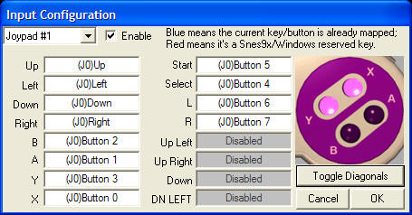
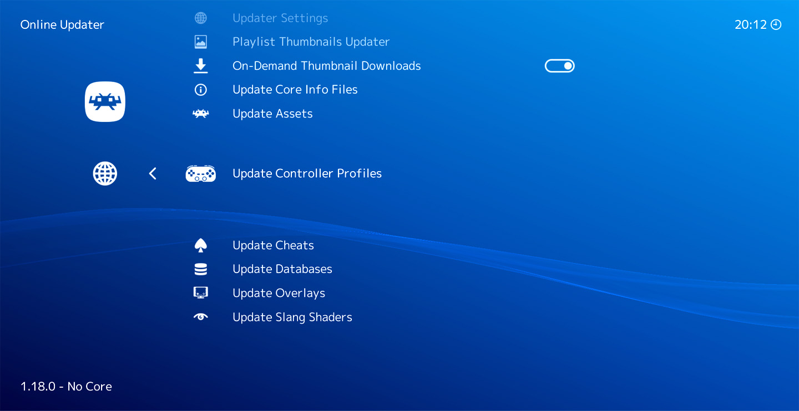

# Joypad Auto Configuration

## How does RetroArch match controllers?

When you connect a new controller to RetroArch, the system attempts to automatically configure it by matching it to known profiles. This matching process is crucial for ensuring that your controller works correctly with various games and emulators.

The matching algorithm considers several key factors:

- **Controller driver (input_driver)**: The software interface used to communicate with the controller. To use a specific driver, RetroArch must be configured accordingly by navigating to **Settings -> Drivers -> Controller**.
- **Device Index (input_device)**: The name of the controller as recognized by the system. The **Device Index** can be identified by navigating to **Settings -> Input -> RetroPad Binds -> Port 1 Controls**.
- **Vendor ID (input_vendor_id)**: A unique identifier assigned to the controller's manufacturer.
- **Product ID (input_product_id)**: A specific identifier for the particular controller model.

RetroArch evaluates each of these factors against its database of controller profiles. It then calculates a matching score for each profile, with the highest-scoring profile being selected to configure the controller.

linuxraw is specifically an input driver option within RetroArch, and not a standalone component used by other software like sdl2, or udev. However, linuxraw which operates differently than other drivers by providing only a device name instead of Vendor ID (VID) and Product ID (PID) information. This means that controller matching with the linuxraw driver depends primarily on the device name (Device Index), accessed through the JSIOCGNAME ioctl command, rather than the typical vid:pid identifiers.

It's worth noting that the Vendor ID and Product ID pair is often abbreviated as "vid:pid" in technical discussions.

This matching system allows RetroArch to support a wide range of controllers while minimizing the need for manual configuration in most cases.

## Why is it needed?

RetroArch works many platforms. Each of these platforms has one or more input systems. These input systems in turn differ widely in the way they enumerate the pad buttons. For this reason, your joypad buttons may be mapped differently depending on if you are using Windows, Mac, or Linux.


Traditional emulators allow you map each button of your pad to the original pad of the emulated system. For example, this is how the Snes9x joypad configuration interface looks:



RetroArch also allows this kind of manual mapping. However, RetroArch tries to go further by detecting your joypad and automatically configuring it so manual configuration becomes obsolete.

## Benefits

With RetroArch joypad auto-configuration system, your joypad will be recognized and will work out of the box.

This allows:

   - Use many different joypads and have them attributed to each players like it would work on a real game console.
   - Unplug the second joypad, and replace it by another one, even if it's of a different brand and model.

Having automatically configured joypads makes it a lot easier to navigate the RetroArch Menu with the joypad. This is very convenient when running RetroArch on a game console, where a keyboard and a mouse are not always available. It is also what makes RetroArch suitable to build your own game console using Lakka or a similar OS.

## Before you begin

Make sure that you run the latest version of RetroArch, to generate a file name and file content via `Settings` -> `Input` -> `RetroPad Binds` -> `Port 1 Controls` -> `Save Controller Profile` that is up to date with our current policies.

## Modify the Controller Profiles Directory for Non-Root User Accessibility

Both the Flatpak and Android versions of RetroArch need adjustments to the Controller Profiles Directory to ensure essential functionality and smooth operation.

**Challenges for Android and Flatpak:**
- Users are unable to save custom profiles through the path: `Settings -> Input -> RetroPad Binds -> Port 1 Controls -> Save Controller Profile`.
- Modification Restrictions: You are not allowed to change existing autoconfig files. Files that are initially disabled have "(default-off)" in their names. Without root access, you cannot modify these files to toggle the input_vendor_id and input_product_id settings. This restriction applies to both the "(default-off)" files and the "original" autoconfig files, which are more widely used and have been set to be enabled by default. These original files must also be commented to make changes. This limitation affects both HID and non-HID files, as well as controllers with multiple autoconfig files, such as the Sony DualSense controller, which includes several Android autoconfig files.

### Android Configuration

**Challenge:**
Most Android devices are not rooted, and RetroArch's default autoconfig directory requires root access, leading to the following issues:
- Restricted File Access: Users can update controller profiles via `Main Menu -> Online Updater -> Update Controller Profiles`, but cannot access these files in `/data/user/0/com.retroarch/autoconfig`. Android's security model prevents non-root users from reading certain files, making it difficult to compare updated profiles with custom-generated ones, thus hindering effective profile management and customization.
- Modification Restrictions: Existing autoconfig files cannot be modified when necessary (refer to the base section for more details).

**Resolution:**
- Create the directory `/storage/emulated/0/RetroArch/autoconfig/android`.
- In RetroArch, change the directory path under `Settings` -> `Directory` -> `Controller Profiles` from `/data/user/0/com.retroarch/autoconfig` (root) to `/storage/emulated/0/RetroArch/autoconfig`.
- This adjustment allows the autoconfig files to be saved in `/storage/emulated/0/RetroArch/autoconfig/android` when using `Settings` -> `Input` -> `RetroPad Binds` -> `Port 1 Controls` -> `Save Controller Profile`.

#### Addressing controller navigation issues on non-touchscreen devices
Your controller will use the Controller Profile directory `/data/user/0/com.retroarch/autoconfig` by default in Android. Any autoconfig file that mathces your controller (Vendor ID/Product ID) be used by RetroArch automatically. However, you will not be able to generate a **new** autoconfig file for your controller if a default autoconfig file encounter issues with the following components:

* **DPAD**: Essential for navigating menus.
* **OK**: Necessary for applying settings, such as navigating to `Settings -> Input -> RetroPad Binds -> Port 1 Controls`, and selecting `Set All Controls` and `Save Controller Profile`.
* **Back**: Needed to return to `Main Menu -> Quit` after configuring `Settings -> Directory -> Controller Profiles`, ensuring the settings are saved to retroarch.cfg. Workaround if you have access to another controller: Temporarily connect another controller with a functioning autoconfig "Back" button and adjust the Controller Profiles directory:
  - `Settings -> Directory -> Controller Profiles`.
  - `Main Menu -> Quit` -- ensuring the settings are saved to retroarch.cfg.
  - Disconnect the controller from BlueTooth.

While these issues are not problematic for typical Android devices like smartphones and tablets, which offer touchscreen navigation, they become significant on Google TV (an Android-based OS used by Chromecast) where a touchscreen is unavailable. Additionally, Chromecast's voice remote control lacks autoconfiguration and is incompatible with RetroArch navigation. Even controllers with touchpads are ineffective, as the touchpad button does not function (as observed with PS4/PS5 controllers), and the cursor remains invisible due to a known [bug](https://github.com/libretro/RetroArch/issues/16853).

**Proposed Solution:**

To resolve this issue, follow these steps:

- **Create a Custom Configuration File:**
  - Create the file `retroarch.cfg` in the directory `/storage/emulated/0/Android/com.retroarch/files/retroarch.cfg` with the following line:
```
joypad_autoconfig_dir = /storage/emulated/0/RetroArch/autoconfig/
```

- **Set Up a Fallback Configuration:**
  - Identify the Product ID and Vendor ID of your controller: Ensure that the directory /storage/emulated/0/RetroArch/autoconfig/ remains empty, then restart RetroArch. This action will compel RetroArch to enter fallback mode, displaying a message like "[Controller name] ([Vendor ID]/[Product ID]) not configured, using fallback". Record the four-digit numbers for both IDs.
  - Create a file named `fallback.cfg` in the directory `/storage/emulated/0/RetroArch/autoconfig/android/` with the following configuration settings (don't forget to replace `input_vendor_id = "[Vendor ID]"` and `input_product_id = "[Product ID]"` with the values of your controller:
```
input_driver = "android"
input_device = "Fallback device"
input_vendor_id = "[Vendor ID]"
input_product_id = "[Product ID]"
input_b_btn = "96"
input_y_btn = "97"
input_select_btn = "98"
input_start_btn = "99"
input_up_btn = "h0up"
input_down_btn = "h0down"
input_left_btn = "h0left"
input_right_btn = "h0right"
input_a_btn = "100"
input_x_btn = "101"
input_l_btn = "102"
input_r_btn = "103"
input_l2_btn = "104"
input_r2_btn = "105"
input_l3_btn = "106"
input_r3_btn = "107"
input_l_x_plus_axis = "+0"
input_l_x_minus_axis = "-0"
input_l_y_plus_axis = "+1"
input_l_y_minus_axis = "-1"
input_r_x_plus_axis = "+2"
input_r_x_minus_axis = "-2"
input_r_y_plus_axis = "+3"
input_r_y_minus_axis = "-3"
```

- **Launch RetroArch:**
  - Start the RetroArch application.

- **Button Testing:**
  - Test the controller buttons to identify which ones correspond to the "OK" and "Back" functions. This will allow you to navigate and temporarily reconfigure RetroArch.

By applying this solution, you allow your controller to configure RetroArch, enabling navigation to Settings -> Input -> RetroPad Binds -> Port 1 Controls and the selection of Set All Controls and Save Controller Profile. This setup also permits the saving of autoconfig files in the directory /storage/emulated/0/RetroArch/autoconfig/android.

### Flatpak Configuration

**Challenge:**
The default autoconfig directory in Flatpak RetroArch also requires root access, which prevents users from:
- Downloading and extracting profiles through `Main Menu` -> `Online Updater` -> `Update Controller Profiles`.
- Saving custom profiles via `Settings -> Input -> RetroPad Binds -> Port 1 Controls -> Save Controller Profile`.
- Modification Restrictions: Facing similar issues as Android users if the GNU/Linux user lacks root access, as existing autoconfig files cannot be modified when necessary (refer to the base section for more details).

#### Resolution
To address this issue, configure RetroArch as follows:
 
1. Enable Hidden File Visibility
* Navigate to `Main Menu -> Load Content -> File Browser`
* Enable the option `Show Hidden Files and Directories`

2. Modify Controller Profiles Directory
* Go to `Settings -> Directory -> Controller Profiles`
* Change the directory from the default `/app/share/libretro/autoconfig` to `/home/youruser/.var/app/org.libretro.RetroArch/config/retroarch/autoconfig`.

Note: The actual path of the default directory is: /var/lib/flatpak/app/org.libretro.RetroArch/current/active/files/share/libretro/autoconfig/

By implementing these changes, you'll be able to create and save custom controller profiles without requiring root privileges.

## Installing or updating joypad profiles



The set of joypad profiles used by RetroArch can be downloaded and updated from the menu. Go to `Main Menu` -> `Online Updater` -> `Update Controller Profiles` to get the latest version of the profile pack.

A message will appear at the bottom of the screen showing the download progress and the extraction of the archive.

## Generating a joypad profile

If your joypad is not recognized by RetroArch even after updating the profiles, you can generate a profile from the menu.

1. To avoid other controllers from interfering with your mapping when starting RetroArch, follow these steps: Disconnect all joypads by unplugging their cables or disconnecting them from any wireless connections.
2. Connect the controller intended for autoconfiguration. Ensure your system supports the selected connectivity method. If your joypad supports both wired and wireless connections and the initial attempt (e.g., via USB) fails, try the alternative option (e.g., Bluetooth). For example, the Nintendo Switch Pro Controller does not support USB connection on Linux 5.15 and older but does support Bluetooth.
3. For Android, run the [Android](#android) steps first.
4. Use `Settings` -> `Input` -> `RetroPad Binds` -> `Port 1 Controls` -> `Set All Controls`. If automatic mapping fails for any button (e.g., due to lack of driver support), the process will be interrupted. In case of interruption, manually map the remaining buttons, starting from the one that caused the interruption and continuing through the rest of the list.
5. If applicable, then also set the menu button binding in `Settings` -> `Input` -> `Hotkeys` -> `Menu Toggle`
6. Use `Settings` -> `Input` -> `RetroPad Binds` -> `Port 1 Controls` -> `Save Controller Profile`
7. The new profile file (also known as the autoconfig file) will be saved to your disk: [Controller profile directory]/[Controller driver]/[Device index].cfg.
8. For analog L2/R2 triggers (pressure-sensitive triggers) you must manually edit the autoconfig file (see the [Analog L2/R2 remapping](#analog-l2r2-remapping) section) due to a bug in RetroArch.

### Manual analog L2/R2 remapping
RetroArch has a bug([ref1](https://github.com/libretro/RetroArch/issues/6920), [ref2](https://github.com/libretro/RetroArch/issues/16767)) that causes analog L2/R2 triggers to be incorrectly mapped as digital buttons instead of analog axes when configuring controls through the UI. This affects pressure-sensitive triggers on controllers like PlayStation 2 and later, making some games unplayable due to the lack of analog input.

To work around this issue, you need to manually edit the RetroArch config file to set the correct analog axis mappings for L2 and R2. Here's how to find the proper axis values:

* Install and run jstest avalible for GNU/Linux, and Windows.
* In GNU/Linux: jstest /dev/input/js0
* Slowly press L2 and R2 to identify which axis numbers change
* Note the axis numbers that correspond to L2 and R2
* In the autoconfig file, set:
```
input_l2_axis = "+X"  (where X is the L2 axis number)
input_r2_axis = "+Y"  (where Y is the R2 axis number)

input_l2_axis_label = "L2 Analog"
input_r2_axis_label = "R2 Analog"
```

For [example](https://github.com/libretro/retroarch-joypad-autoconfig/pull/1135), if L2 is axis 2 and R2 is axis 5, you would:

Replace:
```
input_l2_btn = "6"
input_r2_btn = "7"

input_l2_btn_label = "L2"
input_r2_btn_label = "R2"

```

With
```
input_l2_axis = "+2"
input_r2_axis = "+5"

input_l2_axis_label = "L2 Analog"
input_r2_axis_label = "R2 Analog"
```

Note: These variable values are examples and should not be directly copied to your configuration file.

When modifying your autoconfig file for analog triggers, it's crucial to pay attention to both variable names and values. A common oversight is focusing solely on the values while neglecting to update the variable names themselves. The `_axis` suffix is essential for ensuring proper analog functionality. Simply changing values without updating the suffix from `_btn` to `_axis` will not achieve the desired result.

####Common Pitfall
Users often unintentionally incorporate analog variable values without properly adjusting the existing variable names to reflect their analog nature. This oversight frequently results in configuration problems within the system.
By carefully updating both the variable names and values, you can ensure that your analog triggers are correctly configured for optimal performance.

### Inspect the file

Without modifying anything in the original file, open it in the file in a text editor and
1. Make sure that you have mapped all buttons, and that none of them have duplicated values.
2. Each button should have a variable that ends with `_btn`, or `_axis`, not both. So for example, if you find both `input_a_axis`, and `input_a_btn`, it's incorrect. This may happen if your OS does not support the controller.

Before giving up and saving the controller again, you can attempt to re-map any missing buttons. However, please refrain from manually modifying the variables unless it's absolutely necessary due to bugs in RetroArch. If you plan to submit your profile to our joypad profile repository, we depend on automated data for debugging the autoconfig files.

### Try the controller
1. If the controller support Bluetooth, make sure that that there's no Bluetooth latency.
2. Make sure that your mapping is perfect by testing every button in the menu.
3. **Important: Remove previously set manual bindings**: Manual bindings take precedence over autoconfig files. So it's important to remove any manual bindings you may have set previously, as they take priority over autoconfig files. If you've used the Save Controller Profile command, you should reset these bindings. To do this, navigate to Settings -> Input -> RetroPad Binds -> Port 1 Controls -> Reset to Default Controls. Not resetting can cause issues with core responses, such as those from Remote RetroPad and console emulators, particularly if your manual bindings don't match the current controller driver's bindings. A typical problem arises when you create manual bindings, generate an autoconfig file, test them in Remote RetroPad, switch the controller driver to try a different autoconfig file, but forget to Reset to Default Controls first.
4. To verify all controller mappings: `Main Menu` -> `Load Core` -> `Start Remote RetroPad`. Press each button once; icons change white to light green permanently if they are mapped correctly. If icons remain white, try to remap them. Ensure no white buttons remain. Evaluate analog trigger responsiveness for L2 and R2. As you slowly apply pressure, a black rectangle should appear in the center of each button and gradually fade as the pressure increases. Ensure you press the triggers slowly to observe the visual feedback accurately. For Android smartphones and other devices with small displays, hold the screen closer to your eyes. This will help you see the subtle rectangle indicator, which can be difficult to spot at normal viewing distances on compact screens.
5. Try a game in a core that uses all mappings on your controller. After you have loaded the game it's possible that you have to change the native controller to your controller in `Quick Menu` -> `Settings` -> `Input` -> `RetroPad Binds` -> `Port 1 Controls` -> `Device Index` -- for example if you want to use both thumbsticks you have to change `PS1` to `DualShock` in PlayStation cores. If it's difficult for you to find a game that uses all buttons, you can set `Settings` -> `Input` -> `Hotkeys` (for example Save state, Load state, Fastforward, and Rewind) for unused buttons, so you can evaluate all mappings.
6. Use `Settings` -> `Inputs` -> `Port 1 Controls` -> `Reset to Default Controls` to clear manual bindings and rely on the new profile.
7. Unplug your joypad an re-plug it. See if it is auto configured.

If you are happy with your profile, you can submit it to RetroArch so that other users benefit:

1. Edit the autoconfig file for your joypad manually to include the input descriptors (please see the [Input descriptors](#input-descriptors) section below)
3. [Submit your profile to our joypad profile repository](https://github.com/libretro/retroarch-joypad-autoconfig).

### Default-off configs
When developing controller configurations, it's essential to anticipate and mitigate potential conflicts. These issues often arise in the following situations:

1. When multiple autoconfig files exist for a single device, causing confusion in the system. This primarily occurs with controllers that require different configurations based on kernel versions. For example, the Nintendo Switch Pro Controller on Linux, where older kernels necessitate a different button mapping compared to newer kernels.
2. With poorly constructed unlicensed controllers. Even a single mismatched button can break compatibility, necessitating custom configuration.

Here's how to set up a default-off configuration:

1. Append "(default-off)" to the configuration filename.
2. Comment out the `input_vendor_id` and `input_product_id` lines in the config file.
3. Do not add "(default-off)" to the values of the input_device_display_name and input_driver variables in the config file. The default-off status is already indicated by the filename, so these variables should remain unmodified for clarity.

This approach allows users to manually enable the configuration when needed, preventing automatic application that could interfere with common devices, and helps ensure a smoother experience for users while still providing the necessary configuration options for those who require them.

### Device Index scheme for autoconfig files

In RetroArch, the management of controller configurations is essential for ensuring proper functionality across various systems. This guide outlines how the Device Index are generated and how they can vary based on the Linux kernel version in GNU/Linux distributions.

#### Understanding the Device Index

RetroArch identifies physical controllers through a system called the Device Index. You can locate this identifier by navigating to:

**Settings > Input > RetroPad Binds > Port 1 Binds > Device Index**

The Device Index plays a crucial role when saving a controller profile. To save a profile, follow this path:

**Settings > Input > RetroPad Binds > Port 1 Controls > Save Controller Profile**


### Dual function of the Device Index

When you save a controller profile, the Device Index serves two important purposes:

1. **Configuration File Naming**: It becomes an integral part of the configuration file's name. For example, if the Device Index is "Foo", the configuration file might be named "udev/Foo.cfg".

2. **Input Device Identification**: Within the configuration file itself, the Device Index is used as the value for the `input_device` variable. Following our example, you would see a line like this in the file:

   `input_device = "Foo"`

This dual functionality ensures that RetroArch can correctly identify and apply the appropriate settings for each unique controller.

Importantly, this name remains consistent across various controller drivers, such as udev, sdl2, and linuxraw, as specified in **Settings > Drivers > Controller**.

### Naming scheme for udev, and sdl2

#### Example: Nintendo Switch Pro Controller on GNU/Linux

The following table illustrates how the Device Index for the Nintendo Switch Pro Controller varies across different Linux kernel versions, along with its HID support and corresponding autoconfig file names. As a side-note, the notation "(default-off)" indicates that the configuration is disabled by default to avoid 

| Linux Kernel Version | Device Index in RetroArch              | Nintendo Switch Pro Controller HID Support | Selected Device Index for the autoconfiguration file                          |
|----------------------|-------------------------------------------|-------------------------------------------|----------------------------------------------|
| 5.15                 | Pro Controller                            | No                                        | Pro Controller             |
| 5.19                 | Nintendo Switch Pro Controller            | Yes                                       |                                              |
| 6.2.0                | Nintendo Switch Pro Controller            | Yes                                       |                                              |
| 6.8.0                | Nintendo Co., Ltd. Pro Controller         | Yes                                       | Nintendo Co.,Ltd. Pro Controller         |

##### Configuration file examples

###### Pro Controller (default-off).cfg
```
# This file uses the legacy Device Index "Pro Controller" (generated by RetroArch on Linux 5.15)
# "(default-off)" was added to the file name to indicate that the autoconfig file is not active by default. See comments for input_vendor_id and input_product_id.
input_device = "Pro Controller"
# Due to the uncommon nature of this device, the autoconfig file is not active by default. This precaution is taken to avoid potential conflicts with the widely-used Nintendo Switch Pro Controller (nintendo-hid version) file. Button layouts are not compatible. To activate this configuration:
#   1) Comment out the input_vendor_id and input_product_id lines in the "Nintendo Co.,Ltd. Pro Controller.cfg" file.
#   2) Uncomment the input_vendor_id and input_product_id lines below:
# input_vendor_id = "1406"
# input_product_id = "8201"
```

###### Nintendo Co.,Ltd. Pro Controller.cfg
```
input_device = "Nintendo Co.,Ltd. Pro Controller"
input_vendor_id = "1406"
input_product_id = "8201"
```

### Naming scheme for linuxraw (depends on multiple Device Indexes)

The linuxraw controller driver relies on the `input_device` variable in the autoconfig file generated by the Device Index (described below) and does not use the `input_vendor_id` or `input_product_id` variables in the autoconfig file.

The Device Index may vary depending on the system version, particularly the Linux kernel version. To ensure compatibility, you must compare the Device Index across different Linux kernels and generate autoconfig files when they differ. The easiest way to do this is to run GNU/Linux distributions in live mode or as installed virtual machines.

#### Example: Nintendo Switch Pro Controller

| Linux Kernel Version | HID Support | Device Index in RetroArch         |
|----------------------|-------------|-----------------------------------|
| 5.15                 | No          | Pro Controller                    |
| 5.19                 | Yes         | Nintendo Switch Pro Controller    |
| 6.2.0                | Yes         | Nintendo Switch Pro Controller    |
| 6.8.0                | Yes         | Nintendo Co., Ltd. Pro Controller |

In the above list, three unique Device Index entries are identified, which require these autoconfig files for the controller to be identified for linuxraw:
- **Pro Controller.cfg**: 
  - Variable: `input_device = "Pro Controller"`
  
- **Nintendo Switch Pro Controller.cfg**: 
  - Comment above input_device: [1]
  - Variable: `input_device = "Nintendo Switch Pro Controller"`
  
- **Nintendo Co., Ltd. Pro Controller.cfg**: 
  - Comment above input_device: [1]
  - Variable: `input_device = "Nintendo Co., Ltd. Pro Controller"`

1: `# The files "Nintendo Co., Ltd. Pro Controller.cfg" and "Nintendo Switch Pro Controller.cfg" should have identical content except for the input_device variable. This difference allows thelinuxraw driver to recognize the controller on various Linux kernel versions.`

## Troubleshooting
If your joypad is not configured properly, you should [generate a RetroArch log](/docs/guides/generating-retroarch-logs.md). Your log will show if a profile has been matched for your pad and the path of the corresponding profile.

## Joypad auto-configuration file

### Metadata

The first part of the joypad profile is used for matching the profile with the device, as explained above. The **Vendor ID** and **Product ID** are in decimal format.

```
input_driver = "udev"
input_device = "Sony Interactive Entertainment DualSense Edge Wireless Controller"
input_vendor_id = "1356"
input_product_id = "3570"
```

### Mapping

The second part is the mapping itself, where each button is assigned to a button of the RetroPad (the joypad abstraction of RetroArch).

Example
```
input_b_btn = "0"
input_y_btn = "2"
input_select_btn = "6"
input_start_btn = "7"
input_up_btn = "h0up"
input_down_btn = "h0down"
input_left_btn = "h0left"
input_right_btn = "h0right"
input_a_btn = "1"
input_x_btn = "3"
input_l_btn = "4"
input_r_btn = "5"
input_l2_axis = "+2"
input_r2_axis = "+5"
input_l3_btn = "9"
input_r3_btn = "10"
input_l_x_plus_axis = "+0"
input_l_x_minus_axis = "-0"
input_l_y_plus_axis = "+1"
input_l_y_minus_axis = "-1"
input_r_x_plus_axis = "+3"
input_r_x_minus_axis = "-3"
input_r_y_plus_axis = "+4"
input_r_y_minus_axis = "-4"
input_menu_toggle_btn = "8"
```

Note: These variable values are examples and should not be directly copied to your configuration file.

#### Overview

##### Axes (analog inputs)
* They represent analog inputs from the controller, like joystick position (e.g., left joystick X-axis, right joystick Y-axis) or trigger pressure (e.g., L2 trigger, R2 trigger).
* Variable names (for both mappings and labels) includes `_axis` define these (e.g., `input_l_x_plus_axis_label`, `input_r2_axis`).

| Console          | Controller                       | Release Date   | Analog Thumb Sticks | L2/R2 Analog |
|------------------|----------------------------------|----------------|---------------------|--------------|
| PlayStation 1    | Sony Dual Analog Controller      | April 1997     | Yes                 | No           |
| PlayStation 1    | Sony DualShock                   | November 1997  | Yes                 | No           |
| PlayStation 2    | DualShock 2                      | 2000           | Yes                 | Yes          |
| PlayStation 3    | Sixaxis                          | 2006           | Yes                 | Yes          |
| PlayStation 3    | DualShock 3                      | 2008           | Yes                 | Yes          |
| PlayStation 4    | DualShock 4                      | 2013           | Yes                 | Yes          |
| PlayStation 5    | DualSense                        | 2020           | Yes                 | Yes          |

###### Mapping variables
* Axis definitions use `+` and `-` to indicate positive or negative direction (e.g., full press vs. no press).
* The current RetroArch configurations have axis values that ranges from `0` to `10`. However, if RetroArch does not limit the values to `10`, underlying controller hardware could offer an even wider range.

Mapping variables with analog L2/R2 triggers:
```
input_l2_axis = "+2"
input_r2_axis = "+5"
```

Note: A common mistake These variable values are examples and should not be directly copied to your configuration file.

###### Label variables
The term "Analog" is included in the variable values for the analog inputs to clearly indicate that these inputs are analog in nature.

Labels for analog thumb sticks:
```
input_l_x_plus_axis_label = "Left Analog X+ (right)"
input_l_x_minus_axis_label = "Left Analog X- (left)"
input_l_y_plus_axis_label = "Left Analog Y+ (down)"
input_l_y_minus_axis_label = "Left Analog Y- (up)"
input_r_x_plus_axis_label = "Right Analog X+ (right)"
input_r_x_minus_axis_label = "Right Analog X- (left)"
input_r_y_plus_axis_label = "Right Analog Y+ (down)"
input_r_y_minus_axis_label = "Right Analog Y- (up)"
```

Labels for analog L2/R2 triggers:
```
input_l2_axis_label = "L2 Analog"
input_r2_axis_label = "R2 Analog"
```

##### Buttons (digital inputs)

* These are defined by variable names ending with `_btn` (e.g., `input_a_btn`, `input_start_btn`).
* The current RetroArch configurations have button values that ranges from `0` to `203`. However, if RetroArch does not limit the values to `203`, underlying controller hardware could offer an even wider range.
* RetroArch interprets these IDs (usually 1 for pressed, 0 for not pressed) to determine the button state.

###### D-Pad directions (special digital inputs)

* D-pad directions use variable values beginning with `h0` (e.g., `input_up_btn = "h0up"`).
* Four `h0` variables exist (`h0up`, `h0down`, `h0left`, `h0right`) for each direction on the D-pad.
* Note: The value `h1` is used by a single controller (Nintendo_Wii_Remote_Classic_Controller.cfg).

#### Input descriptors

The third part are *input descriptors* used by RetroArch to display the labels of the buttons as they are written on your joypad.

Generic input descriptors:
```
input_b_btn_label = "A"
input_y_btn_label = "X"
input_select_btn_label = "Back"
input_start_btn_label = "Start"
input_up_btn_label = "D-Pad Up"
input_down_btn_label = "D-Pad Down"
input_left_btn_label = "D-Pad Left"
input_right_btn_label = "D-Pad Right"
input_a_btn_label = "B"
input_x_btn_label = "Y"
input_l_btn_label = "LB"
input_r_btn_label = "RB"
input_l2_axis_label = "LT"
input_r2_axis_label = "RT"
input_l3_btn_label = "Left Thumb"
input_r3_btn_label = "Right Thumb"
input_l_x_plus_axis_label = "Left Analog X+ (right)"
input_l_x_minus_axis_label = "Left Analog X- (left)"
input_l_y_plus_axis_label = "Left Analog Y+ (down)"
input_l_y_minus_axis_label = "Left Analog Y- (up)"
input_r_x_plus_axis_label = "Right Analog X+ (right)"
input_r_x_minus_axis_label = "Right Analog X- (left)"
input_r_y_plus_axis_label = "Right Analog Y+ (down)"
input_r_y_minus_axis_label = "Right Analog Y- (up)"
input_menu_toggle_btn_label = "Guide"
```

#### Example: Controllers for Sony PlayStation 2 and later

Labels for PlayStation controllers starting from PS2. Note that analog L2/R2 triggers (`input_l2_axis_label = "L2 Analog"`, and `input_r2_axis_label = "R2 Analog"`) are featured:
```
input_b_btn_label = "Cross"
input_y_btn_label = "Square"
input_select_btn_label = "Create"
input_start_btn_label = "Options"
input_up_btn_label = "D-Pad Up"
input_down_btn_label = "D-Pad Down"
input_left_btn_label = "D-Pad Left"
input_right_btn_label = "D-Pad Right"
input_a_btn_label = "Circle"
input_x_btn_label = "Triangle"
input_l_btn_label = "L1"
input_r_btn_label = "R1"
input_l2_axis_label = "L2 Analog"
input_r2_axis_label = "R2 Analog"
input_l3_btn_label = "L3"
input_r3_btn_label = "R3"
input_l_x_plus_axis_label = "Left Analog X+ (right)"
input_l_x_minus_axis_label = "Left Analog X- (left)"
input_l_y_plus_axis_label = "Left Analog Y+ (down)"
input_l_y_minus_axis_label = "Left Analog Y- (up)"
input_r_x_plus_axis_label = "Right Analog X+ (right)"
input_r_x_minus_axis_label = "Right Analog X- (left)"
input_r_y_plus_axis_label = "Right Analog Y+ (down)"
input_r_y_minus_axis_label = "Right Analog Y- (up)"
input_menu_toggle_btn_label = "PS"
```
