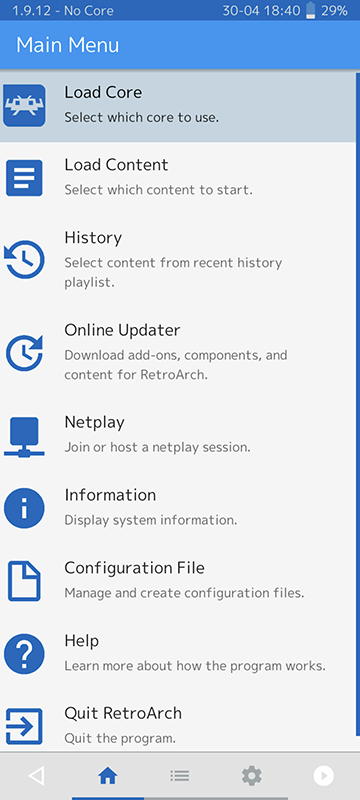
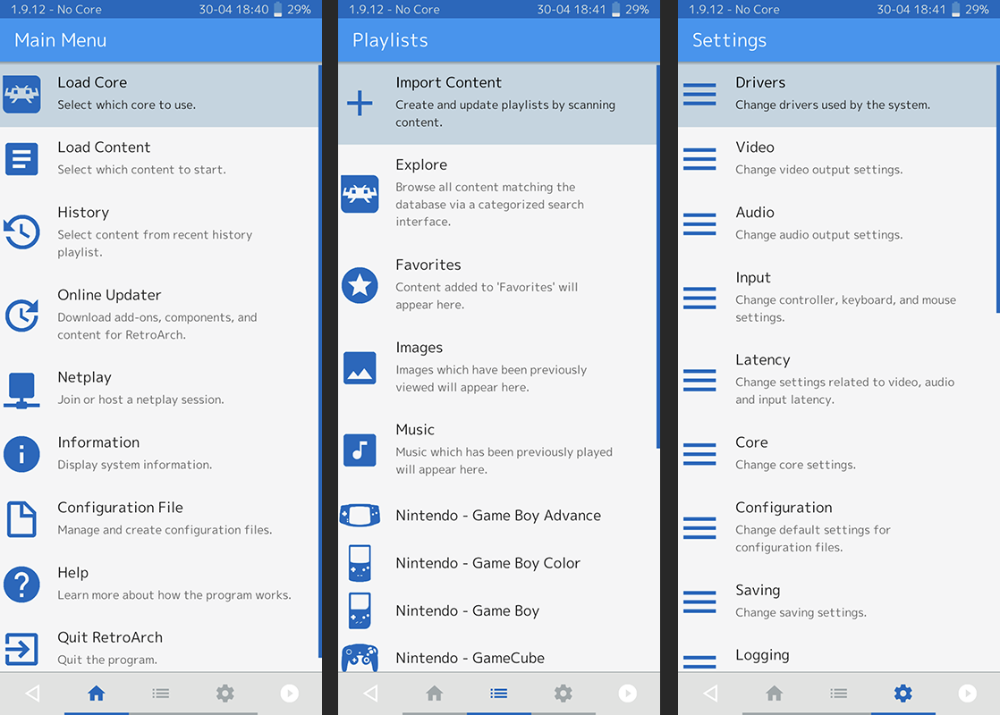

# GLUI (GUI)

**GLUI** (formerly known as **MaterialUI**) is RetroArch's mobile interface for smartphones. This interface is designed around touchscreen and pointer devices like a mouse/trackball. It is based on Android's "Material UI" designs.

GLUI was overhauled in RetroArch 1.6.6.

## Menu structure
Content is displayed in a single column. The menus are organized into three tabs: Main Menu, Playlists, and Settings.

*The three tabs of GLUI, side by side.*

### Navigating the menus
GLUI is designed primarily for touchscreen use, although a gamepad can also be connected via Bluetooth or USB.

Swipe left or right (or tap on the icons at the bottom of the screen) to switch between the three columns. Swipe up or down to scroll through menus. Tap on a line once to select it and enter its submenu. Tap once on the 'back arrow' icon in the top left to go back a step.

Tap once on an entry in a playlist to open the quick menu, from which you can launch the content.

*See [Input and Controls](input-and-controls.md)*

## Input

Content is controlled using Gamepad Overlays on the device's touchscreen. A gamepad can also be connected via Bluetooth or USB.

*See [Overlays](libretro-overlays.md) and [Input and Controls](input-and-controls.md)*

*GLUI gameplay with the default gamepad overlay*

### Thumbnails
By default, 2 thumbnails are displayed for each entry in a playlist. The left thumbnail is the boxart, while the right thumbnail is a gameplay screenshot.
Hold on a thumbnail for 1 second then release to view the thumbnails full-screen (then tap once to close the popup).

## Themes
GLUI has a range of colour schemes built in. Go to `Settings > User Interface > Appearance > Color Theme` to browse the themes and select one.

GLUI does not support OS-level light/dark mode switching at this time.

