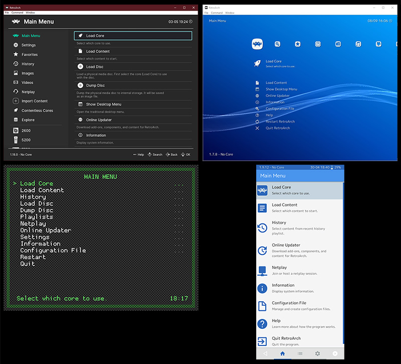

# The User Interface

RetroArch currently has 4 different "Menu Drivers" to choose from for its Graphical User Interface:

* **[Ozone](ozone.md)**: The default skin for many host systems.
* **[XMB](xmb.md)**: The "old" default skin.
* **[GLUI](glui.md)**: The smartphone/touchscreen skin.
* **[RGUI](rgui.md)**: The "basic" skin.

The Menu Driver can be changed under `Settings> User Interface> Menu`. A restart of RetroArch will be required.

*Clockwise from top: Ozone, XMB, GLUI, RGUI.*