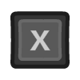

# Getting started: Input and controls

## RetroPad Concept
RetroArch controls map real-world controller buttons to a virtual controller called a "RetroPad". A RetroPad does not exist in real life, it's a concept only within RetroArch. A RetroPad has an ABXY layout like a SNES gamepad plus four shoulder buttons and dual analog sticks like a Sony DualShock.

You don't have to map all of the RetroPad buttons to a real world button. If your real controller has less buttons than a DualShock, then the virtual RetroPad also has less buttons, that's perfectly fine.

## Gamepad setup
RetroArch is intended to be easily controlled with a gamepad. RetroArch and libretro provide ability to configure a gamepad once for many cores instead of having to configure each core individually. However, RetroArch also provides the freedom to configure specific cores and even individual games differently if the user wants.

### Gamepad autoconfiguration
Many gamepads should work out of the box via the RetroArch autoconfiguration profile database. If the gamepad can be autoconfigured the OSD will inform you of the autoconfiguration event.

!!! info "Manual RetroPad binding"
    Not all gamepads have autoconfigs. If that is the case for your gamepad, please refer to the **Manual RetroPad binding** section below.

## Keyboard controls
RetroArch provides a remappable set of bindings between a keyboard and the RetroPad abstraction as well as between a keyboard and RetroArch's hotkeys. Please refer to **Default RetroArch keyboard bindings** in this doc as a reference.

### Cores with direct keyboard input
Please be aware that some cores, for example arcade emulator cores and vintage computer emulator cores, can also be configured to directly read the keyboard or controls that use a keyboard interface. **If you are using a core configured for direct keyboard access, it is recommended that users unbind the RetroArch keyboard-to-RetroPad and hotkey bindings or use the `Game Focus` mode to disable those bindings while using the keyboard device.** Otherwise, keyboard input may result in multiple conflicting simultaneous actions by the core.

!!! tip
    Controls with keyboard interfaces can also benefit from defining a **Hotkey Enable** button in RetroArch which is required to be held down in order to activate the other hotkeys.

## Manual RetroPad binding

If your gamepad does not have an autoconfiguration or if you would like to change its default RetroPad binding, use the **Input** settings menu.

- Navigate to **Settings**
- Navigate to **Input**
- Navigate to **Input User 1 Binds**
- Select **User 1 Bind All**
- Press the buttons as required

!!! tip
    If you have several different controller types you may want to use the **User 1 Save Autoconfig** followed by **User 1 Bind Default All** options after binding in order to achieve hotplug functionality

## Controls for multi-player

If you want to set-up local multi-player with games that support it:

- Navigate to **Settings**
- Navigate to **Input**

Here you will find the option to set binds for multiple users, "Input User 1 Binds", "Input User 2 Binds" and so on.

So lets set-up User 1's controller:

- Navigate to **Input User 1 Binds**
- Select **User 1 Device Index**

From here using the left/right buttons, select which currently plugged-in controller will be assigned to what player. While here you should also bind the controls to this player by pressing them on the assigned controller, Select **User 1 Bind All** to do this.

After you finish, go back, select **Input User 2 Binds** and repeat for user 2.

## Hotkeys
Hotkeys are combinations of buttons you can press in order to access options such as saving, loading, and exiting games. Hotkey binds can be configured at `Settings` → `Input` → `Input Hotkey Binds`. If you map `Enable Hotkeys` to a button, it will require that button to be held in order to trigger any hotkeys.

!!! tip
    To unbind (effectively, disable) a hotkey, press **Del** on your keyboard or the **Y button** (the left one of the 4 buttons) on the RetroPad. To reset a hotkey to its default, press **Space** on your keyboard or the **Start** button on the RetroPad.

## Remapping controls for individual cores or content
Core Controls Remapping alters how the core receives input rather than how the gamepad is coded, for example you can tell an individual core to switch button A and B on the RetroPad for gameplay, but you can still use "A" to select in the RetroArch menu and "B" to go back. This is opposed to changing the gamepad bindings in RetroArch itself which would swap "A" and "B" in the core but would also make "B" select and "A" back in the RetroArch menu.

**How to remap the controls for a single core or game:**

* Start content with the core for which you want to remap controls
* Go to **Quick Menu** and then **Controls**
* Configure the buttons the way you want
* Select **Save Core Remap File**
* OR, if you want to save this remapping for the current game only, select **Save Game Remap File**

## Default RetroArch keyboard bindings

### Keyboard gameplay controls

| User 1 Keyboard                                                                       | Default RetroPad Mapping                                     |
|---------------------------------------------------------------------------------------|--------------------------------------------------------------|
|        |           |
|    |       |
|    |       |
|  |     |
|                      |                |
|                      |                |
|              |        |
|              |          |
|                      |                  |
|                      |                  |
|                      |                  |
|                      |                   |

### Menu controls

The keyboard inputs shown here are active only when `Settings` → `Input` → `Unified Menu Controls` is disabled (default). Otherwise, only Retropad inputs are used.

| Keyboard Input                                                                        | Retropad Input                                            | Menu Action                   |
| ------------------------------------------------------------------------------------- | --------------------------------------------------------- | ----------------------------- |
|        |        | Move cursor up                |
|    |    | Move cursor down              |
|    |    | Move cursor left              |
|  |  | Move cursor right             |
|          |             | Scroll one page up            |
|      |             | Scroll one page down          |
|      |               | Return to the previous screen |
|              |               | Select Item                   |
| -                                                                                     |               | Scan content                  |
|                  |               | Search                        |
|              |     | Help                          |
|                  | -                                                         | Remove highlighted input bind |
|              |       | Reset to default              |
|                  | -                                                         | Exit RetroArch                |

### Hotkey controls

Hotkey binds can be configured at `Settings` → `Input` → 'Input Hotkey Binds'. If you map `Enable Hotkeys` to a key, it will require that key to be held in order to trigger any hotkeys. This can be useful in avoiding keyboard mapping conflicts between RetroArch and cores cores that use the keyboard for input.

!!! Tip
    Hotkeys can also be mapped to RetroPad buttons.

| Keyboard Input                                                               | In-Game Action               |
| ---------------------------------------------------------------------------- | ---------------------------- |
|             | Rewind                       |
|             | Pause                        |
|             | Reset                        |
|             | Next shader                  |
|             | Previous shader              |
|             | Netplay toggle play/spectate |
|           | Menu toggle                  |
|           | Save state                   |
|           | Load state                   |
|           | Increase current state slot  |
|           | Decrease current state slot  |
|           | Take screenshot              |
|           | Mute                         |
|         | Show on-screen keyboard      |
|         | Grab mouse                   |
|          | Volume Up                    |
|         | Volume Down                  |
|  | Fast forward toggle          |
|             | Fast forward hold            |
|             | Movie record                 |
|             | Frame advance                |
|             | Slow motion                  |
|             | Fullscreen toggle            |
|           | Switch GUI                   |

## Platform-specific controls

### Nintendo Switch

USB keyboards and mice: All keyboards seem to work. Not all mice seem to work. [Mouse compatibility sheet](https://docs.google.com/spreadsheets/d/1Drbo5-QuSX901MwtOytSMuqRGxeIkq2HELM806I9dj0/edit#gid=0).

Touch mouse emulation: The Switch touchscreen can be used for mouse control like a laptop touchpad. The following gestures are supported.

| Touch Input              | Effect                                                 |
|--------------------------|--------------------------------------------------------|
| single finger drag       | move the mouse pointer (indirectly like on a touchpad) |
| single short tap         | left mouse click                                       |
| dual finger short tap*   | right mouse click                                      |
| dual finger drag         | drag'n'drop (left mouse button is held down)           |
| three finger drag        | drag'n'drop (right mouse button is held down)          |

*: hold one finger, short tap with another
