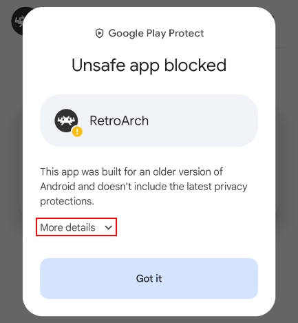
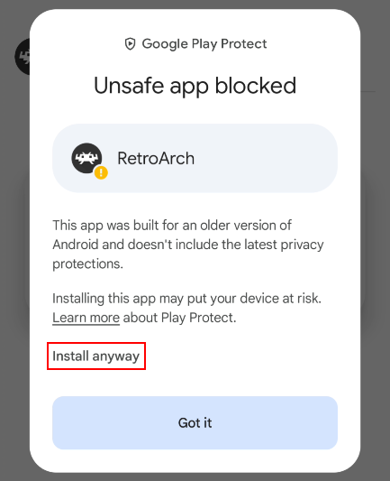

# Downloading, Installing and Updating RetroArch for Android devices.

## Non-Google Play Sources

### Installation via Sideloading
Sideloading Android apps involves installing APK files from sources outside official stores. Apps like Obtainium automate APK downloads for the latest versions, avoiding issues with manual methods such as lengthy repeated downloads/installations and missed updates.

To sideload successfully:
* The first time you attempt to install an APK via an app (e.g. via any file manager, or Obtainium), enable the [install unknown apps](#install-unknown-apps) permission for it. This step is straightforward, and most Android users can complete it without consulting the detailed instructions.
* If Play Protect warnings appear on Android, follow the installation notes for [allowing APK installations blocked by Google Play Protect](#allowing-apk-installations-blocked-by-google-play-protect). This step is more complex and should be read carefully to ensure success on all Android devices.

#### From RetroArch.com Downloads
retroarch.com offers six apk builds:
* Architecture-specific builds: RetroArch_aarch64.apk and RetroArch_ra32.apk for stable, and YYYY-MM-DD-RetroArch_aarch64.apk and YYYY-MM-DD-RetroArch_ra32.apk for nightly. APK's that contain "aarch64.apk", and "ra32.apk" in the filename has package name com.retroarch.aarch64 and com.retroarch.ra32 respective when installed in Android.
* Universal package: RetroArch.apk for stable, and YYYY-MM-DD-RetroArch.apk for nightly. Their package name is com.retroarch when installed in Android.

Android 7.0 (Nougat) or later supports installing both architecture-specific RetroArch builds (com.retroarch.aarch64 and com.retroarch.ra32) alongside the universal package (com.retroarch) without forcing an upgrade. Android introduced improved multi-package handling in 7.0, treating distinct package names as separate apps rather than conflicting upgrades like in earlier versions.

It is not possible to install both stable and nightly builds of the same apk on any system.

##### Manual Downloads

1. Visit the retroarch.com [Downloads page](https://www.retroarch.com/?page=platforms) and select **Download Stable** or **Download Nightly**.
2. Open the downloaded APK (via a file manager if your browser does not prompt you when the download is completed).
3. Select Install.

###### From Buildbot Archives

All [stable](https://buildbot.libretro.com/stable/CURRENTVERSIONNUMBER/android/) and [nightly](https://buildbot.libretro.com/nightly/android/) bundles are available via BuildBot If you need a specific architecture or build for testing. Builds are named with an architecture suffix: `aarch64` is a 64-bit build, `ra32` is a 32-bit build, and no suffix is a universal build that opts for 64-bit if your system supports it.
> 32-bit support on Android is slowly being phased out by the industry, but these builds remain available for older devices or specific use cases.

#### Installation via Obtainium
"Obtainium allows you to install and update apps directly from their releases pages, and receive notifications when new releases are made available." - Obtainium

Obtainium installs the latest stable RetroArch APK — whether 32‑bit, AArch64, or Universal — directly from https://buildbot.libretro.com/stable/CURRENTVERSIONNUMBER/android/, the same source used for manual downloads. The only difference is that Obtainium automates this process and provides update notifications, helping users stay current and avoid reporting issues from outdated versions. It’s also worth noting that Obtainium is Android TV–friendly, making it suitable for use across all Android devices.

To install RetroArch from Obtainium, follow these steps:

* Install [Obtainium](https://f-droid.org/en/packages/dev.imranr.obtainium.fdroid/) from F-Droid.
* Add RetroArch to Obtainium
  * Visit https://apps.obtainium.imranr.dev/.
  * Search for "RetroArch".
  * Select “Add to Obtainium” for either RetroArch (32-bit), RetroArch (AArch64), or RetroArch (Universal).
* Import and Install
  * When the “Import app” prompt appears, tap **Continue**.
* Open the newly added RetroArch entry.
* Tap **Install** to download and install the app.

### Installation via F-Droid (incomplete)

The F-Droid release of [RetroArch](https://f-droid.org/packages/com.retroarch/) offers the recent stable release can be found in F-Droid for easier automatic updating. The APK supports ABIs: arm64-v8a, armeabi-v7a, x86, x86_64.

To minimize installation size, the F-Droid release includes only a basic set of assets. For a complete setup matching the retroarch.com release it is necessary to visit `Main Menu` → `Online Updater` within the app to download all additional assets, controller profiles, overlays, shaders, and other required data.

The `ozone` menu driver lacks assets, impacting popular microconsoles (see [#18756](https://github.com/libretro/RetroArch/issues/18756)). Temporary workaround: Main Menu → Online Updater → Update Assets.

### Installation via Google Play servers (obsolete)

RetroArch is available on the Google Play Store, but has not been updated for years due to Play Store policy changes. You may choose to use this older version, but it is not recommended.

[RetroArch Plus on the Play Store](https://play.google.com/store/apps/details?id=com.retroarch.aarch64&hl=en_US "RetroArch64") (Only for 64 bit devices, additional cores)

[RetroArch on the Play Store](https://play.google.com/store/apps/details?id=com.retroarch&hl=en "RetroArch") (For 32 or 64 bit devices, fewer cores)

A more detailed difference between the Play Store versions can be found in [this libretro blog post](https://www.libretro.com/index.php/retroarch-android-new-versions-for-play-store-please-read/).

DeGoogle notice: Google Play requires sign-in with a Google account. Aurora Store offers a free alternative enabling anonymous downloads and updates from Google Play servers without a Google account. [Aurora Store](https://f-droid.org/en/packages/com.aurora.store/) is avalible in F-Droid.

## Installation notes

### Sideloading

#### Install unknown apps

The first time you attempt to install an APK via an app (e.g. via any file manager, or Obtainium), Android displays a prompt: `For your security, your phone currently isn't allowed to install unknonw apps from this source. You can change this in Settings`.
* Click the available `Settings` button in that prompt.
* In the `Install unknown apps` menu, toggle on `Allow from this source` to permit the app to install APKs.
* `Hit the back button` to return to your installation.

#### Allowing APK installations blocked by Google Play Protect

To install RetroArch from non-Google Play sources (such as F-Droid or retroarch.com), you may need to either allow it through Google Play Protect or disable Play Protect entirely.

Since RetroArch 1.19.1, if you skip the methods in the sub-sections below, the app may either fail to install without warning or display the message “App not installed.” This issue appears to affect some Android versions and hardware configurations, but not all. For example, the current RetroArch APK may fail to install on the standard Android version without following these methods, while it may succeed on the current Android TV version.

If you get "App not installed" your version of Play Protect may have a bug that prevents you from using the feature.[1] If so, use Method 2—disable Google Play Protect to permit blocked APK installs.

##### Method 1: Selecting ‘Install anyway’ in the Google Play Protect popup

When you tap "Install" for the APK, Google Play Protect runs a security scan and displays options similar to those shown below:

If you get "App not installed," your Play Protect version may have a bug preventing use of the "Install anyway" feature.[1] In that case, use Method 2—disable Google Play Protect to permit blocked APK installs.

##### Method 2: Disable Google Play Protect

* Open the Google Play Store app.
* Locate and tap "Play Protect" — its location depends on your Android version and whether you’re signed in:
  - Tap the hamburger menu (☰) in the upper-left or upper-right corner.
  - If you’re signed in, check both the hamburger menu (☰) and your profile icon, as Play Protect may appear under either. The profile icon shows your account initial (e.g., “F” for Foo).
* Tap the gear icon ⚙️ to open Settings.
* Toggle off "Scan apps with Play Protect":
  - You may be asked whether to "Pause" scanning temporarily or "Turn off" permanently — choose the option you prefer.
* Install the APK — Play Protect will no longer interfere with the process.
* Note: Android may prompt you to re-enable Play Protect each time you sideload an APK. If your goal is to keep it permanently turned off, always select "No" when prompted.

## RetroArch APK Package Variants

RetroArch.com provides six Android APK builds with three distinct package names:

| Type    | Variant          | Filename                          | Package Name       |
|---------|------------------|-----------------------------------|--------------------|
| Stable  | Universal        | `RetroArch.apk`                   | `com.retroarch`         |
| Stable  | Architecture-specific | `RetroArch_aarch64.apk`        | `com.retroarch.aarch64` |
| Stable  | Architecture-specific | `RetroArch_ra32.apk`             | `com.retroarch.ra32`    |
| Nightly | Universal        | `YYYY-MM-DD-RetroArch.apk`        | `com.retroarch`         |
| Nightly | Architecture-specific | `YYYY-MM-DD-RetroArch_aarch64.apk`| `com.retroarch.aarch64` |
| Nightly | Architecture-specific | `YYYY-MM-DD-RetroArch_ra32.apk`   | `com.retroarch.ra32`    |

### Compatibility Notes
- **Android 7.0+ (Nougat)**: Supports multi-package handling. This makes it possible to install the universal package (com.retroarch) alongside the appropriate architecture-specific build (com.retroarch.aarch64 **or** com.retroarch.ra32, depending on device) without forcing an upgrade.
  - **Installing both stable and nightly builds on the same device**: To install both the stable and nightly versions of RetroArch, ensure that the APKs use different package names, since Android does not allow multiple apps with the same package name to coexist. For example, on a typical 64-bit Android system, you can install the stable RetroArch.apk (com.retroarch) alongside YYYY-MM-DD-RetroArch_aarch64.apk (com.retroarch.aarch64), but you cannot install RetroArch.apk (com.retroarch) together with YYYY-MM-DD-RetroArch.apk (com.retroarch), nor RetroArch_aarch64.apk (com.retroarch.aarch64) together with YYYY-MM-DD-RetroArch_aarch64.apk (com.retroarch.aarch64).
- **Pre-7.0**: Distinct package names treated as conflicting upgrades.

## References
Case Report: On Android 10 with LG G7 ThinQ (LM-G710EM), after factory reset, signing into Play Store (allowing self-update and setup), sideloading RetroArch 1.22.2 from retroarch.com and tapping "Install anyway" triggers "App not installed" before the password prompt—even with the correct password entered. Disabling Play Protect was the sole workaround to install the APK; otherwise, factory reset with offline sideloading was required.
