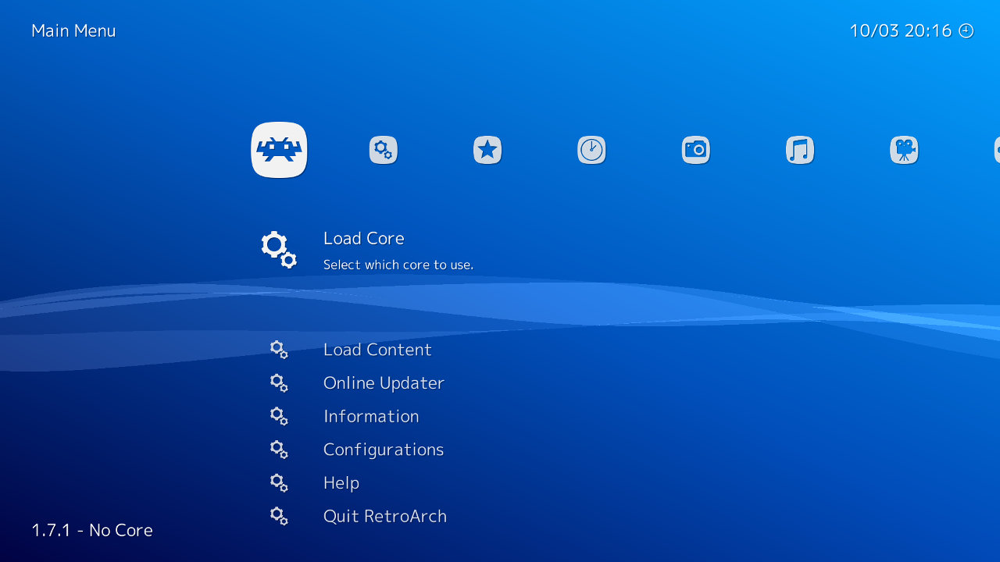
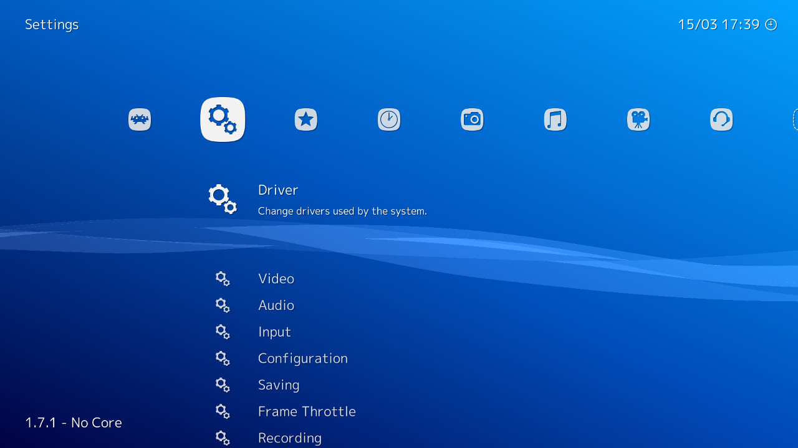
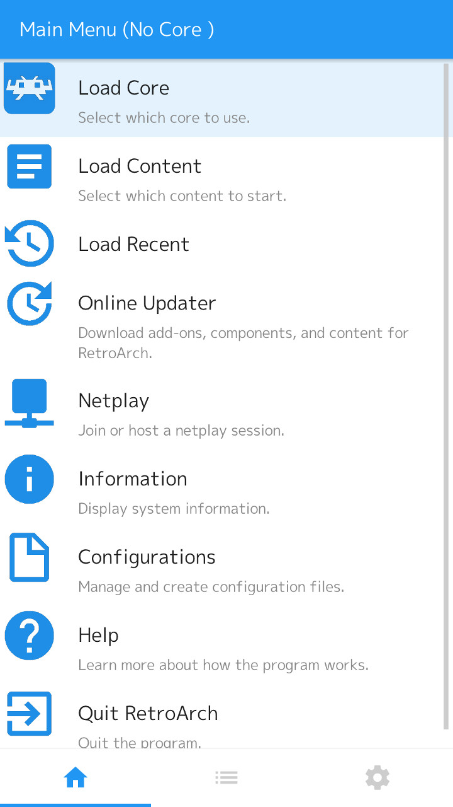
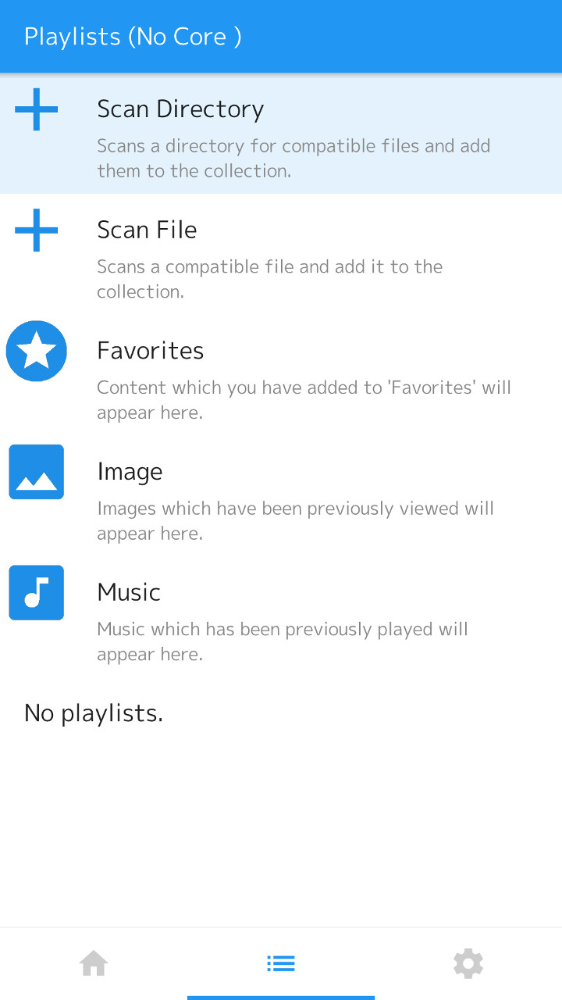
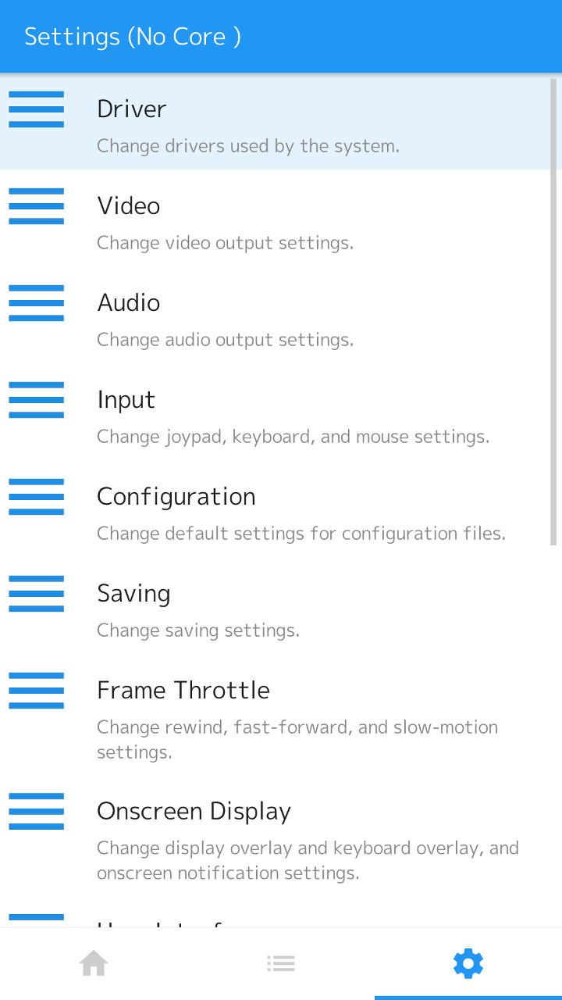

# Navigating The UI

This tutorial will teach you the basics of navigating RetroArch and where to find everything. Soon, we will go over the essentials to set RetroArch up suitable for playing games.

## PC

By default the keyboard should be ready to use.

Using the *left* and *right* arrow keys, you move to a different tab, each tab will relate to an aspect of the RetroArch experience (main menu for game loading, settings for settings etc.). Once the desired tab is selected, use the *up* and *down* arrow to move to an option.

To advance in the menu press *Enter* (or *Return*). To go back to the previous menu push *Backspace*.

Whilst in a game use the *F1* key [MOVE TO ANOTHER PAGE]

Pushing *Esc* will quit the program

### Main Menu

Welcome to the main menu this is where you will launch games, download and update cores and have access to freely available content. *Load Core*, *Load Content* and the *Online Updater* are the menu items you will probably be using the most.

### Settings

Here you will find all the options available to configure RetroArch, from Graphics, Input, Sound and everything else.

### Favourites and History

Favourites allow you to maintain a short list of your favourite games, And history is useful for getting back to where you left off.

### Image, Music and Video

These tabs will handle all your media. Images will contain any screenshots you've made.

### Netplay

Allows multi-player over the internet (more on this later).

### Import content

Allows you to import recognised content into playlists.

## Mobile

The mobile interface is much more minimalistic compared to the PC's interface. Touch is the default input, although depending on device other options may be available. There are three different tabs, which can be switched at the bottom of the menu.

### Main Menu

The main menu will be where you launch games, download and update cores, start or join netplay sessions and pretty much anything to do with gaming.

### Playlists

Handles anything to do with creating and maintaining playlists. It gives you scanning options to recognise your game collection. It also provides access to your images, music and videos.

### Settings

Here you will find all the options available to configure RetroArch, from Graphics, Input, Sound and everything else.
