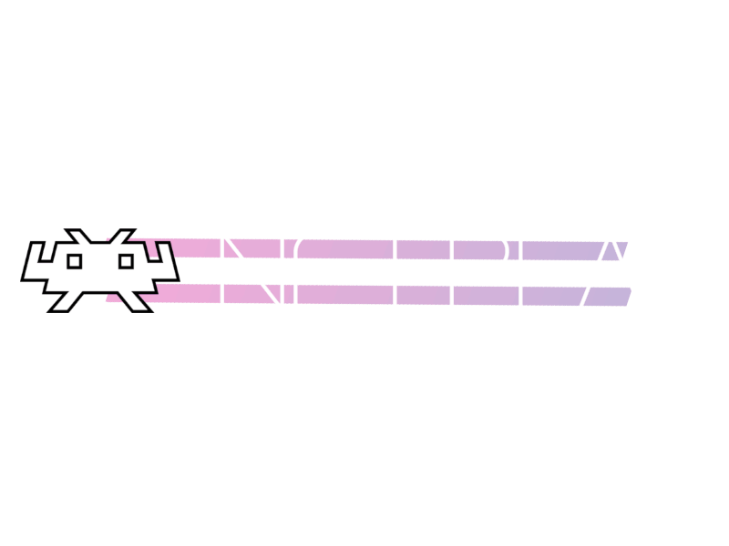

## FAQ

### What is netplay?

- Netplay is RetroArch's mechanism for emulating local multiplayer over the internet, by continuously synchronizing multiple RetroArch instances running the same emulation core and same content. Currently, this approach is only for emulating classic single-system local multiplayer, not link cable play or network multiplayer modes.

### Does RetroArch require port-forwarding to work?

- The host needs to accept incoming connections on port TCP 55435. For most people, this requires port-forwarding: the network connections have to be forwarded from your local network access point (i.e. gateway or router) to the device running RetroArch. RetroArch requests a port-forwarding from the local network using the UPnP IGD protocol, or, you can manually create a port-forwarding rule on your network device. For those who can't forward the ports for whatever reason, please refer to the Setup Guide below.

### Does it support more than two players?

- Yes! See [Getting Started Guide](netplay-getting-started.md) for more details.

### Does it support more than one player on one computer?

- Yes! See [Multiple Controllers Guide](netplay-multiple-controllers.md) for more details.

### Does it support the host spectating while a client performs as player 1?

- Yes! By default, the host is always assigned Controller 1, but see [Multiple Controllers Guide](netplay-multiple-controllers.md) on how a client can 'Request Device' to be controller 1.

### What do you need for RetroArch netplay to work?

- Same RetroArch version, same core version, and the same exact content.

### Does RetroArch support cross-platform netplay?

- Yes, but your mileage may vary, particularly when endianness differs.

### Which cores work for netplay?

- On a technical level, every core that supports save states should work but the performance requirements may be too high for it to work in any practical level.

### Does PSX / N64 / Dreamcast / GameCube / Wii / 3DS netplay work?

- No, the performance requirements make the current model unsuitable for those.

### Can I play GB / GBC / GBA / PSP / 3DS games with multiple people via RetroArch Netplay?

- No, RetroArch's netplay is not link-cable emulation, GB, GBA, PSP netplay are currently not possible with our implementation. One notable exception is same game GB/GBC Netplay via the TGB-Dual and Sameboy cores.

### Can I trade Pokémon via RetroArch Netplay?

- No.

## Troubleshooting NetPlay

### RetroArch says "Content not found, try loading content manually"

- Either load content manually, have the content in your recent history list, or scan your content to a playlist.

### As Client: "Failed to Initialize Netplay"

"Failed to Initialize Netplay" often means you were not able to connect to the host. Confirm that you have the correct IP address for the host, and that the host has begun hosting a NetPlay session. Tell the host to check if their host-based firewall is allowing RetroArch to accept connections, and confirm that they have port-forwarding working.

### As Host: "Port Mapping Failed"

"Port Mapping Failed" probably indicates a UPnP port-forwarding problem. If you can manually configure your network gateway to forward TCP port 55435 to the local-network IP address of your RetroArch device, then you can do that. Alternatively, enable the use of a Relay Server.
