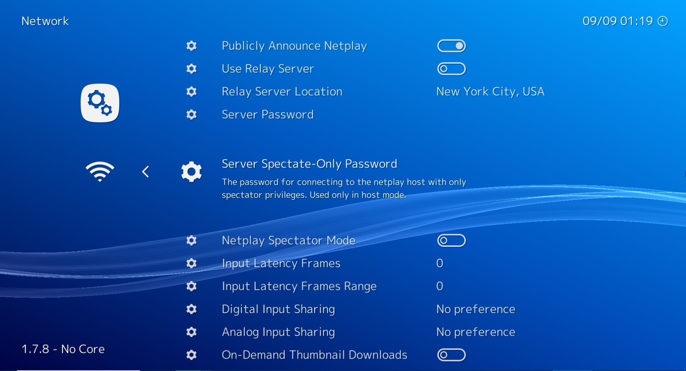
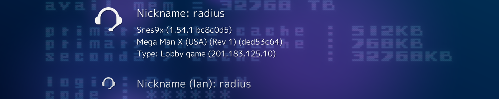

## Getting Started

<iframe width="560" height="315" src="https://www.youtube-nocookie.com/embed/Z3CTuTx0nnc" frameborder="0" allow="accelerometer; autoplay; clipboard-write; encrypted-media; gyroscope; picture-in-picture" allowfullscreen></iframe>

### Configure a Nickname

- Navigate to **Settings**
- Navigate to **User**
- Select **Username**
- Configure your preferred nickname

### Host a Netplay Server

If you are going to host a game, simply configure your network parameters and "Start Hosting" from the netplay menu. After doing that, load the content you want to netplay and wait for players to connect.

#### Check your lobby

Once you start hosting, you can check to see if your lobby is visible [at lobby.libretro.com](http://lobby.libretro.com/).

!!! tip
    If your router doesn't support UPnP, you can't forward your ports, or you are just uncertain how, enable the **Use Relay Server** option. This routes both sides of the connection through one of the public proxy servers.

!!! tip
    If you want to run a private game, set up a **Server Password** to prevent random people from connecting. Alternatively, you can disable the **Publicly Announce Netplay** option. The clients will need to enter your IP address or hostname directly.

!!! Warning
    By default, RetroArch attempts to use UPnP to automatically port-forward (it asks the gateway to forward incoming connections on TCP 55435 to itself), but it doesn't check to see if it succeeded (i.e., if it is actually reachable on TCP 55435 from elsewhere on the internet). The lobby server doesn't verify the host's reachability either. Make sure you have correctly port-forwarded, using [this tool](http://www.yougetsignal.com/tools/open-ports/): enter your **Netplay TCP Port** once you are hosting, and it will tell you if the port is open or not. If this port is not open, people won't be able to connect to your session, and you might have to enable the use of a Relay Server.

### Configure Netplay Clients

You don't need to configure anything to connect to netplay rooms. Browse to the netplay menu, Select **Refresh** and then select the room you want to connect to.

You will be asked for a password if one is required, and if you have matching content scanned or in the **Content History** it will connect right away. Otherwise, it will tell you to load the core and content manually and it will attempt to connect right away.