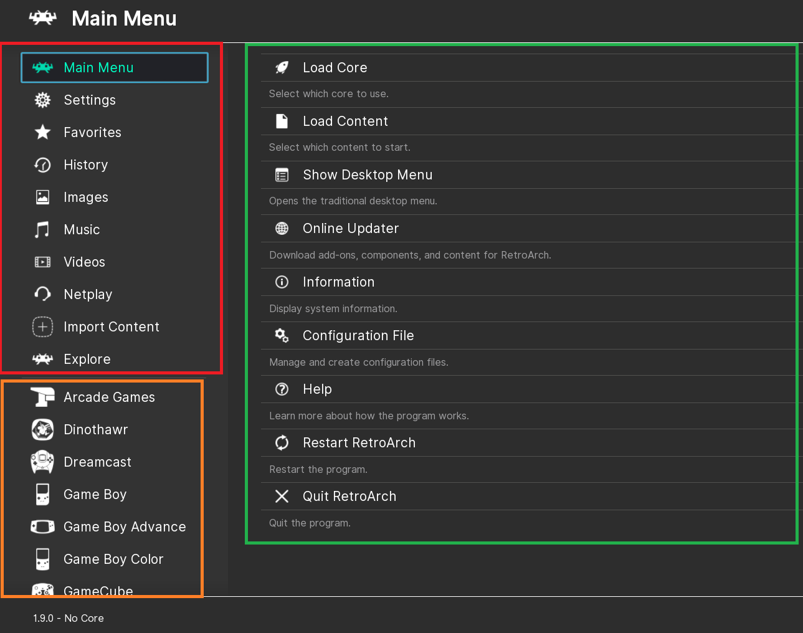
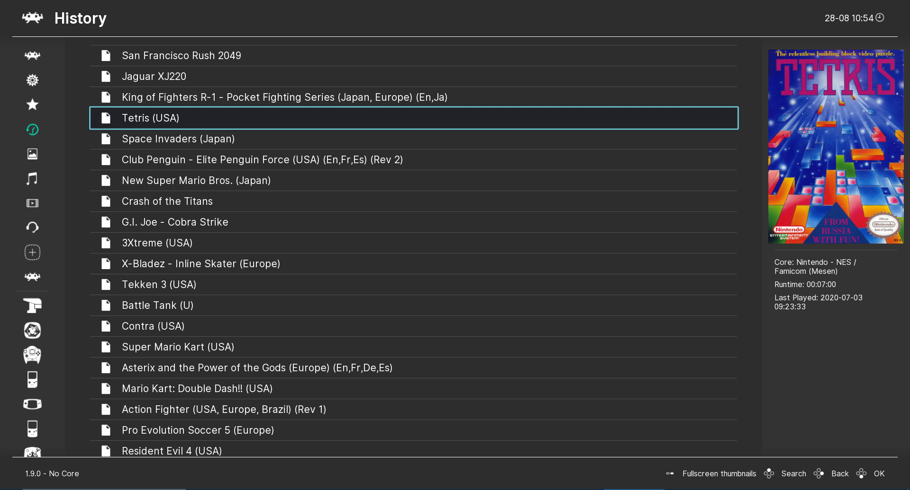
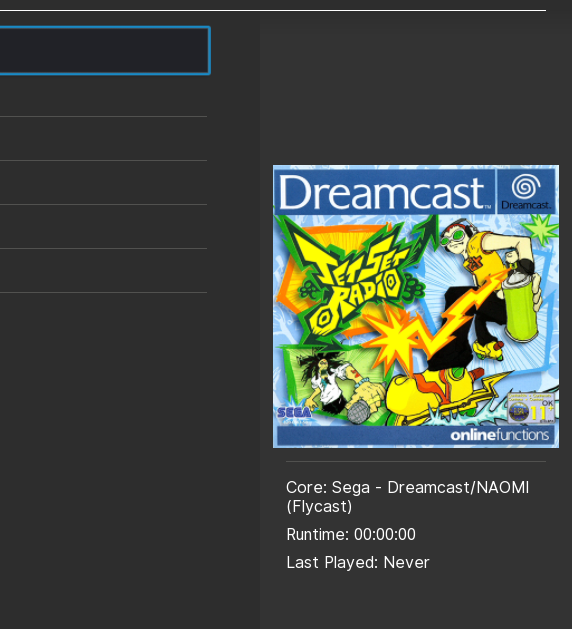
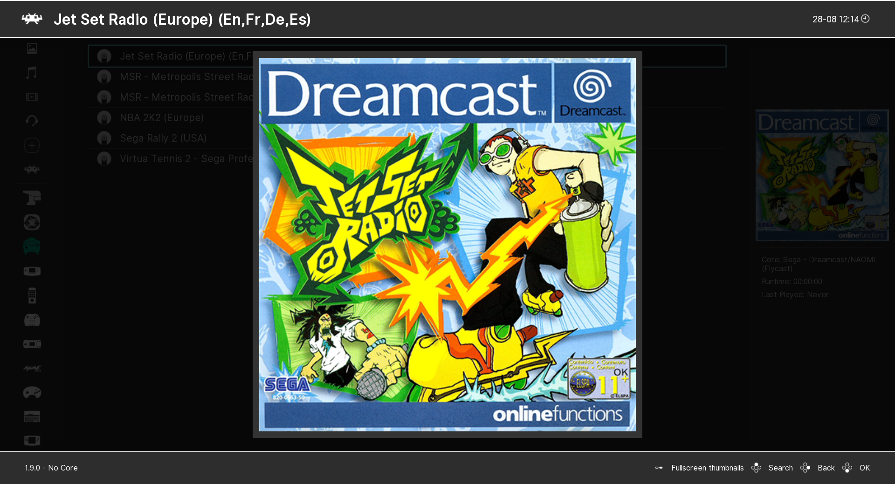

# Ozone RetroArch Menu Interface

Ozone user interface is the default gui of RetroArch. It offers easy use thanks to its simple interface structure.

| :warning: DISCLAIMER          |
|:---------------------------|
| Keyboard key assignments may differ from platform to platform and configuration. Most of the examples below are made on PC.      |

## Menu Structure

Ozone's simple user interface shows you everything you have access to. The way the interface appears on the screen; the main categories are on the left, subcategories are in the middle, and the selections are on the right.

By hiding the menu labels, you will have more elegant impression with only icons. This setting normally becomes active when you leave the Main category options. When you return to Main Categories again, descriptions are added next to the icons(Sidebar does not collapse while in Main Menu or Settings selected). If you always want to see only the icons, you can do as follows: `Settings> User Interface> Appearance`, then turn Collapse the Sidebar on.

### Audio

Only Ozone has background music, **OK**, **Cancel** and **Notice** sounds. The background music has been created by the talented [ViRiX Dreamcore](https://soundcloud.com/virix). To enable it, all you have to do is turn on the Mixer first in `Settings> Audio> Menu Sounds` and then turn on the other options according to your wish, `Enable BGM Sound` for background music should be on.

<audio controls>
  <source src="/image/retroarch/ozone/bgm.ogg" type="audio/ogg">
</audio>

### Navigating the menu

Ozone is controlled like any other user interface. Regular input binds will apply, and binds here are defined in terms of the RetroPad, RetroArch's joypad abstraction.

- **A button** (Default PC: Z&ENTER&Left mouse click): Accept/OK
- **B button** (Default PC: X&Backspace&Right mouse click): Back/Cancel
- **Up/Down & Left/Right D-pad** (Default PC: Up/Down Left/Right): To scroll through the options
- **PC keyboard: Right shift**: Toggle menu label description
- **PC keyboard: S key**: Toggle search
- **PC keyboard: F1**: Toggle quick menu
- **PC keyboard: F5**: Toggle desktop menu

See the [Input and Controls](input-and-controls.md)

#### Searching through lists with keyboard

When using a keyboard, it can be slow to navigate a large list using gamepad-like controls. To help this, you can type `/`(forward slash) or `s`(s key) at any time to bring up a search-box. Type a search string and hit return. The cursor should jump to the first entry that matches. The search will match mid-path strings. However, if a match is found at the beginning of the path, like when searching for first letter, the start-of-path match will take priority.

### Thumbnails

Thumbnails appear on the right side of the screen. To get these pictures to full screen size, you need to press the `spacebar` key on your keyboard.

## Starting a game

* To load a game you need a libretro core to use, and a ROM.
* Selecting `Core` from `Load Core` menu, you can browse for a libretro cores.
* If you haven't downloaded or have a Core before. In this case, click on `Download a Core`. You need to download the core compatible with your content from the `core` list.

After loading a libretro core, you will see the name and version of the core in lower part of screen. You can then browse for a ROM with `Load Content`. To control where Ozone starts to browse for contents, set `File Browser` in `Settings > Directory`. If not set, it'll start in root.

See the [File Browser](file-browser.md) and [Import Content](import-conten.md)

## Applying shaders

See the [shaders user guide](shaders.md).

## Input

See the [Input and Controls](input-and-controls.md)

## Themes

Ozone themes may be less than other user interfaces for now. You can follow `Settings> User Interface> Appearance> Menu Color Theme` to browse the themes. The visual features of Ozone themes are based on usability and comfort. This situation created simpler themes.

