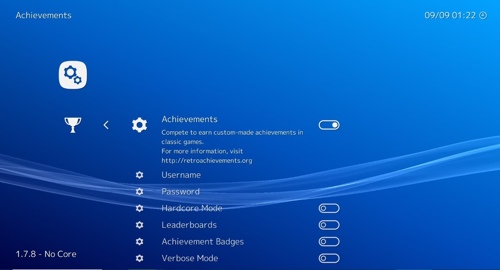
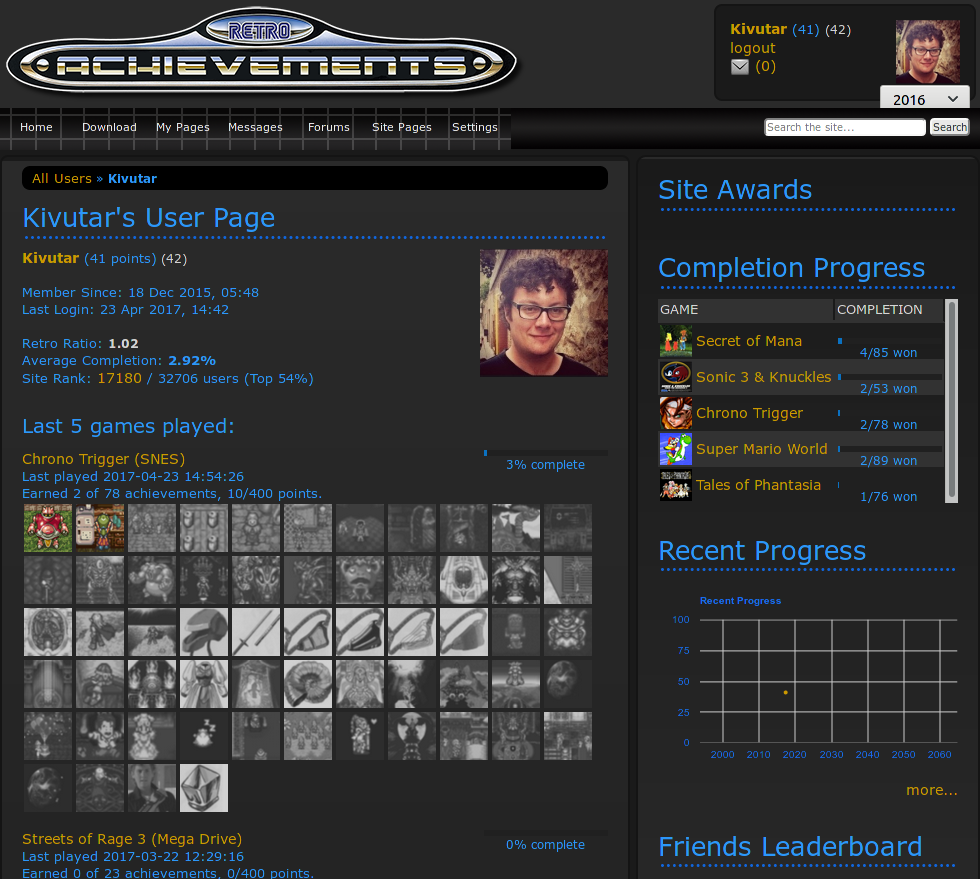

# RetroAchievements In RetroArch

## **What are RetroAchievements?**

[retroachievements.org](https://retroachievements.org/) is a service that provides a trophy/achievement unlocking mechanism similar to modern consoles, for retro games.

!!! Warning
    The service is not maintained by RetroArch or the Libretro team.

!!! Warning
    In order to get better compatibility with the RetroAchievements feature it's recommended to always use the latest version of RetroArch and the cores.

## **How to setup achievements**

1. Register an account on [retroachievements.org](https://retroachievements.org/) (don't forget to confirm your account creation with the email they send to you).
2. Open Retroarch and go to Settings->Achievements.
3. Enable the functionality and fill in your retroachievements credentials.

!!! Note
    The hardcore mode prevents you from using emulation features like savestates, slow motion, and cheats, **BUT** it places you on a separate leaderboard and allows you to participate in site events.

## **Check your connection to the service**

**You need an active internet connection.**

In this example, we are using the game Chrono Trigger (USA) with the Snes9x core.

Launch the game and trigger the Quick Menu.

Go to Achievements and you should see a list of the unlockable trophies for this game.

## **Check your progress**

On the retroachievements website, you can login and access your account page.

You should be able to check your progress in the games and see which trophies you unlocked.

Trophies unlocked in hardcore mode are marked with a special color.

You can also check the progress of your friends and add comments on their trophies.

## **Cores Compatibility**

For a list of supported cores, take a look at the [Emulator Support page on RetroAchievements](https://docs.retroachievements.org/general/emulator-support-and-issues.html).

Cores that are not listed as supported are likely to have issues with achievement logic, and tickets from players using those can be closed without investigation.

In the future, it is likely that unsupported cores will not be blocked in hardcore mode, as well.
