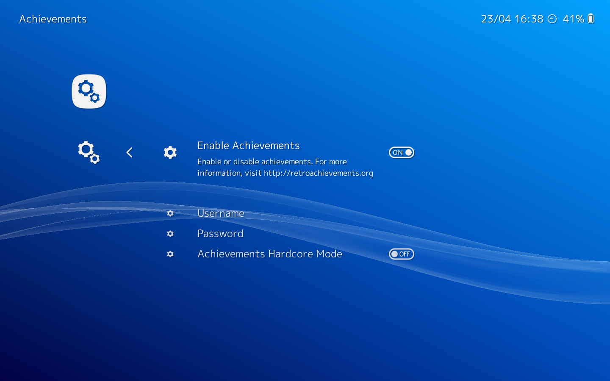

# RetroAchievements In RetroArch

## **What are RetroAchievements?**

[retroachievements.org](http://www.retroachievements.org/) is a service that provides a trophies unlocking mechanism similar to modern consoles, for Retro games.

!!! Warning
    The service is not maintained by RetroArch or the Libretro team.

!!! Note
    If you want to contribute, please update RetroArch and cores to get the latest fixes on the RetroAchievements feature;
    then in order to propose improvements to this document, [do it via GitHub](https://github.com/libretro/docs/tree/master/docs/guides/retroachievements.md) using "Pull Requests"

## **How to setup achievements**

1. Register an account on [retroachievements.org](http://www.retroachievements.org/) (don't forget to confirm your account creation with the email they send to you).
2. Open Retroarch and go to Settings->Achievements
3. Enable the functionality and fill your retroachievements credentials

!!! note
    The hardcore mode prevents you from using emulation features like slow motion, cheats and savestates.
    **BUT** gives you double points.

## **Check your connection to the service**

**You need an active Internet connection.**

In this example, we are using the game Chrono Trigger (USA) with the Snes9x core.

Launch the game and trigger the Quick Menu.

Go to Achievements and you should see a list of the unlockable trophies for this game.

## **Check your progress**

On the retroachievements website, you can login and access your account page.

You should be able to check your progress in the games and see which trophies you unlocked.

Trophies unlocked in hardcore mode are marked with a special color.

You can also check the progress of your friends and add comments on their trophies.

## **Cores Compatibility**

### Arcade

| Core                                                  | Supported | Notes |
|-------------------------------------------------------|:---------:|-------|
| [FB Alpha](https://github.com/libretro/fbalpha)       | ✔         | **Very experimental**. Only supports NeoGeo at the moment. |

### Atari 2600

| Core                                                  | Supported | Notes |
|-------------------------------------------------------|:---------:|-------|
| [Stella](https://github.com/libretro/stella-libretro) | ✔         | |

### NES

| Core                                                  | Supported | Notes |
|-------------------------------------------------------|:---------:|-------|
| [Mesen](https://github.com/SourMesen/Mesen)           | ✕         | [**Achievements are not fully supported yet**](https://github.com/SourMesen/Mesen/issues/341) |
| [FCEUmm](https://github.com/libretro/libretro-fceumm) | ✔         | |
| [QuickNES](https://github.com/libretro/QuickNES_Core) | ✔         | On Android has a [known issue](https://github.com/libretro/RetroArch/issues/3973) |
| [Nestopia UE](https://github.com/libretro/nestopia)   | ✕         | [**Achievements are not fully supported yet**](https://github.com/libretro/docs/pull/10) |
| [bnes](https://github.com/libretro/bnes-libretro)     | ✕         | |
| [Emux NES](https://github.com/libretro/emux)          | ✕         | |

### Master System / MegaDrive - Genesis

| Core                                                           | Supported |
|----------------------------------------------------------------|:---------:|
| [Gearsystem](https://github.com/drhelius/Gearsystem)           | ✔         |
| [Genesis Plus GX](https://github.com/libretro/Genesis-Plus-GX) | ✔         |
| [Picodrive](https://github.com/libretro/picodrive)             | ✔         |
| [Emux SMS](https://github.com/libretro/emux)                   | ✕         |

### SNES

| Core                                                                         | Supported | Notes |
|------------------------------------------------------------------------------|:---------:|-------|
| [Snes9x](https://github.com/libretro/snes9x)                                 | ✔         | |
| [Snes9x 2010](https://github.com/libretro/snes9x2010)                        | ✔         | |
| [Snes9x 2005](https://github.com/libretro/snes9x2005)                        | ✔         | |
| [Snes9x 2005 Plus](https://github.com/libretro/snes9x2005)                   | ✔         | |
| [Snes9x 2002](https://github.com/libretro/snes9x2002)                        | ✔         | |
| [bsnes Accuracy](https://github.com/libretro/bsnes-libretro)                 | ✔         | |
| [bsnes Balanced](https://github.com/libretro/bsnes-libretro)                 | ✔         | |
| [bsnes Performance](https://github.com/libretro/bsnes-libretro)              | ✔         | |
| [bsnes-mercury Accuracy](https://github.com/libretro/bsnes-mercury)          | ✔         | |
| [bsnes-mercury Balanced](https://github.com/libretro/bsnes-mercury)          | ✔         | |
| [bsnes-mercury Performance](https://github.com/libretro/bsnes-mercury)       | ✔         | |
| [bsnes C++98 (v085)](https://github.com/libretro/bsnes-libretro-cplusplus98) | ✔         | |
| higan Accuracy                                                               | ✕         | [Achievement support isn't going to be added](https://forums.libretro.com/t/is-higan-105-accuracy-supposed-to-be-slow-on-a-3-ghz-ivy-bridge-i7/13405/7?u=esoptron) |
| nSide Balanced                                                               | ✕         | [Achievement support isn't going to be added](https://forums.libretro.com/t/is-higan-105-accuracy-supposed-to-be-slow-on-a-3-ghz-ivy-bridge-i7/13405/7?u=esoptron) |
| [Beetle bsnes](https://github.com/libretro/beetle-bsnes-libretro)            | ✕         | |

### Game Boy / Game Boy Color

| Core                                                      | Supported | Notes |
|-----------------------------------------------------------|:---------:|-------|
| [Gambatte](https://github.com/libretro/gambatte-libretro) | ✔         | |
| [Gearboy](https://github.com/libretro/gearboy)            | ✔         | |
| [SameBoy](https://github.com/libretro/SameBoy)            | ✔         | |
| [mGBA](https://github.com/libretro/mgba)                  | ✕         | Achievements only work for the Game Boy Advance |
| [Emux GB](https://github.com/libretro/emux)               | ✕         | |
| [TGB Dual](https://github.com/libretro/tgbdual-libretro)  | ✕         | |

### Game Boy Advance

| Core                                                          | Supported | Notes |
|---------------------------------------------------------------|:---------:|-------|
| [mGBA](https://github.com/libretro/mgba)                      | ✔         | |
| [VBA Next](https://github.com/libretro/vba-next)              | ✔         | |
| [VBA-M](https://github.com/libretro/vbam-libretro)            | ✔         | |
| [Beetle GBA](https://github.com/libretro/beetle-gba-libretro) | ✔         | |
| [gpSP](https://github.com/libretro/gpsp)                      | ✕         | |
| [Meteor](https://github.com/libretro/meteor-libretro)         | ✕         | |

### PC Engine

| Core                                                                    | Supported |
|-------------------------------------------------------------------------|:---------:|
| [Beetle PCE Fast](https://github.com/libretro/beetle-pce-fast-libretro) | ✔         |
| [Beetle SGX](https://github.com/libretro/beetle-supergrafx-libretro)    | ✔         |

### Neo Geo Pocket

| Core                                                             | Supported |
|------------------------------------------------------------------|:---------:|
| [Beetle NeoPop](https://github.com/libretro/beetle-ngp-libretro) | ✔         |

### Nintendo 64

| Core                                                              | Supported |
|-------------------------------------------------------------------|:---------:|
| [Mupen64Plus](https://github.com/libretro/mupen64plus-libretro)   | ✔         |
| [ParaLLEl N64](https://github.com/libretro/parallel-n64)          | ✔         |

### Lynx

| Core                                                             | Supported | Notes |
|------------------------------------------------------------------|:---------:|:-----:|
| [Handy](https://github.com/libretro/libretro-handy)              | ✔         |       |
| [Beetle Handy](https://github.com/libretro/beetle-lynx-libretro) | ✔         | Beetle Handy is incompatible with modern No-Intro romsets as they require headers to work properly. The regular Handy core does not have this issue. |

### Virtual Boy

| Core                                                        | Supported | Notes |
|-------------------------------------------------------------|:---------:|:-----:|
| [Beetle VB](https://github.com/libretro/beetle-vb-libretro) | ✔         |       |
