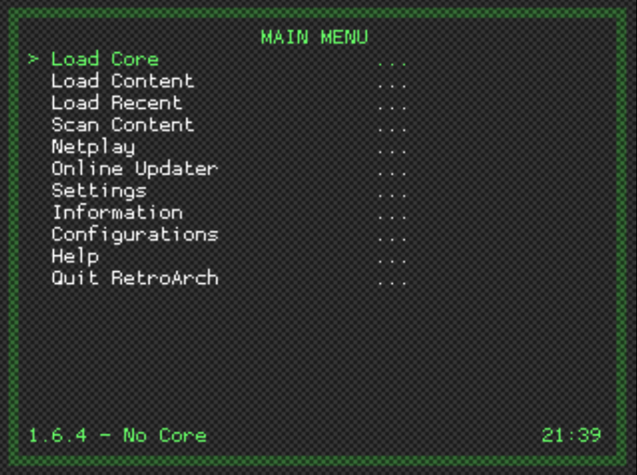

# RGUI RetroArch Menu Interface

RGUI is a simple built-in GUI for RetroArch. It was originally introduced in the Wii port of RetroArch in order to provide the console experience, where everything is controlled from a joypad. RGUI was later refitted for PC and mobile ports.

## Features

While RGUI cannot configure absolutely everything, it can do the most common things you would want to do while using RetroArch.

- Selecting libretro core
- Load a game
- Tweak per-libretro core options (e.g. colorization in GameBoy)
- Load game from history (previous games played)
- Save/load savestates
- Configure shaders
- Configure aspect ratios
- Configure integer scale
- Toggle fullscreen
- Swap disk images (needed for PlayStation, see notes below!)
- Take screenshots
- Enable/disable real-time rewind
- Simple input configuration
- Mute/unmute audio
- Exit RetroArch (yes, sadly :p)

## Config file
By default, RetroArch looks for a config in various places depending on OS:

- **Linux/OSX**: `$XDG_CONFIG_HOME/retroarch/retroarch.cfg`, then `~/.config/retroarch/retroarch.cfg`, then `~/.retroarch.cfg`, and finally, as a fallback, `/etc/retroarch.cfg`.
- **Windows**: `retroarch.cfg` in same folder as `retroarch.exe`, then `%APPDATA%\retroarch.cfg`.

To override this, use `retroarch --config customconfig.cfg`. If you have some special options you want to store in separate config files you can use `retroarch --config baseconfig.cfg --appendconfig specialconfig.cfg`. See man-page and/or `--help` for detail.

### Warning
While you are changing settings in runtime, they are not saved to disk afterwards on PC by default. If you want RetroArch to automatically write back the config, either set `config_save_on_exit = true` in config, or enable this under Settings -> Config Save On Exit from within RGUI.

By design, the config file is considered immutable as it is likely maintained by the user, and should not be overwritten behind the users back. This is not the case on consoles however, where looking at the config manually isn't really an option for most users.

## Entering the menu

* By default on PC, the F1 button will enter the menu.
* To exit the menu, use F1 or `Resume Game`.
* To start immediately in RGUI without any game or core loaded, use the `--menu` command line option. As a special case, if no arguments are received, it is treated the same as running `retroarch --menu`.

Menu toggle button can be mapped to joypad as well, see option `input_menu_toggle` option in `retroarch.cfg`.

## Navigating the menu

RGUI is controlled like any other libretro core. Regular input binds will apply, and binds here are defined in terms of the RetroPad, RetroArch's joypad abstraction.

- **A button** (Default PC: X): Accept/OK
- **B button** (Default PC: Z): Back/Cancel
- **Start** (Default PC: Return): Go to main settings menu
- **Select** (Default PC: Right shift): Set a setting to default
- **Up/Down D-pad** (Default PC: Up/Down keys): Browse settings/files
- **Left/Right D-pad** (Default PC: Left/Right keys): Toggle settings, or browse several items at once in file browser.

### Searching through lists with keyboard
When using a keyboard, it can be slow to navigate a large list using gamepad-like controls. To help this, you can type `/` (forward slash) at any time to bring up a search-box. Type a search string and hit return. The cursor should jump to the first entry that matches. The search will match mid-path strings. However, if a match is found at the beginning of the path, like when searching for first letter, the start-of-path match will take priority.

The forward slash is recognized on character basis, not on the key itself. This allows e.g. norwegian layouts to type forward slash using shift + 7. Characters which are outside the ASCII set are recognized but ignored as RGUI cannot render such characters anyways.

## Starting a game

* To load a game you need a libretro core to use, and a ROM.
* Selecting `Core` from top menu, you can browse for a libretro implementation.
* Where the browser starts depends on your `libretro_path` config.
* If blank, it will start in root (tedious to browse). If `libretro_path` is a directory, RGUI will use that as top folder. If `libretro_path` is a full path, it will start in the folder where the file is.

After loading a libretro core, you will see the name and version of the core in lower part of screen. You can then browse for a ROM with `Load Game`. To control where RGUI starts to browse for roms, set `rgui_browser_directory` in config. If not set, it'll start in root.

The browser will filter out extensions for the last core set in `Core`, and use that core when a ROM is loaded. If `libretro_path` in config is set with a full path to a core, this core is automatically selected once RGUI boots up (but you can still change the core afterwards).

### Applying shaders
The fundamental options are:

- **Apply Shader Changes**: After changing shader settings, use this to apply changes. Changing shader settings is a somewhat expensive operation so it has to be done explicitly.
- **Default Filter**: Choose hardware filter to use if a shader pass is not explicitly defined.
- **Load Shader Preset**: Load a Cg/GLSL preset directly. The RGUI shader menu is updated accordingly. If the CGP uses scaling methods which are not simple, (i.e. source scaling, same scaling factor for X/Y), the scaling factors displayed in RGUI might not be correct.
- **Shader Passes**: Number of shader passes to use. If you set this to 0, and use Apply Shader Changes, you use a "blank" shader. The Default Filter option will affect the stretching filter.

For every shader pass you can configure:
- **Shader #N**: Path to shader. All shaders must be of the same type (i.e. .cg or .glsl). Set `video_shader_dir` in config to set where browser starts to look for shaders.
- **Shader #N Filter**: Hardware filter. If "don't care" is set, Default Filter will be used.
- **Shader #N Scale**: Scale for this pass. The scale factor accumulates, i.e. 2x for first pass and 2x for second pass will give you a 4x total scale. If there is a scale factor for last pass, the result is stretched to screen with filter specificed in Default Filter. If "don't care" is set, either 1x scale or stretch to fullscreen will be used depending if it's not the last pass or not.

When you apply shaders, the RGUI shader settings are saved to a temporary file (either rgui.cgp or rgui.glslp) and loaded. The file persists after RetroArch exits. The file is saved to `video_shader_dir` directory in config. If you always want to load the RGUI preset on bootup, you can set `video_shader` option to this file.

### Converting Cg shaders to GLSL
In some cases, Cg shaders cannot be supported. This goes for OpenGL ES drivers, and when EGL OpenGL contexts are used (KMS mode for instance). Using nVidia's `cgc` compiler, you can convert Cg shaders to GLSL shaders with the `cg2glsl` tool developed by us [here](https://github.com/Themaister/RetroArch/blob/master/tools/cg2glsl.py). It can convert single shaders as well as whole folder structures in batch.
100% compatibility is not guaranteed, but almost all shaders should work fine. Cg presets (.cgp) are not converted at the moment, but converting them is as simple as copying over the .cgp, rename it to .glslp and replace references to .cg files to .glsl.

## Configuring input
Currently you can configure two settings per player (on PC):

- **Device**: Picks which gamepad to use for player N. The name of the pad is available.
- **Device Type**: Picks which device type to use. This is relevant for the libretro core itself, and mostly useful for PlayStation, which needs to know if you're using a DualAnalog device or not.

### Configuring joypad input
Configuring joypad input is supported from within RGUI.
Normal gameplay binds as well as RGUI hotkey binding is supported. It is possible to bind everything in succession for convenience.

### Configuring keyboard input
Configuring keyboard input is currently not supported. To configure keyboard binds, it must be done outside RGUI.

## PlayStation disk swapping
Some PlayStation games require disk swapping. To manage disks, libretro has a concept of a disk index (like a multi-disk CD player, remember those? :P). If a PlayStation core is loaded, `Disk Index` and `Disk Image Append` options are added to main menu.

In Mednafen PSX, multi-CD images are typically handled with an .m3u playlist. In this case, you can swap disks by cycling through the Disk Index setting. If you don't or can't use a playlist, you can append a disk image on the fly using `Disk Image Append`. In this case, you browse for a disk image and append it to the internal disk image list. The `Disk Index` is updated appropriately and you are returned to the game.

### Workarounds
Replacing the disk inside RGUI is "physically" speaking the same as ejecting, swapping disks and closing the tray instantanously. Some games will not work with this approach, notably Metal Gear Solid because they need to detect an actual eject taking place.

To work around this, set `Disk Index` to `No Disk`, and exit RGUI. The game will pick up that the tray has been ejected/missing disk after half a second or so. Now you can go back to RGUI, pick the correct disk index and return to the game.
