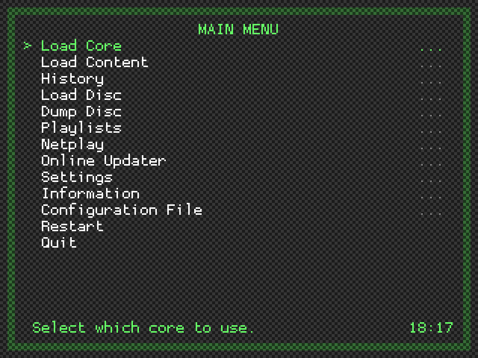
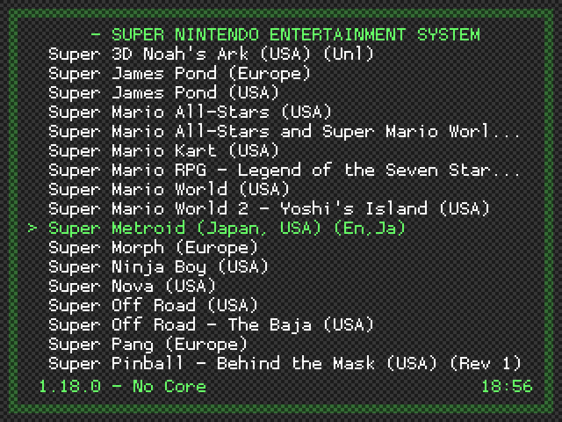
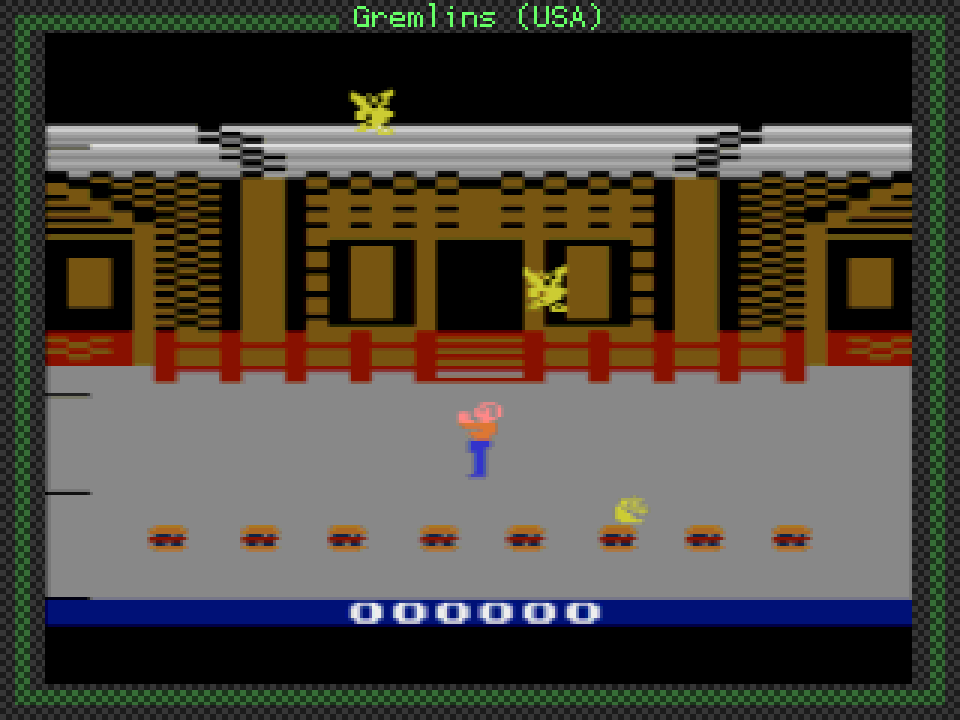
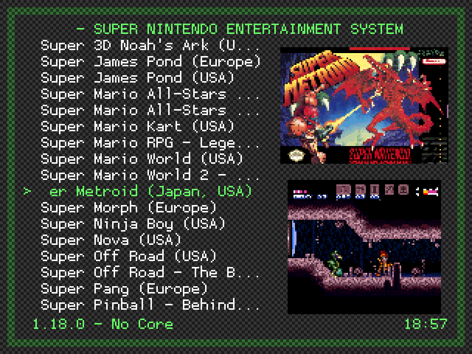
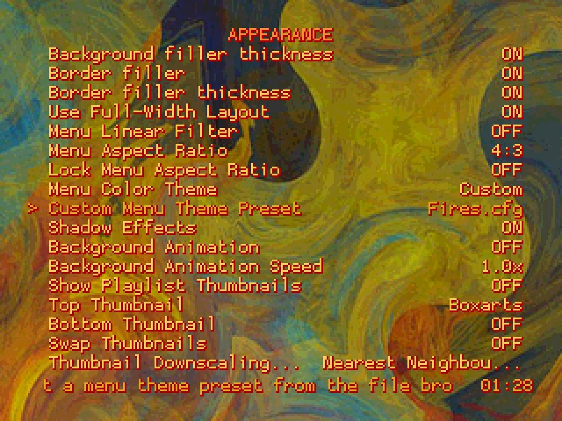

# RGUI (GUI)

**RGUI** is a simple built-in user interface for RetroArch. It was originally introduced in the Wii port of RetroArch. RGUI was later refitted for use on low-powered and/or low-resolution devices.

## Features

While RGUI cannot configure absolutely everything, it can do the most common things you would want to do while using RetroArch.

- Selecting libretro core
- Load a game
- Tweak per-libretro core options (e.g. colorization in GameBoy)
- Load game from history (previous games played)
- Save/load savestates
- Configure shaders
- Configure aspect ratios
- Configure integer scale
- Toggle fullscreen
- Swap disk images (needed for PlayStation, see notes below!)
- Take screenshots
- Enable/disable real-time rewind
- Simple input configuration
- Mute/unmute audio
- Exit RetroArch

## Navigating the menus

Regular input binds will apply, and binds here are defined in terms of the RetroPad, RetroArch's joypad abstraction.

| Button | PC Default | Action |
|--------|------------|--------|
| **A button** | X/Return | Accept/OK |
| **B button** | Z/Backspace | Back/Cancel |
| **Select** | Right shift | Display tooltip |
| **Up/Down D-pad** | Up/Down keys | Move up/down menus |
| **Left/Right D-pad** | Left/Right keys | Toggle settings, or jump up/down menus |

### Searching through lists with keyboard
When using a keyboard, it can be slow to navigate a large list using gamepad-like controls. To help this, you can type `/` (forward slash) at any time to bring up a search box. Type a search string and hit Return. The cursor should jump to the first entry that matches. The search will match mid-path strings: However, if a match is found at the beginning of the path (like when searching for the first letter), the start-of-path match will take priority.

The forward slash is recognized on character basis, not on the key itself. This allows e.g. Norwegian layouts to type forward slash by pressing 'shift + 7'. Characters which are outside the ASCII set are recognized but ignored, as RGUI cannot render such characters anyway.

## Config file
By default, RetroArch looks for a config in various places depending on OS:

- **Linux/OSX**: `$XDG_CONFIG_HOME/retroarch/retroarch.cfg`, then `~/.config/retroarch/retroarch.cfg`, then `~/.retroarch.cfg`, and finally, as a fallback, `/etc/retroarch.cfg`.
- **Windows**: `retroarch.cfg` in same folder as `retroarch.exe`, then `%APPDATA%\retroarch.cfg`.

To override this, use `retroarch --config customconfig.cfg`. If you have some special options you want to store in separate config files you can use `retroarch --config baseconfig.cfg --appendconfig specialconfig.cfg`. See man-page and/or `--help` for detail.

| Warning |
|-------- |
| While you are changing settings in runtime, they are not saved to disk afterwards on PC by default. If you want RetroArch to automatically write back the config, either set `config_save_on_exit = true` in config, or enable this under Settings -> Config Save On Exit from within RGUI. |

By design, the config file is considered immutable as it is likely maintained by the user, and should not be overwritten behind the users back. This is not the case on consoles however, where looking at the config manually isn't really an option for most users.

### Configuring input
Currently you can configure two settings per player (on PC):

- **Device**: Picks which gamepad to use for player N. The name of the pad is available.
- **Device Type**: Picks which device type to use. This is relevant for the libretro core itself, and mostly useful for PlayStation, which needs to know if you're using a DualAnalog device or not.

#### Configuring controller input
* Configuring controller input is supported from within RGUI.
* Normal gameplay binds as well as RGUI hotkey binding is supported. It is possible to bind everything in succession for convenience.

#### Configuring keyboard input
Configuring keyboard input is currently not supported. To configure keyboard binds, it must be done outside RGUI.

### Thumbnails

RGUI thumbnail support requires the use of playlist files and thumbnail image packs: See [ROMs, Playlists, and Thumbnails](../guides/roms-playlists-thumbnails/).

To view existing playlists choose `Playlists` from the main menu or the `Load Content` menu. Select a playlist, and while browsing its contents use the RetroPad **Y button** (or **Spacebar** on PC) to toggle the full-screen thumbnail associated with the currently highlighted entry:

*Thumbnails off:*

*Thumbnails on:*

Any thumbnail image larger than 320x240 will be downscaled automatically to fit the screen. Three downscaling methods are provided, allowing a choice between performance and quality. To switch between them, from the top menu select `Settings > User Interface > Appearance` and set the `Thumbnail Downscaling Method` option to one of:

- **Nearest Neighbour (Fast)**: Simple (pixelated) nearest neighbour scaling. Has a very low impact on performance, and should be usable on any hardware.
- **Bilinear**: Smooth (although potentially blurry) resampling. Slower than nearest neighbour, but should be usable on most hardware.
- **Sinc/Lanczos3 (Slow)**: High quality resampling (although sometimes generates artefacts when source image contains dithering). May cause lag on very low end devices, but has no discernable performance impact on desktop-class hardware.

Note that it is possible to display thumbnails on the right of a system's playlist:

This option can be toggled on at `Settings > User Interface > Appearance> Show Playlist Thumbnails`. The options immediately below it, `Top Thumbnail` and `Bottom Thumbnail`, can be set to display:

- Boxart
- Title Screen
- Screenshot

## Applying Shaders

See the [shaders user guide](shaders.md).

## Themes

The visual appearance of RGUI may altered by choosing one of 32 built-in color themes. These change both the color scheme and sometimes the background wallpaper.

From the top menu select `Settings > User Interface > Appearance` and cycle through the various `Menu Color Theme` options:

Setting `Menu Color Theme` to `Custom` allows for an even greater degree of personalisation via the use of custom menu theme presets. A number of examples are provided in the RetroArch assets package, which may be downloaded by selecting from the top menu `Online Updater > Update Assets`.

To choose one of these examples, go to `Settings > User Interface > Appearance` and select the `Custom Menu Theme Preset` option. In the file browser that opens, navigate to the `rgui` directory and select a `.cfg` file.

Icons are not supported by RGUI: It instead uses ASCII characters where possible.

### Creating custom menu theme presets

A custom menu theme preset is a plain text configuration file (e.g. `my_theme.cfg`) with the following contents:

    rgui_entry_normal_color = "0xAARRGGBB"
    rgui_entry_hover_color = "0xAARRGGBB"
    rgui_title_color = "0xAARRGGBB"
    rgui_bg_dark_color = "0xAARRGGBB"
    rgui_bg_light_color = "0xAARRGGBB"
    rgui_border_dark_color = "0xAARRGGBB"
    rgui_border_light_color = "0xAARRGGBB"
    rgui_wallpaper = "wallpaper_file.png"

- **rgui_entry_normal_color**: Specifies the color of all 'normal' text displayed in any list.
- **rgui_entry_hover_color**: Specifies the color of the currently selected entry, along with the core name and clock displayed at the bottom of the screen.
- **rgui_bg_dark/light_color**: Specifies the menu background color. Setting `rgui_bg_dark_color` and `rgui_bg_light_color` to different values creates a chequerboard effect. Also used for the background of message boxes, and the title text when displaying thumbnails.
- **rgui_border_dark/light_color**: Specifies the color of the border 'frame' drawn around the perimeter of the menu. Setting `rgui_border_dark_color` and `rgui_border_light_color` to different values creates a chequerboard effect. Also used for the frame of message boxes.
- **rgui_wallpaper**: The relative file path to an optional wallpaper image. If this entry is omitted or left empty, no wallpaper is used.

#### Color selection

All color values are given in 0xAARRGGBB 8-digit hex code format - i.e. the first two digits correspond to the alpha (transparency) value, while the remaining 6 are a normal [hex triplet](https://en.wikipedia.org/wiki/Web_colors#Hex_triplet). For example: fully opaque red would correspond to `0xFFFF0000`; 50% transparent green would correspond (approximately) to `0x7F00FF00`.

For maximum legibility, the alpha value for all text colors should be set to `FF` (fully opaque). For the background and border, setting partial transparency allows the currently loaded content to be seen 'through' the menu when opening it while running a game. Note, however, that setting partial transparency causes colors to appear darker than expected, so careful tuning of the [hex triplet](https://en.wikipedia.org/wiki/Web_colors#Hex_triplet) values is required. Appropriate transparency values are as follows:

- When creating a dark theme *without wallpaper*, the border/bg alpha component should be set to `C0`.
- When creating a light theme *without wallpaper*, the border/bg alpha component should be set to `E0`.
- When creating a theme *with wallpaper*, the border/bg alpha component should be set to `FF`. (This is because it is very difficult to create a semi-transparent wallpaper image with proper colors, and so it is most practical to make everything fully opaque when using wallpapers)

#### Creating wallpaper images

RGUI wallpapers must have the following properties:

- A resolution of exactly 320x240.
- A color depth of 4 bits per pixel. (This is not *strictly* required, but using an image with greater color depth will not produce expected results)

Wallpapers should be generated in [PNG](https://en.wikipedia.org/wiki/Portable_Network_Graphics) format.

To produce a suitable image, the user should first create a regular 320x240 [PNG](https://en.wikipedia.org/wiki/Portable_Network_Graphics) file via any means at their disposal. [Inkscape](https://inkscape.org/) users may find the following simple template beneficial: [rgui_wallpaper_template.svg](rgui_wallpaper_template.svg)

Once the image is complete, it is necessary to reduce its color depth. This may be done via one of two methods:

#### 1) Using pngquant (recommended):

[pngquant](https://pngquant.org/) is a command-line utility for lossy compression of PNG files. It supports very high quality conversion of images to [indexed](https://en.wikipedia.org/wiki/Indexed_color) color, in a manner appropriate for *most* kinds of wallpaper.

Download/compile/install the latest version, then use the following command to process a wallpaper source file:

    > pngquant --posterize=4 --force -o "WALLPAPER_NAME_indexed.png" "WALLPAPER_SOURCE.png"

Open the output `WALLPAPER_NAME_indexed.png` file and check that colors/gradients appear correct. In most cases, the result will be agreeable. If odd 'speckles' are apparent, it may be necessary to adjust the colors in the source image (this is a black art, and beyond the scope of this document). If the image has unacceptable, uncorrectable dithering then the `WALLPAPER_NAME_indexed.png` file should be discarded, and the following alternate method used instead:

#### 2) Using GIMP

[GIMP](https://www.gimp.org/) is a well known image editor. In general it produces lower quality color reduction than [pngquant](https://pngquant.org/), but it can handle certain gradients and patterns that cause [pngquant](https://pngquant.org/) to stumble. Download/install the latest version, then:

- Open the wallpaper source file.
- From the menu, select `Image > Mode > Indexed...`
- In the `Indexed Color Conversion` pop-up, select:
    - `Generate optimum palette`
    - `Maximum number of colors:` `16`
    - `Color dithering:` EITHER `Floyd-Steinberg (normal)` OR `Floyd-Steinberg (reduced color bleeding` (use whichever looks best, but the other options here will not work).
    - Press `Convert`.

- Inspect the result. Some manual touch-up may be required. (If the image is disagreeable at this stage, then the wallpaper probably isn't going to work - so start over...)
- If all is well, select from the menu `File > Export As...` and name the file `WALLPAPER_NAME_indexed.png`
- In the `Export Image as PNG` pop-up, untick `Save color values from transparent pixels` and click `Export`.

Whether [pngquant](https://pngquant.org/) or [GIMP](https://www.gimp.org/) is used to create `WALLPAPER_NAME_indexed.png`, a final stage of optimisation should be applied to generate a 'clean' output wallpaper. This can be done using [OptiPNG](http://optipng.sourceforge.net/). Download/compile/install the latest version, then run the following command:

    > optipng -o7 -strip=all -force -clobber -out `WALLPAPER_NAME.png` `WALLPAPER_NAME_indexed.png`

Edit the custom menu theme preset configuration file such that `rgui_wallpaper` points to the resultant `WALLPAPER_NAME.png` image. Once appropriate text/background/border colors have been set, the theme is complete.