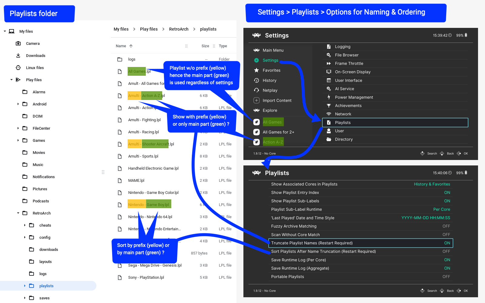
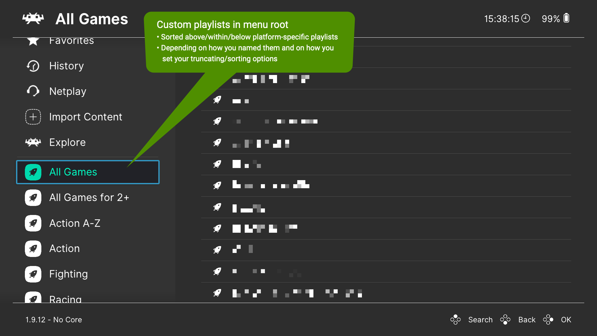
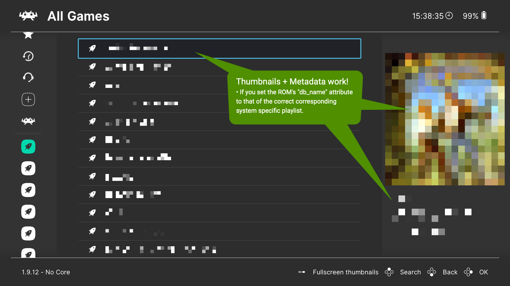
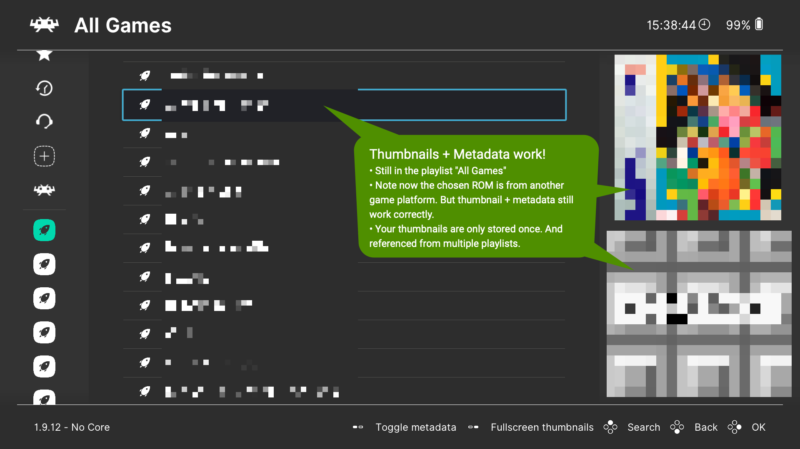

# ROMs, Playlists, and Thumbnails

## Storing games and other content
Game ROMs are the source media of the games that can be played using RetroArch cores, they can be actual dumps of read-only memory, but also tape/floppy/compact disc images or some other format. The ROM files may be placed anywhere in the file system where RetroArch has access - note that some platforms (notably Android) are not able to browse the full storage. It is practical if the file browser start directory is configured to the directory where ROMs are stored.

Many users sort their ROMs into subfolders named after the system which the ROMs belong to, which results in a folder arrangement such as:


     roms/
          Atari - 2600/
               Atari Game 1.zip
               Atari Game 2.zip
               Atari Game 3.zip
          Nintendo - Nintendo Entertainment System/
               NES Game 1.zip
          Sega - 32X/
               32X Game 1.zip
               32X Game 2.zip
          etc.
          etc.

This arrangement is not required and you are free to organize your ROMs as you prefer.

Also, as a general guideline, content from disc-based systems (Compact Disc images, etc.) should not be zipped for RetroArch use.

## Working with Playlists
Playlists are the lists of games and other content that can be generated automatically by the RetroArch playlist scanner, generated by a third-party playlist utility or script, or edited by hand in a text editor.

### RetroArch Playlist Scanner

RetroArch incorporates a ROM scanning system to automatically produce playlists. Each ROM that is scanned by the playlist generator is checked against a database of ROMs that are known to be good copies.

In order for content to be correctly scanned, you must:

  - Have a compatible core already downloaded and installed (note: Scan Without Core Match setting removes this requirement)
  - Update `Core Info Files` via `Online Updater`
  - Update `Databases` via `Online Updater`
  - Restart RetroArch if any of the above was just done

For a normal scan, the content must match existing databases from the [libretro-database README](https://github.com/libretro/libretro-database#retroarch-database). If those conditions are met but content is still not being added automatically to a playlist, consider submitting an issue report on [github](https://www.github.com/libretro/RetroArch/issues).

There is an option to do manual scan, which does not require a database, and just needs the file names to match. Results from the manual scan will be playable (as long as the respective core supports them), but may lack thumbnails and do not appear in the Explore menu.

### Designating which core to use

RetroArch will attempt to detect and use the correct core for use with the ROMs that are used as part of a playlist. Under some circumstances, it may be useful to manually set a particular core for one of its playlists. This can be accomplished within the Playlists submenu in the RetroArch settings.

## The Explore menu

RetroArch provides an Explore menu which can be used for browsing all content that were added to playlists using any database attribute - release year, genre, etc.

## Playlist File Format Details

Each playlist is a plain text file with an extension of `.lpl`. RetroArch 1.7.5 and later uses a JSON playlist format, although the backwards compatibility remains for the deprecated "6-Line" playlist format.

**Note:** The paths in playlist files need to use the correct 'slash' character for the user's platform. Linux, OS X, and Android systems including Lakka and LudOS require forward slashes `/`, while Windows and DOS systems require backslashes `\`.

!!! Hint "Hint for Windows Users"
    The built-in Notepad editor cannot work with cross-platform text files such as RetroArch playlist files. Many users and developers recommend the free [Notepad++](https://notepad-plus-plus.org/) as a replacement although most alternative text editors will also work.

### JSON Playlist Format

The following example is a single-entry MAME 2003-Plus playlist for [Alien Arena](https://www.arcade-museum.com/game_detail.php?game_id=6850) -- the silent version of this game is available through the RetroArch **Content Downloader** found in the **Online Updater** menu.

The romset with the `label` **Alien Arena** is located at `path` being `C:\retroarch\downloads\alienar.zip`; note that the backslashes are doubled in JSON-formatted playlist entries so that the value of the `path` entry is `C:\\retroarch\\downloads\\alienar.zip`.

The ROM's corresponding `db_name` is `MAME 2003-Plus.lpl` which tells the menu driver which ROM database to use for looking up the game's metadata, thumbnails and game-system-specific icon-type. Menu drivers which implement playlist icons will use it to display it next to the ROM's name.

#### `MAME 2003-Plus.lpl`
```json
{
  "version": "1.0",
  "items": [
    {
      "path": "C:\\retroarch\\downloads\\alienar.zip",
      "label": "Alien Arena",
      "core_path": "DETECT",
      "core_name": "DETECT",
      "crc32": "01ACE2AB|crc",
      "db_name": "MAME 2003-Plus.lpl"
    }
  ]
}
```

!!! Alert
    You can omit the CRC or Serial for a manually created playlist entry by using the word `DETECT`  instead, although it may limit your ability to use netplay for this playlist entry.

### 6-Line Playlist Format (Deprecated)

!!! Warning
    This playlist format is deprecated and may not always be supported by RetroArch in the future. New playlists should be created in the JSON format.

**Each entry in a playlist must be composed of 6 lines:**

#### `MAME 2003-Plus.lpl`
```
C:\retroarch\downloads\alienar.zip"
Alien Arena
/tmp/cores/mame2003_plus_libretro.so
DETECT
01ACE2AB|crc
MAME 2003-Plus.lpl
```

1. The path to the ROM. This can either be an 'absolute' path or a path relative to the current working directory.
2. The display name (you can use any name here)
3. The path to the core, this libretro core will be used to launch the ROM. **You can use the word DETECT in place of the core path here. Once this is done you can set the core to be used for this playlist via the RetroArch GUI.**
4. The displayname of the core, not really useful, we keep it there because the history list is also using this format
5. CRC or Serial number for database and other matching purposes. **You can omit the CRC or Serial for a manually created playlist entry by using the word DETECT here instead, although it may limit your ability to use Netplay for this playlist entry.**
6. The name of the system playlist to which this ROM is associated for looking up database metadata and thumbnails.

## Creating custom playlists (cross-platform, cross-folders)

The standard playlists in RetroArch are usually platform-specific, i.e. `Nintendo - Game Boy.lpl` or `Sony - PlayStation.lpl`.

Maybe you want to create custom playlists not limited within game-platforms or ROM-folders, e.g. "Multiplayer Racing Games" or "Medieval Themed Games".

`content_favorites.lpl` and `content_history.lpl` are examples of default playlists which have this cross-platform behavior. So study them as an example first.

### To create a custom playlist

- Copy/merge content from platform-playlists files into a fresh playlist file inside `<RetroArchRoot>/playlists/` entitled `My Sorting Prefix - My Playlist Name.lpl`.
- Be sure that the ROM entries follow the syntax as described in section: [JSON Playlist Format](#json-playlist-format).
- The `db_name` attribute entry must be the ROM's corresponding `Exact Game Platform Playlists Name.lpl` (e.g. `Nintendo - Game Boy.lpl`) in order to be associated with the correct metadata and thumbnails.

### Customize how/where your playlists are shown

- Name your playlist in the scheme `My Sorting Prefix - My Playlist Name.lpl` or just `My Playlist Name.lpl`.
- To tweak how playlists are displayed (with or without prefix) and how they are sorted (by prefix or by main name):
  - Go to: Settings > Playlists
  - Set options **Truncate Playlist Names** and **Sort Playlists After Name Truncation** to your liking.

### How to set up custom playlists (Screenshots)










### Third-Party Applications

Since playlists are managed in text-only JSON format, there are a few third-party applications to help manage your playlists.

- [RetroArch Playlist Editor](https://www.marcrobledo.com/retroarch-playlist-editor/) ([Source](https://github.com/marcrobledo/retroarch-playlist-editor))
- [RetroArch Playlist Buddy](https://forums.libretro.com/t/retroarch-playlist-buddy-playlist-and-thumbnail-generation-app/8417) ([Source](https://github.com/markwkidd/ahk-retroarch-playlist-helpers))

## Thumbnails

RetroArch can display three types of thumbnails for games in playlists, depending on the specific RetroArch menu driver in use:

* In-game snapshots
* Title screen snapshots
* Boxart


Displayed thumbnail types can be configured system-wide and also per playlist. For XMB and Ozone menus, Y button (west face button) changes between possible thumbnails.

Thumbnails can be retrieved in several ways:

* Playlist thumbnail downloader (recommended): under Online Updater menu, all available thumbnails can be downloaded for a playlist. RetroArch will connect to http://thumbnails.libretro.com.
* Individual thumbnail downloader: there is a Download Thumbnails option for each entry in playlists. For RetroArch versions later than 1.16.0, you may hit download up to 3 times to try the flexible matches.
* On-demand thumbnail downloader: if the respective option is enabled, RetroArch will try to download each thumbnail as the playlist is browsed. For RetroArch versions later than 1.16.0, you may try flicking back and forth between entries up to 3 times to try the flexible matches.
* Thumbnail pack downloader: RetroArch provides packs of thumbnails suitable for use with many emulated systems, although the playlist thumbnail downloader is preferred. Thumbnail packs can be installed from the Online Updater menu, if the legacy thumbnail downloader option is enabled. Thumbnail packs can be downloaded manually from http://thumbnailpacks.libretro.com .

### Custom thumbnails
Users who wish to use their own thumbnails can do so by naming PNG image files according to the RetroArch naming convention.

#### Thumbnail paths and filenames
Thumbnails should be stored in subfolders within the configured RetroArch `thumbnails` directory within a subfolder named exactly the same as the playlist, except without `.lpl` at the end. **Example: If your playlist is named `Atari - 2600.lpl`, then your Atari 2600 root thumbnail folder should be called `thumbnails/Atari - 2600/`.**

Within this root thumbnail folder called `Atari - 2600`, you should then create subfolders named `Named_Boxarts`, `Named_Snaps`, or `Named_Titles` for boxart/cover art, in-game snapshots, and title screens, respectively.

The thumbnail filename should exactly match the game's title as listed in the playlist with an important exception. **The following characters in playlist titles must be replaced with `_` in the corresponding thumbnail filename:** `` &*/:`<>?\| ``

**Example: If your content is named `Q*bert's Qubes (USA)` in the playlist, then its thumbnails should be named `Q_bert's Qubes (USA).png` and stored at these paths:**

```
     thumbnails/
          Atari - 2600/
               Named_Boxarts/
                    Q_bert's Qubes (USA).png
               Named_Snaps/
                    Q_bert's Qubes (USA).png
               Named_Titles/
                    Q_bert's Qubes (USA).png
```
For RetroArch versions later than 1.16.0, flexible naming is applied, up to 3 options are tried for each playlist entry, in the following order:
- ROM file name with .png extension: `Q-Bert's Qubes (1983)(Parker Bros)[b].png`
- Database entry / playlist label with .png extension, as explained above: `Q_Bert's Qubes (USA).png`
- Short name: same as previous, but only up to first round bracket: `Q_Bert's Qubes.png`
