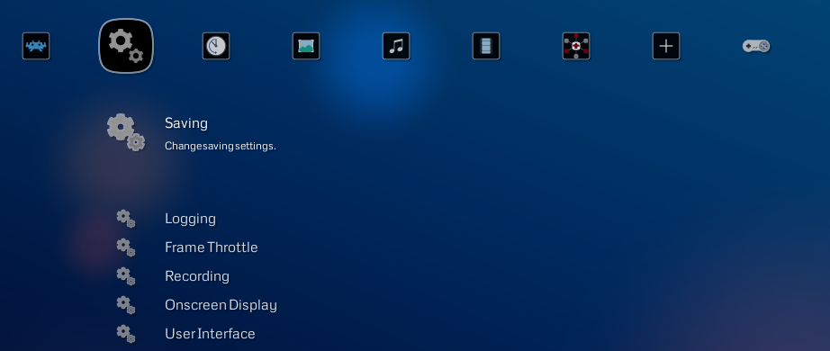
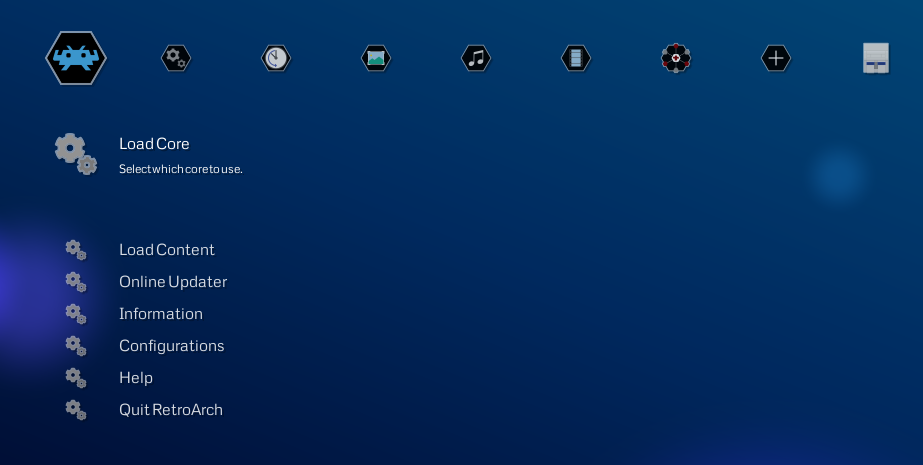
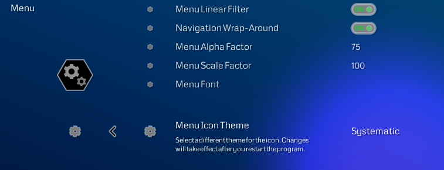

# Icon Theme Examples

Here are three examples of available menu icon themes.

To create your own theme please read [this guide](themes.md)

## Dot-Art

## Retroactive

## Systematic

## How To Change Icon Themes

Navigate to Settings -> User Interface -> Menu -> Menu Icon Theme

Scroll right to choose a theme

