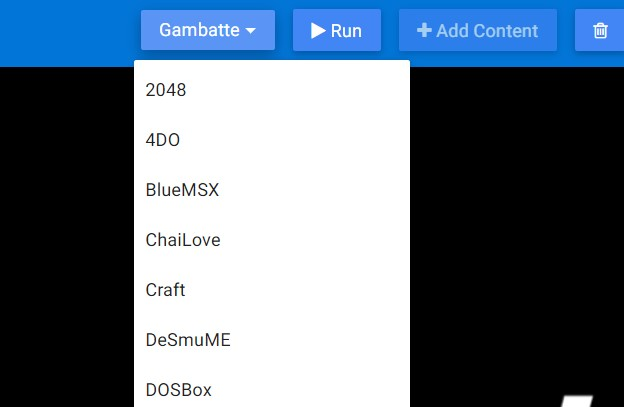
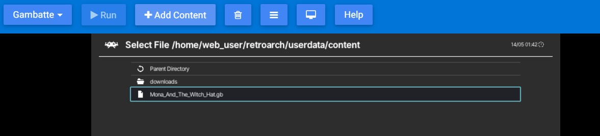

# What is it?

It is a version that works on the modern internet browsers with the basic features of RetroArch. You don't need to install this version. You can add your content after selecting the desired Core.

## How to use it

You can access it from this [link](https://web.libretro.com/) with using modern internet browsers (For example: Google Chrome, Microsoft Edge etc.).

!!! Warning
    Using an old internet browser may ruin the whole experience.



1. Select the **Core** to run from the **first tab**(Clicking on the Core name will start running).
*Core loading time may vary depending on the selected Core. During this time, your system's performance and actively used processes can cause your browser to crash. In this case, the option Wait or End will be displayed on your screen. In this case, click Wait, it may come out several times.*

1. Choose your content to load by clicking **Add Content** from the **second tab**.
*This will add your content to your browser's cache. We will be able to delete it later.*
1.  To access the file you uploaded `Load Content> Start Directory >`
*You will also see it in the Downloads folder, where you can access open source content, which you can download from RetroArch's Content Downloader.*


## Details

We can use the basic features of RetroArch.

- How can I toggle Quick Menu?
 - You can either press F1 or click the Menu Toggle button which is 
- How can I go full screen?
 - You do not want to press F11 when the screen is selected, this key usually takes you to full screen, but in our scenario you need to use the Full Screen key which is .
- How can I delete the cache?
 - There are many methods for this, you can do CTRL + F5, right click the cursor and go to the inspect and right click on the refresh button on the top left and clear the cache, press the clear cache key .

You can also click the `Help` button and read this information there.

### Cores

Supported Cores for now are as follows, may vary in this list.

```
2048
Beetle Lynx
Beetle NeoPop
Beetle PCE FAST
Beetle PC-FX
Beetle PSX
Beetle SNES
Beetle VB
Beetle WonderSwan
BlueMSX
ChaiLove
Craft
DeSmuME
DOSBox
EasyRPG
FB Alpha 2012
FB Alpha 2012 CPS1
FB Alpha 2012 CPS2
FB Alpha 2012 NeoGeo
FCEUmm
FFmpeg
Gambatte
Game Music Emu
Genesi Plus GX
GLupeN64
gPSP
Handy
MAME 2000
Mu
Mupen64 Plus
Nestopia
NX Engine
02em
Opera
PicoDrive
PrBoom
QuickNES
Flycast
Snes9x 2002
Snes9x 2005
Snes9x 2010
Snes9x
SquirrelJME
Stella
TGB Dual
Theodore (Thompson T08/T09)
TryQuake
VBA Next
Vecx
Virtual Jaguar
Yabause
```
