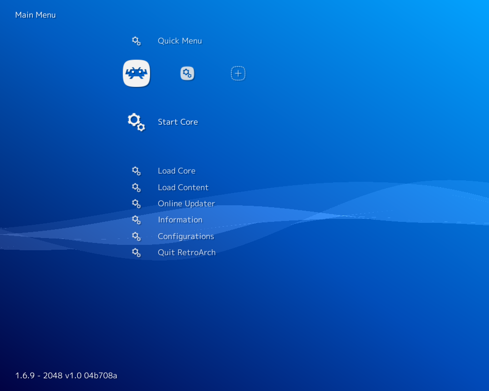

# 2048

## Background

This is a port of 2048, a game, to libretro.

#### How to start the 2048 core:

- To start the 2048 core, go to RetroArch's main menu screen. Select 'Load Core', then '2048'.

- Now, select 'Start Core'.

  

The content should now start running!

### Author/License

The 2048 game has been authored by

- Gabriele Cirulli

The libretro implementation was authored by

- Higor Eurípedes

The 2048 core is licensed under

- [Public Domain](https://github.com/libretro/libretro-2048/blob/master/COPYING)

A summary of the licenses behind RetroArch and its cores can be found [here](../development/licenses.md).

## Features

Frontend-level settings or features that the 2048 core respects.

| Feature           | Supported |
|-------------------|:---------:|
| Restart           | ✔         |
| Screenshots       | ✔         |
| Saves             | ✔         |
| States            | ✔         |
| Rewind            | ✔         |
| Netplay           | ✔         |
| Core Options      | ✕         |
| RetroAchievements | ✕         |
| RetroArch Cheats  | ✕         |
| Native Cheats     | ✕         |
| Controls          | ✔         |
| Remapping         | ✔         |
| Multi-Mouse       | ✕         |
| Rumble            | ✕         |
| Sensors           | ✕         |
| Camera            | ✕         |
| Location          | ✕         |
| Subsystem         | ✕         |
| [Softpatching](../guides/softpatching.md) | ✕         |
| Disk Control      | ✕         |
| Username          | ✕         |
| Language          | ✕         |
| Crop Overscan     | ✕         |
| LEDs              | ✕         |

### Directories

The 2048 core's internal core name is '2048'

The 2048 core saves/loads to/from these directories.

**Frontend's Save directory**

- 2048.srm (Previous game sessions and hiscores)

**Frontend's State directory**

- 2048.state# (State)

### Geometry and timing

- The 2048 core's core provided FPS is 60
- The 2048 core's core provided sample rate is 30000 Hz
- The 2048 core's core provided aspect ratio is 1

## Controllers

The 2048 core supports the following device type(s) in the controls menu, bolded device types are the default for the specified user(s):

### User 1 device types

- None - Doesn't disable input.
- **RetroPad** - Joypad
- RetroPad w/Analog - Joypad - There's no reason to switch to this.

### Controller tables

#### Joypad

| User 1 Remap descriptors | RetroPad Inputs                             |
|--------------------------|---------------------------------------------|
| Pause                    |      |
| Start                    |       |
| Up                       |     |
| Down                     |   |
| Left                     |   |
| Right                    |  |

## External Links

- [Official 2048 Website](https://gabrielecirulli.github.io/2048/)
- [Official 2048 Github Repository](https://github.com/gabrielecirulli/2048)
- [Libretro 2048 Core info file](https://github.com/libretro/libretro-super/blob/master/dist/info/2048_libretro.info)
- [Libretro 2048 Github Repository](https://github.com/libretro/libretro-2048)
- [Report Libretro 2048 Core Issues Here](https://github.com/libretro/libretro-2048/issues)
