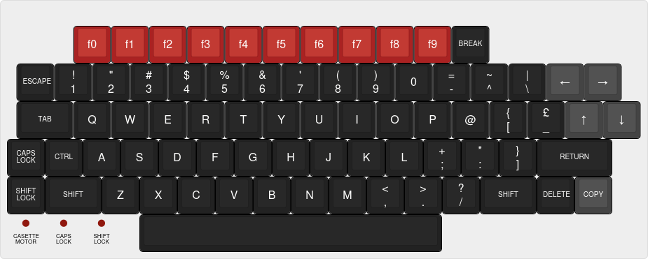
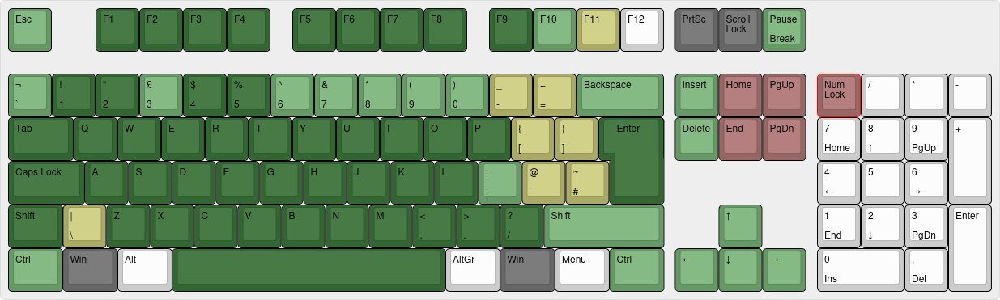

# Acorn - BBC Micro (b2-libretro)

<iframe width="560" height="315" src="https://www.youtube-nocookie.com/embed/FMwQJtZacOc" frameborder="0" allow="accelerometer; autoplay; clipboard-write; encrypted-media; gyroscope; picture-in-picture" allowfullscreen></iframe> 

## Background

Emulate the BBC Micro, a series of microcomputers designed and built by Acorn Computers Limited in the 1980s for the Computer Literacy Project of the BBC.

The b2-libretro core has been authored by:

- Tom Seddon (b2)
- Zoltan Balogh (libretro core specific modifications)

The b2 core is licensed under [GPL v3](https://github.com/zoltanvb/b2-libretro#licence). A summary of the licenses behind RetroArch and its cores can be found [here](../development/licenses.md).

## Requirements

No special requirements. To be tested yet on low end platforms.

## Extensions

Content that can be loaded by the b2 core have the following file extensions:

- `.ssd/.dsd` - Floppy disk image

RetroArch database(s) that are associated with the b2 core:

- None yet

## Features

Frontend-level settings or features that the b2 core respects.

| Feature           | Supported |
|-------------------|:---------:|
| Restart           | ✔         |
| Saves             | ✕         |
| States            | ✕         |
| Rewind            | ✕         |
| Netplay           | ✕         |
| Core Options      | ✔         |
| RetroAchievements | ✕         |
| RetroArch Cheats  | ✕         |
| Native Cheats     | ✕         |
| Controls          | ✔         |
| Remapping         | -         |
| Multi-Mouse       | ✕         |
| Rumble            | ✕         |
| Sensors           | ✕         |
| Camera            | ✕         |
| Location          | ✕         |
| Subsystem         | ✕         |
| [Softpatching](../guides/softpatching.md) | ✕         |
| Disk Control      | ✔         |
| Username          | ✕         |
| Language          | ✕         |
| Crop Overscan     | ✕         |
| LEDs              | ✕         |

## Directories

No additional directories used, only content disk image is needed.

## Geometry and timing

- The b2 core's core provided FPS is 50
- The b2 core's core provided sample rate is 250 kHz (to be optimized)
- The b2 core's base width is 768
- The b2 core's base height is 288
- The b2 core's max width is 768
- The b2 core's max height is 576 (interlace mode)
- The b2 core's core provided aspect ratio is 4:3

## Usage

Load any supported content file. Content type will be autodetected, and if possible, started:

- If disk image name contains an executable file name in brackets (such as `[CHUCKIE]`), a `CHAIN` command will be issued shortly after initial booting
- If disk image name does not contain such indication, Shift key press will be simulated during boot to trigger autoboot function

In case of multi-disk games, use the Disk Control menu to add the subsequent images and switch between them.

## Core options

The b2 core has the following option(s) that can be tweaked from the core options menu.

- Emulated machine
  - `B/Acorn 1770`
  - `B/Watford 1770 (DDB2)`
  - `B/Watford 1770 (DDB3)`
  - `B/Opus 1770`
  - `B/Opus CHALLENGER 256K`
  - `B/Opus CHALLENGER 512K`
  - `B+`
  - `B+128`
- Autoboot (on|off)
- Keyboard assignments for each RetroPad button

## Joypad mapping

The analogue joysticks are mapped to the left analog stick and face button A for RetroArch player 1 and 2 slots.

Joypad is fully assignable to keyboard keys in core options.

## Keyboard

Keyboard layout of the BBC Micro:

Most mappings are straightforward positionally from an ISO UK keyboard:

- Dark green: natural mapping, both position and function matches nicely
- Light green: either position or function is slightly different
- Yellow: function is different
- Red: extra mapping
- Dark grey: keys intentionally reserved for RetroArch / OS functions

Exceptions are marked in the following table:

| RetroKeyboard Inputs         | BBC Micro keyboard input  |
|------------------------------|---------------------------|
| Keyboard F10                 | f0                        |
| Keyboard F11                 | Break                     |
| Keyboard Pause               | Break                     |
| Keyboard Backspace           | Delete                    |
| Keyboard Backquote `         | Escape (alternative mapping) |
| Keyboard Equals =            | ^ (caret)                 |
| Keyboard Oem 102             | \\ (backslash)            |
| Keyboard Home                | \\ (alternative mapping)  |
| Keyboard Backspace           | Delete                    |
| Keyboard Left Bracket [      | @ (at)                    |
| Keyboard Right Bracket ]     | [ (left bracket)          |
| Keyboard End                 | _ (underline)             |
| Keyboard Quote '             | : (colon)                 |
| Keyboard Backslash \         | ] (right bracket) (shown as # in ISO map) |
| Keyboard Delete              | Delete                    |
| Keyboard PgUp                | Caps Lock                 |
| Keyboard PgDn                | Shift Lock                |
| Keyboard NumLock             | Shift Lock                |
| Keyboard Insert              | Copy                      |

## External Links

- [Official b2-libretro core repository](https://github.com/zoltanvb/b2-libretro)
- [Libretro b2 Core info file](https://github.com/libretro/libretro-super/blob/master/dist/info/b2_libretro.info)
- [Report Libretro b2 Core Issues Here](https://github.com/zoltanvb/b2-libretro/issues)
- [Original b2 Implementation](https://github.com/tom-seddon/b2)
- [Complete BBC Micro Games Archive](https://www.bbcmicro.co.uk/)
- [Stardot forums](https://www.stardot.org.uk/forums/) - BBC Micro community
