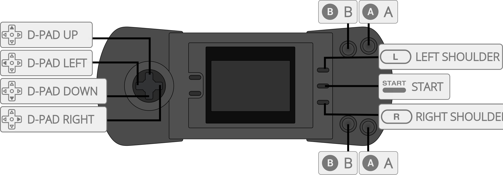

# Atari - Lynx (Beetle Lynx)

## Background

Beetle Lynx is an Atari Lynx video game system emulator that can be used as a libretro core. Specifically it's a port of Mednafen Lynx which is a fork of Handy.

### Author/License

The Beetle Lynx core has been authored by

- K. Wilkins
- [Mednafen Team](https://mednafen.github.io/)

The Beetle Lynx core is licensed under

- [zlib](https://github.com/libretro/beetle-lynx-libretro/blob/master/mednafen/lynx/license.txt), [GPLv2](https://github.com/libretro/beetle-lynx-libretro/blob/master/COPYING)

A summary of the licenses behind RetroArch and its cores can be found [here](../development/licenses.md).

## Extensions

Content that can be loaded by the Beetle Lynx core have the following file extensions:

- .lnx
- .o

## Databases

RetroArch database(s) that are associated with the Beetle Lynx core:

- [Atari - Lynx](https://github.com/libretro/libretro-database/blob/master/rdb/Atari%20-%20Lynx.rdb)

## BIOS

Required or optional firmware files go in the frontend's system directory.

|   Filename    |    Description             |              md5sum              |
|:-------------:|:--------------------------:|:--------------------------------:|
| lynxboot.img  | Lynx Boot Image - Required | fcd403db69f54290b51035d82f835e7b |

## Features

Frontend-level settings or features that the Beetle Lynx core respects.

| Feature           | Supported |
|-------------------|:---------:|
| Restart           | ✔         |
| Screenshots       | ✔         |
| Saves             | ✕         |
| States            | ✔         |
| Rewind            | ✔         |
| Netplay (State based) | ✔ (not link-cable emulation)         |
| Core Options      | ✔         |
| RetroAchievements | ✔         |
| Cheats (Cheats menu) | ✔         |
| Native Cheats     | ✕         |
| Controls          | ✔         |
| Remapping         | ✔         |
| Multi-Mouse       | ✕         |
| Rumble            | ✕         |
| Sensors           | ✕         |
| Camera            | ✕         |
| Location          | ✕         |
| Subsystem         | ✕         |
| [Softpatching](../guides/softpatching.md) | ✔         |
| Disk Control      | ✕         |
| Username          | ✕         |
| Language          | ✕         |
| Crop Overscan     | ✔         |
| LEDs              | ✕         |

### Directories

The Beetle Lynx core's directory name is 'Beetle Lynx'

The Beetle Lynx core saves/loads to/from these directories.

**Frontend's State directory**

- 'content-name'.state# (State)

### Geometry and timing

- The Beetle Lynx core's core provided FPS is 75
- The Beetle Lynx core's core provided sample rate is 44100 Hz
- The Beetle Lynx core's core provided aspect ratio is 80/51

## Loading content

Beetle Lynx supports Lynx headered roms and non-headered roms. It also supports homebrews in *.o extensions.

## Core options

The Beetle Lynx core has the following option(s) that can be tweaked from the core options menu. The default setting is bolded.

Settings with (Restart) means that core has to be closed for the new setting to be applied on next launch.

- **Auto-rotate Screen** [lynx_rot_screen] (**enabled**/disabled)

	Virtually rotates the screen orientation and keymaps automatically for known games.
	When disabled, screen rotation is manually adjusted by pressing the SELECT button.

## Controllers

The Beetle Lynx core supports the following device type(s) in the controls menu, bolded device types are the default for the specified user(s):

### User 1 device types

- None - Doesn't disable input.
- **RetroPad** - Joypad
- RetroPad w/Analog - Joypad - There's no reason to switch to this.

### Controller tables

#### Joypad

| User 1 Remap descriptors | RetroPad Inputs                                | Beetle Lynx core inputs |
|--------------------------|------------------------------------------------|--------------------------|
|                          |              | B                        |
|                          |          | Pause                    |
|                          |        | D-Pad Up                 |
|                          |      | D-Pad Down               |
|                          |      | D-Pad Left               |
|                          |     | D-Pad Right              |
|                          |              | A                        |
|                          |             | Option 1                 |
|                          |             | Option 2                 |

Supported combinations

* Option 1 + Pause = Flips Screen
* Option 2 + Pause = Restarts game

## Compatibility

| Game             | Issue                                                                   |
|------------------|-------------------------------------------------------------------------|
|  RoadBlasters  | Graphics glitches. Minor flickering and glitches after starting a race.   |

## External Links

- [Official Mednafen Website](https://mednafen.github.io/)
- [Official Mednafen Downloads](https://mednafen.github.io/releases/)
- [Libretro Beetle Lynx Core info file](https://github.com/libretro/libretro-super/blob/master/dist/info/mednafen_lynx_libretro.info)
- [Libretro Beetle Lynx Github Repository](https://github.com/libretro/beetle-lynx-libretro)
- [Report Libretro Beetle Lynx Core Issues Here](https://github.com/libretro/beetle-lynx-libretro/issues)

### See also

#### Atari - Lynx

- [Atari - Lynx (Handy)](handy.md)
- [Atari - Lynx (Holani)](holani.md)
