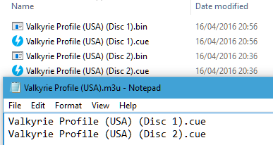
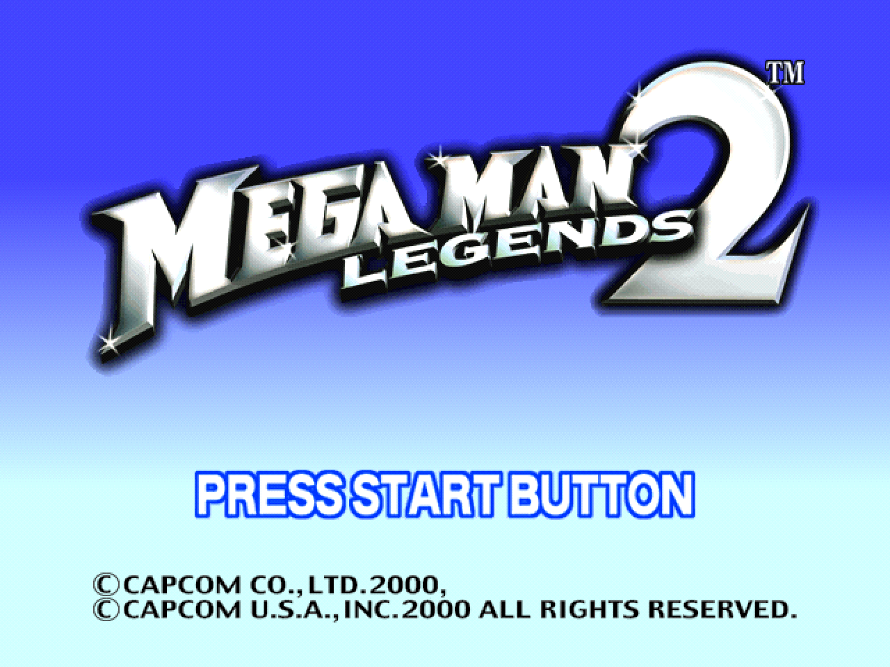
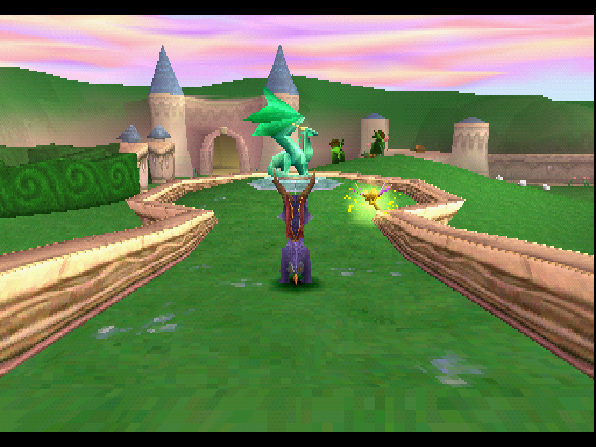
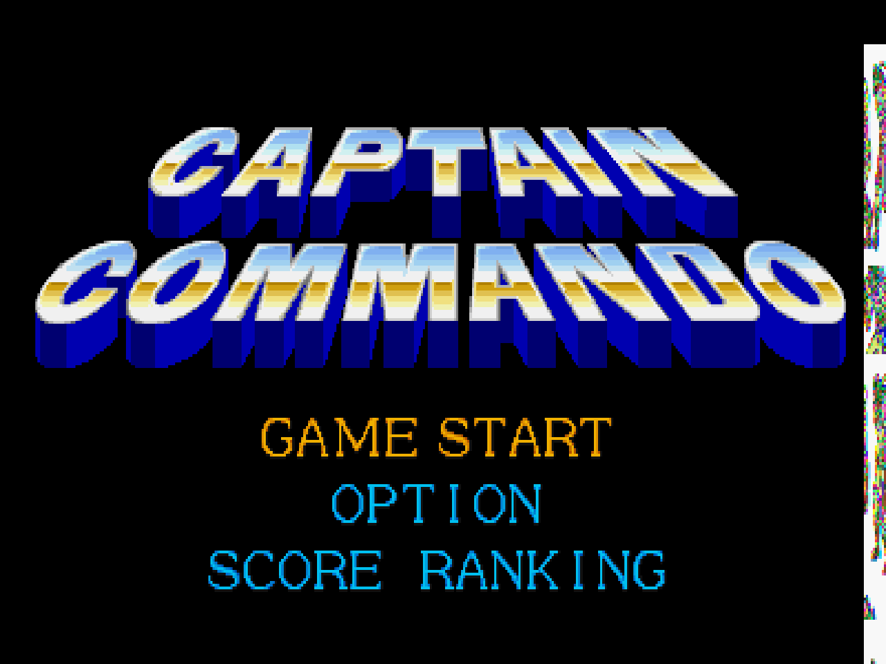
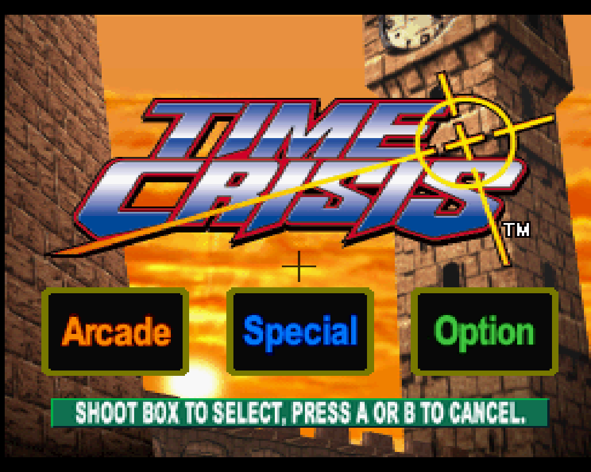
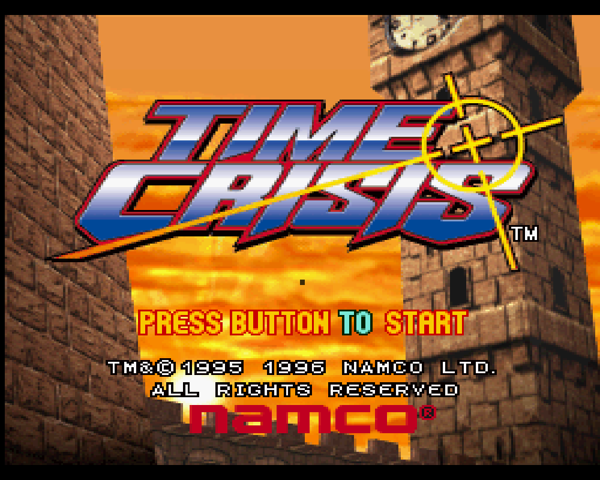
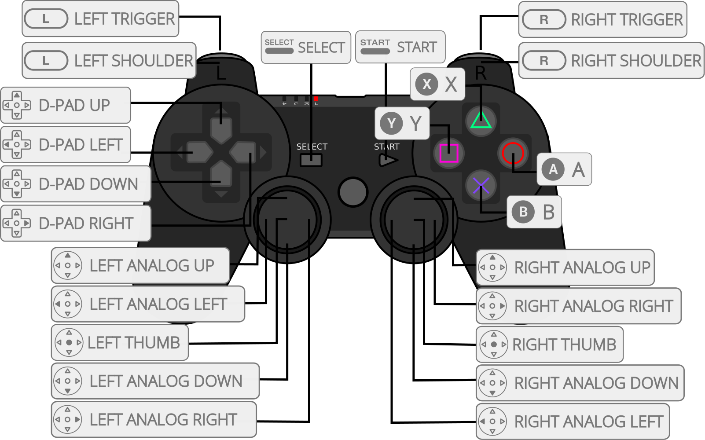
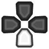

# PlayStation (Beetle PSX)

## Background

Beetle PSX is a port/fork of Mednafen's PSX module to the libretro API. It can be compiled in C++98 mode. Beetle PSX currently runs on Linux, OSX and Windows.

Notable additions in this fork are:

- PBP and CHD file format support, developed by Zapeth;
- Software renderer internal resolution upscaling, implemented by simias;
- PGXP subpixel precision, developed by iCatButler;

Beetle PSX prioritizes accuracy and offers a software renderer that faithfully replicates the original PlayStation experience. However, it lacks hardware rendering capabilities.

For those seeking improved visuals and performance, Beetle PSX HW provides a hardware-accelerated alternative. However, it's important to note that all games experience graphical glitches and rendering issues of varying severity with its OpenGL renderer ([example](https://github.com/libretro/beetle-psx-libretro/issues/900)). Fortunately, Beetle PSX HW offers a more stable alternative – the Vulkan renderer. This choice delivers hardware acceleration with accuracy closer to the software renderer, making it a compelling middle ground.

The Beetle PSX core has been authored by

- [Mednafen Team](https://mednafen.github.io/)

The Beetle PSX core is licensed under

- [GPLv2](https://github.com/libretro/beetle-psx-libretro/blob/master/COPYING)

A summary of the licenses behind RetroArch and its cores can be found [here](../development/licenses.md).

## BIOS

Required or optional firmware files go in the frontend's `system` directory.

|   Filename      | Description                           |              md5sum              |
|:---------------:|:-------------------------------------:|:--------------------------------:|
| scph5500.bin    | PS1 JP BIOS - Required for JP games   | 8dd7d5296a650fac7319bce665a6a53c |
| scph5501.bin    | PS1 US BIOS - Required for US games   | 490f666e1afb15b7362b406ed1cea246 |
| scph5502.bin    | PS1 EU BIOS - Required for EU games   | 32736f17079d0b2b7024407c39bd3050 |

As a replacement for any of the BIOS files mentioned above, it is also possible to use either of these BIOSes:

- `PSXONPSP660.bin` (MD5: c53ca5908936d412331790f4426c6c33)
- `ps1_rom.bin` (MD5: 81bbe60ba7a3d1cea1d48c14cbcc647b)

The `PSXONPSP660.bin` BIOS comes from the PSP, and the `ps1_rom.bin` BIOS comes from the PS3, both are region-free.
For Beetle PSX to recognize either of these BIOSes, you need to enable the "Override BIOS" option.

## Extensions

Content that can be loaded by the Beetle PSX core have the following file extensions:

- .cue
- .toc
- .m3u
- .ccd
- .exe
- .pbp
- .chd

RetroArch database(s) that are associated with the Beetle PSX core:

- [Sony - PlayStation](https://github.com/libretro/libretro-database/blob/master/rdb/Sony%20-%20PlayStation.rdb)

## Features

Frontend-level settings or features that the Beetle PSX core respects.

| Feature           | Supported |
|-------------------|:---------:|
| Restart           | ✔         |
| Screenshots       | ✔         |
| Saves             | ✔         |
| States            | ✔         |
| Rewind            | ✔         |
| Netplay           | ✕         |
| Core Options      | ✔         |
| RetroAchievements | ✔         |
| RetroArch Cheats  | ✔         |
| Native Cheats     | ✕         |
| Controls          | ✔         |
| Remapping         | ✔         |
| Multi-Mouse       | ✔         |
| Rumble            | ✔         |
| Sensors           | ✕         |
| Camera            | ✕         |
| Location          | ✕         |
| Subsystem         | ✕         |
| [Softpatching](../guides/softpatching.md) | ✕         |
| Disk Control      | ✔         |
| Username          | ✕         |
| Language          | ✕         |
| Crop Overscan *   | ✕         |
| LEDs              | ✕         |

\* Overscan cropping available via Core Options instead of frontend settings

### Directories

The Beetle PSX core's library name is 'Beetle PSX'

The Beetle PSX core saves/loads to/from these directories.

**Frontend's Save directory**

- Memory cards

**Frontend's State directory**

| File     | Description |
|:--------:|:-----------:|
| *.state# | State       |

### Geometry and timing

- The Beetle PSX core's core provided FPS is 59.826 for NTSC games and 49.761 for PAL games (non-interlaced rates) and is toggleable to 59.940 for NTSC games and 50.000 for PAL games (interlaced rates) through core options
- The Beetle PSX core's core provided sample rate is 44100 Hz
- The Beetle PSX core's base width is 320
- The Beetle PSX core's base height is 240
- The Beetle PSX core's max width is 700 when the 'Internal GPU resolution' is set to 1x. Raising the resolution past 1x will increase the max width
- The Beetle PSX core's max height is 576 when the 'Internal GPU resolution' is set to 1x. Raising the resolution past 1x will increase the max height
- The Beetle PSX core's core provided aspect ratio is automatically set based on core options

## Loading content

Beetle PSX needs a cue-sheet that points to an image file. A cue sheet, or cue file, is a metadata file which describes how the tracks of a CD or DVD are laid out.

If you have e.g. `foo.bin`, you should create a text file and save it as `foo.cue`. Most PS1 games are single-track, so the cue file contents should look like this:

`foobin.cue`
```
 FILE "foo.bin" BINARY
  TRACK 01 MODE1/2352
   INDEX 01 00:00:00
```

After that, you can load the `foo.cue` file in RetroArch with the Beetle PSX core.

!!! attention
    Certain PS1 games are multi-track, so their .cue files might be more complicated.

### Playing PAL copy protected games

PAL copy protected games need a SBI Subchannel file next to the bin/cue files in order to get past the copy protection.

- Ape Escape (Europe).bin
- Ape Escape (Europe).cue
- **Ape Escape (Europe).sbi**

!!! warning
	For proper PAL game compatibility, the 'Skip BIOS' core option needs to be set to off.

### Multiple-disk games

If foo is a multiple-disk game, you should have .cue files for each one, e.g. `foo (Disc 1).cue`, `foo (Disc 2).cue`, `foo (Disc 3).cue`.

To take advantage of Disc Control feature for disk swapping, an index file (a m3u file) should be made.

Create a text file and save it as `foo.m3u`. Then enter your game's .cue files on it. The m3u file contents should look something like this:

`foo.m3u`
```
foo (Disc 1).cue
foo (Disc 2).cue
foo (Disc 3).cue
```

After that, you can load the `foo.m3u` file in RetroArch with the Beetle PSX core.

Here's a m3u example done with Valkryie Profile



!!! attention
	Adding multi-track games to a RetroArch playlist is recommended. (Manually add an entry a playlist that points to `foo.m3u`)

#### Swapping disks

Disks can be swapped through Quick Menu -> Disc Control in RetroArch.

If not using .m3u files, .cue files must be manually selected via the Load New Disk legacy feature.

If using .m3u files, disks can be swapped by selecting Eject Disk, changing the Current Disk Index to your desired disk, and finally selecting Insert Disk.

### Compressed content

Alternatively to using cue sheets with .bin/.iso files, you can convert your games to .pbp (Playstation Portable update file) or .chd (MAME Compressed Hunks of Data) to reduce file sizes and neaten up your game folder.

#### PBP

A recommended .pbp convert tool is PSX2PSP.

If converting a multiple-disk game, all disks should be added to the same .pbp file, rather than making a .m3u file for them.

Most conversion tools will want a single .bin file for each disk. If your game uses multiple .bin files (tracks) per disk, you will have to mount the cue sheet to a virtual drive and re-burn the images onto a single track before conversion.

For multi-disk PAL copy-protected games, change the sbi file syntax from `[filename].sbi` to `[filename]_[disc_number].sbi`

- Final Fantasy IX (Germany).pbp
- **Final Fantasy IX (Germany)_1.sbi**
- **Final Fantasy IX (Germany)_2.sbi**
- **Final Fantasy IX (Germany)_3.sbi**
- **Final Fantasy IX (Germany)_4.sbi**

!!! attention
    RetroArch does not currently have .pbp database due to variability in users' conversion methods. All .pbp games will have to be added to playlists manually.

#### CHD

To convert content to CHD format, use the chdman tool found inside the latest MAME distribution and point it to a .cue file, like so:

```
chdman createcd --input foo.cue --output foo.chd
```

Note that the tool currently does not integrate .sbi files into the .chd, so these must be placed alongside the resulting .chd file in order to properly play games with LibCrypt protection.

!!! attention
	For multi-disc content, make an .m3u file that lists all the .chd files instead of .cue files. Like the PBP files, content must be added to playlists manually.

## Saves

For game savedata storage, the PSX console used memory cards. The PSX console had two slots for memory cards.

In this doc, the first memory card slot will be referred to as 'Memcard slot 0' and the second slot will be referred to as 'Memcard slot 1'.

For memory card functionality and usage, the Beetle PSX core will either use the Libretro savedata format or the Mednafen savedata format.

<center>

| Libretro savedata format   |  Mednafen savedata format        |
|----------------------------|----------------------------------|
| gamename.srm               |   gamename.slot#.mcr             |

</center>

**By default**, the Beetle PSX core will use Libretro's savedata format for Memcard slot 0 and Mednafen's savedata format for Memcard slot 1.

<center>

| Memcard slot 0 | Memcard slot 1 |
|----------------|----------------|
| gamename.srm   | gamename.1.mcr |

</center>

!!! attention
    Memory card behavior can be controlled with the following [core options](#core-options) (Memcard 0 method, Enable memory card 1, Shared memcards).

**By default**, the filenames of the Memcard savedata will match the loaded cue or m3u or pbp filename, like this:

- Loaded content: Breath of Fire III (USA).cue

- **Memcard slot 0: Breath of Fire III (USA).srm**

- **Memcard slot 1: Breath of Fire III (USA).1.mcr**

or

- Loaded content: Final Fantasy VII (USA).m3u

- **Memcard slot 0: Final Fantasy VII (USA).srm**

- **Memcard slot 1: Final Fantasy VII (USA).1.mcr**

or

- Loaded content: Wild Arms 2 (USA).pbp

- **Memcard slot 0: `Wild Arms 2 (USA).srm**

- **Memcard slot 1: `Wild Arms 2 (USA).1.mcr**

!!! attention
	To import your old memory cards from other emulators, you need to rename them to either the Libretro savedata format or the Mednafen savedata format. The Libretro (.srm) savedata format, when used with Beetle PSX, is internally identical to the Mednafen PSX (.mcr) savedata format, and can be converted between one another via renaming.

!!! warning
	Keep in mind that save states also include the state of the memory card; carelessly loading an old save state will **OVEWRITE** the memory card, potentially resulting in lost saved games.	**You can set the 'Don't overwrite SaveRAM on loading savestate' option in RetroArch's Saving settings to On to prevent this.**

## Core options

The Beetle PSX core has the following options that can be tweaked from your frontend's core options menu or manually changed via core configuration files. Options are listed below in the following format:

``Option Name [option_key] (setting1/setting2/...)``

To manually change an option, search for that option's key in the core configuration file you want to edit and set it to your desired setting value, enclosed in quotations. For example, if you had set the Internal Color Depth to 32bpp and wanted to revert it to 16bpp, you would change ``beetle_psx_depth = "32bpp"`` to ``beetle_psx_depth = "16bpp(native)"``. Manually editing core configuration files is typically unnecessary unless your frontend does not have a method for toggling options.

The default setting for each option will be highlighted in bold. Settings with (Restart) means that core has to be shut down for the new setting to be applied on next launch.

- **Internal GPU Resolution** [beetle_psx_internal_resolution] (**1x(native)**/2x/4x/8x/16x)

	Selects internal resolution multiplier.

	Resolutions higher than 1x(native) improve the fidelity of 3D models at the expense of increased performance requirements. 2D elements are generally unaffected by this setting from the core's perspective.

	??? note "*Internal GPU Resolution - 1x*"
	    

	??? note "*Internal GPU Resolution - 2x*"
	    

- **Dithering Pattern** [beetle_psx_dither_mode] (**1x(native)**/internal resolution/disabled)

	Select dithering pattern.

	Dithering is used by the original PSX hardware to combat the color banding visible due to 16bpp color depth.

	'1x(native)' emulates original hardware but can look grainy at higher internal resolutions.

	'internal resolution' reduces graininess by allowing for finer dithering at higher Internal GPU Resolutions, but has limited effectiveness in combating color banding if the Internal GPU Resolution is set too high. (Note in the examples below that the 'internal resolution' option is less grainy but has more visible banding than '1x(native)' at 4x Internal GPU Resolution)

	'disabled' is for users who otherwise wish to turn off dithering regardless of color banding.

	??? note "*Dithering Pattern - 1x Native*"
	    

	??? note "*Dithering Pattern - Internal Resolution*"
	    

	??? note "*Dithering Pattern - Disabled*"
	    

- **PGXP Operation Mode** [beetle_psx_pgxp_mode] (**disabled**/memory only/memory + CPU)

	Enabling the Parallel/Precision Geometry Transform Pipeline (PGXP) allows polygons to be rendered with subpixel precision, eliminating or otherwise diminishing the polygon jitter/wobble visible on original PSX hardware. This distortion results from original hardware using fixed point mathematics when rendering 3D models, thus rounding polygon vertices to the nearest integer pixel.

	'disabled' emulates original hardware behavior.

	'memory only' mode enables subpixel precision at the cost of increased performance requirements with only minor compatibility issues. 'memory + CPU' mode can further reduce jitter but is highly demanding and is known to cause geometry errors. 'memory only' is recommended for best compatibility.

	[https://www.youtube.com/watch?v=EYCpd_1lPUc](https://www.youtube.com/watch?v=EYCpd_1lPUc)

- **Display Internal FPS** [beetle_psx_display_internal_fps] (**disabled**/enabled)

	Displays the frame rate that the emulated PSX is drawing at. Requires onscreen notifications to be enabled in the libretro frontend. Reported values may be inaccurate.

	??? note "*Display internal FPS - On*"
	    

- **Line-to-Quad Hack** [beetle_psx_line_render] (**default**/aggressive/disabled)

	Certain games employ a special technique for drawing horizontal lines, which involves stretching single-pixel-high triangles across the screen in a manner that causes the PSX hardware to rasterise them as a row of pixels. Examples include Doom/Hexen, and the water effects in Soul Blade. When running such games with an Internal GPU Resolution higher than native, these triangles no longer resolve as a line, causing gaps to appear in the output image.

	Setting 'Line-to-Quad Hack' to 'Default' solves this issue by detecting small triangles and converting them as required.

	The 'Aggressive' option will likely introduce visual glitches due to false positives, but is needed for correct rendering of some 'difficult' titles (e.g. Dark Forces, Duke Nukem).

- **Frame Duping (Speedup)** [beetle_psx_frame_duping] (**disabled**/enabled)

	When enabled, provides a small performance increase by redrawing/reusing the last rendered frame (instead of presenting a new one) if the content of the current frame is unchanged based on the internal fps heuristic. May cause inaccurate behavior or lost animation frames, so it is not recommended to use this unless necessary.

- **CPU Dynarec** [beetle_psx_cpu_dynarec] (**disabled**/execute/execute_once/run_interpreter)

	Dynamically recompile CPU instructions to native instructions. Much faster than interpreter, but CPU timing is less accurate, and may have bugs.

- **Dynarec Code Invalidation** [beetle_psx_dynarec_invalidate] (**full**/dma)

	Some games require Full invalidation, some require DMA Only. This option has no effect when CPU Dynarec is not enabled.

- **Dynarec DMA/GPU Event Cycles** [beetle_psx_dynarec_eventcycles] (**128**/256/384/512/640/768/896/1024)

	Max cycles run by CPU before a GPU or DMA Update is checked, higher number will be faster, has much less impact on beetle interpreter than dynarec. Leave at 128 for default Beetle interpreter behavior when CPU Dynarec is not enabled.

- **CPU Frequency Scaling (Overclock)** [beetle_psx_cpu_freq_scale] (50% to 750% in increments of 10%. Default: **100%(native)**)

	Enable overclocking (or underclocking) of the emulated PSX's CPU. The default frequency of the MIPS R3000A-compatible 32-bit RISC CPU is 33.8688 MHz; running at higher frequencies can eliminate slowdown and improve frame rates in certain games at the expense of increased performance requirements.

	Note that some games have an internal frame rate limiter and may not benefit from overclocking. It is generally not recommended to adjust this setting as it causes many games or portions of them to run at unintended speeds. This can lead to audio and video desynchronization, among other issues.

	Leave at default for most games.

- **GTE Overclock** [beetle_psx_gte_overclock] (**disabled**/enabled)

	When enabled, reduces the latency of operations involving the emulated PSX's Geometry Transform Engine (CPU coprocessor used for calculations related to 3D projection - i.e. all 3D graphics) to 1 cycle per instruction and additionally eliminates all memory access or cache fetch latency. For games that make heavy use of the GTE, this can greatly improve frame rate (and frame time) stability at the expense of increased performance requirements.

	Currently unstable -- leave off if unsure.

- **GPU Rasterizer Overclock** [beetle_psx_gpu_overclock] (**1x(native)**/2x/4x/8x/16x/32x)

	Enables overclocking of the 2D rasterizer contained within the emulated PSX's GPU. Does not improve 3D rendering, and in general has little effect.

- **Skip BIOS** [beetle_psx_skip_bios] (**disabled**/enabled)

	When enabled, skips the PSX BIOS animation normally displayed with starting content.

	**Enabling this option will cause compatibility issues with a small minority of games (Saga Frontier, PAL copy protected games, etc).**

	??? note "*Skip BIOS - Off*"
	    

- **Core-Reported FPS Timing** [beetle_psx_core_timing_fps] (**force_progressive**/force_interlaced/auto_toggle)

	Sets FPS timing that the core will report to the frontend. Automatic toggling will allow the core to switch between reporting progressive and interlaced rates, but may cause frontend video/audio driver reinits. Progressive timings are 59.826 for NTSC content and 49.761 for PAL content, and interlaced timings are 59.940 for NTSC content and 50.000 for PAL content.

- **Core Aspect Ratio** [beetle_psx_aspect_ratio] (**corrected**/uncorrected/4:3)

	Set core provided aspect ratio. This setting is ignored when the Widescreen Mode Hack or Display Full VRAM options are enabled. "4:3" forces the core aspect ratio to 4:3 without taking horizontal overscan cropping or visible scanlines into account. The "4:3" setting should not be used and is only provided as a legacy feature for users desiring old incorrect behavior from the core.

- **Widescreen Mode Hack** [beetle_psx_widescreen_hack] (**disabled**/enabled)

	Forces content to be rendered with an aspect ratio of 16:9. Produces best results with fully 3D games. Can cause graphical glitches or alignment/stretching issues in games that mix 3D and 2D elements. Leave off for most games.

	??? note "*Widescreen mode hack - Off*"
	    

	??? note "*Widescreen mode hack - On*"
	    

- **Crop Horizontal Overscan** [beetle_psx_crop_overscan] (**enabled**/disabled)

	By default, Beetle PSX includes horizontal padding (black bars or 'pillarboxes' on either side of the screen) to emulate the same black bars generated in analog video output by real PSX hardware. This horizontal padding can contain garbage pixels that are generated when the game's width mode is smaller than the display area width in the emulated GPU registers. Enabling 'Crop Horizontal Overscan' will remove this potentially glitchy horizontal overscan region.

	Not all games will benefit from enabling this setting as shown in the examples below.

	??? note "*Crop Overscan - Off (Game with Garbage Pixels)*"
	    

	??? note "*Crop Overscan - On (Game with Garbage Pixels)*"
	    

	??? note "*Crop Overscan - Off (Game with No Issues)*"
	    

	??? note "*Crop Overscan - On (Game with No Issues)*"
	    

	This option does not affect vertical overscan. Vertical overscan can be cropped using the Initial/Last Scanline core options.

- **Additional Cropping** [beetle_psx_image_crop] (**disabled**/1px/2px/3px/4px/5px/6px/7px/8px)

	When 'Crop Horizontal Overscan' is enabled, this option further reduces the width of the cropped image by the specified number of pixels.

	Note: This can have unintended consequences. While the absolute width is reduced, the resultant video is still scaled to the currently set aspect ratio. Enabling 'Additional Cropping' may therefore cause horizontal stretching.

- **Offset Cropped Image** [beetle_psx_image_offset] (**disabled**/-4px/-3px/-2px/-1px/+1px/+2px/+3px/+4px)

	When 'Crop Horizontal Overscan' is enabled, allows the resultant cropped image to be offset horizontally to the right (positive) or left (negative) by the specified number of pixels. May be used to correct alignment issues.

- **Initial Scanline - NTSC** [beetle_psx_initial_scanline] (0 to 40 in increments of 1. Default: **0**)

	Selects the first displayed scanline when running NTSC content. Setting a value greater than 0 will reduce the height of output images by cropping pixels from the topmost edge. May be used to counteract letterboxing built in to some games.

- **Last Scanline - NTSC** [beetle_psx_last_scanline] (210 to 239 in increments of 1. Default: **239**)

	Selects the last displayed scanline when running NTSC content. Setting a value less than 239 will reduce the height of output images by cropping pixels from the bottommost edge. May be used to counteract letterboxing built in to some games.

- **Initial Scanline - PAL** [beetle_psx_initial_scanline_pal] (0 to 40 in increments of 1. Default: **0**)

	Selects the first displayed scanline when running PAL content. Setting a value greater than 0 will reduce the height of output images by cropping pixels from the topmost edge. May be used to counteract letterboxing built in to some games.

- **Last Scanline - PAL** [beetle_psx_last_scanline_pal] (230 to 287 in increments of 1. Default: **287**)

	Selects the last displayed scanline when running PAL content. Setting a value less than 287 will reduce the height of output images by cropping pixels from the bottommost edge. May be used to counteract letterboxing built in to some games.

- **CD Access Method (Restart)** [beetle_psx_cd_access_method] (**sync**/async/precache)

	Selects method used to read data from content disc images.

	'sync' emulates original hardware.

	'async' can alleviate stuttering on devices with slow storage.

	'precache' loads the entire disc image into memory when starting content, incurring a small startup delay. This can improve in-game loading times and eliminate stutters due to emulated CD access, but may cause issues on systems with low memory.

- **CD Loading Speed** [beetle_psx_cd_fastload] (**2x(native)**/4x/6x/8x/10x/12x/14x)

	Selects disk access speed multiplier.

	This speedhack can greatly reduce loading times at speeds higher than native but is known to introduce texture corruption errors, timing glitches, or loading screen softlocks in many titles. Some games will not work at all if loading speed is not set to native (e.g. Castlevania: Symphony of the Night).

	**Reduce multiplier value if experiencing loading issues, freezes, etc.**

- **Memory Card 0 Method (Restart)** [beetle_psx_use_mednafen_memcard0_method] (**libretro**/mednafen)

	Choose the savedata format used for Memory Card 0. See the [Saves section](#saves) above for an explanation regarding the libretro and mednafen formats. libretro is recommended, but mednafen may be used for compatibility with the standalone version of Mednafen. The libretro (.srm) and Mednafen (.mcr) formats are internally identical when used with Beetle PSX.

	Note: This option must be set to 'mednafen' if the Shared Memcards option is enabled.

- **Enable Memory Card 1 (Restart)** [beetle_psx_enable_memcard1] (**enabled**/disabled)

	Selects whether to emulate a second memory card in Slot 1. When disabled, games can only access the memory card in Slot 0.

	Note: Some games require this option to be disabled for correct operation (e.g. Codename Tenka).

- **Shared Memory Cards (Restart)** [beetle_psx_shared_memory_cards] (**disabled**/enabled)

	When enabled, games will save and load using the same memory card files. Note: The "Memcard 0 Method" option must be set to 'mednafen' for this option to function properly.

	When disabled, separate memory card files will be generated for each title.

	This option is useful for games in series such as Suikoden or Arc the Lad that check for save data from previous titles.

<center>

| Memcard slot 0                     | Memcard slot 1                     |
|------------------------------------|------------------------------------|
| mednafen_psx_libretro_shared.0.mcr | mednafen_psx_libretro_shared.1.mcr |

</center>

- **Analog Self-Calibration** [beetle_psx_analog_calibration] (**disabled**/enabled)

	When enabled, monitors the max values reached by the input, using it as a calibration heuristic which then scales the analog coordinates sent to the emulator accordingly. For best results, rotate the sticks at max amplitude for the algorithm to get a good estimate of the scaling factor, otherwise it will adjust while playing.

	While modern analog sticks have circular logical ranges, older analog sticks such as those on the DualShock have logical ranges closer to squares and can report larger values at the intercardinal directions than modern analog sticks can. Games that expect these larger values will have issues controlling with modern analog sticks, which this option can solve by scaling modern analog stick values up.

- **Enable DualShock Analog Mode Toggle** [beetle_psx_analog_toggle] (**disabled**/enabled)

	When the input device type is set to DualShock, this option determines whether or not the Analog Button on that device can be toggled.

	When this option is disabled, the DualShock input device will be locked in Analog Mode where the analog sticks are on.

	When this option is enabled, the DualShock input device can be toggled between Digital Mode (analog sticks off) and Analog Mode (analog sticks on) much like real hardware by pressing and holding START+SELECT+L1+L2+R1+R2 for one second in lieu of a dedicated Analog Button.

	Note: Some games may not respond to input when the DualShock is in Analog Mode. Either enable Analog Button Toggle and toggle the DualShock to Digital Mode or change your input device type to PlayStation Controller.

- **Port 1: Multitap Enable** [beetle_psx_enable_multitap_port1] (**disabled**/enabled)

	Enables/Disables multitap functionality on port 1.

- **Port 2: Multitap Enable** [beetle_psx_enable_multitap_port2] (**disabled**/enabled)

	Enables/Disables multitap functionality on port 2.

- **Gun Input Mode** [beetle_psx_gun_input_mode] (**lightgun**/touchscreen)

	When device type is set to 'Guncon / G-Con 45' or 'Justifier', specify whether to use a mouse-controlled 'Light Gun' or 'Touchscreen' input.

- **Gun Cursor** [beetle_psx_gun_cursor] (**cross**/dot/off)

	Selects the gun cursor to be displayed on screen while using the the 'Guncon / G-Con 45' and 'Justifier' input device types. When disabled, cross hairs are always hidden.

	??? note "*Gun Cursor - Cross*"
	    

	??? note "*Gun Cursor - Dot*"
	    

	??? note "*Gun Cursor - Off*"
	    

- **Mouse Sensitivity** [beetle_psx_mouse_sensitivity] (5% to 200% in increments of 5%. Default: **100%**)

	Configure the response of the 'Mouse' input device type.

- **NegCon Twist Response** [beetle_psx_negcon_response] (**linear**/quadratic/cubic)

	Specifies the analog response when using a RetroPad left analog stick to simulate the 'twist' action of emulated [neGcon Controllers](https://en.wikipedia.org/wiki/NeGcon).

	'linear': Analog stick displacement is mapped linearly to negCon rotation angle.

	'quadratic': Analog stick displacement is mapped quadratically to negCon rotation angle. This allows for greater precision when making small movements with the analog stick.

	'cubic': Analog stick displacement is mapped cubically to negCon rotation angle. This allows for even greater precision when making small movements with the analog stick, but 'exaggerates' larger movements.

	!!! attention
		A linear response is not recommended when using standard gamepad devices. The negCon 'twist' mechanism is substantially different from conventional analog sticks; linear mapping over-amplifies small displacements of the stick, impairing fine control. A linear response is only appropriate when using racing wheel peripherals.

		In most cases, the 'quadratic' option should be selected. This provides effective compensation for the physical differences between real/emulated hardware and is the closest approximation of real hardware, enabling smooth/precise analog input.

- **NegCon Twist Deadzone** [beetle_psx_negcon_deadzone] (**0%**/5%/10%/15%/20%/25%/30%)

	Sets the deadzone of the RetroPad left analog stick when simulating the 'twist' action of emulated [neGcon Controllers](https://en.wikipedia.org/wiki/NeGcon). Used to eliminate drift/unwanted input.

	!!! attention
		Most (all?) negCon compatible titles provide in-game options for setting a 'twist' deadzone value. To avoid loss of precision, the in-game deadzone should *always* be set to zero. Any analog stick drift should instead be accounted for by configuring the 'NegCon Twist Deadzone' core option. This is particularly important when 'NegCon Twist Response' is set to 'quadratic' or 'cubic'.

		Xbox gamepads typically require a deadzone of 15-20%. Many Android-compatible bluetooth gamepads have an internal 'hardware' deadzone, allowing the deadzone value here to be set to 0%.

		For convenience, it is recommended to make use of the 'Options → Analog Setting 1P' menu of [Gran Turismo](https://en.wikipedia.org/wiki/Gran_Turismo_(video_game)) when calibrating the 'NegCon Twist Deadzone'. This provides a clear and precise representation of 'real' controller input values.

## User 1 - 8 device types

The Beetle PSX core supports the following device type(s) in the controls menu, bolded device types are the default for the specified user(s):

- None - Input disabled.
- [**PlayStation Controller**](https://en.wikipedia.org/wiki/PlayStation_Controller) - Joypad - PlayStation Controller (SCPH-1080)
- [DualShock](https://en.wikipedia.org/wiki/DualShock) - Joypad - DualShock (SCPH-1200)
- [Analog Controller](https://en.wikipedia.org/wiki/Dual_Analog_Controller) - Joypad - PlayStation Dual Analog Controller(SCPH-1180)
- [Analog Joystick](https://en.wikipedia.org/wiki/PlayStation_Analog_Joystick) - Joypad - PlayStation Analog Joystick (SCPH-1110)
- [Guncon / G-Con 45](https://en.wikipedia.org/wiki/GunCon) - Lightgun - Namco Gun Controller (SLEH-00007)
- [Justifier](https://en.wikipedia.org/wiki/Konami_Justifier) - Lightgun -  Konami Justifier lightgun peripheral (SLEH-00005, SLUH-00017)
- [Mouse](https://en.wikipedia.org/wiki/PlayStation_Mouse) - Mouse - PlayStation Mouse (SCPH-1090, SCPH-1030)
- [neGcon](https://en.wikipedia.org/wiki/NeGcon) - Joypad - Namco third party controller

## Rumble support

Rumble only works in the Beetle PSX core when

- The content being ran has rumble support.
- The frontend being used has rumble support.
- The joypad device being used has rumble support.
- The corresponding user's device type is set to **DualShock**

## Multitap support

Activating multitap support in compatible games can be configured by the ['Port 1: Multitap enable' and 'Port 2: Multitap enable' core options](#core-options).

## Joypad



| User 1 - 8 input descriptors  | RetroPad Inputs                              | PlayStation Controller Inputs                  | DualShock Inputs                                | Analog Controller Inputs                        | Analog Joystick Inputs                         | neGcon Inputs                   |
|-------------------------------|----------------------------------------------|------------------------------------------------|-------------------------------------------------|-------------------------------------------------|------------------------------------------------|---------------------------------|
| Cross                         |              |       |        |        |       | Analog button I                 |
| Square                        |              |      |       |       |      | Analog button II                |
| Select                        |         |      |       |       |      |                                 |
| Start                         |          |       |        |        |       | Start                           |
| D-Pad Up                      |        |     |      |      |     | D-Pad Up                        |
| D-Pad Down                    |      |   |    |    |   | D-Pad Down                      |
| D-Pad Left                    |      |   |    |    |   | D-Pad Left                      |
| D-Pad Right                   |     |  |   |   |  | D-Pad Right                     |
| Circle                        |              |      |       |       |      | A                               |
| Triangle                      |              |    |     |     |    | B                               |
| L1                            |             |          |           |           |          | Left shoulder button (analog)   |
| R1                            |             |          |           |           |          | Right shoulder button (digital) |
| L2                            |             |          |           |           |          | Analog button II                |
| R2                            |             |          |           |           |          | Analog button I                 |
| L3                            |             |                                                  |           |                                                   |                                                |                                 |
| R3                            |             |                                                  |           |                                                   |                                                |                                 |
| Left Analog X                 |  X  |                                                  |   |   | Left Joystick X                                | Twist                           |
| Left Analog Y                 |  Y  |                                                  |   |   | Left Joystick Y                                |                                 |
| Right Analog X                |  X |                                                  |  |  | Right Joystick X                               |                                 |
| Right Analog Y                |  Y |                                                  |  |  | Right Joystick Y                               |                                 |

## Mouse

| RetroMouse Inputs                                   | Mouse Inputs       |
|-----------------------------------------------------|--------------------|
|  Mouse Cursor | Mouse Cursor       |
|  Mouse 1       | Mouse Left Button  |
|  Mouse 2      | Mouse Right Button |

## Lightgun

| RetroLightgun Inputs                                 | Guncon / G-Con 45 Inputs    | Justifier Inputs    |
|------------------------------------------------------|-----------------------------|---------------------|
|  Gun Crosshair | Guncon / G-Con 45 Crosshair | Justifier Crosshair |
| Gun Trigger                                          | Guncon / G-Con 45 Trigger   | Justifier Trigger   |
| Gun Reload                                           | Guncon / G-Con 45 Reload    | Justifier Reload    |
| Gun Aux A                                            | Guncon / G-Con 45 A         | Justifier Aux       |
| Gun Aux B                                            | Guncon / G-Con 45 B         |                     |
| Gun Start                                            |                             | Justifier Start     |

## Compatibility

A list of known emulation bugs can be found here [https://forum.fobby.net/index.php?t=msg&th=1114&start=0&](https://forum.fobby.net/index.php?t=msg&th=1114&start=0&)

## External Links

- [Official Mednafen Website](https://mednafen.github.io/)
- [Official Mednafen Downloads](https://mednafen.github.io/releases/)
- [Beetle PSX Libretro Core info file](https://github.com/libretro/libretro-super/blob/master/dist/info/mednafen_psx_libretro.info)
- [Beetle PSX Libretro Github Repository](https://github.com/libretro/beetle-psx-libretro)
- [Report Beetle PSX Core Issues Here](https://github.com/libretro/beetle-psx-libretro/issues)
- [Gameplay Videos](https://www.youtube.com/playlist?list=PLRbgg4gk_0IeQOnw9bnjwthht0iUvs2wk)

## Libretro PSX cores

- [PlayStation (Beetle PSX HW)](beetle_psx_hw.md)
- [PlayStation (PCSX ReARMed)](pcsx_rearmed.md)
