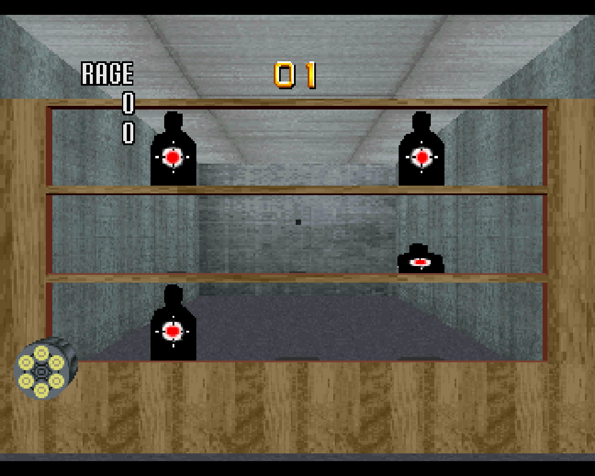
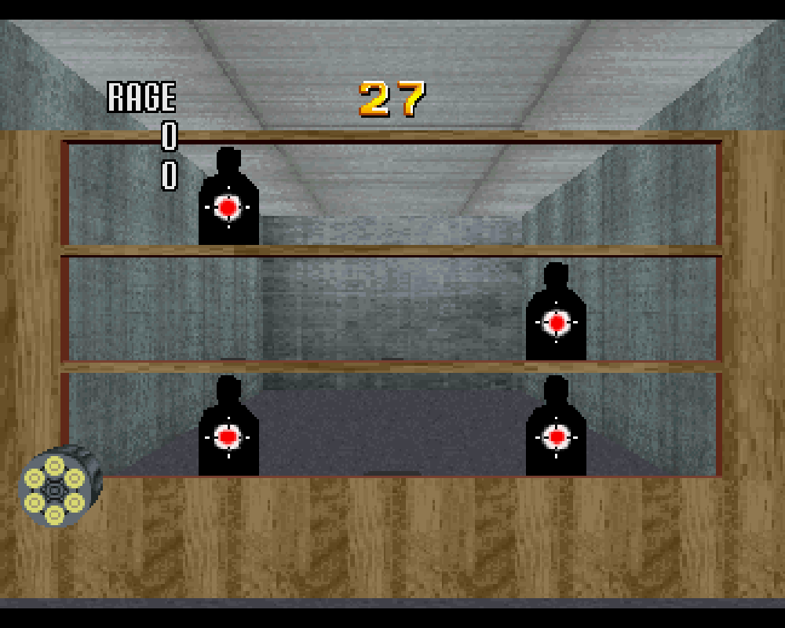
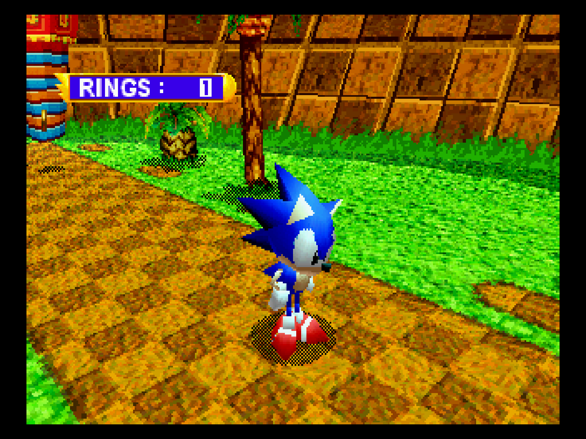
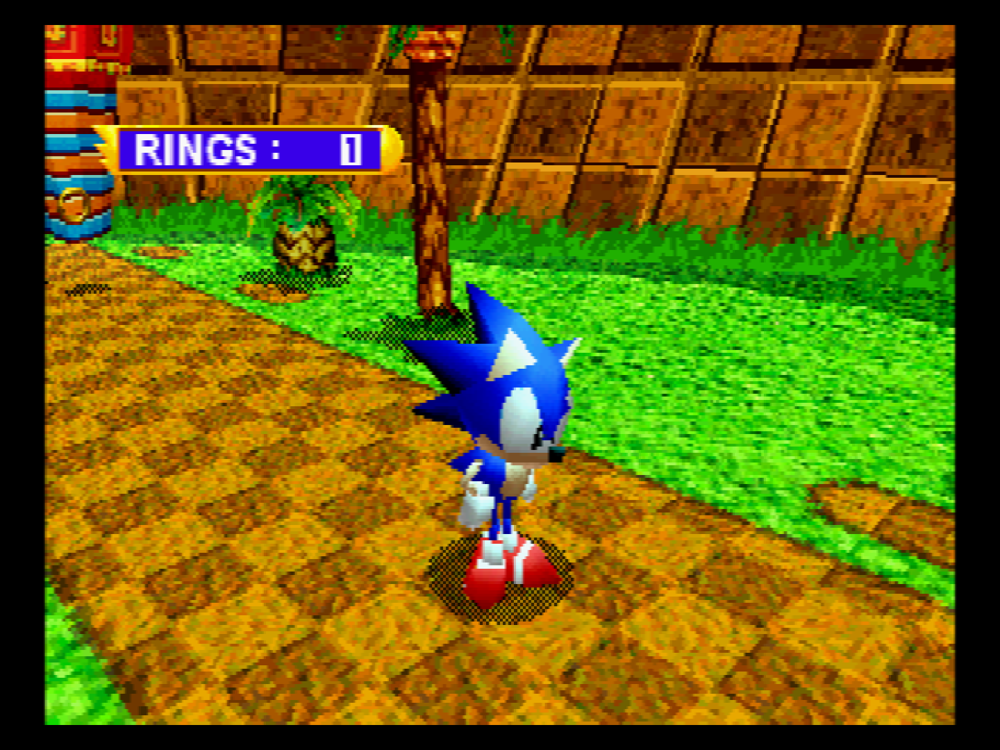

# Sega - Saturn (Beetle Saturn)

<iframe width="560" height="315" src="https://www.youtube-nocookie.com/embed/QTIRtZ9q5PM" title="YouTube video player" frameborder="0" allow="accelerometer; autoplay; clipboard-write; encrypted-media; gyroscope; picture-in-picture" allowfullscreen></iframe>

## Background

This is fork of Mednafen Saturn. It has been ported to the libretro API. It currently runs on Linux, OSX and Windows.

The Beetle Saturn core has been authored by

- [Mednafen Team](https://mednafen.github.io/)

The Beetle Saturn core is licensed under

- [GPLv2](https://github.com/libretro/beetle-saturn-libretro/blob/master/COPYING)

A summary of the licenses behind RetroArch and its cores can be found [here](../development/licenses.md).

## Extensions

Content that can be loaded by the Beetle Saturn core have the following file extensions:

- .cue
- .toc
- .m3u
- .ccd
- .chd

RetroArch database(s) that are associated with the Beetle Saturn core:

- [Sega - Saturn](https://github.com/libretro/libretro-database/blob/master/rdb/Sega%20-%20Saturn.rdb)

## BIOS

Required or optional firmware files go in the frontend's system directory.

!!! attention
	The King of Fighters '95 and Ultraman: Hikari no Kyojin Densetsu ROM Cartridges can be manually selected with the ['Cartridge' core option](#core-options).

|   Filename       |    Description                                                             |              md5sum              |
|:----------------:|:--------------------------------------------------------------------------:|:--------------------------------:|
| sega_101.bin     | Saturn JP BIOS - Required for JP games                                     | 85ec9ca47d8f6807718151cbcca8b964 |
| mpr-17933.bin    | Saturn US.mdEU BIOS - Required for US/EU games                               | 3240872c70984b6cbfda1586cab68dbe |
| mpr-18811-mx.ic1 | The King of Fighters '95 ROM Cartridge - Required for this game            | 255113ba943c92a54facd25a10fd780c |
| mpr-19367-mx.ic1 | Ultraman: Hikari no Kyojin Densetsu ROM Cartridge - Required for this game | 1cd19988d1d72a3e7caa0b73234c96b4 |

## Features

Frontend-level settings or features that the Beetle Saturn core respects.

| Feature           | Supported |
|-------------------|:---------:|
| Restart           | ✔         |
| Screenshots       | ✔         |
| Saves             | ✔         |
| States            | ✔         |
| Rewind            | ✔         |
| Netplay           | ✔         |
| Core Options      | ✔         |
| RetroAchievements | ✔         |
| RetroArch Cheats  | -         |
| Native Cheats     | ✕         |
| Controls          | ✔         |
| Remapping         | ✔         |
| Multi-Mouse       | ✔         |
| Rumble            | ✕         |
| Sensors           | ✕         |
| Camera            | ✕         |
| Location          | ✕         |
| Subsystem         | ✕         |
| [Softpatching](../guides/softpatching.md) | ✕         |
| Disk Control      | ✕         |
| Username          | ✕         |
| Language          | ✕         |
| Crop Overscan     | ✕         |
| LEDs              | ✕         |

## Directories

The Beetle Saturn core's library name is 'Beetle Saturn'

The Beetle Saturn core saves/loads to/from these directories.

**Frontend's Save directory**

| File   | Description                          |
|:------:|:------------------------------------:|
| *.bcr  | External cartridge backup save       |
| *.bkr  | Internal save                        |
| *.smpc | SMPC's emulated Real-Time Clock save |

**Frontend's State directory**

| File     | Description |
|:--------:|:-----------:|
| *.state# | State       |

## Geometry and timing

- The Beetle Saturn core's core provided FPS is 59.83 for NTSC games and 49.92 for PAL games
- The Beetle Saturn core's core provided sample rate is 44100 Hz
- The Beetle Saturn core's base width is 320
- The Beetle Saturn core's base height is 240
- The Beetle Saturn core's max width is 704
- The Beetle Saturn core's max height is 576
- The Beetle Saturn core's core provided aspect ratio is 4/3

## Loading Saturn Sega content

Beetle Saturn needs a cue-sheet that points to an image file. A cue sheet, or cue file, is a metadata file which describes how the tracks of a CD or DVD are laid out.

If you have e.g. `foo.bin`, you should create a text file and save it as `foo.cue`. If you're playing a single-track Saturn game, then the cue file contents should look like this:

`foobin.cue`
```
 FILE "foo.bin" BINARY
  TRACK 01 MODE1/2352
   INDEX 01 00:00:00
```

After that, you can load the `foo.cue` file in RetroArch with the Beetle Saturn core.

!!! attention
    Certain Saturn games are multi-track, so their .cue files might be more complicated.

## Multiple-disk games

If foo is a multiple-disk game, you should have .cue files for each one, e.g. `foo (Disc 1).cue`, `foo (Disc 2).cue`, `foo (Disc 3).cue`.

To take advantage of Beetle Saturn's Disk Control feature for disk swapping, an index file (a m3u file) should be made.

Create a text file and save it as `foo.m3u`. Then enter your game's .cue files on it. The m3u file contents should look something like this:

`foo.m3u`
```
foo (Disc 1).cue
foo (Disc 2).cue
foo (Disc 3).cue
```

## Swapping disks

Swapping disks follows this procedure

1. Open tray (Disk Cycle Tray Status)

2. Change the Disk Index to the disk you want to swap to.

3. Close tray (Disk Cycle Tray Status)

4. Return to the game and wait a few seconds to let it take effect

After that, you can load the `foo.m3u` file in RetroArch with the Beetle Saturn core.

## Core options

The Beetle Saturn core has the following option(s) that can be tweaked from the core options menu. The default setting is bolded.

Settings with (Restart) means that core has to be closed for the new setting to be applied on next launch.

- **System Region** [beetle_saturn_region] (**Auto Detect**|Japan|North America|Europe|South Korea|Asia (NTSC)|Asia (PAL)|Brazil|Latin America)

	Choose which region the system is from.

- **Cartridge** [beetle_saturn_cart] (**Auto Detect**|None|Backup Memory|Extended RAM (1MB)|Extended RAM (4MB)|The King of Fighters '95|Ultraman: Hikari no Kyojin Densetsu)

	A list of games that require a cartridge can be found [here](https://www.satakore.com/cartridge.php).

- **6Player Adaptor on Port 1** [beetle_saturn_multitap_port1] (**disabled**|enabled)

	Enable [multitap](https://segaretro.org/Saturn_6_Player_Adaptor) on Saturn port 1.

- **6Player Adaptor on Port 2** [beetle_saturn_multitap_port2] (**disabled**|enabled)

	Enable [multitap](https://segaretro.org/Saturn_6_Player_Adaptor) on Saturn port 2.

- **Analog Stick Deadzone** [beetle_saturn_analog_stick_deadzone] (**15%**|20%|25%|30%|0%|5%|10%)

	Configure the '3D Control Pad' Device Type's analog deadzone.

- **Trigger Deadzone** [beetle_saturn_trigger_deadzone] (**15%**|20%|25%|30%|0%|5%|10%)

	Configure the '3D Control Pad' Device Type's trigger deadzone.

- **Mouse Sensitivity** [beetle_saturn_mouse_sensitivity] (5% to 200% in increments of 5%. **100% is default**)

	Configure the 'Mouse' device type's sensitivity.

- **Gun Crosshair** [beetle_saturn_virtuagun_crosshair] (**Cross**|Dot|Off)

	Choose the crosshair for the 'Stunner' and 'Virtua Gun' device types. Setting it to Off disables the crosshair.

??? note "Gun - Crosshair - Cross"
	

??? note "Gun - Crosshair - Dot"
	

??? note "Gun - Crosshair - Off"
	

- **CD Image Cache (restart)** [beetle_saturn_cdimagecache] (**disabled**|enabled)

	Loads the complete image in memory at startup. Can potentially decrease loading times at the cost of increased startup time.
	Requires a restart in order for a change to take effect.

- **Mid-frame Input Synchronization** [beetle_saturn_midsync] (**disabled**|enabled)

	Mid-frame synchronization can reduce input latency, but it will increase CPU requirements.

- **Automatically set RTC on game load** [beetle_saturn_autortc] (**enabled**|disabled)

	Automatically set the SMPC's emulated Real-Time Clock to the host system's current time and date upon game load.

- **BIOS language** [beetle_saturn_autortc_lang] (**english**|german|french|spanish|italian|japanese)

	Self explanatory. Also affects language used in some games (e.g. the European release of "Panzer Dragoon").

- **Horizontal Overscan Mask** [beetle_saturn_horizontal_overscan] (0 to 60 in increments of 2. **0 is default**)

	Self-explanatory.

- **Initial scanline** [beetle_saturn_initial_scanline] (0 to 40 in increments of 1. **0 is default**)

	Adjust the first displayed scanline in NTSC mode.

- **Last scanline** [beetle_saturn_last_scanline] (210 to 239 in increments of 1. **239 is default**)

	Adjust the last displayed scanline in NTSC mode.

- **Initial scanline PAL** [beetle_saturn_initial_scanline_pal] (0 to 60 in increments of 1. **16 is default**)

	Adjust the first displayed scanline in NTSC mode.

- **Last scanline PAL** [beetle_saturn_last_scanline_pal] (230 to 287 in increments of 1. **271 is default**)

	Adjust the last displayed scanline in PAL mode.

- **Enable Horizontal Blend(blur)** [beetle_saturn_horizontal_blend] (**disabled**|enabled)

	Enable horizontal blend(blur) filter. Has a more noticeable effect with the Saturn's higher horizontal resolution modes(640/704).

??? note "Enable Horizontal Blend(blur) - Off"
	

??? note "Enable Horizontal Blend(blur) - On"
	

## User 1 - 12 device types

The Beetle Saturn core supports the following device type(s) in the controls menu, bolded device types are the default for the specified user(s):

- None - Input disabled.
- [**Control Pad**](http://segaretro.org/Control_Pad_(Saturn)) - Joypad
- [3D Control Pad](http://segaretro.org/3D_Control_Pad) - Analog
- [Arcade Racer](http://segaretro.org/Arcade_Racer_Joystick) - Analog
- [Mission Stick](https://segaretro.org/Sega_Mission_Stick) - Analog
- [Mouse](http://segaretro.org/Shuttle_Mouse) - Mouse
- [Stunner](http://segaretro.org/Virtua_Gun) - Lightgun
- [Twin-Stick](https://segaretro.org/Saturn_Twin-Stick) - Analog
- [Virtua Gun](https://segaretro.org/Virtua_Gun) - Lightgun
- [Dual Mission Sticks](https://segaretro.org/Sega_Mission_Stick) - Analog - Panzer Dragoon Zwei only

## Multitap

Activating multitap support in compatible games can be configured by the ['6Player Adaptor on Port 1' and '6Player Adaptor on Port 2' core options](#core-options).

## Joypad


| RetroPad Inputs                                | User 1 - 12 input descriptors | Control Pad  | 3D Control Pad | Arcade Racer              | Mission Stick  | Twin-Stick          | Dual Mission Sticks  |
|------------------------------------------------|-------------------------------|--------------|----------------|---------------------------|----------------|---------------------|----------------------|
|              | A Button                      | A Button     | A Button       | A Button                  | A Button       |                     | A Button             |
|              | X Button                      | X Button     | X Button       | X Button                  | X Button       |                     | X Button             |
|         | Mode Switch                   |              | Mode Switch    |                           |                |                     |                      |
|          | Start Button                  | Start Button | Start Button   | Start Button              | Start Button   | Start Button        | Start Button         |
|        | D-Pad Up                      | D-Pad Up     | D-Pad Up       |                           |                |                     |                      |
|      | D-Pad Down                    | D-Pad Down   | D-Pad Down     |                           |                |                     |                      |
|      | D-Pad Left                    | D-Pad Left   | D-Pad Left     |                           |                |                     |                      |
|     | D-Pad Right                   | D-Pad Right  | D-Pad Right    |                           |                |                     |                      |
|              | B Button                      | B Button     | B Button       | B Button                  | B Button       |                     | B Button             |
|              | Y Button                      | Y Button     | Y Button       | Y Button                  | Y Button       |                     | Y Button             |
|             | Z Button                      | Z Button     | Z Button       | Z Button                  | Z Button       | Left Stick Button   | Z Button             |
|             | C Button                      | C Button     | C Button       | C Button                  | C Button       | Right Stick Button  | C Button             |
|             | L Button                      | L Button     | L Button       | Left shift paddle (Up)    | L Button       | Left Stick Trigger  | L Button             |
|             | R Button                      | R Button     | R Button       | Right shift paddle (Down) | R Button       | Right Stick Trigger | R Button             |
|             |                               |              |                |                           | Throttle latch |                     | Throttle latch       |
|  X  | Analog X                      |              | Analog X       | Analog wheel              | Analog Stick X | Left Stick X        | Left Analog Stick X  |
|  Y  | Analog Y                      |              | Analog Y       |                           | Analog Stick Y | Left Stick Y        | Left Analog Stick Y  |
|  X | Analog X (Right)              |              |                |                           |                | Right Stick X       | Right Analog Stick X |
|  Y | Analog Y (Right)              |              |                |                           | Throttle       | Right Stick Y       | Right Analog Stick Y |

## Mouse

| RetroMouse Inputs                                     | Mouse        |
|-------------------------------------------------------|--------------|
|  Mouse Cursor | Mouse Cursor |
|  Mouse 1       | Mouse A      |
|  Mouse 2      | Mouse B      |
|  Mouse 3     | Mouse C      |
| Mouse 4                                               | Mouse Start  |
| Mouse 5                                               | Mouse Start  |

## Lightgun

| RetroLightgun Inputs                                   | Stunner           | Virtua Gun           |
|--------------------------------------------------------|-------------------|----------------------|
|  Gun Crosshair | Stunner Crosshair | Virtua Gun Crosshair |
| Gun Trigger                                            | Stunner Trigger   | Virtua Gun Trigger   |
| Gun Reload                                             | Stunner Reload    | Virtua Gun Reload    |
| Gun Start                                              | Stunner Start     | Virtua Gun Start     |

## External Links

- [Official Mednafen Website](https://mednafen.github.io/)
- [Official Mednafen Downloads](https://mednafen.github.io/releases/)
- [Libretro Beetle Saturn Core info file](https://github.com/libretro/libretro-super/blob/master/dist/info/mednafen_saturn_libretro.info)
- [Libretro Beetle Saturn Github Repository](https://github.com/libretro/beetle-saturn-libretro)
- [Report Libretro Beetle Saturn Core Issues Here](https://github.com/libretro/beetle-saturn-libretro/issues)

## Saturn

- [Sega - Saturn (Beetle Saturn)](beetle_saturn.md)
- [Sega - Saturn/ST-V (Kronos)](kronos.md)
- [Sega - Saturn (Yabause)](yabause.md)
- [Sega - Saturn (YabaSanshiro)](yabasanshiro.md)
