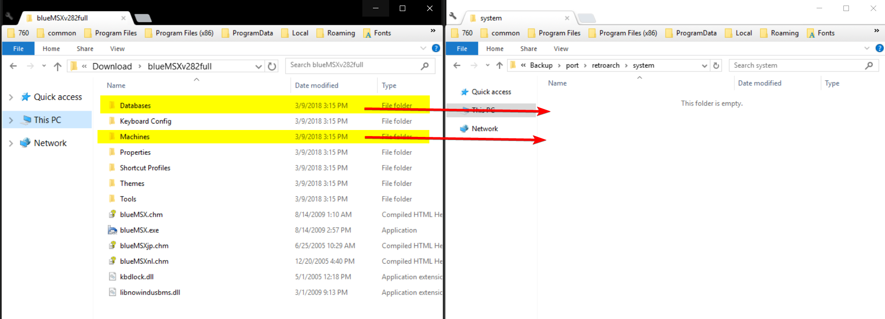
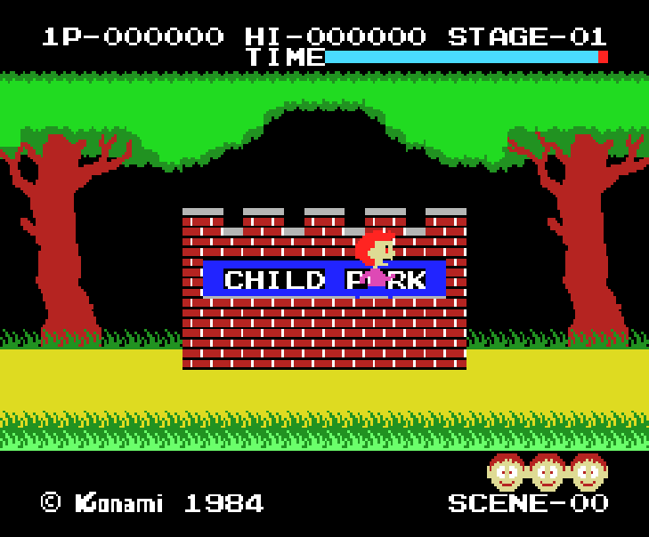

# MSX/SVI/ColecoVision/SG-1000 (blueMSX)

## Background

blueMSX is a cycle accurate emulator that emulates all generations of MSX computers as well as SVI, ColecoVision and Sega SG-1000.

### Author/License

The blueMSX core has been authored by

- Daniel Vik

The blueMSX core is licensed under

- [GPLv2](https://github.com/libretro/blueMSX-libretro/blob/master/license.txt)

A summary of the licenses behind RetroArch and its cores can be found [here](../development/licenses.md).

## Extensions

Content that can be loaded by the blueMSX core have the following file extensions:

- .rom
- .ri
- .mx1
- .mx2
- .col
- .dsk
- .cas
- .sg
- .sc
- .m3u

## Databases

RetroArch database(s) that are associated with the blueMSX core:

- [Microsoft - MSX](https://github.com/libretro/libretro-database/blob/master/rdb/Microsoft%20-%20MSX.rdb)
- [Microsoft - MSX2](https://github.com/libretro/libretro-database/blob/master/rdb/Microsoft%20-%20MSX2.rdb)
- [Coleco - ColecoVision](https://github.com/libretro/libretro-database/blob/master/rdb/Coleco%20-%20ColecoVision.rdb)
- [Sega - SG-1000](https://github.com/libretro/libretro-database/blob/master/rdb/Sega%20-%20SG-1000.rdb)

## BIOS

The blueMSX core requires the 'Databases' and 'Machines' folders from a full installation of blueMSX.

Go to `Main Menu > Online Updater > Core System Files Downloader` and download 'blueMSX.zip'. That's all you need to do! The 'Databases' and 'Machines' folders will be extracted and moved to your RetroArch 'system' folder automatically.

Alternatively, if your frontend doesn't have the 'Core System Files Downloader':

You can download the 'Databases' and 'Machines' folders from an [official full standalone blueMSX emulator installation](http://bluemsx.msxblue.com/download.html). Get blueMSXv282full.zip near the bottom of the page.

Move/Copy the 'Databases' and 'Machines' Folders to RetroArch's System directory.



## Features

Frontend-level settings or features that the blueMSX core respects.

| Feature           | Supported |
|-------------------|:---------:|
| Restart           | ✔         |
| Screenshots       | ✔         |
| Saves             | ✕         |
| States            | ✕         |
| Rewind            | ✕         |
| Netplay           | ✕         |
| Core Options      | ✔         |
| RetroAchievements | ✔         |
| RetroArch Cheats  | ✕         |
| Native Cheats     | ✕         |
| Controls          | ✔         |
| Remapping         | ✔         |
| Multi-Mouse       | ✕         |
| Rumble            | ✕         |
| Sensors           | ✕         |
| Camera            | ✕         |
| Location          | ✕         |
| Subsystem         | ✕         |
| [Softpatching](../guides/softpatching.md) | ✕         |
| Disk Control      | ✔         |
| Username          | ✕         |
| Language          | ✕         |
| Crop Overscan     | ✕         |
| LEDs              | ✕         |

### Directories

The blueMSX core's library name is 'blueMSX'

The blueMSX core saves/loads to/from these directories.

**Frontend's System directory**

| File                | Description     |
|:-------------------:|:---------------:|
| bluemsx.ini         | blueMSX Config  |
| bluemsx_history.ini | blueMSX History |

### Geometry and timing

- The blueMSX core's core provided FPS is 60
- The blueMSX core's core provided sample rate is 44100 Hz
- The blueMSX core's base width is (Base width)
- The blueMSX core's base height is (Base height)
- The blueMSX core's max width is (Max width)
- The blueMSX core's max height is (Max height)
- The blueMSX core's core provided aspect ratio is (Ratio)

## Usage

ColecoVision Gamepad Mapping is as follow:

- Button 1 as Retropad A
- Button 2 as Retropad B
- Dial keys 1 to 8 as X, Y, R, L, R2, L2, R3, L3
- Star (*) as Select, Hash (#) as Start
- 0 & 9 are on keyboard 1 & 2 for Player 1
- 0 & 9 are on keyboard 3 & 4 for Player 2.

## SpectraVideo Cassettes

<iframe width="560" height="315" src="https://www.youtube-nocookie.com/embed/ikRjN5OV7cA" title="YouTube video player" frameborder="0" allow="accelerometer; autoplay; clipboard-write; encrypted-media; gyroscope; picture-in-picture" allowfullscreen></iframe>

To play SpectraVideo cassettes type 'cload' then 'run'

or BLOAD ''CAS:'',R depending on the game.

## Multiple-disk games

If foo is a multiple-disk game, you should have .dsk files for each one, e.g. `foo (Disk 1).dsk`, `foo (Disk 2).dsk`, `foo (Disk 3).dsk`.

To take advantage of BlueMSX Disk Control feature for disk swapping, an index file (a m3u file) should be made.

Create a text file and save it as `foo.m3u`. Then enter your game's .dsk files on it. The m3u file contents should look something like this:

`foo.m3u`
```
foo (Disk 1).dsk
foo (Disk 2).dsk
foo (Disk 3).dsk
```

After that, you can load the `foo.m3u` file in RetroArch with the BlueMSX core.

An alternative is to append disks to the current playlist via the "Disk Image Append" option RetroArch menu.

## Core options

The blueMSX core has the following option(s) that can be tweaked from the core options menu. The default setting is bolded.

Settings with (Restart) means that core has to be closed for the new setting to be applied on next launch.

- **Machine Type (Restart)** [bluemsx_msxtype] (**Auto**|MSX|MSXturboR|MSX2|MSX2+|SEGA - SG-1000|SEGA - SC-3000|SEGA - SF-7000|SVI - Spectravideo SVI-318|SVI - Spectravideo SVI-328|SVI - Spectravideo SVI-328 MK2|ColecoVision|Coleco (Spectravideo SVI-603))

	Manually select the machine type you would like the core to start in.

- **Crop Overscan** [bluemsx_overscan] (**disabled**|enabled|MSX2)

	Forces cropping of overscanned frames

??? note "*Crop Overscan Off*"
    

??? note "*Crop Overscan On*"
    

??? note "*Crop Overscan MSX2*"
    

- **VDP Sync Type (Restart)** [bluemsx_vdp_synctype] (**Auto**|50Hz|60Hz)

	Match the game/machine region frequency to avoid emulated speed issues.

- **No Sprite Limit** [bluemsx_nospritelimits] (**OFF**|ON)

	Remove the 4 sprite per line limit which can reduce or remove sprite flicker in some games.

- **Sound YM2413 Enable (Restart)** [bluemsx_ym2413_enable] (**enabled**|disabled)

	Awaiting description.

- **Cart Mapper Type (Restart)** [bluemsx_cartmapper] (**Auto**|Normal|mirrored|basic|0x4000|0xC000|ascii8|ascii8sram|ascii16|ascii16sram|
ascii16nf|konami4|konami4nf|konami5|konamisynth|korean80|korean90|korean126|
MegaFlashRomScc|MegaFlashRomSccPlus|msxdos2|scc|sccexpanded|sccmirrored|sccplus|
snatcher|sdsnatcher|SegaBasic|SG1000|SG1000Castle|SG1000RamA|SG1000RamB|SC3000)

	When a ROM game or application is in the database, the emulator uses the databases to apply the correct mapper. If the sha1 value of a dump is not yet in the databases, it uses an automatic mapper detection system, but it can fail in some cases. In this situation, you can manually select the correct mapper.

## Controllers

The blueMSX core supports the following device type(s) in the controls menu, bolded device types are the default for the specified user(s):

### User 1 device types

- None - Doesn't disable input. There's no reason to switch to this.
- **RetroPad** - Joypad
- RetroKeyboard - Keyboard - Keyboard inputs are always active. Has keymapper support.
- RetroPad Keyboard Map - Joypad - Awaiting description.

### User 2 device types

- None - Doesn't disable input. There's no reason to switch to this.
- **RetroPad** - Joypad
- RetroKeyboard - Keyboard - Keyboard inputs are always active.

### Controller tables

#### Joypad

| User 1 and 2 Remap descriptors for 'RetroPad' device type | RetroPad Inputs                                | blueMSX core inputs        |
|-----------------------------------------------------------|------------------------------------------------|----------------------------|
| Button 2                                                  |              | Button 2, Coleco Button 2  |
| Button 3                                                  |              | Button 3, Coleco #2        |
| Select                                                    |         | Select, Coleco Star (*)    |
| Start                                                     |          | Start, Coleco Hash (#)     |
| Joy Up                                                    |        | Joy Up                     |
| Joy Down                                                  |      | Joy Down                   |
| Joy Left                                                  |      | Joy Left                   |
| Joy Right                                                 |     | Joy Right                  |
| Button 1                                                  |              | Button 1,  Coleco Button 1 |
| Button 4                                                  |              | Button 4, Coleco #1        |
| Button 5                                                  |             | Button 5, Coleco #4        |
| Button 6                                                  |             | Button 6, Coleco #3        |
| Button 7                                                  |             | Button 7, Coleco #6        |
| Button 8                                                  |             | Button 8, Coleco #5        |
| Button 9                                                  |             | Button 9. Coleco #8        |
| Button 10                                                 |             | Button 10, Coleco #7       |

#### Keyboard

| RetroKeyboard Inputs         | RetroKeyboard         |
|------------------------------|-----------------------|
| Keyboard Backspace           | BACKSPACE             |
| Keyboard Tab                 | TAB                   |
| Keyboard Return              | RETURN                |
| Keyboard Pause               | PAUSE                 |
| Keyboard Escape              | ESCAPE                |
| Keyboard Space               | SPACE                 |
| Keyboard Quote '             | COLON                 |
| Keyboard Comma ,             | COMMA                 |
| Keyboard Minus -             | NEGATIVE              |
| Keyboard Period .            | PERIOD                |
| Keyboard Slash /             | DIVIDE                |
| Keyboard 0                   | 0                     |
| Keyboard 1                   | 1, Player 1 Coleco #0 |
| Keyboard 2                   | 2, Player 1 Coleco #9 |
| Keyboard 3                   | 3, Player 2 Coleco #0 |
| Keyboard 4                   | 4, Player 2 Coleco #9 |
| Keyboard 5                   | 5                     |
| Keyboard 6                   | 6                     |
| Keyboard 7                   | 7                     |
| Keyboard 8                   | 8                     |
| Keyboard 9                   | 9                     |
| Keyboard Semicolon ;         | SEMICOLON             |
| Keyboard Equals =            | CIRCUMFLEX            |
| Keyboard Left Bracket [      | LEFT BRACKET          |
| Keyboard Backslash \         | BACKSLASH (YEN)       |
| Keyboard Right Bracket ]     | RIGHT BRACKET         |
| Keyboard Backquote `         | AT                    |
| Keyboard a                   | A                     |
| Keyboard b                   | B                     |
| Keyboard c                   | C                     |
| Keyboard d                   | D                     |
| Keyboard e                   | E                     |
| Keyboard f                   | F                     |
| Keyboard g                   | G                     |
| Keyboard h                   | H                     |
| Keyboard i                   | I                     |
| Keyboard j                   | J                     |
| Keyboard k                   | K                     |
| Keyboard l                   | L                     |
| Keyboard m                   | M                     |
| Keyboard n                   | N                     |
| Keyboard o                   | O                     |
| Keyboard p                   | P                     |
| Keyboard q                   | Q                     |
| Keyboard r                   | R                     |
| Keyboard s                   | S                     |
| Keyboard t                   | T                     |
| Keyboard u                   | U                     |
| Keyboard v                   | V                     |
| Keyboard w                   | W                     |
| Keyboard x                   | X                     |
| Keyboard y                   | Y                     |
| Keyboard z                   | Z                     |
| Keyboard Delete              | DELETE                |
| Keyboard Keypad 0            | NUMPAD 0              |
| Keyboard Keypad 1            | NUMPAD 1              |
| Keyboard Keypad 2            | NUMPAD 2              |
| Keyboard Keypad 3            | NUMPAD 3              |
| Keyboard Keypad 4            | NUMPAD 4              |
| Keyboard Keypad 5            | NUMPAD 5              |
| Keyboard Keypad 6            | NUMPAD 6              |
| Keyboard Keypad 7            | NUMPAD 7              |
| Keyboard Keypad 8            | NUMPAD 8              |
| Keyboard Keypad 9            | NUMPAD 9              |
| Keyboard Keypad Period .     | NUMPAD COMMA          |
| Keyboard Keypad Divide /     | NUMPAD DIVIDE         |
| Keyboard Keypad Multiply *   | NUMPAD MULTIPLY       |
| Keyboard Keypad Minus -      | NUMPAD SUBTRACTION    |
| Keyboard Keypad Plus +       | NUMPAD ADD            |
| Keyboard Keypad Enter        | NUMPAD PERIOD         |
| Keyboard Up                  | UP                    |
| Keyboard Down                | DOWN                  |
| Keyboard Right               | RIGHT                 |
| Keyboard Left                | LEFT                  |
| Keyboard Insert              | INSERT                |
| Keyboard Home                | CLS                   |
| Keyboard End                 | STOP                  |
| Keyboard Page Up             | SELECT                |
| Keyboard F1                  | F1                    |
| Keyboard F2                  | F2                    |
| Keyboard F3                  | F3                    |
| Keyboard F4                  | F4                    |
| Keyboard F5                  | F5                    |
| Keyboard Caps Lock           | CAPS                  |
| Keyboard Right Shift         | RIGHT SHIFT           |
| Keyboard Left Shift          | LEFT SHIFT            |
| Keyboard Left Control        | CONTROL               |
| Keyboard Left Alt            | GRAPH                 |
| Keyboard Print               | PRINT                 |

Supported combinations

- Keyboard Left or Right Shift + Keyboard 0 = UNDERSCORE

## Compatibility

- [blueMSX Manual](http://www.msxblue.com/manual/settingsports.htm)

## External Links

- [Official blueMSX Website](http://bluemsx.com/)
- [Official blueMSX SourceForge Repository](http://sourceforge.net/projects/bluemsx/)
- [Libretro blueMSX Core info file](https://github.com/libretro/libretro-super/blob/master/dist/info/bluemsx_libretro.info)
- [Libretro blueMSX Github Repository](https://github.com/libretro/blueMSX-libretro)
- [Report Libretro blueMSX Core Issues Here](https://github.com/libretro/blueMSX-libretro/issues)

### See also

#### Sega - SG-1000

- [Sega - MS/GG/MD/CD (Genesis Plus GX)](genesis_plus_gx.md)
- [Sega - MS/GG/SG-1000 (Gearsystem)](gearsystem.md)

#### Microsoft - MSX

- [Microsoft - MSX (fMSX)](fmsx.md)

#### Microsoft - MSX2

- [Microsoft - MSX (fMSX)](fmsx.md)

#### ColecoVision

- [Coleco - ColecoVision (Gearcoleco)](gearcoleco.md)
