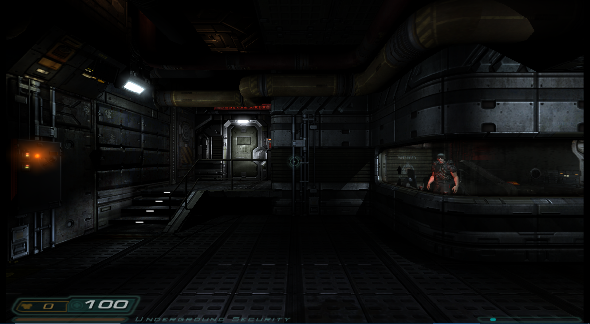

# Doom 3 (Boom3)
<iframe width="560" height="315" src="https://www.youtube-nocookie.com/embed/uS7veurg0ww" title="YouTube video player" frameborder="0" allow="accelerometer; autoplay; clipboard-write; encrypted-media; gyroscope; picture-in-picture" allowfullscreen></iframe>

## Background

Boom 3[^1] is a Doom 3 and Doom 3: Resurrection Of Evil GPL source port, known to work on Windows and Linux. Doom 3 is a sci-fi horror fantasy first-person shooter computer game developed by id Software and published by ActiVision.

The PrBoom core has been authored by

- 

The Boom 3 core is licensed under

- [GPLv3](https://github.com/libretro/boom3/blob/master/COPYING.txt)

A summary of the licenses behind RetroArch and its cores can be found [here](../development/licenses.md).

## BIOS

There are no required BIOS.


## Extensions

Content that can be loaded by the Boom 3 core have the following file extensions:

- .pk4

RetroArch database(s) that are associated with the PrBoom core:

- [DOOM](https://github.com/libretro/libretro-database/blob/master/rdb/DOOM.rdb)

## Features

Frontend-level settings or features that the PrBoom core respects.

| Feature           | Supported |
|-------------------|:---------:|
| Restart           | ✕         |
| Screenshots       | ✔         |
| Saves             | ✔         |
| States            | ✕         |
| Rewind            | ✕         |
| Netplay           | ✕         |
| Core Options      | ✔         |
| RetroAchievements | ✕         |
| RetroArch Cheats  | ✔         |
| Native Cheats     | ✔         |
| Controls          | ✔         |
| Remapping         | ✔         |
| Multi-Mouse       | ✕         |
| Rumble            | ✕         |
| Sensors           | ✕         |
| Camera            | ✕         |
| Location          | ✕         |
| Subsystem         | ✕         |
| [Softpatching](../guides/softpatching.md) | ✕         |
| Disk Control      | ✕         |
| Username          | ✕         |
| Language          | ✕         |
| Crop Overscan     | ✕         |
| LEDs              | ✕         |

### Directories

The Boom 3 core's library name is 'boom3'

The Boom 3 core saves/loads to/from these directories.

**Frontend's Save directory**

| File                      | Description |
|:-------------------------:|:-----------:|
| (conten folder)/savegames/*.save      | Save        |
| (content folder)/libretro.cfg | DOOM 3 Config |

### Geometry and timing

- The Boom 3 core's core provided FPS (by default) is 60
- The Boom 3 core's core provided sample rate is 44100 Hz
- The Boom 3 core's base width is dependent on the Internal resolution core option.
- The Boom 3 core's base height is dependent on the Internal resolution core option.
- The Boom 3 core's max width is dependent on the Internal resolution core option.
- The Boom 3 core's max height is dependent on the Internal resolution core option.
- The Boom 3 core's core provided aspect ratio is 4/3

## Loading DOOM 3 files

Boom 3 can load pk4 files. The Boom 3 core requires game data files which can be found [here](https://store.steampowered.com/app/9050/DOOM_3/) and [here](https://store.steampowered.com/app/9070/). If you bought the game on CDs/DVD, base/pak000.pk4 - pak004.pk4 and d3xp/pak000.pk4 can be copied from the disks, the other files are from the patch.

On Linux (and probably other Unix-like systems and maybe even Windows with a mingw shell) you can extract the needed files from [the official 1.3.1 patch for Linux with](https://files.holarse-linuxgaming.de/native/Spiele/Doom%203/doom3-linux-1.3.1.1304.x86.run):

```sh
sh /path/to/doom3-linux-1.3.1.1304.x86.run --tar xvf --wildcards base/pak* d3xp/pak*
```

On Windows you can just install the game and [the official 1.3.1 patch for Windows](https://archive.org/details/Doom_3_1.3.1) and then get the files from the installation directory (or copy dhewm3 in there).

!!! WARNING
	Doom3 BFG is not supported.	

You'll need the game data from a Doom3 installation patched to 1.3.1. Specifically, you'll need the following .pk4 files for the main game:

```
Filename    Size    MD5-sum
base/pak000.pk4 337MB   71b8d37b2444d3d86a36fd61783844fe
base/pak001.pk4 220MB   4bc4f3ba04ec2b4f4837be40e840a3c1
base/pak002.pk4 398MB   fa84069e9642ad9aa4b49624150cc345
base/pak003.pk4 303MB   f22d8464997924e4913e467e7d62d5fe
base/pak004.pk4 227MB   38561a3c73f93f2e6fd31abf1d4e9102
base/pak005.pk4 540KB   2afd4ece27d36393b7538d55a345b90d
base/pak006.pk4 214KB   a6e7003fa9dcc75073dc02b56399b370
base/pak007.pk4 118KB   6319f086f930ec1618ab09b4c20c268c
base/pak008.pk4 12KB    28750b7841de9453eb335bad6841a2a5
```

... and (optionally) these .pk4 files for the Resurrection of Evil addon:

```
Filename    Size    MD5-sum
d3xp/pak000.pk4 514MB   a883fef0fd10aadeb73d34c462ff865d
d3xp/pak001.pk4 98KB    06fc9be965e345587064056bf22236d2
```


An example folder structure would be like so:

```
└── contents/
    └── doom3/
        ├── base/
        │   ├── pak000.pk4
        │   ├── pak001.pk4
        │   ├── pak002.pk4
        │   ├── pak003.pk4
        │   ├── pak004.pk4
        │   ├── pak005.pk4
        │   ├── pak006.pk4
        │   ├── pak007.pk4
        │   └── pak008.pk4
        └── d3xp/
            ├── pak000.pk4 
            └── pak001.pk4
```

Game saves and internal configuration files will be created in the content directory, organised in folders matching the filenames of loaded content - for example:

```
└── contents/
    └── doom3/
        └── base/
            ├── savegames/
            │   ├── *.save  
            └── └── *.txt
```

Game saves are named from mission names.

## Loading Doom 3: Resurrection Of Evil

Doom 3: Resurrection of Evil is a horror first-person shooter video game developed by Nerve Software and published by Activision. It was released for Microsoft Windows on April 3, 2005, as an expansion pack and sequel to Doom 3 and on October 5, 2005, for the Xbox video game console. The Xbox version does not require the original Doom 3 in order to play, and includes The Ultimate Doom, Doom II: Hell on Earth and Master Levels for Doom II.

You will need to get Doom 3 and expansion pack RoE [here](https://store.steampowered.com/app/9070/).

You need to load Boom 3 xp core instead of Boom3 core. After Core is loaded you can load RoE's pk4 file

```
└── contents/
    └── doom3/
        └── d3xp/
            ├── pak000.pk4
            └── pak001.pk4
```

You can get Boom 3 xp core [here](https://github.com/fpscan/RetroArch-AppImage/releases/download/A-cores/boom3_xp_libretro.zip) for now.

## Config

Boom 3's internal game settings can be found in the 'libretro.cfg' file inside each game's directory.

Many of these settings may be changed from the in-game menu. 

## Core options

The Boom 3 core has the following option(s) that can be tweaked from the core options menu. The default setting is bolded.

Settings with (Restart) means that core has to be closed for the new setting to be applied on next launch.

- **Framerate (restart)** [boom3-framerate] (**Auto**|50fps|60fps|72fps|75fps|90fps|100fps|119fps|120fps|144fps|155fps|160fps|165fps|180fps|200fps|240fps|244fps|300fps|360fps)

	Modify framerate. Requires a restart.

??? note "Internal resolution - 640x368"
    

??? note "Internal resolution - 1920x1080"
    

- **Internal Resolution (restart)** [boom3-resolution] (480x272|**640x368**|720x408|960x544|1280x720|1920x1080|2560x1440|3840x2160)

	Configure the resolution. Requires a restart.

- **Invert Y Axis** [boom3-invert_y_axis] (**OFF**|ON)

	Invert the gamepad right analog stick's Y axis.

- **Show FPS** [boom3-show_fps] (**OFF**|ON)

	Shows framerate on screen.

## User 1 device types

The Boom3 core supports the following device type(s) in the controls menu, bolded device types are the default for the specified user(s):

- None - Input disabled.
- **Gamepad Classic** - Joypad
- **Gamepad Classic Alt** - Joypad
- **Gamepad Modern** - Joypad

## Joypad

| User 1 input descriptors for 'Gamepad Classic' device type | RetroPad Inputs                             | PrBoom inputs   |
|------------------------------------------------------------|---------------------------------------------|-----------------|
| Use                                                        |           | Use             |
| Run                                                        |           | Run             |
| Show/Hide Map                                              |      | Show/Hide Map   |
| Show/Hide Menu                                             |       | Show/Hide Menu  |
| D-Pad Up                                                   |     | D-Pad Up        |
| D-Pad Down                                                 |   | D-Pad Down      |
| D-Pad Left                                                 |   | D-Pad Left      |
| D-Pad Right                                                |  | D-Pad Right     |
| Fire                                                       |           | Fire            |
| Strafe                                                     |           | Strafe          |
| Strafe Left                                                |          | Strafe Left     |
| Strafe Right                                               |          | Strafe Right    |
| Previous Weapon                                            |          | Previous Weapon |
| Next Weapon                                                |          | Next Weapon     |

| User 1 input descriptors for 'Gamepad Modern' device type | RetroPad Inputs                                | PrBoom inputs           |
|-----------------------------------------------------------|------------------------------------------------|-------------------------|
| Menu Cancel                                               |              | Menu Cancel             |
| Quick Save                                                |              | Quick Save              |
| Show/Hide Map                                             |         | Show/Hide Map           |
| Show/Hide Menu                                            |          | Show/Hide Menu          |
| D-Pad Up                                                  |        | D-Pad Up                |
| D-Pad Down                                                |      | D-Pad Down              |
| D-Pad Left                                                |      | D-Pad Left              |
| D-Pad Right                                               |     | D-Pad Right             |
| Menu Select                                               |              | Menu Select             |
| Quick Load                                                |              | Quick Load              |
| Previous Weapon                                           |             | Previous Weapon         |
| Next Weapon                                               |             | Next Weapon             |
| Use                                                       |             | Use                     |
| Fire                                                      |             | Fire                    |
| Toggle Run                                                |             | Toggle Run              |
| 180 Turn                                                  |             | 180 Turn                |
|                                                           |  X  | Strafe Left/Right       |
|                                                           |  Y  | Move Forwards/Backwards |
|                                                           |  X | Look Left/Right         |


## External Links

- [Official dhewm3 Website](https://dhewm3.org/)
- [Official dhewm3 Repository](https://github.com/dhewm/dhewm3)
- [Libretro Boom 3 Core info file](https://github.com/libretro/libretro-super/blob/master/dist/info/boom3_libretro.info)
- [Libretro Boom 3 xp Core info file](https://github.com/libretro/libretro-super/blob/master/dist/info/boom3_xp_libretro.info)
- [Libretro Boom 3 Github Repository](https://github.com/libretro/boom3)
- [Report Libretro Boom 3 Core Issues Here](https://github.com/libretro/boom3/issues)

## id Software

- [Doom 1&2 (PrBoom)](prboom.md)

[^1]: Core renamed to Boom 3 from Dhewm3 [based on original author request.](https://github.com/dhewm/dhewm3/issues/270#issuecomment-573478406)
