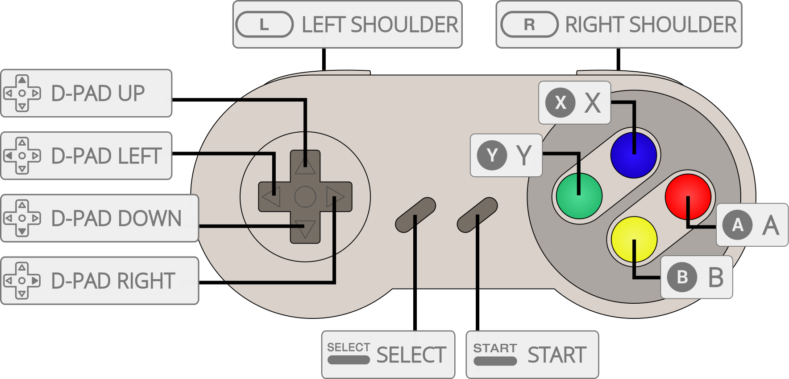

# Nintendo - SNES / SFC (bsnes)

## Background

bsnes is a Super Nintendo Entertainment System and Super Famicom emulator focused on accuracy, performance, features, and ease of use. The libretro core is based on bsnes v115 and includes enhancements such as HD Mode 7, internal run-ahead, and CPU and coprocessor overclocking.

The bsnes core is best suited to desktop-class systems with a relatively fast CPU.

### Author/License

The bsnes core has been authored by

- Near

The bsnes core is licensed under

- [GPLv3](https://github.com/libretro/bsnes-libretro/blob/master/LICENSE.txt)

A summary of the licenses behind RetroArch and its cores can be found [here](../development/licenses.md).

## Extensions

Content that can be loaded by the bsnes core has the following file extensions:

- .smc
- .sfc
- .swc
- .fig
- .gb
- .gbc
- .bs

## Databases

RetroArch databases that are associated with the bsnes core:

- [Nintendo - Super Nintendo Entertainment System](https://github.com/libretro/libretro-database/blob/master/rdb/Nintendo%20-%20Super%20Nintendo%20Entertainment%20System.rdb)
- [Nintendo - Sufami Turbo](https://github.com/libretro/libretro-database/blob/master/rdb/Nintendo%20-%20Sufami%20Turbo.rdb)
- [Nintendo - Satellaview](https://github.com/libretro/libretro-database/blob/master/rdb/Nintendo%20-%20Satellaview.rdb)

## BIOS

[Required or optional firmware files](bios.md) go in the frontend's system directory.

The coprocessor firmware files are optional. When low-level coprocessor firmware is absent, the core can use high-level emulation where available. A Super Game Boy boot image is required for Super Game Boy content, and `BS-X.bin` is required for Satellaview content.

| Filename          | Description                     | md5sum                           |
|:-----------------:|:-------------------------------:|:--------------------------------:|
| dsp1.data.rom     | DSP1 data ROM                   | 3d81b45fa0c2aa8b852dfb1ece7c0971 |
| dsp1.program.rom  | DSP1 program ROM                | ae209fbe789fbf11a48aea5ab1197321 |
| dsp1b.data.rom    | DSP1B data ROM                  | 1e3f568634a7d8284020dddc0ae905bc |
| dsp1b.program.rom | DSP1B program ROM               | d10f446888e097cbf500f3f663cf4f6d |
| dsp2.data.rom     | DSP2 data ROM                   | e9417e29223b139c3c4b635a2a3b8744 |
| dsp2.program.rom  | DSP2 program ROM                | aa6e5922a3ed5ded54f24247c11143c5 |
| dsp3.data.rom     | DSP3 data ROM                   | 0a81210c0a940b997dd9843281008ee6 |
| dsp3.program.rom  | DSP3 program ROM                | d99ca4562818d49cee1f242705bba6f8 |
| dsp4.data.rom     | DSP4 data ROM                   | ee4990879eb68e3cbca239c5bc20303d |
| dsp4.program.rom  | DSP4 program ROM                | a151023b948b90ffc23a5b594bb6fef2 |
| cx4.data.rom      | Cx4 data ROM                    | 037ac4296b6b6a5c47c440188d3c72e3 |
| st010.data.rom    | ST010 data ROM                  | 254d70762b6f59f99c27c395aba7d07d |
| st010.program.rom | ST010 program ROM               | 1d70019179a59a566a0bb5d3f2845544 |
| st011.data.rom    | ST011 data ROM                  | 10bd3f4aa949737ab9836512c35bcc29 |
| st011.program.rom | ST011 program ROM               | 95222ebf1c0c2990bcf25db43743f032 |
| st018.data.rom    | ST018 data ROM                  | 49c898b60d0f15e90d0ba780dd12f366 |
| st018.program.rom | ST018 program ROM               | dda40ccd57390c96e49d30a041f9a9e7 |
| SGB1.sfc          | Super Game Boy boot image - Required for SGB1 | b15ddb15721c657d82c5bab6db982ee9 |
| SGB2.sfc          | Super Game Boy 2 boot image - Required for SGB2 | 8ecd73eb4edf7ed7e81aef1be80031d5 |
| BS-X.bin          | Satellaview BS-X boot ROM - Required for Satellaview | fed4d8242cfbed61343d53d48432aced |

The Super Game Boy boot images must use the filenames `SGB1.sfc` and `SGB2.sfc`. The Satellaview boot ROM must use the filename `BS-X.bin`.

## Features

Frontend-level settings or features that the bsnes core respects:

| Feature           | Supported |
|-------------------|:---------:|
| Restart           | ✔         |
| Screenshots       | ✔         |
| Saves             | ✔         |
| States            | ✔         |
| Rewind            | ✔         |
| Netplay           | -         |
| Core Options      | ✔         |
| [Memory Monitoring (achievements)](../guides/memorymonitoring.md) | ✕         |
| RetroArch Cheats  | ✔         |
| Native Cheats     | ✕         |
| Controls          | ✔         |
| Remapping         | ✔         |
| Multi-Mouse       | ✔         |
| Rumble            | ✕         |
| Sensors           | ✕         |
| Camera            | ✕         |
| Location          | ✕         |
| Subsystem         | ✔         |
| [Softpatching](../guides/softpatching.md) | ✕         |
| Disk Control      | ✕         |
| Username          | ✕         |
| Language          | ✔         |
| Crop Overscan     | ✔         |
| LEDs              | ✕         |

RetroArch cheat codes are supported for SNES content. The core does not apply them while Super Game Boy content is loaded.

## Directories

The bsnes core's library name is `bsnes`.

The bsnes core saves and loads files in these directories.

**Frontend's Save directory**

| File  | Description                     |
|:-----:|:-------------------------------:|
| *.srm | Cartridge battery save          |
| *.rtc | Real-time clock data             |
| *.psr | Satellaview flash memory data    |

**Frontend's State directory**

| File     | Description |
|:--------:|:-----------:|
| *.state# | Save state  |

## Geometry and timing

- The bsnes core's core-provided FPS is approximately 60.0988 for NTSC games and 50.0070 for PAL games.
- The bsnes core's core-provided sample rate is 48000 Hz.
- The bsnes core's base width is 256.
- The bsnes core's default base height is 224 after the default vertical overscan crop is applied.
- The bsnes core's maximum width is 2048 and maximum height is 1920 for HD Mode 7 scaling.
- The bsnes core provides adjustable overscan and aspect ratio options.

## Subsystems

The bsnes core supports Super Game Boy and BS-X Satellaview through the subsystem API.

| Subsystem | Content                                     |
|:---------:|:--------------------------------------------|
| sgb       | Game Boy ROM and Super Game Boy boot image  |
| bsx       | BS-X memory pack and BS-X boot ROM           |

Game Boy and Game Boy Color content can also be loaded directly. The core uses the Super Game Boy boot image selected by the `Preferred Super Game Boy BIOS` core option.

When `.bs` content is loaded directly, the core loads `BS-X.bin` from the frontend's system directory. To start a game from the BS-X town interface, return to the house and select the first option.

## MSU-1

MSU-1 is supported. Load the `.sfc` file from the same directory as its `.msu` file and audio tracks.

## Core options

The bsnes core has the following options that can be changed from the core options menu. Defaults are shown in bold.

### Video

| Option | Values | Description |
|--------|--------|-------------|
| Preferred Aspect Ratio (`bsnes_aspect_ratio`) | **Auto**, 1:1, 4:3, NTSC, PAL | Sets the core-provided aspect ratio. |
| Crop Vertical Overscan (`bsnes_ppu_overscan_v`) | 0, **8**, 12, 16 lines | Crops lines from the top and bottom of the image. |
| Blur Emulation (`bsnes_blur_emulation`) | **Off**, On | Blends adjacent horizontal pixels to reproduce effects that rely on an SDTV display. |
| Filter (`bsnes_video_filter`) | **None**, NTSC RF, Composite, S-Video, RGB | Selects an NTSC video filter. |
| Color Adjustment - Luminance (`bsnes_video_luminance`) | 0-100%, **100%** | Adjusts luminance. |
| Color Adjustment - Saturation (`bsnes_video_saturation`) | 0-200%, **100%** | Adjusts saturation. |
| Color Adjustment - Gamma (`bsnes_video_gamma`) | 100-200%, **150%** | Adjusts gamma. |
| PPU - Fast Mode (`bsnes_ppu_fast`) | Off, **On** | Uses faster PPU emulation with a minor accuracy tradeoff. This must be enabled for deinterlacing, removing the sprite limit, and HD Mode 7. |
| PPU - Deinterlace (`bsnes_ppu_deinterlace`) | Off, **On** | Deinterlaces games by rendering internally at 480p. |
| PPU - No Sprite Limit (`bsnes_ppu_no_sprite_limit`) | **Off**, On | Removes the original hardware sprite-per-scanline limit. |
| PPU - No VRAM Blocking (`bsnes_ppu_no_vram_blocking`) | **Off**, On | Emulates inaccurate VRAM behavior from older emulators that is required by some ROM hacks. |

### Audio

| Option | Values | Description |
|--------|--------|-------------|
| DSP - Fast Mode (`bsnes_dsp_fast`) | Off, **On** | Uses faster DSP emulation with a minor accuracy tradeoff. |
| DSP - Cubic Interpolation (`bsnes_dsp_cubic`) | **Off**, On | Uses cubic instead of Gaussian audio interpolation. |
| DSP - Echo Shadow RAM (`bsnes_dsp_echo_shadow`) | **Off**, On | Emulates inaccurate echo RAM behavior from ZSNES that is required by some older Super Mario World ROM hacks. |

### HD Mode 7

| Option | Values | Description |
|--------|--------|-------------|
| Scale (`bsnes_mode7_scale`) | **1x**-8x | Increases the internal resolution of Mode 7 scenes. |
| Perspective Correction (`bsnes_mode7_perspective`) | Off, **On** | Corrects perspective at higher Mode 7 resolutions. |
| Supersampling (`bsnes_mode7_supersample`) | **Off**, On | Supersamples HD Mode 7 output for smoother edges. |
| HD->SD Mosaic (`bsnes_mode7_mosaic`) | Off, **On** | Keeps mosaic effects at their original apparent size. |

### Emulation hacks and enhancements

| Option | Values | Description |
|--------|--------|-------------|
| Internal Run-Ahead (`bsnes_run_ahead_frames`) | **Off**, 1-4 frames | Reduces input latency by simulating and rolling back frames. This has high CPU requirements. |
| Coprocessors - Fast Mode (`bsnes_coprocessor_delayed_sync`) | Off, **On** | Speeds up low-level coprocessor emulation with a small accuracy tradeoff. |
| Coprocessors - Prefer HLE (`bsnes_coprocessor_prefer_hle`) | Off, **On** | Prefers high-level coprocessor emulation when it is available. |
| Hotfixes (`bsnes_hotfixes`) | **Off**, On | Applies fixes for a small number of games that also exhibit bugs on original hardware. |
| Entropy (`bsnes_entropy`) | None, **Low**, High | Sets the amount of power-on state randomization. |
| CPU Fast Math (`bsnes_cpu_fastmath`) | **Off**, On | Uses faster CPU multiplication and division timings. |

### Overclocking

| Option | Values | Description |
|--------|--------|-------------|
| CPU (`bsnes_cpu_overclock`) | 10-400%, **100%** | Changes the main CPU clock. |
| SA-1 Coprocessor (`bsnes_cpu_sa1_overclock`) | 10-400%, **100%** | Changes the SA-1 clock. |
| SuperFX Coprocessor (`bsnes_cpu_sfx_overclock`) | 10-800%, **100%** | Changes the SuperFX clock. |

Overclocking may reduce slowdown, but it can also cause crashes or other game-specific problems.

### Super Game Boy

| Option | Values | Description |
|--------|--------|-------------|
| Preferred Super Game Boy BIOS (`bsnes_sgb_bios`) | **SGB1.sfc**, SGB2.sfc | Selects the boot image. Restart the core after changing it. |
| Hide SGB Border (`bsnes_hide_sgb_border`) | **Off**, On | Hides the Super Game Boy border. |

### Light gun

| Option | Values | Description |
|--------|--------|-------------|
| Touchscreen Light Gun (`bsnes_touchscreen_lightgun`) | Off, **On** | Enables touchscreen input for the Super Scope. |
| Super Scope Reverse Trigger Buttons (`bsnes_touchscreen_lightgun_superscope_reverse`) | **Off**, On | Swaps the Super Scope trigger and cursor buttons for touchscreen input. |

## Controllers

The bsnes core supports the following device types in the controls menu. Bolded device types are the defaults.

### User 1 device types

- **SNES Joypad**
- SNES Mouse

### User 2 device types

- **SNES Joypad**
- SNES Mouse
- Multitap
- SuperScope
- Justifier
- Justifiers

Selecting Multitap for User 2 enables compatible games to use up to five joypads.

### Joypad

| RetroPad Inputs                             | SNES Joypad Inputs |
|---------------------------------------------|--------------------|
|           | B                  |
|           | Y                  |
|      | Select             |
|       | Start              |
|     | D-Pad Up           |
|   | D-Pad Down         |
|   | D-Pad Left         |
|  | D-Pad Right        |
|           | A                  |
|           | X                  |
|          | L                  |
|          | R                  |

### Mouse

| RetroMouse Inputs                                     | SNES Mouse Inputs        |
|-------------------------------------------------------|--------------------------|
|  Mouse Cursor | SNES Mouse Cursor        |
|  Mouse 1       | SNES Mouse Left Button   |
|  Mouse 2      | SNES Mouse Right Button  |

### Light gun

| RetroLightgun Inputs                                   | Super Scope        | Justifier(s)        |
|--------------------------------------------------------|--------------------|---------------------|
|  Gun Crosshair | Crosshair          | Crosshair           |
| Gun Trigger                                            | Trigger            | Trigger             |
| Gun Aux A                                              | Cursor             |                     |
| Gun Aux B                                              | Turbo              |                     |
| Gun Start                                              | Pause              | Start               |

## Compatibility

The bsnes core is based on the latest bsnes source and targets accurate, faithful SNES and Super Famicom emulation. Its enhancements can increase CPU requirements or reduce accuracy when enabled.

## External links

- [Upstream bsnes Repository](https://github.com/bsnes-emu/bsnes)
- [Libretro bsnes Core info file](https://github.com/libretro/libretro-super/blob/master/dist/info/bsnes_libretro.info)
- [Libretro bsnes Repository](https://github.com/libretro/bsnes-libretro)
- [Report bsnes Core Issues Here](https://github.com/libretro/bsnes-libretro/issues)

### See also

#### Nintendo - SNES / SFC

- [Nintendo - SNES / Famicom (Beetle bsnes)](beetle_bsnes.md)
- [Nintendo - SNES / Famicom (bsnes-jg)](bsnes-jg.md)
- [Nintendo - SNES / Famicom (bsnes Accuracy)](bsnes_accuracy.md)
- [Nintendo - SNES / Famicom (bsnes Balanced)](bsnes_balanced.md)
- [Nintendo - SNES / Famicom (bsnes Performance)](bsnes_performance.md)
- [Nintendo - SNES / SFC / Game Boy / Color (Mesen-S)](mesen-s.md)
- [Nintendo - SNES / Famicom (Snes9x)](snes9x.md)
