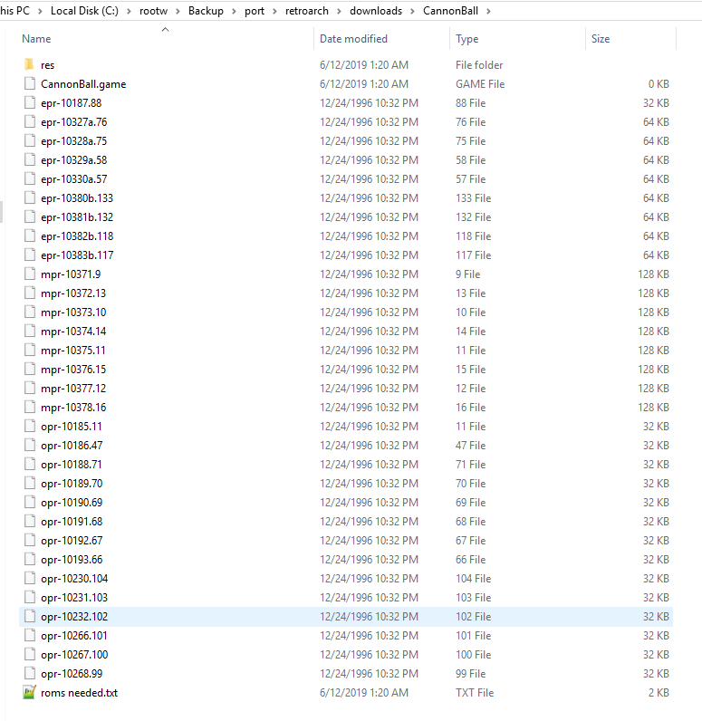

# Cannonball

<iframe width="560" height="315" src="https://www.youtube-nocookie.com/embed/ILGQqmpbg6E" title="YouTube video player" frameborder="0" allow="accelerometer; autoplay; clipboard-write; encrypted-media; gyroscope; picture-in-picture" allowfullscreen></iframe>

## Background

This is an OutRun game engine recreation written by Chris White in 2014. It has been ported to the libretro API. The Cannonball core has been authored by

- Chris White

The Cannonball core is licensed under

- [Non-commercial](https://github.com/libretro/cannonball/blob/master/docs/license.txt)

A summary of the licenses behind RetroArch and its cores can be found [here](../development/licenses.md).

## How to start the Cannonball core:

- To start the Cannonball core, you need to obtain Cannonball's data files. You can do this by going to RetroArch's main menu screen and selecting 'Online Updater'. From there, select 'Content Downloader'.

- Select 'Cannonball', then select 'CannonBall.zip'. This should download and extract this file to RetroArch's Downloads directory.

- Next, follow this [guide](https://github.com/djyt/cannonball/blob/master/roms/roms.txt) and place OutRun Revision B ROMs in the CannonBall directory.

- Below is a pictured example of a working Cannonball setup.

- Go back to RetroArch's main menu screen. Select 'Load Content', then 'Downloads'.

- Select the 'CannonBall' directory, then select 'CannonBall.game'.

- If you are asked which core to select, choose 'Cannonball'.

The content should now start running!

## Extensions

Content that can be loaded by the Cannonball core have the following file extensions:

- .game
- .88

RetroArch database(s) that are associated with the Cannonball core:

- [Cannonball](https://github.com/libretro/libretro-database/blob/master/rdb/Cannonball.rdb)

## Features

- Smoother 60fps gameplay
- [True Widescreen Play Mode](https://youtube.com/clip/UgkxU6mqSPJX9ZAiAyd8N0oXCmHk8rRVHTdS)
- Force Feedback support
- Custom Track support from [LayOut](https://github.com/djyt/layout/wiki)
- New Game Modes (Continuous Mode & Time Trial Mode)
- [Many, many more enhancements](https://github.com/djyt/cannonball/wiki/Cannonball-Manual#enhancements)

Frontend-level settings or features that the Cannonball core respects.

| Feature           | Supported |
|-------------------|:---------:|
| Restart           | ✕         |
| Saves             | ✔         |
| States            | ✕         |
| Rewind            | ✕         |
| Netplay           | ✕         |
| Core Options      | ✔         |
| RetroAchievements | ✕         |
| RetroArch Cheats  | ✕         |
| Native Cheats     | ✕         |
| Controls          | ✔         |
| Remapping         | ✔         |
| Multi-Mouse       | ✕         |
| Rumble            | ✕         |
| Sensors           | ✕         |
| Camera            | ✕         |
| Location          | ✕         |
| Subsystem         | ✕         |
| [Softpatching](../guides/softpatching.md) | ✕         |
| Disk Control      | ✕         |
| Username          | ✕         |
| Language          | ✕         |
| Crop Overscan     | ✕         |
| LEDs              | ✕         |

## Directories

The Cannonball core's library name is 'Cannonball'

The Cannonball core saves/loads to/from these directories.

**Frontend's Home directory**

| File         | Description   |
|:------------:|:-------------:|
| config.xml   | Config File   |
| hiscores.xml | Hiscores File |

## Geometry and timing

- The Cannonball core's core provided FPS is 60 when the [Video Framerate core option](#core-options) is set to Smooth (60) or Original (60/30)
- The Cannonball core's core provided FPS is 120 when the [Video Framerate core option](#core-options) is set to Ultra Smooth (120)
- The Cannonball core's core provided FPS is 30 when the [Video Framerate core option](#core-options) is set to Low (30)
- The Cannonball core's core provided sample rate is 44040 Hz when the [Video Framerate core option](#core-options) is set to Ultra Smooth (120)
- The Cannonball core's core provided sample rate is 44100 Hz when the [Video Framerate core option](#core-options) is not set to Ultra Smooth (120)
- The Cannonball core's base width is 320
- The Cannonball core's base height is 224
- The Cannonball core's max width is 640
- The Cannonball core's max height is 448
- The Cannonball core's core provided aspect ratio is 4/3 when the [Video Widescreen Mode core option](#core-options) is set to Off
- The Cannonball core's core provided aspect ratio is 16/9 when the [Video Widescreen Mode core option](#core-options) is set to On

## Core options

The Cannonball core has the following option(s) that can be tweaked from the core options menu. The default setting is bolded.

Settings with (Restart) means that core has to be closed for the new setting to be applied on next launch.

- **Menu At Start** [cannonball_menu_enabled] (**ON**|OFF)

	When enabled; the Cannonball core shows the main menu upon startup.

	When disabled; the Cannonball core goes into attract mode upon startup.

- **Menu Road Scroll Speed** [cannonball_menu_road_scroll_speed] (**50**|60|70|80|90|100|150|200|300|400|500|5|10|15|20|25|30|40)

	Use this to configure the speed at which the road on the Main Menu scrolls at.

- **Video Widescreen Mode** [cannonball_video_widescreen] (**ON**|OFF)

	Explained [here](https://github.com/djyt/cannonball/wiki/Cannonball-Manual#video-modes).

- **Video High-Resolution Mode** [cannonball_video_hires] (**OFF**|ON)

	The original game ran at 320x224. This mode doubles that resolution to 640x448. However, rather than simply doubling up the display, the sprites and road are rendered at a higher resolution where possible.

- **Video Framerate** [cannonball_video_fps] (**Smooth (60)**|Ultra Smooth (120)|Original (60/30))

	Explained [here](https://github.com/djyt/cannonball/wiki/Cannonball-Manual#video-modes).

- **Advertise Sound** [cannonball_sound_advertise] (**ON**|OFF)

	Play sounds in attract mode.

- **Preview Music** [cannonball_sound_preview] (**ON**|OFF)

	Preview the music tracks at the point of selection in-game. The original game did not have this option and you would not hear the audio track until the game started.

- **Fix Samples (use opr-10188.71f)** [cannonball_sound_fix_samples] (**ON**|OFF)

	Explained [here](https://github.com/djyt/cannonball/wiki/Cannonball-Manual#fix-corrupted-audio).

- **Gear Mode** [cannonball_gear] (**Manual**|Manual Cabinet|Manual 2 Buttons|Automatic)

	Change the gear shift behaviour. Useful to configure based on your target hardware.

	0 = Manual (Click to shift, for normal play)
	1 = Manual (Hold to shift, for cabinet play)
	2 = Manual (Separate Buttons for High/Low)
	3 = Automatic (No need to change gear)

- **Analog Controls (off to allow digital speed setup)** [cannonball_analog] (**ON**|OFF)

	Self-explanatory.

- **Digital Steer Speed** [cannonball_steer_speed] (**3**|4|5|6|7|8|9|1|2)

	Awaiting description.

- **Digital Pedal Speed** [cannonball_pedal_speed] (**4**|5|6|7|8|9|1|2|3)

	Awaiting description.

- **Time** [cannonball_dip_time] (**Easy (80s)**|Normal (75s)|Hard (72s)|Very Hard (70s)|Infinite Time)

	Explained [here](https://github.com/djyt/cannonball/wiki/Cannonball-Manual#outrun-engine-settings).

- **Traffic** [cannonball_dip_traffic] (**Normal**|Hard|Very Hard|No Traffic|Easy)

	Explained [here](https://github.com/djyt/cannonball/wiki/Cannonball-Manual#outrun-engine-settings).

- **Freeplay Mode** [cannonball_freeplay] (**OFF**|ON)

	Awaiting description.

- **Use Japanese Tracks Version** [cannonball_jap] (**OFF**|ON)

	Explained [here](https://github.com/djyt/cannonball/wiki/Cannonball-Manual#japanese-courses)

- **Use Prototype Stage 1** [cannonball_prototype] (**OFF**|ON)

	Explained [here](https://github.com/djyt/cannonball/wiki/Cannonball-Manual#prototype-coconut-beach).

- **Objects Limit Enhanced** [cannonball_level_objects] (**ON**|OFF)

	Explained [here](https://github.com/djyt/cannonball/wiki/Cannonball-Manual#outrun-engine-settings)

- **Original Traffic Patterns Randomization** [cannonball_randomgen] (**ON**|OFF)

	Awaiting description.

- **Force AI To Play** [cannonball_force_ai] (**OFF**|ON)

	Awaiting description.

- **Fix Original Game Bugs** [cannonball_fix_bugs] (**ON**|OFF)

	Explained [here](https://github.com/djyt/cannonball/wiki/Cannonball-Manual#bug-fixes)

- **Fix Timing Bugs** [cannonball_fix_timer] (**OFF**|ON)

	Awaiting description.

- **Display Debug Info For LayOut** [cannonball_layout_debug] (**OFF**|ON)

	Awaiting description.

- **New Attract** [cannonball_new_attract] (**ON**|OFF)

	Explained [here](https://github.com/djyt/cannonball/wiki/Cannonball-Manual#outrun-engine-settings).

- **Time Trial Laps** [cannonball_ttrial_laps] (**3**|4|5|1|2)

	Awaiting description.

- **Time Trial Traffic Amount** [cannonball_ttrial_traffic] (**3**|4|5|6|7|8|0|1|2)

	Awaiting description.

- **Continuous Mode Traffic Amount** [cannonball_cont_traffic] (**3**|4|5|6|7|8|0|1|2)

	Awaiting description.

## Joypad

| RetroPad Inputs                                | User 1 input descriptors |
|------------------------------------------------|--------------------------|
|              | Accelerate               |
|              | Brake                    |
|         | Coin                     |
|          | Start                    |
|        | Up                       |
|      | Down                     |
|      | Left                     |
|     | Right                    |
|              | Gear                     |
|              | Gear                     |
|             | Adjust View              |
|             | Go Back To Menu          |
|  X  | Analog X                 |
|  Y  | Analog Y                 |

## External Links

- [Official Cannoball Github Wiki](https://github.com/djyt/cannonball/wiki)
- [Official Cannonball Github Repository](https://github.com/djyt/cannonball)
- [Libretro Cannonball Core info file](https://github.com/libretro/libretro-super/blob/master/dist/info/cannonball_libretro.info)
- [Libretro Cannonball Github Repository](https://github.com/libretro/cannonball)
- [Report Libretro Cannonball Core Issues Here](https://github.com/libretro/cannonball/issues)
- [How to setup video](https://www.youtube.com/watch?v=ILGQqmpbg6E)
