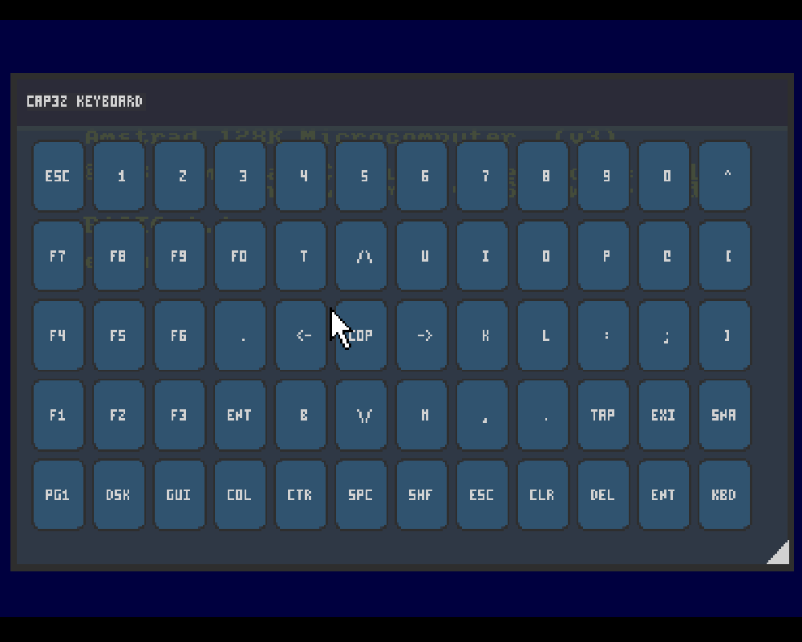

# Amstrad - CPC (Caprice32)

## Background

Caprice32 is a software emulator of the Amstrad CPC 8bit home computer series running on Linux and Windows. The emulator faithfully imitates the CPC464, CPC664, and CPC6128 models. By recreating the operations of all hardware components at a low level, the emulator achieves a high degree of compatibility with original CPC software. These programs or games can be run unmodified at real-time or higher speeds, depending on the emulator host environment.

### Author/License

The Caprice32 core has been authored by

- Ulrich Doewich
- dantoine

The Caprice32 core is licensed under

- [GPLv2](https://github.com/ColinPitrat/caprice32/blob/master/COPYING.txt)

A summary of the licenses behind RetroArch and its cores have found [here](https://docs.libretro.com/tech/licenses/).

## Extensions

Content that can be loaded by the Caprice32 core have the following file extensions:

- .dsk
- .sna
- .zip
- .tap
- .cdt
- .voc

## Databases

RetroArch database(s) that are associated with the Caprice32 core:

- [Amstrad - CPC](https://github.com/libretro/libretro-database/blob/master/rdb/Amstrad%20-%20CPC.rdb)

## Features

Frontend-level settings or features that the Caprice32 core respects.

| Feature           | Supported |
|-------------------|:---------:|
| Restart           | ✔         |
| Screenshots       | ✔         |
| Saves             | ✕         |
| States            | ✔         |
| Rewind            | ✕         |
| Netplay           | ✕         |
| Core Options      | ✔         |
| RetroAchievements | ✕         |
| RetroArch Cheats  | ✕         |
| Native Cheats     | ✕         |
| Controls          | ✔         |
| Remapping         | ✔         |
| Multi-Mouse       | ✕         |
| Rumble            | ✕         |
| Sensors           | ✕         |
| Camera            | ✕         |
| Location          | ✕         |
| Subsystem         | ✕         |
| [Softpatching](https://docs.libretro.com/guides/softpatching/) | ✕         |
| Disk Control      | ✕         |
| Username          | ✕         |
| Language          | ✕         |
| Crop Overscan     | ✕         |
| LEDs              | ✕         |

### Directories

The Caprice32 core's internal core name is 'cap32'

The Caprice32 core saves/loads to/from these directories.

**Loaded content's directory**

- 'content-name'#.SNA (SNA)

### Geometry and timing

- The Caprice32 core's core provided FPS is (FPS)
- The Caprice32 core's core provided sample rate is (Rate)
- The Caprice32 core's core provided aspect ratio is (Ratio)

## Usage

The Caprice32 core has a virtual keyboard GUI that can be accessed through User 1's RetroPad Y input.

The mouse cursor can be controlled by RetroPad D-Pad inputs when the RetroPad Select input is pressed.

Here are some actions you can do in page 2 of the virtual keyboard GUI.

- "EXT" EXIT EMU
- "SNA" SAVE SNA
- "DSK" SWITCH DSK DRIVE A/B
- "Col" SWTICH FGCOL ON/OFF

## Core options

The Caprice32 core has the following option(s) that can be tweaked from the core options menu. The default setting is bolded. 

Settings with (Restart) means that core has to be closed for the new setting to be applied on next launch.

- **Autorun** [cap32_autorun] (**disabled**|enabled)

	If enabled, the core will run the first bas/bin found in the DSK.
	
- **Internal resolution** [cap32_resolution] (**384x272**|400x300)

	Self-explanatory.
	
- **Model:** [cap32_Model] (**464**|664|6128)

	Choose which Amstrad CPC model to emulate.
	
- **Ram size:** [cap32_Ram] (**64**|128|192|512|576)

	CPC physical RAM size in kB
	
- **Status Bar** [cap32_Statusbar] (**disabled**|enabled)

	Awaiting description.
	
- **Drive:** [cap32_Drive] (**0**|1)

	Awaiting description.
	
- **scr_tube** [cap32_scr_tube] (**disabled**|enabled)

	Choose between a color display or a monochrome display.
	
??? note "scr_tube - Off"
	
	
??? note "scr_tube - On"
		
	
- **scr_intensity** [cap32_scr_intensity] (**5**|6|7|8|9|10|11|12|13|14|15)

	Screen cathodic tube intensity.
	
!!! attention
	These 'scr_intensity' core option screenshots have been taken with the 'scr_tube' core option set to Off.

??? note "scr_intensity - 5"
	
	
??? note "scr_intensity - 15"
	
	
- **Retro joy0** [cap32_RetroJoy] (**disabled**|enabled)

	Awaiting description.
	
## Controllers

The Caprice32 core supports the following device type(s) in the controls menu, bolded device types are the default for the specified user(s):

### User 1 - 2 device types

- None - Doesn't disable input. There's no reason to switch to this.
- **RetroPad** - Joypad - Don't use this. Switch to Amstrad Joystick for joypad input.
- Amstrad Joystick - Joypad - Use this for joypad input.
- Amstrad Keyboard - Keyboard - Keyboard input are always active. Has keymapper support.

### Other controllers

- Mouse - The mouse cursor in the Virtual Keyboard GUI can be controlled with mouse inputs.

### Controller tables

#### Joypad

| User 1 Remap descriptors | RetroPad Inputs                           | Amstrad Joystick |
|--------------------------|-------------------------------------------|------------------|
| B                        |     | RUN              |
| Y                        |     | VKBD ON/OFF      |
| Select                   |      | MOUSE/JOY in GUI |
| Start                    |       | ENTER/RETURN     |
| Up                       |     | JOY UP           |
| Down                     |   | JOY DOWN         |
| Left                     |   | JOY LEFT         |
| Right                    |  | JOY RIGHT        |
| A                        |     | FIRE1/VKBD KEY   |
| X                        |     | FIRE2            |
| L                        |          | CAT              |
| R                        |          | RESET            |
| L2                       |          | STATUS ON/OFF    |
| R2                       |          | AUTOLOAD TAPE    |
| L3                       |          |                  |
| R3                       |          |                  |

#### Keyboard

| RetroKeyboard Inputs         | Amstrad Keyboard            |
|------------------------------|-----------------------------|
| Keyboard Backspace           | CPC_KEY_DEL                 |
| Keyboard Tab                 | CPC_KEY_TAB                 |
| Keyboard Return              | CPC_KEY_RETURN              |
| Keyboard Escape              | CPC_KEY_ESC                 |
| Keyboard Space               | CPC_KEY_SPACE               |
| Keyboard Comma ,             | CPC_KEY_COMMA               |
| Keyboard Minus -             | CPC_KEY_MINUS               |
| Keyboard Period .            | CPC_KEY_DOT                 |
| Keyboard 0                   | CPC_KEY_ZERO                |
| Keyboard 1                   | CPC_KEY_1                   |
| Keyboard 2                   | CPC_KEY_2                   |
| Keyboard 3                   | CPC_KEY_3                   |
| Keyboard 4                   | CPC_KEY_4                   |
| Keyboard 5                   | CPC_KEY_5                   |
| Keyboard 6                   | CPC_KEY_6                   |
| Keyboard 7                   | CPC_KEY_7                   |
| Keyboard 8                   | CPC_KEY_8                   |
| Keyboard 9                   | CPC_KEY_9                   |
| Keyboard Semicolon ;         | CPC_KEY_COLON               |
| Keyboard Equals =            | CPC_KEY_HAT                 |
| Keyboard Left Bracket [      | CPC_KEY_AT                  |
| Keyboard Right Bracket ]     | CPC_KEY_OPEN_SQUARE_BRACKET |
| Keyboard a                   | CPC_KEY_A                   |
| Keyboard b                   | CPC_KEY_B                   |
| Keyboard c                   | CPC_KEY_C                   |
| Keyboard d                   | CPC_KEY_D                   |
| Keyboard e                   | CPC_KEY_E                   |
| Keyboard f                   | CPC_KEY_F                   |
| Keyboard g                   | CPC_KEY_G                   |
| Keyboard h                   | CPC_KEY_H                   |
| Keyboard i                   | CPC_KEY_I                   |
| Keyboard j                   | CPC_KEY_J                   |
| Keyboard k                   | CPC_KEY_K                   |
| Keyboard l                   | CPC_KEY_L                   |
| Keyboard m                   | CPC_KEY_M                   |
| Keyboard n                   | CPC_KEY_N                   |
| Keyboard o                   | CPC_KEY_O                   |
| Keyboard p                   | CPC_KEY_P                   |
| Keyboard q                   | CPC_KEY_Q                   |
| Keyboard r                   | CPC_KEY_R                   |
| Keyboard s                   | CPC_KEY_S                   |
| Keyboard t                   | CPC_KEY_T                   |
| Keyboard u                   | CPC_KEY_U                   |
| Keyboard v                   | CPC_KEY_V                   |
| Keyboard w                   | CPC_KEY_W                   |
| Keyboard x                   | CPC_KEY_X                   |
| Keyboard y                   | CPC_KEY_Y                   |
| Keyboard z                   | CPC_KEY_Z                   |
| Keyboard Delete              | CPC_KEY_JOY_LEFT            |
| Keyboard Keypad 0            | CPC_KEY_F0                  |
| Keyboard Keypad 1            | CPC_KEY_F1                  |
| Keyboard Keypad 2            | CPC_KEY_F2                  |
| Keyboard Keypad 3            | CPC_KEY_F3                  |
| Keyboard Keypad 4            | CPC_KEY_F4                  |
| Keyboard Keypad 5            | CPC_KEY_F5                  |
| Keyboard Keypad 6            | CPC_KEY_F6                  |
| Keyboard Keypad 7            | CPC_KEY_F7                  |
| Keyboard Keypad 8            | CPC_KEY_F8                  |
| Keyboard Keypad 9            | CPC_KEY_F9                  |
| Keyboard Keypad Period .     | CPC_KEY_FDOT                |
| Keyboard Keypad Enter        | CPC_KEY_SMALL_ENTER         |
| Keyboard Up                  | CPC_KEY_CURSOR_UP           |
| Keyboard Down                | CPC_KEY_CURSOR_DOWN         |
| Keyboard Right               | CPC_KEY_CURSOR_RIGHT        |
| Keyboard Left                | CPC_KEY_CURSOR_LEFT         |
| Keyboard Insert              | CPC_KEY_JOY_FIRE1           |
| Keyboard Home                | CPC_KEY_JOY_UP              |
| Keyboard End                 | CPC_KEY_JOY_DOWN            |
| Keyboard Page Up             | CPC_KEY_JOY_FIRE2           |
| Keyboard Page Down           | CPC_KEY_JOY_RIGHT           |
| Keyboard F8                  | LOAD DSK/TAPE               |
| Keyboard F9                  | MEM SNAPSHOT LOAD/SAVE      |
| Keyboard F10                 | MAIN GUI                    |
| Keyboard F12                 | PLAY TAPE                   |
| Keyboard Caps Lock           | CPC_KEY_CAPS_LOCK           |
| Keyboard Right Shift         | CPC_KEY_SHIFT               |
| Keyboard Left Shift          | CPC_KEY_SHIFT               |
| Keyboard Right Control       | CPC_KEY_CONTROL             |
| Keyboard Left Control        | CPC_KEY_CONTROL             |
| Keyboard Right Alt           | CPC_KEY_COPY                |
| Keyboard Left Alt            | CPC_KEY_COPY                |
| Keyboard Compose             | CPC_KEY_COPY                |

#### Mouse

| RetroMouse Inputs                                   | Virtual Keyboard GUI Inputs |
|-----------------------------------------------------|-----------------------------|
|  Mouse Cursor | Mouse Cursor                |
|  Mouse 1       | Mouse Left Button           |

## External Links

- [Official Caprice32 Github Repository](https://github.com/ColinPitrat/caprice32)
- [Libretro Caprice32 Core info file](https://github.com/libretro/libretro-super/blob/master/dist/info/cap32_libretro.info)
- [Libretro Caprice32 Github Repository](https://github.com/libretro/libretro-cap32)
- [Report Libretro Caprice32 Core Issues Here](https://github.com/libretro/libretro-cap32/issues)

### See also

#### Amstrad - CPC

- [Amstrad - CPC (CrocoDS)](https://docs.libretro.com/library/crocods/)