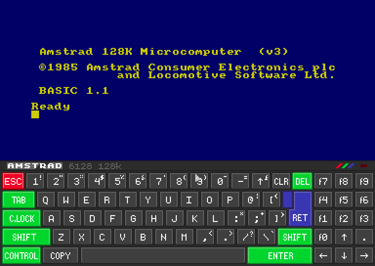
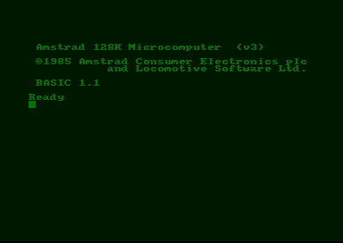
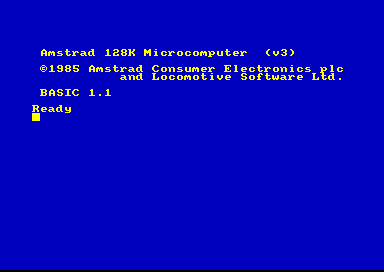

# Amstrad - CPC (Caprice32)

## Background

Caprice32 is a software emulator of the Amstrad CPC 8bit home computer series running on Linux and Windows. The emulator faithfully imitates the CPC464, CPC664, CPC6128, CPC6128+ and GX4000 models. By recreating the operations of all hardware components at a low level, the emulator achieves a high degree of compatibility with original CPC software. These programs or games can be run unmodified at real-time or higher speeds, depending on the emulator host environment.

### Author/License

The Caprice32 core has been authored by

- Ulrich Doewich
- David Colmenero (D_Skywalk)
- Colin Pitrat

The Caprice32 core is licensed under

- [GPLv2](https://github.com/ColinPitrat/caprice32/blob/master/COPYING.txt)

A summary of the licenses behind RetroArch and its cores can be found [here](../development/licenses.md).

## Extensions

Content that can be loaded by the Caprice32 core have the following file extensions:

- .dsk
- .sna
- .tap
- .cdt
- .voc
- .m3u
- .cpr
- .zip

## Databases

RetroArch database(s) that are associated with the Caprice32 core:

- [Amstrad - CPC](https://github.com/libretro/libretro-database/blob/master/rdb/Amstrad%20-%20CPC.rdb) (TOSEC)

## Features

Frontend-level settings or features that the Caprice32 core respects.

| Feature           | Supported |
|-------------------|:---------:|
| Restart           | ✔         |
| Screenshots       | ✔         |
| Saves             | ✔         |
| States            | ✔         |
| Rewind            | ✔         |
| Netplay           | ✔         |
| Core Options      | ✔         |
| RetroAchievements | ✔         |
| RetroArch Cheats  | ✕         |
| Native Cheats     | ✕         |
| Controls          | ✔         |
| Remapping         | ✔         |
| Multi-Mouse       | ✕         |
| Rumble            | ✕         |
| Sensors           | ✕         |
| Camera            | ✕         |
| Location          | ✕         |
| Subsystem         | ✕         |
| [Softpatching](../guides/softpatching.md) | ✕         |
| Disk Control      | ✔         |
| Username          | ✕         |
| Language          | ✕         |
| Crop Overscan     | ✕         |
| LEDs              | ✕         |

### Directories

The Caprice32 core's internal core name is 'cap32'.

The Caprice32 core saves/loads to/from these directories.

**Loaded content's directory**

- 'content-name'#.SNA (SNA)

### Geometry and timing

* The Caprice32 core's core provided FPS is 50
* The Caprice32 core's core provided sample rate is 44100 Hz
* The Caprice32 core's core provided aspect ratio is 4/3

## Usage

The Caprice32 core has a virtual keyboard GUI that can be accessed through SELECT (configured by cap32_combokey) or F9.

The mouse cursor can be controlled by RetroPad D-Pad and use button A to press a Key.



## Core options

The Caprice32 core has the following option(s) that can be tweaked from the core options menu.

!!! tip
    Settings with (Restart) means that core has to be closed for the new setting to be applied on next launch.

| Core option | Description | Default |
| ---         | ---         | ---     |
| Autorun     | If enabled, the core will run the first bas/bin found in the DSK. `cap32_autorun = "enabled|disabled"`   | `enabled`     |
| Combo Key   | See [Combo list](#combo-list) below. `cap32_combokey = "select|y|b|disabled"`                            | `select`      |
| Internal resolution   | Self-explanatory. `cap32_resolution = "384x272|400x300"`                                       | `384x272`     |
| Model (Restart)       | Choose which Amstrad CPC model to emulate. `cap32_model = "6128|464|6128+"`                    | `6128`        |
| Ram size (Restart)    | CPC physical RAM size in kB. `cap32_ram = "128|64|192|576"`                                    | `128`         |
| Status Bar            | Status bar configuration `cap32_statusbar = "onloading|enabled|disabled"`                      | `onloading`   |
| Floppy Sound          | Disk emulated sound configuration `cap32_floppy_sound = "enabled|disabled"`                    | `enabled`     |
| Monitor Type          | Choose between a color display or a monochrome display. `cap32_scr_tube = "color|green|white"` | `color`       |
| Monitor Intensity     | Screen cathodic tube intensity. `cap32_scr_intensity = "5|6|7|8|9|10|11|12|13|14|15"`          | `5`           |
| CPC Language (Restart) | Choose between english, french or spanish keyboard layout. `cap32_lang_layout = "english|french|spanish"` | `english` |
| User 1 Joystick Configuration | Select Joy/Overlay configuration for player 1. `cap32_retrojoy0 = "joystick|qaop|incentive"` | `joystick` |
| User 2 Joystick Configuration | Select Joy/Overlay configuration for player 2. `cap32_retrojoy1 = "joystick|qaop|incentive|joystick_port2"` | `joystick` |

!!! note "cap32_scr_tube = color"
	

!!! note "cap32_scr_tube = green"
	

!!! attention
	These 'scr_intensity' core option screenshots have been taken with the 'cap32_scr_tube' core option set to 'color'.

!!! note "scr_intensity = 5"
	

!!! note "scr_intensity = 15"
	

## Controllers

The Caprice32 core supports the following device type(s) in the controls menu, bolded device types are the default for the specified user(s):

### User 1 - 2 device types

- None - Doesn't disable input. There's no reason to switch to this.
- **RetroPad** - Joypad - Don't use this. Switch to Amstrad Joystick for joypad input.
- Amstrad Joystick - Joypad - Use this for joypad input.
- Amstrad Keyboard - Keyboard - Keyboard input are always active. Has keymapper support.

### Other controllers

- Mouse - The mouse cursor in the Virtual Keyboard GUI can be controlled with mouse inputs.

### Controller tables using RetroPad device Type

#### JOY CONFIG DEFAULT (JOYSTICK)

| User 1 Remap descriptors | RetroPad Inputs                                | Amstrad Joystick             |
|--------------------------|------------------------------------------------|------------------------------|
| B                        |              | FIRE1                        |
| Y                        |              |                              |
| Start                    |          |                              |
| Up                       |        | JOY UP                       |
| Down                     |      | JOY DOWN                     |
| Left                     |      | JOY LEFT                     |
| Right                    |     | JOY RIGHT                    |
| A                        |              | FIRE2                        |
| X                        |              |                              |
| L                        |             | CTRL                         |
| R                        |             | INTRO                        |
| L2                       |             | F1                           |
| R2                       |             | F2                           |
| Select                   |         | COMBO (see bellow)           |
| L3                       |             |                              |
| R3                       |             |                              |

#### JOY CONFIG QAOP (GENERAL KEYB)

| User 1 Remap descriptors | RetroPad Inputs                                | Amstrad Joystick             |
|--------------------------|------------------------------------------------|------------------------------|
| B                        |              | B                            |
| Y                        |              | Y                            |
| Start                    |          | K *(to select Keyb in games)*|
| Up                       |        | Q                            |
| Down                     |      | A                            |
| Left                     |      | O                            |
| Right                    |     | P                            |
| A                        |              | SPACE                        |
| X                        |              | N                            |
| L                        |             | CTRL                         |
| R                        |             | INTRO                        |
| L2                       |             | F1                           |
| R2                       |             | F2                           |
| Select                   |         | COMBO (see bellow)           |
| L3                       |             |                              |
| R3                       |             |                              |

#### JOY INCENTIVE ([INCENTIVE GAMES](https://en.wikipedia.org/wiki/Incentive_Software))

| User 1 Remap descriptors | RetroPad Inputs                                | Amstrad Joystick  |
|--------------------------|------------------------------------------------|-------------------|
| B                        |              | SPACE             |
| Y                        |              | W                 |
| Start                    |          | F                 |
| Up                       |        | CURSOR UP         |
| Down                     |      | CURSOR DOWN       |
| Left                     |      | CURSOR LEFT       |
| Right                    |     | CURSOR RIGHT      |
| A                        |              | A                 |
| X                        |              | C                 |
| L                        |             | P                 |
| R                        |             | L                 |
| L2                       |             | R                 |
| R2                       |             | U                 |
| Select                   |         | COMBO (see bellow)|
| L3                       |             |                   |
| R3                       |             |                   |

#### COMBO LIST

If you press **SELECT** you could make a combo with other buttons:

| Combo          | RetroPad Inputs                                                                          | Amstrad Writes   |
|----------------|------------------------------------------------------------------------------------------|------------------|
| Select + B     |  +              | CAT              |
| Select + Y     |  +              | \|CPM            |
| Select + Start |  +          | SHOW V-KEYBOARD  |
| Select + Up    |  +        | [1], [Y]         |
| Select + Down  |  +      | [2], [N]         |
| Select + Left  |  +      | [4], [S]         |
| Select + Right |  +     | [3], [J]         |
| Select + A     |  +              | RUN"DISK RUN"DISC|
| Select + X     |  +              | \|TAPE RUN"      |

*This combos are useful to load games and select options in game-menus.*


#### Keyboard

This core allows **direct keyboard access**, you could use your keyboard as an original CPC. To achieve that you must activate the **[Game Focus](https://docs.libretro.com/guides/input-and-controls/#cores-with-direct-keyboard-input)**, by default the hotkey is configured to the **SCROLL_LOCK** key.


##### English layout


##### Spanish layout


##### French layout


#### Keyboard Binds

| RetroKeyboard Special Inputs | Amstrad                      |
|------------------------------|------------------------------|
| Keyboard Keypad 0            | CPC_KEY_F0                   |
| Keyboard Keypad 1            | CPC_KEY_F1                   |
| Keyboard Keypad 2            | CPC_KEY_F2                   |
| Keyboard Keypad 3            | CPC_KEY_F3                   |
| Keyboard Keypad 4            | CPC_KEY_F4                   |
| Keyboard Keypad 5            | CPC_KEY_F5                   |
| Keyboard Keypad 6            | CPC_KEY_F6                   |
| Keyboard Keypad 7            | CPC_KEY_F7                   |
| Keyboard Keypad 8            | CPC_KEY_F8                   |
| Keyboard Keypad 9            | CPC_KEY_F9                   |
| Keyboard Keypad Period .     | CPC_KEY_FDOT                 |
| Keyboard Keypad Enter        | CPC_KEY_SMALL_ENTER          |
| Keyboard Delete              | CPC_KEY_CLR                  |
| Keyboard Insert              | CHANGE CURSOR/JOY EMULATION  |
| Keyboard Home                | PLAY TAPE                    |
| Keyboard End                 | STOP TAPE                    |
| Keyboard Page Up             | TAPE REWIND                  |
| Keyboard Page Down           | -                            |
| Keyboard F9                  | SHOW V-KEYBOARD              |
| Keyboard F10                 | MAIN GUI                     |
| Keyboard Right Alt           | CPC_KEY_COPY                 |
| Keyboard Left Alt            | CPC_KEY_COPY                 |
| Keyboard Right Shift         | CPC_KEY_FIRE2 (JOY EMULATION)|
| Keyboard Right Control       | CPC_KEY_FIRE1 (JOY EMULATION)|

Choose AMSTRAD KEYBOARD in Quick Menu > Controls to customize your **retropad keys per game**.

#### Mouse

| RetroMouse Inputs                                     | Virtual Keyboard GUI Inputs |
|-------------------------------------------------------|-----------------------------|
|  Mouse Cursor | Mouse Cursor                |
|  Mouse 1       | Mouse Left Button           |

## M3U and Disk control

When you have a multi disk game, you can use a m3u file to specify each disk of the game and change them from the RetroArch Disk control interface.

A M3U file is a simple text file with one disk per line (see https://en.wikipedia.org/wiki/M3U).

Example: **Alive (F).m3u**

    Alive (F) - Disk 1A.dsk
    Alive (F) - Disk 1B.dsk

Path can be absolute or relative to the location of the M3U file.

When a game ask for it, you can change the current disk in the RetroArch 'Disk Control' menu:

* Eject the current disk with 'Disk Cycle Tray Status'
* Select the right disk index
* Insert the new disk with 'Disk Cycle Tray Status'

### Specify a specific command to launch a game

If the autorun option of the core does a pretty good job to guess what command must be executed to launch a game on the CPC, there is some problems (cpm disk and strange catalogs for the most).

You can specify a command to be executed on the CPC when the emu launch.

All you have to do is to add a comment like this in the m3u file :

```
#COMMAND:<YOUR_COMMAND_HERE>
```

Even for one disk game, you can create a m3u file like this one :

Jack the Nipper II... In Coconut Capers.m3u
```
#COMMAND:|CPM
Jack the Nipper II... In Coconut Capers (E).dsk
```

## External Links

- [Official Caprice32 Github Repository](https://github.com/ColinPitrat/caprice32)
- [Libretro Caprice32 Core info file](https://github.com/libretro/libretro-super/blob/master/dist/info/cap32_libretro.info)
- [Libretro Caprice32 Github Repository](https://github.com/libretro/libretro-cap32)
- [Report Libretro Caprice32 Core Issues Here](https://github.com/libretro/libretro-cap32/issues)

### See also

#### Amstrad - CPC

- [Amstrad - CPC (CrocoDS)](crocods.md)
