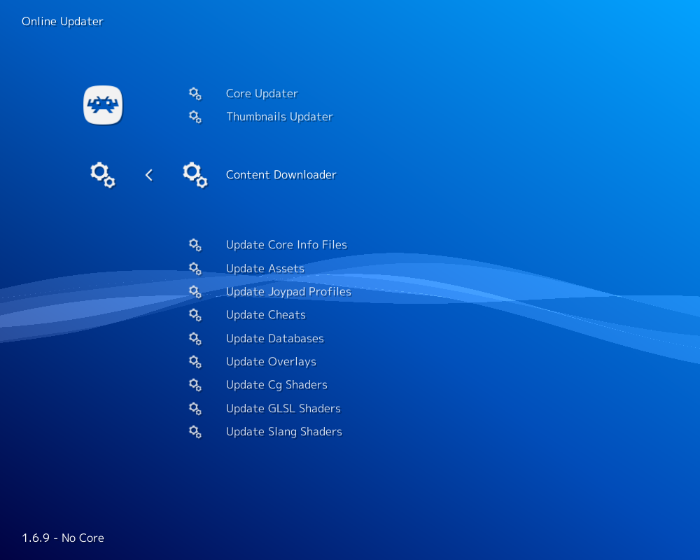
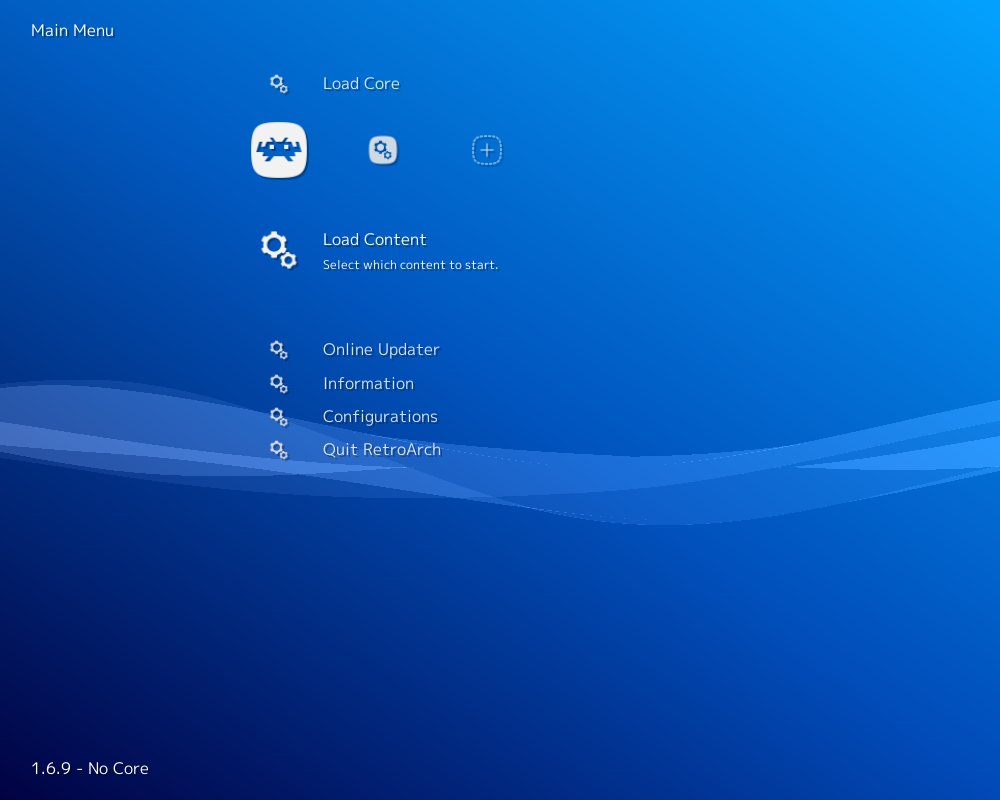

# ChaiLove

## Background

[ChaiLove](https://github.com/libretro/libretro-chailove) is a framework for making 2D games with [ChaiScript](http://chaiscript.com/). ChaiLove games can be played with LibRetro/RetroArch through the ChaiLove core.

#### How to start the ChaiLove core:

- As an example showcasing loading content with Chailove core, we will load the [Floppy Bird](https://github.com/robloach/chailove-floppybird) game hosted on RetroArch's Content Downloader.

You can do this by going to RetroArch's main menu screen and selecting 'Online Updater'. From there, select 'Content Downloader'.

  

- Select 'ChaiLove', then select 'Floppy Bird.chailove'. This should download and extract this file to RetroArch's Downloads directory.

  

- Go back to RetroArch's main menu screen. Select 'Load Content', then 'Downloads'.

  

  

- Select 'Floppy Bird.chailove'.

- If you are asked which core to select, choose 'ChaiLove'.

The content should now start running!

### Author/License

The ChaiLove core has been authored by

- Rob Loach

The ChaiLove core is licensed under

- [MIT](https://github.com/libretro/libretro-chailove/blob/master/LICENSE.md)

A summary of the licenses behind RetroArch and its cores can be found [here](../development/licenses.md).

## Extensions

Content that can be loaded by the ChaiLove core have the following file extensions:

- `.chai`
- `.chailove`

## Databases

RetroArch database(s) that are associated with the ChaiLove core:

- [ChaiLove](https://github.com/libretro/libretro-database/blob/master/rdb/ChaiLove.rdb)

## Features

Frontend-level settings or features that the ChaiLove core respects.

| Feature           | Supported |
|-------------------|:---------:|
| Restart           | ✔         |
| Screenshots       | ✔         |
| Saves             | ✕         |
| States            | ✔         |
| Rewind            | ✔         |
| Netplay           | ✔         |
| Core Options      | ✔         |
| RetroAchievements | ✕         |
| RetroArch Cheats  | ✕         |
| Native Cheats     | ✔         |
| Controls          | ✔         |
| Remapping         | ✔         |
| Multi-Mouse       | ✕         |
| Rumble            | ✕         |
| Sensors           | ✕         |
| Camera            | ✕         |
| Location          | ✕         |
| Subsystem         | ✕         |
| [Softpatching](../guides/softpatching.md) | ✕         |
| Disk Control      | ✕         |
| Username          | ✔         |
| Language          | ✕         |
| Crop Overscan     | ✕         |
| LEDs              | ✕         |

### Directories

The ChaiLove core's internal core name is 'ChaiLove'

The ChaiLove core saves/loads to/from these directories.

**Frontend's State directory**

- 'content-name'.state# (State)

### Geometry and timing

- The ChaiLove core's core provided FPS is 60
- The ChaiLove core's core provided sample rate is 44100 Hz
- The ChaiLove core's core provided aspect ratio is game provided

## Core options

The ChaiLove core has the following option(s) that can be tweaked from the core options menu. The default setting is bolded.

Settings with (Restart) means that core has to be closed for the new setting to be applied on next launch.

- **Alpha Blending** [chailove_alphablending] (**enabled**|disabled)

	Enable or disable alpha blending (transparency).

??? note "Alpha Blending - On"
	

??? note "Alpha Blending - Off"
	

- **High Quality** [chailove_highquality] (**enabled**|disabled)

	Enable or disable extra visual features.

??? note "High Quality - On"
	

??? note "High Quality - Off"
	

## Controllers

The ChaiLove core supports the following device type(s) in the controls menu, bolded device types are the default for the specified user(s):

### User 1 - 5 device types

- None - Doesn't disable input.
- **RetroPad** - Joypad - Stay on this.
- RetroPad w/Analog - Joypad - There's no reason to switch to this.

### Controller tables

#### Joypad

!!! attention
	What the buttons do are game specific.

| User 1 - 5 Remap descriptors | RetroPad Inputs                                |
|------------------------------|------------------------------------------------|
| B                            |              |
| Y                            |              |
| Select                       |         |
| Start                        |          |
| D-Pad Up                     |        |
| D-Pad Down                   |      |
| D-Pad Left                   |      |
| D-Pad Right                  |     |
| A                            |              |
| X                            |              |
| L                            |             |
| R                            |             |

## External Links

- [ChaiScript Website](http://chaiscript.com/)
- [ChaiLove API Documentation Website](https://rawgit.com/libretro/libretro-chailove/docs/)
- [ChaiLove Github Wiki](https://github.com/libretro/libretro-chailove/wiki)
- [Libretro ChaiLove Core info file](https://github.com/libretro/libretro-super/blob/master/dist/info/chailove_libretro.info)
- [Libretro ChaiLove Github Repository](https://github.com/libretro/libretro-chailove)
- [Report Libretro ChaiLove Core Issues Here](https://github.com/libretro/libretro-chailove/issues)
- [Floppy Bird](https://github.com/robloach/chailove-floppybird)
- [Gameplay Videos](https://www.youtube.com/playlist?list=PLRbgg4gk_0IfOE39vx0sftVugNnMgC67o)

### See also

#### Custom Engine

- [Lua Engine (Lutro)](lutro.md)
