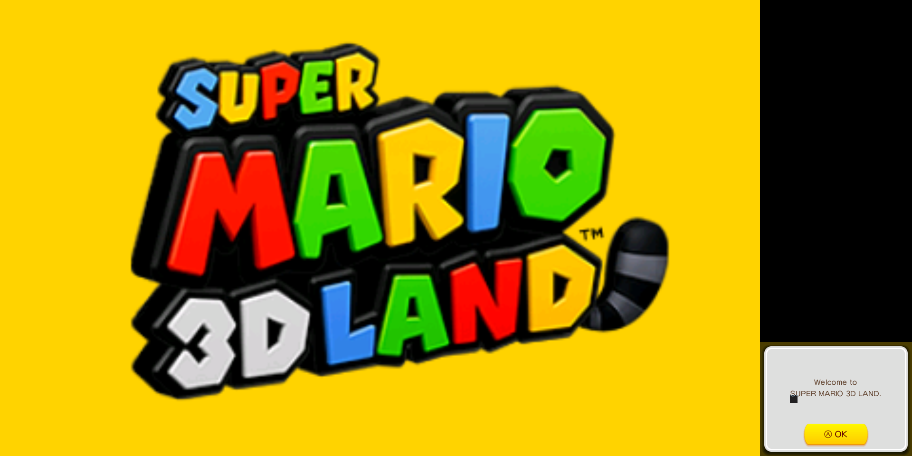

# Nintendo 3DS (Citra)

## Contribute to this documentation

In order to propose improvements to this document, [visit its corresponding source page on github](https://github.com/libretro/docs/tree/master/docs/library/citra.md). Changes are proposed using "Pull Requests."

## Background

Citra is an experimental open-source Nintendo 3DS emulator/debugger written in C++. It is written with portability in mind.

### Requirements

This core requires that you use OpenGL as the video driver. Go to Settings -> Driver. If ‘video driver’ is set to ‘vulkan’, switch it back to ‘gl’, and then restart.

!!! attention
	The Citra core requires OpenGL 3.3 or higher in order to work.

!!! warning
	There is currently no ‘working’ macOS version available. This is because this core requires OpenGL core 3.3 context, and RetroArch on macOS currently does not support this. We will have to add support for this to a future version of RetroArch on macOS before this core will start to work on it.

Also, you need to turn on ‘Enable Shared Hardware Context’ so that fullscreen toggling will work properly.	

First, you need to ensure that ‘Show Advanced Settings’ is turned on. Go to Settings -> User Interface and turn ‘Show Advanced Settings’ on.

Now, go back, and go to Settings -> Core.

Once inside the ‘Core’ settings, set ‘Enable Shared Hardware Context’ to ON.

	
### How to get and install the Citra core:

1. Start up RetroArch. Inside the main menu, go to 'Online Updater'.

2. Just to make sure we have the latest info files, select 'Update Core Info FIles'. Wait until this is done. Then, select 'Core Updater'.

3. Browse through the list and select 'Nintendo 3DS (Citra)'.

After this has finished downloading, the core should now be ready for use!

#### How to play (after installation):

1. Go back to RetroArch's main menu screen. Select 'Load Content'.

2. Browse to the folder that contains the content you want to run.

3. Select the content that you want to run.

4. If you are asked which core to select, choose 'Nintendo 3DS (Citra)'.

The game should now start running!

### Authors

- Citra Emulation Project

## License

A summary of the licenses behind RetroArch and its cores have found [here](https://docs.libretro.com/tech/licenses/).

- [GPLv2](https://github.com/citra-emu/citra/blob/master/license.txt)

## Extensions

Content that can be loaded by the Citra core have the following file extensions:

- .3ds
- .3dsx
- .elf
- .axf
- .cci
- .cxi
- .app

## Databases

RetroArch database(s) that are associated with the Citra core:

- [Nintendo - Nintendo 3DS](https://github.com/libretro/libretro-database/blob/master/rdb/Nintendo%20-%20Nintendo%203DS.rdb)

## BIOS

Awaiting description.

## Features

| Feature           | Supported |
|-------------------|:---------:|
| Restart           | ✔         |
| Screenshots       | ✔         |
| Saves             | -         |
| States            | ✕         |
| Rewind            | ✕         |
| Netplay           | ✕         |
| Core Options      | ✔         |
| RetroAchievements | ✕         |
| RetroArch Cheats  | ✕         |
| Native Cheats     | ✕         |
| Controls          | ✔         |
| Remapping         | ✔         |
| Multi-Mouse       | ✕         |
| Rumble            | ✕         |
| Sensors           | ✕         |
| Camera            | ✕         |
| Location          | ✕         |
| Subsystem         | ✕         |
| Softpatching      | ✕         |
| Disk Control      | ✕         |
| Username          | ✕         |
| Crop Overscan (in RetroArch's Video settings) | ✕         |

### Directories

The Citra core's directory name is 'Citra'

Awaiting description.

### Core provided aspect ratio

Awaiting description.

## Core options

The Citra core has the following option(s) that can be tweaked from the core options menu. The default setting is bolded. Settings with (Restart) means that core has to be closed for the new setting to be applied on next launch.

- **Enable CPU JIT** (Off/**On**)

 Enable Citra's 'dynarmic' dynamic recomplier. Can improve performance. Instructions that are not implemented by the recompiler fall back into the interpreter CPU core. 

 If disabled, Citra will solely use the Interpreter CPU core. 

- **Enable hardware renderer** (Off/**On**)

 Awaiting description. 

- **Enable shader JIT** (Off/**On**)

 Awaiting description. 

- **Resolution scale factor** (**1x (Native)**/2x/3x/4x/5x/6x/7x/8x/9x/10x)

 Awaiting description. 

- **Screen layout positioning** (**Default Top-Bottom Screen**/Single Screen Only/Large Screen, Small Screen)

 Self explanatory. 

??? note "Screen layout positioning - Default Top-Bottom Screen"
	

??? note "Screen layout positioning - Single Screen Only"
	

??? note "Screen layout positioning - Large Screen, Small Screen)"
	

- **Prominent 3DS screen** (**Top**/Bottom)

 Awaiting description. 

- **Right analog function** (**C-Stick and Touchscreen Pointer**/Touchscreen Pointer/C-Stick)

 Awaiting description. 

- **Emulated pointer deadzone (%)** (0 to 35 in increments of 5. **15 is default.**)

 Awaiting description. 

- **Enable frame limiter** (Off/**On**)

 Awaiting description. 

- **Enable audio stretching** (Off/**On**)

 Awaiting description. 

- **Enable virtual SD card** (Off/**On**)

 Awaiting description. 

- **3DS system model** (**Old 3DS**/New 3DS)

 Awaiting description. 

- **3DS system region** (**Auto**/Japan/USA/Europe/Australia/China/Korea/Taiwan)

 Awaiting description. 

- **Enable GDB stub** (**Off**/On)

 Awaiting description. 

## Controllers

### Device types

The Citra core supports the following device type(s) in the controls menu, bolded device types are the default for the specified user(s):

#### User 1 device types

- None - Input disabled.
- **RetroPad** - Joypad
- Nintendo 3DS - Joy[ad

### Controller tables

#### Joypad and analog device type table

| User 1 input descriptors      |                                              | Nintendo 3DS       |
|-------------------------------|----------------------------------------------|--------------------|
| B                             |        | B                  |
| Y                             |        | Y                  |
| Select                        |         | Select             |
| Start                         |          | Start              |
| Up                            |        | Up                 |
| Down                          |      | Down               |
| Left                          |      | Left               |
| Right                         |     | Right              |
| A                             |        | A                  |
| X                             |        | X                  |
| L                             |             | L                  |
| R                             |             | R                  |
| ZL                            |             | ZL                 |
| ZR                            |             | ZR                 |
| Home                          |             | Home               |
| N/A                           |             | [Right analog function](https://docs.libretro.com/library/citra/#core-options) |
| N/A                           |  X  | Circle Pad X       |
| N/A                           |  Y  | Circle Pad Y       |
| N/A                           |  X | [Right analog function](https://docs.libretro.com/library/citra/#core-options) X |
| N/A                           |  Y | [Right analog function](https://docs.libretro.com/library/citra/#core-options) Y |

#### Pointer device type table

| User 1 input descriptors      |                 | Touchscreen Pointer |
|-------------------------------|-----------------|---------------------|
| N/A                           | Pointer         | Touchscreen Pointer |
| N/A                           | Pointer Pressed | Touchscreen Pressed |

## Compatibility

- [Citra Game Compatibility List](https://citra-emu.org/game/)

## External Links

- [Libretro Citra Core info file](https://github.com/libretro/libretro-super/blob/master/dist/info/citra_libretro.info)
- [Libretro Citra Github Repository](https://github.com/libretro/citra)
- [Report Libretro Citra Core Issues Here](https://github.com/libretro/citra/issues)
- [Official Citra Website](https://citra-emu.org/)
- [Official Citra Github Repository](https://github.com/citra-emu/citra)
