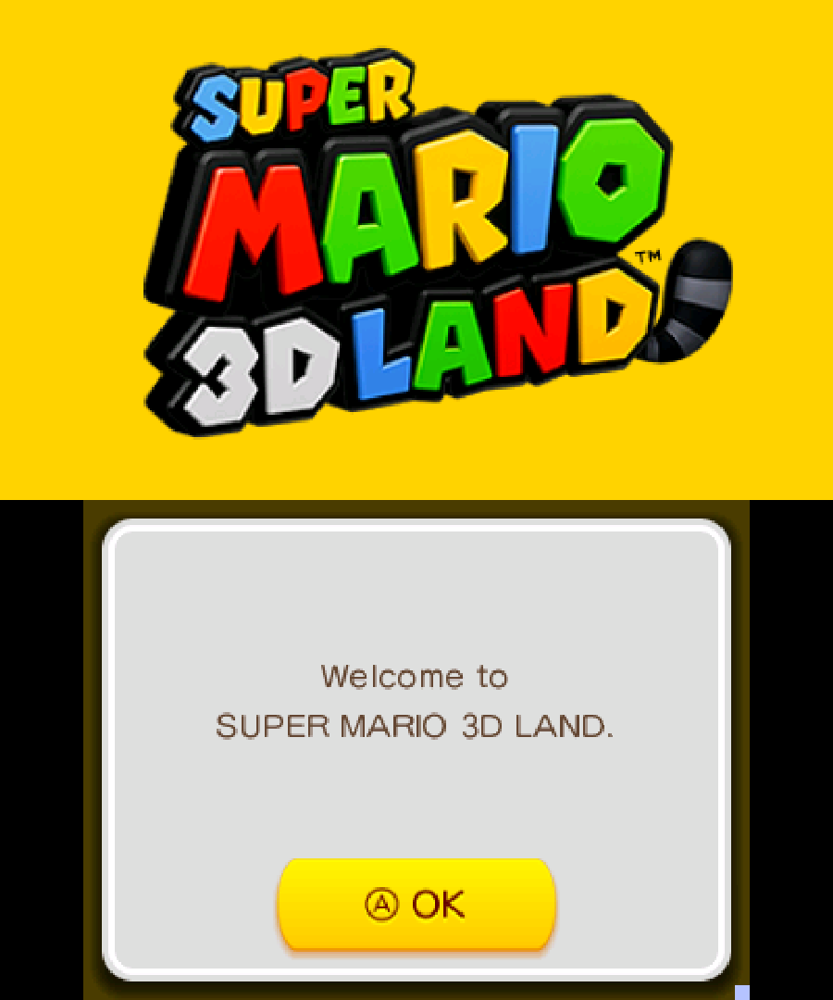
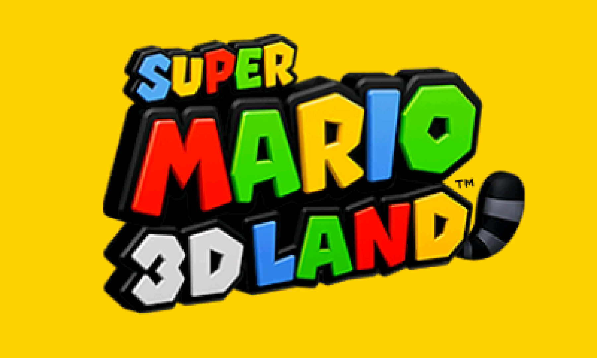

# Nintendo - 3DS (Citra Canary/Experimental)

## Background

Citra is an experimental open-source Nintendo 3DS emulator/debugger written in C++. It is written with portability in mind.

**Citra Canary is the new performance-optimized version of Citra.**

The Citra Canary/Experimental core has been authored by

- Citra Emulation Project

The Citra Canary/Experimental core is licensed under

- [GPLv2](https://github.com/citra-emu/citra/blob/master/license.txt)

A summary of the licenses behind RetroArch and its cores can be found [here](../development/licenses.md).

### Requirements

OpenGL 3.3 or higher

!!! warning
	There is currently no ‘working’ macOS version available. This is because this core requires OpenGL core 3.3 context, and RetroArch on macOS currently does not support this. We will have to add support for this to a future version of RetroArch on macOS before this core will start to work on it.

## Extensions

Content that can be loaded by the Citra Canary/Experimental core have the following file extensions:

- .3ds
- .3dsx
- .elf
- .axf
- .cci
- .cxi
- .app

RetroArch database(s) that are associated with the Citra Canary/Experimental core:

- [Nintendo - Nintendo 3DS](https://github.com/libretro/libretro-database/blob/master/rdb/Nintendo%20-%20Nintendo%203DS.rdb)

## Features

Frontend-level settings or features that the Citra Canary/Experimental core respects.

| Feature           | Supported |
|-------------------|:---------:|
| Restart           | ✔         |
| Screenshots       | ✔         |
| Saves             | ✔         |
| States            | ✕         |
| Rewind            | ✕         |
| Netplay           | ✕         |
| Core Options      | ✔         |
| RetroAchievements | ✕         |
| RetroArch Cheats  | ✕         |
| Native Cheats     | ✕         |
| Controls          | ✔         |
| Remapping         | ✔         |
| Multi-Mouse       | ✕         |
| Rumble            | ✕         |
| Sensors           | ✕         |
| Camera            | ✕         |
| Location          | ✕         |
| Subsystem         | ✕         |
| [Softpatching](../guides/softpatching.md) | ✕         |
| Disk Control      | ✕         |
| Username          | ✕         |
| Language          | ✕         |
| Crop Overscan     | ✕         |
| LEDs              | ✕         |

### Directories

The Citra Canary/Experimental core's library name is 'Citra'

The Citra Canary/Experimental core saves/loads to/from these directories.

**Frontend's Save directory**

- [Citra System and Save files](https://citra-emu.org/wiki/user-directory/)

### Geometry and timing

- The Citra Canary/Experimental core's core provided FPS is 60.0
- The Citra Canary/Experimental core's core provided sample rate is 32728 Hz
- The Citra Canary/Experimental core's base width is (Base width)
- The Citra Canary/Experimental core's base height is (Base height)
- The Citra Canary/Experimental core's max width is (Max width)
- The Citra Canary/Experimental core's max height is (Max height)
- The Citra Canary/Experimental core's core provided aspect ratio is (Ratio)

## Core options

The Citra Canary/Experimental core has the following option(s) that can be tweaked from the core options menu. The default setting is bolded.

Settings with (Restart) means that core has to be closed for the new setting to be applied on next launch.

- **Enable CPU JIT** [citra_use_cpu_jit] (**enabled**|disabled)

	Enable Citra's 'dynarmic' dynamic recomplier. Can improve performance. Instructions that are not implemented by the recompiler fall back into the interpreter CPU core.

	If disabled, Citra will solely use the Interpreter CPU core.

- **Select Renderer** [citra_renderer] (**enabled**|disabled)

	Awaiting description.

- **Enable shader JIT** [citra_use_shader_jit] (**enabled**|disabled)

	Awaiting description.

- **Resolution scale factor** [citra_resolution_factor] (**1x (Native)**|2x|3x|4x|5x|6x|7x|8x|9x|10x)

	Self-explanatory.

??? note "Screen layout positioning - Default Top-Bottom Screen"
	

??? note "Screen layout positioning - Single Screen Only"
	

??? note "Screen layout positioning - Large Screen, Small Screen)"
	

- **Screen layout positioning** [citra_layout_option] (**Default Top-Bottom Screen**|Single Screen Only|Large Screen, Small Screen|Side by Side)

	Awaiting description.

- **Prominent 3DS screen** [citra_swap_screen] (**Top**|Bottom)

	Awaiting description.

- **Right analog function** [citra_analog_function] (**C-Stick and Touchscreen Pointer**|Touchscreen Pointer|C-Stick)

	Awaiting description.

- **Emulated pointer deadzone (%)** [citra_deadzone] (**15**|20|25|30|35|0|5|10)

	Awaiting description.

- **What hardware shaders to enable** [citra_hw_shaders] (**None**|Partial|Full)

	Awaiting description.

- **Enables accurate hardware shaders (infinity * 0 = 0), required for some games, though slow on some hardware** [citra_use_accurate_mul] (**enabled**|disabled)

	Awaiting description.

- **Enable virtual SD card** [citra_use_virtual_sd] (**enabled**|disabled)

	Awaiting description.

- **Savegame location** [citra_use_libretro_save_path] (**LibRetro Default**|Citra Default)

	Awaiting description.

- **3DS system model** [citra_is_new_3ds] (**Old 3DS**|New 3DS)

	Awaiting description.

- **3DS system region** [citra_region_value] (**Auto**|Japan|USA|Europe|Australia|China|Korea|Taiwan)

	Awaiting description.

- **"Enable GDB stub** [citra_use_gdbstub] (**disabled**|enabled)

	Awaiting description.

## Joypad

| User 1 input descriptors | RetroPad Inputs                                | Citra inputs       |
|--------------------------|------------------------------------------------|--------------------|
| B                        |              | B                  |
| Y                        |              | Y                  |
| Select                   |         | Select             |
| Start                    |          | Start              |
| Up                       |        | Up                 |
| Down                     |      | Down               |
| Left                     |      | Left               |
| Right                    |     | Right              |
| A                        |              | A                  |
| X                        |              | X                  |
| L                        |             | L                  |
| R                        |             | R                  |
| ZL                       |             | ZL                 |
| ZR                       |             | ZR                 |
| Home                     |             | Home               |
| Touch Screen Touch       |             | Touch Screen Touch |
|                          |  X  | Circle Pad X       |
|                          |  Y  | Circle Pad Y       |
|                          |  X | [Right analog function](#core-options) |
|                          |  Y | [Right analog function](#core-options) |

### Mouse

| RetroMouse Inputs                                     | Citra inputs        |
|-------------------------------------------------------|---------------------|
|  Mouse Cursor | Touchscreen Pointer |
|  Mouse 1       | Touch Screen Touch  |

### Pointer

| RetroPointer Inputs                                                                                                      | Citra inputs        |
|--------------------------------------------------------------------------------------------------------------------------|---------------------|
|  or  Pointer Position | Touchscreen Pointer |
|  or  Pointer Pressed            | Touch Screen Touch  |

## Compatibility

- [Citra Game Compatibility List](https://citra-emu.org/game/)

## External Links

- [Official Citra Canary/Experimental Website](https://citra-emu.org/)
- [Official Citra Canary/Experimental Github Repository](https://github.com/citra-emu/citra)
- [Libretro Citra Canary/Experimental Core info file](https://github.com/libretro/libretro-super/blob/master/dist/info/citra_canary_libretro.info)
- [Libretro Citra Canary/Experimental Github Repository](https://github.com/libretro/citra/tree/canary)
- [Report Libretro Citra Canary/Experimental Core Issues Here](https://github.com/libretro/citra/issues)

## Nintendo - Nintendo 3DS

- [Nintendo - 3DS (Citra)](citra.md)
