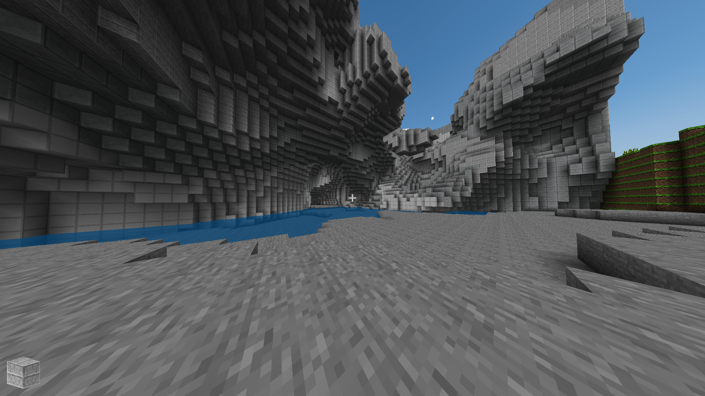
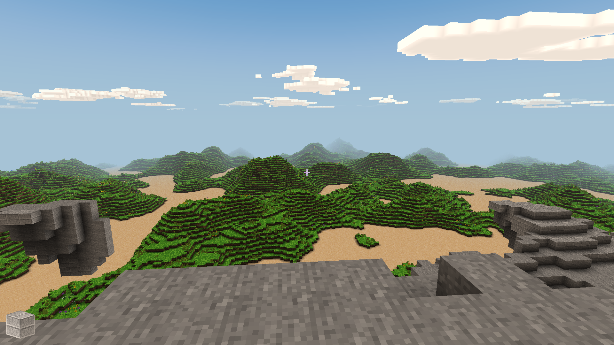
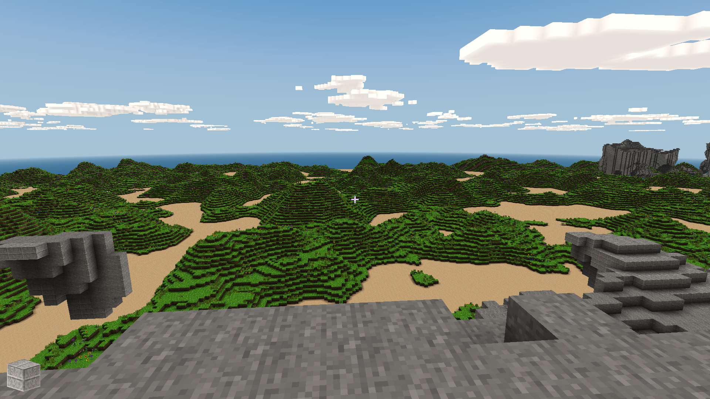

# Minecraft (Craft)

## Background

A simple Minecraft clone written in C using modern OpenGL (shaders).

## Features

- Simple but nice looking terrain generation using simplex noise.
- Biomes
- Water
- More than 20 types of blocks and more can be added easily.
- Supports plants (grass, flowers, trees, etc.) and transparency (glass).
- Simple clouds in the sky (they don't move).
- Day / night cycles and a textured sky dome.
- More sophisticated sunrise/sunset color blending
- Ambient occlusion for basic shading of blocks.
- World changes persisted in a sqlite3 database.
- Configurable draw distance. The draw distance has a big effect on the framerate, a draw distance of 1 or 2 can make this core playable even on very lightweight computers.
- Configurable field of view.
- Gamepad support (including analog stick support) configurable analog sensitivity and deadzones, preliminary mouse and keyboard support.
- Configurable resolutions, up to 4K.
- A ‘Jumping Flash’ mode that allows you to jump infinitely into the air all while the camera faces downwards.

The Craft core has been authored by

- Michael Fogleman

The Craft core is licensed under

- [MIT](https://github.com/libretro/Craft/blob/master/LICENSE.md)

A summary of the licenses behind RetroArch and its cores can be found [here](../development/licenses.md).

## Requirements

- OpenGL or OpenGL ES

## How to start the Craft core:

- To start the Craft core, go to RetroArch's main menu screen. Select 'Load Core', then 'Craft'.

- Now, select 'Start Core'.

The content should now start running!

## Features

Frontend-level settings or features that the Craft core respects.

| Feature           | Supported |
|-------------------|:---------:|
| Restart           | ✕         |
| Saves             | ✔         |
| States            | ✕         |
| Rewind            | ✕         |
| Netplay           | ✕         |
| Core Options      | ✔         |
| RetroAchievements | ✕         |
| RetroArch Cheats  | ✕         |
| Native Cheats     | ✕         |
| Controls          | ✔         |
| Remapping         | ✕         |
| Multi-Mouse       | ✕         |
| Rumble            | ✕         |
| Sensors           | ✕         |
| Camera            | ✕         |
| Location          | ✕         |
| Subsystem         | ✕         |
| [Softpatching](../guides/softpatching.md) | ✕         |
| Disk Control      | ✕         |
| Username          | ✕         |
| Language          | ✕         |
| Crop Overscan     | ✕         |
| LEDs              | ✕         |

## Directories

The Craft core's library name is 'Craft'

The Craft core saves/loads to/from these directories.

**Frontend's System directory**

| File     | Description |
|:--------:|:-----------:|
| craft.db | World data  |

## Geometry and timing

- The Craft core's core provided FPS is 60.0
- The Craft core's core provided sample rate is 48000 Hz
- The Craft core's base width is 640
- The Craft core's base height is 480
- The Craft core's max width is 640
- The Craft core's max height is 480
- The Craft core's core provided aspect ratio is 16/9

## Core options

The Craft core has the following option(s) that can be tweaked from the core options menu. The default setting is bolded.

Settings with (Restart) means that core has to be closed for the new setting to be applied on next launch.

- **Resolution (restart)** [craft_resolution] (**640x480**|320x200|640x400|960x600|1280x800|1600x1000|1920x1200|2240x1400|2560x1600|2880x1800|3200x2000|3520x2200|3840x2400|7680x4320|15360x8640|16000x9000|320x240|320x480|360x200|360x240|360x400|360x480|400x224|480x272|512x224|512x240|512x384|512x512|640x224|640x240|640x448|720x576|800x480|800x600|960x720|1024x768|1280x720|1366x768|1600x900|1920x1080|2048x2048|4096x4096)

	Configure the resolution.

??? note "Resolution - 320x240"
	

??? note "Resolution - 1920x1080"
	

- **Show info text** [craft_show_info_text] (**disabled**|enabled)

	Show game information in the upper left corner of Craft.

??? note "Show info text - Off"
	

??? note "Show info text - On"
	

- **Jumping Flash mode** (**Off**/On):

	Enabling this allows you to jump infinitely into the air all while the camera faces downwards.

- **Field of view** [craft_field_of_view] (**65** to 150 in increments of 5)

	Configure the field of view.

??? note "Field of view - 65"
	

??? note "Field of view - 125"
	

- **Draw distance** [craft_draw_distance] (1 to 32 in increments of 1. **10 is default**)

	Configure the draw distance.

??? note "Draw distance - 10"
	

??? note "Draw distance - 32"
	

- **Inverted aim** [craft_inverted_aim] (**disabled**|enabled)

	Invert up and down crosshair aiming controls for the RetroPad and the RetroMouse.

- **Right analog sensitivity** [craft_analog_sensitivity] (**0.0150** to 0.0500 in increments of 0.0025)

	Modify the RetroPad right analog stick's sensitivity.

- **Analog deadzone size** [craft_deadzone_radius] (**0.010** to 0.200 in increments of 0.005)

	Modify RetroPad analog sticks' deadzone.

## Joypad

| RetroPad Inputs                                | Craft Inputs              |
|------------------------------------------------|---------------------------|
|              | Jump                      |
|              | Destroy block             |
|         | Zoom out                  |
|        | Move forwards             |
|      | Move backwards            |
|      | Move crosshair left       |
|     | Move crosshair right      |
|              | Next block                |
|              | Place block               |
|             | Move left                 |
|             | Move right                |
|             | Move crosshair up         |
|             | Move crosshair down       |
|  X  | Move left/right           |
|  Y  | Move up/down              |
|  X | Move crosshair left/right |
|  Y | Move crosshair up.down    |

## Keyboard

| RetroKeyboard Inputs | Craft Inputs         |
|----------------------|----------------------|
| Keyboard Up          | Move forwards        |
| Keyboard Down        | Move backwards       |
| Keyboard Right       | Move crosshair left  |
| Keyboard Left        | Move crosshair right |
| Keyboard Right Shift | Zoom out             |

## Mouse

| RetroMouse Inputs                                     | Craft Inputs   |
|-------------------------------------------------------|----------------|
|  Mouse Cursor | Move crosshair |
|  Mouse 1       | Destroy block  |
|  Mouse 2      | Place block    |
|  Mouse 3     | Copy block     |
| Wheel Up                                              | Previous block |
| Wheel Down                                            | Next block     |

## External Links

- [Official Craft Website](https://www.michaelfogleman.com/projects/craft/)
- [Official Craft Github Repository](https://github.com/fogleman/Craft)
- [Libretro Craft Core info file](https://github.com/libretro/libretro-super/blob/master/dist/info/craft_libretro.info)
- [Libretro Craft Github Repository](https://github.com/libretro/craft)
- [Report Libretro Craft Core Issues Here](https://github.com/libretro/Craft/issues)