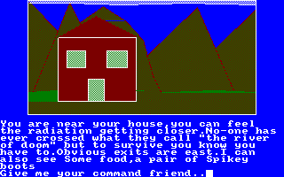
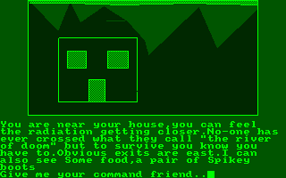
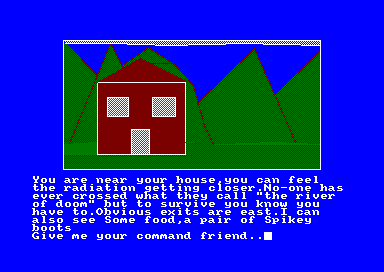

# Amstrad - CPC (CrocoDS)

## Background

Based on Win-CPC. CrocoDS was originally an Amstrad CPC emulator created for the Nintendo DS and was ported to libretro some time after.

### Author/License

The CrocoDS core has been authored by

- RedBug

The CrocoDS core is licensed under

- [MIT](https://github.com/libretro/libretro-crocods/blob/master/LICENSE)

A summary of the licenses behind RetroArch and its cores can be found [here](../development/licenses.md).

## Extensions

Content that can be loaded by the CrocoDS core have the following file extensions:

- .dsk
- .sna
- .[kcr](https://github.com/redbug26/crocods-core/wiki/kcr)

## Databases

RetroArch database(s) that are associated with the CrocoDS core:

- [Amstrad - CPC](https://github.com/libretro/libretro-database/blob/master/rdb/Amstrad%20-%20CPC.rdb)

## Features

Frontend-level settings or features that the CrocoDS core respects.

| Feature           | Supported |
|-------------------|:---------:|
| Restart           | ✔         |
| Screenshots       | ✔         |
| Saves             | ✕         |
| States            | ✔         |
| Rewind            | ✔         |
| Netplay           | ✔         |
| Core Options      | ✔         |
| RetroAchievements | ✕         |
| RetroArch Cheats  | ✕         |
| Native Cheats     | ✕         |
| Controls          | ✔         |
| Remapping         | ✔         |
| Multi-Mouse       | ✕         |
| Rumble            | ✕         |
| Sensors           | ✕         |
| Camera            | ✕         |
| Location          | ✕         |
| Subsystem         | ✕         |
| [Softpatching](../guides/softpatching.md) | ✕         |
| Disk Control      | ✕         |
| Username          | ✕         |
| Language          | ✕         |
| Crop Overscan     | ✕         |
| LEDs              | ✕         |

### Directories

The CrocoDS core's internal core name is 'crocods'

The CrocoDS core saves/loads to/from these directories.

**Frontend's State directory**

- 'content-name'.state# (State)

### Geometry and timing

- The CrocoDS core's core provided FPS is 50
- The CrocoDS core's core provided sample rate is 44100 Hz
- The CrocoDS core's core provided aspect ratio is 1

## Core options

The CrocoDS core has the following option(s) that can be tweaked from the core options menu. The default setting is bolded.

Settings with (Restart) means that core has to be closed for the new setting to be applied on next launch.

- **Color Monitor** [crocods_greenmonitor] (**color**|green)

	Self-explanatory.

??? note "Color Monitor - color"
	

??? note "Color Monitor - green"
	

- **Resize** [crocods_resize] (**Auto**|320x200|Overscan)

	Self-explanatory.

??? note "Resize - 320x200"
	

??? note "Resize - Overscan"
	

- **Speed hack** [crocods_hack] (**no**|yes)

	Awaiting description.

## Controllers

The CrocoDS core supports the following device type(s) in the controls menu, bolded device types are the default for the specified user(s):

### User 1 - 2 device types

- None - Doesn't disable input. There's no reason to switch to this.
- **RetroPad** - Joypad
- RetroKeyboard - Joypad - Keyboard inputs are always active. Has keymapper support.

### Controller tables

#### Joypad

| User 1 Remap descriptors | RetroPad Inputs                                | CrocoDS core inputs |
|--------------------------|------------------------------------------------|---------------------|
|                          |              | JOY_FIRE2           |
|                          |              | NIL                 |
| Pause                    |         | SPARE               |
| Start                    |          | RETURN              |
| Up                       |        | JOY_UP              |
| Down                     |      | JOY_DOWN            |
| Left                     |      | JOY_LEFT            |
| Right                    |     | JOY_RIGHT           |
|                          |              | JOY_FIRE1           |
|                          |              | NIL                 |
|                          |             | NIL                 |
|                          |             | NIL                 |

| User 2 Remap descriptors | RetroPad Inputs                                | CrocoDS core inputs |
|--------------------------|------------------------------------------------|---------------------|
|                          |              | SPARE               |
|                          |              | NIL                 |
|                          |         | SPARE               |
|                          |          | RETURN              |
|                          |        | CURSOR_UP           |
|                          |      | CURSOR_DOWN         |
|                          |      | CURSOR_LEFT         |
|                          |     | CURSOR_RIGHT        |
|                          |              | SPARE               |
|                          |              | NIL                 |
|                          |             | NIL                 |
|                          |             | NIL                 |

#### Keyboard

| RetroKeyboard Inputs         | CrocoDS core Inputs |
|------------------------------|---------------------|
| Keyboard Backspace           | DEL                 |
| Keyboard Tab                 | TAB                 |
| Keyboard Return              | RETURN              |
| Keyboard Escape              | ESC                 |
| Keyboard Space               | SPARE               |
| Keyboard Comma ,             | COMMA               |
| Keyboard Minus -             | MINUS               |
| Keyboard Period .            | DOT                 |
| Keyboard 0                   | 0                   |
| Keyboard 1                   | 1                   |
| Keyboard 2                   | 2                   |
| Keyboard 3                   | 3                   |
| Keyboard 4                   | 4                   |
| Keyboard 5                   | 5                   |
| Keyboard 6                   | 6                   |
| Keyboard 7                   | 7                   |
| Keyboard 8                   | 8                   |
| Keyboard 9                   | 9                   |
| Keyboard Semicolon ;         | COLON               |
| Keyboard Equals =            | HAT                 |
| Keyboard Left Bracket [      | AT                  |
| Keyboard Right Bracket ]     | OPEN_SQUARE_BRACKET |
| Keyboard a                   | A                   |
| Keyboard b                   | B                   |
| Keyboard c                   | C                   |
| Keyboard d                   | D                   |
| Keyboard e                   | E                   |
| Keyboard f                   | F                   |
| Keyboard g                   | G                   |
| Keyboard h                   | H                   |
| Keyboard i                   | I                   |
| Keyboard j                   | J                   |
| Keyboard k                   | K                   |
| Keyboard l                   | L                   |
| Keyboard m                   | M                   |
| Keyboard n                   | N                   |
| Keyboard o                   | O                   |
| Keyboard p                   | P                   |
| Keyboard q                   | Q                   |
| Keyboard r                   | R                   |
| Keyboard s                   | S                   |
| Keyboard t                   | T                   |
| Keyboard u                   | U                   |
| Keyboard v                   | V                   |
| Keyboard w                   | W                   |
| Keyboard x                   | X                   |
| Keyboard y                   | Y                   |
| Keyboard z                   | Z                   |
| Keyboard Delete              | JOY_LEFT            |
| Keyboard Keypad 0            | F0                  |
| Keyboard Keypad 1            | F1                  |
| Keyboard Keypad 2            | F2                  |
| Keyboard Keypad 3            | F3                  |
| Keyboard Keypad 4            | F4                  |
| Keyboard Keypad 5            | F5                  |
| Keyboard Keypad 6            | F6                  |
| Keyboard Keypad 7            | F7                  |
| Keyboard Keypad 8            | F8                  |
| Keyboard Keypad 9            | F9                  |
| Keyboard Keypad Period .     | FDOT                |
| Keyboard Keypad Enter        | SMALL_ENTER         |
| Keyboard Up                  | CURSOR_UP           |
| Keyboard Down                | CURSOR_DOWN         |
| Keyboard Right               | CURSOR_RIGHT        |
| Keyboard Left                | CURSOR_LEFT         |
| Keyboard Insert              | JOY_FIRE1           |
| Keyboard Home                | JOY_UP              |
| Keyboard End                 | JOY_DOWN            |
| Keyboard Page Up             | JOY_FIRE2           |
| Keyboard Page Down           | JOY_RIGHT           |
| Keyboard Caps Lock           | CAPS_LOCK           |
| Keyboard Right Shift         | SHIFT               |
| Keyboard Left Shift          | SHIFT               |
| Keyboard Right Control       | CONTROL             |
| Keyboard Left Control        | CONTROL             |

## External Links

- [Official CrocoDS Github Repository](https://github.com/redbug26/crocods-core)
- [Libretro CrocoDS Core info file](https://github.com/libretro/libretro-super/blob/master/dist/info/crocods_libretro.info)
- [Libretro CrocoDS Github Repository](https://github.com/libretro/libretro-crocods)
- [Report Libretro CrocoDS Core Issues Here](https://github.com/libretro/libretro-crocods/issues)

### See also

#### Amstrad - CPC

- [Amstrad - CPC (Caprice32)](caprice32.md)