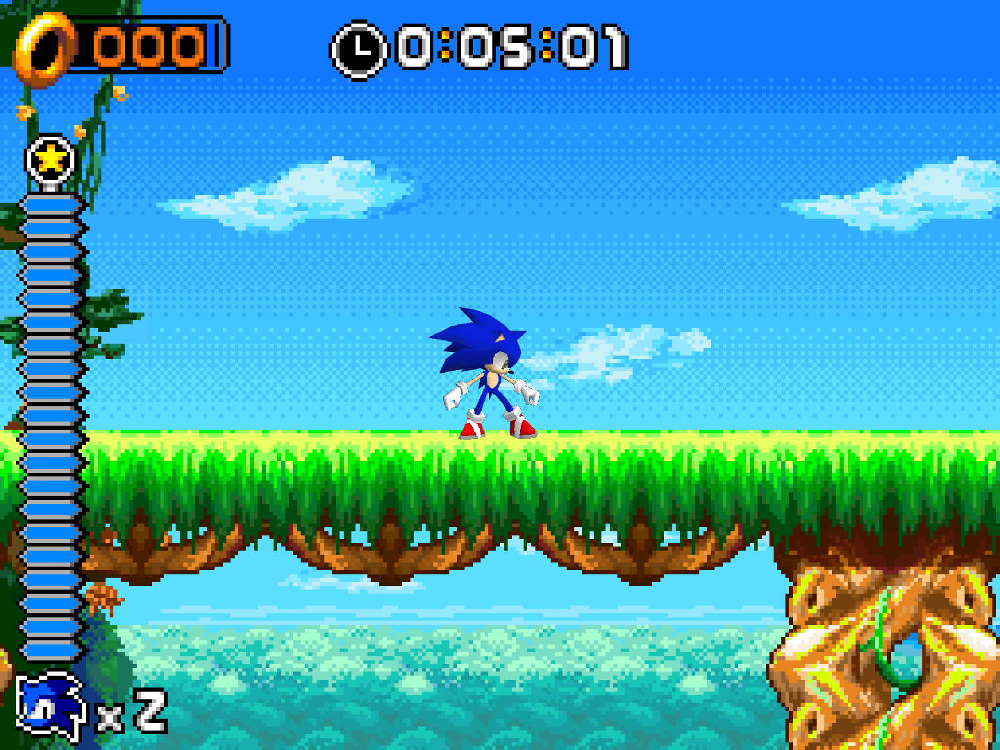
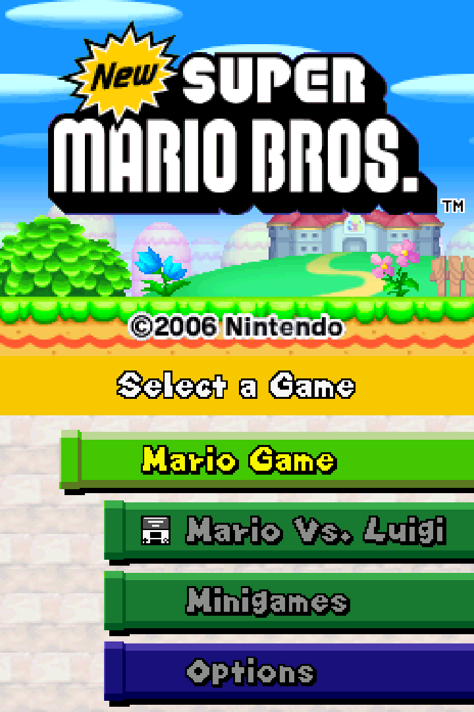
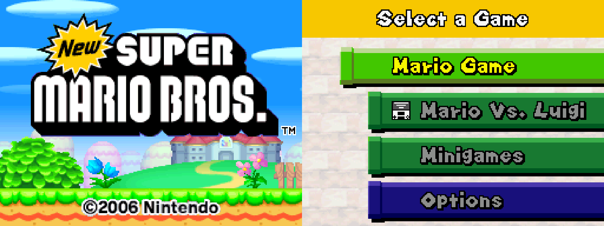
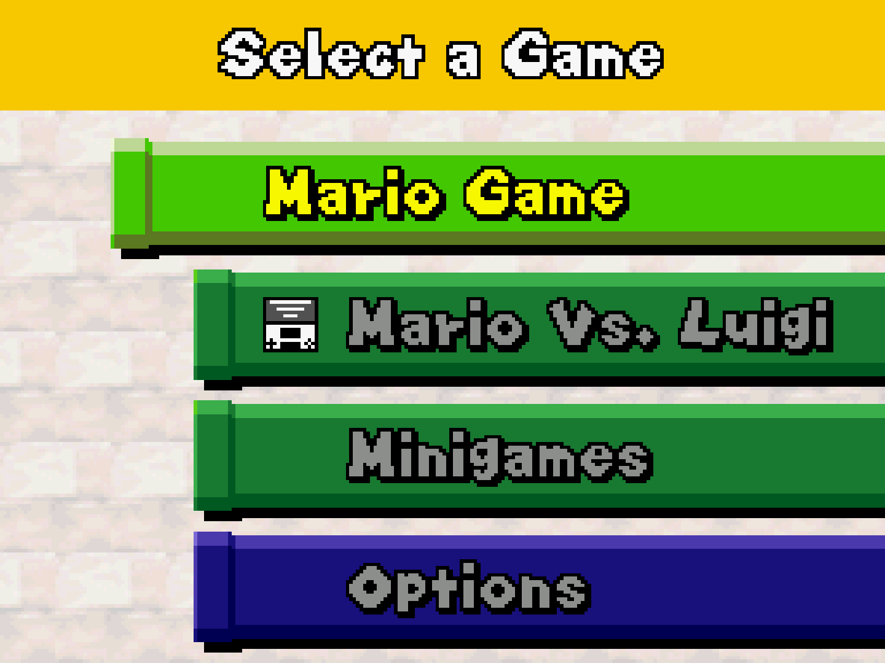
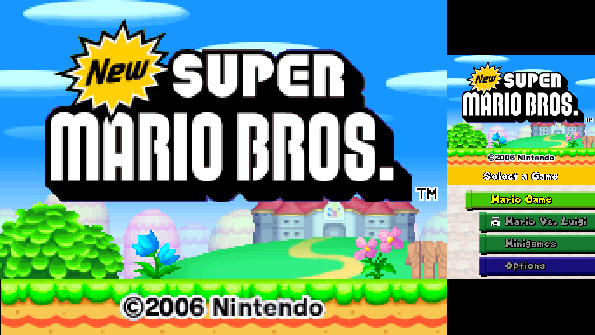

# Nintendo - DS (DeSmuME)

## Background

DeSmuME is a Nintendo DS emulator [http://desmume.org](http://desmume.org)

### Author/License

The DeSmuME core has been authored by

- YopYop156
- Zeromus

The DeSmuME core is licensed under

- [GPLv2](https://github.com/TASVideos/desmume/blob/master/license.txt)

A summary of the licenses behind RetroArch and its cores can be found [here](../development/licenses.md).

## Extensions

Content that can be loaded by the DeSmuME core have the following file extensions:

- .nds
- .bin

## Databases

RetroArch database(s) that are associated with the DeSmuME core:

- [Nintendo - Nintendo DS](https://github.com/libretro/libretro-database/blob/master/rdb/Nintendo%20-%20Nintendo%20DS.rdb)
- [Nintendo - Nintendo DS Decrypted](https://github.com/libretro/libretro-database/blob/master/rdb/Nintendo%20-%20Nintendo%20DS%20Decrypted.rdb)
- [Nintendo - Nintendo DS (Download Play)](https://github.com/libretro/libretro-database/blob/master/rdb/Nintendo%20-%20Nintendo%20DS%20(Download%20Play).rdb)

## BIOS

Required or optional firmware files go in the frontend's `system` directory.

!!! warning
	In order for the firmware files to be loaded by the DeSmuME core, the 'Use External BIOS/Firmware (restart)' core option must be set to enabled.
The md5sum of firmware.bin will vary from dump to dump. bios7 and bios9 should be the exact same as here. firmware.bin may not be the same.

|   Filename   |    Description          |              md5sum              |
|:------------:|:-----------------------:|:--------------------------------:|
| bios7.bin    | ARM7 BIOS - Optional    | df692a80a5b1bc90728bc3dfc76cd948 |
| bios9.bin    | ARM9 BIOS - Optional    | a392174eb3e572fed6447e956bde4b25 |
| firmware.bin | NDS Firmware - Optional |                                  |

## Features

Frontend-level settings or features that the DeSmuME core respects.

| Feature           | Supported |
|-------------------|:---------:|
| Restart           | ✔         |
| Screenshots       | ✔         |
| Saves             | ✔         |
| States            | ✔         |
| Rewind            | ✔         |
| Netplay           | ✔ (Not Download Play, Link-Cable or Wi-Fi emulation)         |
| Core Options      | ✔         |
| RetroAchievements | ✔         |
| RetroArch Cheats  | ✔         |
| Native Cheats     | ✕         |
| Controls          | ✔         |
| Remapping         | ✔         |
| Multi-Mouse       | ✕         |
| Rumble            | ✕         |
| Sensors           | ✕         |
| Camera            | ✕         |
| Location          | ✕         |
| Subsystem         | ✕         |
| [Softpatching](../guides/softpatching.md) | ✕         |
| Disk Control      | ✕         |
| Username          | ✔         |
| Language          | ✕         |
| Crop Overscan     | ✕         |
| LEDs              | ✕         |

### Directories

The DeSmuME core's library name is 'DeSmuME'

The DeSmuME core saves/loads to/from these directories.

**Frontend's Save directory**

| File         | Description            |
|:------------:|:----------------------:|
| *.dsv        | Cartridge battery save |
| firmware.dfc | Firmware settings save |

**Frontend's State directory**

| File    | Description |
|:-------:|:-----------:|
| *.state | State       |

### Geometry and timing

- The DeSmuME core's core provided FPS is 60
- The DeSmuME core's core provided sample rate is 44100 Hz
- The DeSmuME core's base width is dependent on the ['Screen layout' core option](#core-options).
- The DeSmuME core's base height is dependent on the ['Screen layout' core option](#core-options).
- The DeSmuME core's max width is dependent on the ['Screen layout' core option](#core-options).
- The DeSmuME core's max height is dependent on the ['Screen layout' core option](#core-options).
- The DeSmuME core's core provided aspect ratio is dependent on the ['Screen layout' core option](#core-options).

## Nickname

The Nintendo DS' system nickname can be configured via RetroArch's Username setting in the User Menu.

## Core options

The DeSmuME core has the following option(s) that can be tweaked from the core options menu. The default setting is bolded.

Settings with (Restart) means that core has to be closed for the new setting to be applied on next launch.

- **Firmware Language** [desmume_firmware_language] (**Auto**|English|Japanese|French|German|Italian|Spanish)

	Choose the language of the firmware.

- **Use External BIOS/Firmware (restart)** [desmume_use_external_bios] (**disabled**|enabled)

	When set to enabled, the DeSmuME core will use the external firmware files found in RetroArch's System Directory. Look at the [BIOS section](#bios) for more information.

- **Boot Into BIOS (interpreter and external bios only)** [desmume_boot_into_bios] (**disabled**|enabled)

	**For proper functionality of this core option. The 'CPU Mode' core option must be set to interpreter and the 'Use External BIOS/Firmware' core option must be set to enabled.**

	**Also, you must have external firmware files in RetroArch's System Directory.**

	When set to enabled, the DeSmuME core will boot into the Nintendo DS firmware screen upon content load.

	Any settings changed in the firmware screen will be saved to firmware.dfc in RetroArch's Save directory.

- **Load Game Into Memory (restart)** [desmume_load_to_memory] (**disabled**|enabled)

	Loads the entire game into memory before startup. Will decrease in-game loading times at the cost of increased game startup times.

- **CPU Cores** [desmume_num_cores] (**1**|2|3|4)

	Configure how many CPU cores the DeSmuME core will use. Please note that, in general, DeSmuME benefits more from few fast CPUs than from many slow CPUs. For example, a dual-core 3.9GHz CPU will run DeSmuME much faster than a 12-core 1.6GHz CPU.

- **CPU Mode** [desmume_cpu_mode] (**jit**|interpreter)

	Choose to run CPU emulation through the Interpreter engine or the JIT Dynamic Recomplier engine.

	Interpreter has better compatibility than JIT Dynamic Recompiler. Some games that fail when using JIT Dynamic Recompiler will work fine with Interpreter. The tradeoff here is that Interpreter has much lower performance than JIT Dynamic Recompiler.

	Please note that the default setting for this core option is dependent on your hardware. The JIT Dynamic Recompiler is not available on all hardware (e.g. Android devices).

- **JIT Block Size** [desmume_jit_block_size] (**12**|13|14|15|16|17|18|19|20|21|22|23|24|25|26|27|28|29|30|31|32|33|34|35|36|37|38|39|40|41|42|43|44|45|46|47|48|49|50|51|52|53|54|55|56|57|58|59|60|61|62|63|64|65|66|67|68|69|70|71|72|73|74|75|76|77|78|79|80|81|82|83|84|85|86|87|88|89|90|91|92|93|94|95|96|97|98|99|100|0|1|2|3|4|5|6|7|8|9|10|11)

	This core option is only available when the 'CPU mode' core option to set to jit. You may need to tune the block size to prevent some games from breaking. 1 = most accurate, 100 = fastest.

- **Enable Advanced Bus-Level Timing** [desmume_advanced_timing] (**enabled**|disabled)

	This will improve or fix some games but it is very performance demanding. Disable this if you want more speed.

- **Frameskip** [desmume_frameskip] (**0**|1|2|3|4|5|6|7|8|9)

	Choose how much frames should be skipped to improve performance at the expense of visual smoothness.

	It is generally safe to choose 1 or 2 if you don't mind a slightly choppier game, in order to get a speedup.

	If screens seem stuck or screen flickering becomes unacceptable, pick a different frame skip value.

- **Internal Resolution (restart)** [desmume_internal_resolution] (**256x192**|512x384|768x576|1024x768|1280x960|1536x1152|1792x1344|2048x1536|2304x1728|2560x1920)

	Configure the resolution. Requires a restart.

??? note "Internal resolution - 256x192"
	

??? note "Internal resolution - 2560x1920"
	

- **OpenGL Rasterizer (restart)** [desmume_opengl_mode] (**disabled**|enabled)

	Enable OpenGL renderer.

	**The Frontend's video driver must be set to gl.**

- **OpenGL: Color Depth (restart)** [desmume_color_depth] (**16-bit**|32-bit)

	32-bit allows full color support from the DS (natively 6-bit).

	**OpenGL Rasterizer core option must be set to enabled.**

- **OpenGL: Multisampling (restart)** [desmume_gfx_multisampling] (**disabled**|2|4|8|16|32)

	Awaiting description.

- **OpenGL: Texture Smoothing** [desmume_gfx_texture_smoothing] (**disabled**|enabled)

	Awaiting description.

- **Soft3D: High-res Color Interpolation** [desmume_gfx_highres_interpolate_color] (**disabled**|enabled)

	Awaiting description.

- **Soft3D: Line Hack** [desmume_gfx_linehack] (**enabled**|disabled)

	Fixes some graphical bugs involving lines, but causes some other bugs. Not many games use lines.

- **Soft3D: Texture Hack** [desmume_gfx_txthack] (**disabled**|enabled)

	Awaiting description.

- **Edge Marking** [desmume_gfx_edgemark] (**enabled**|disabled)

	Awaiting description.

- **"Texture Scaling (xBrz)** [desmume_gfx_texture_scaling] (**1**|2|4)

	Awaiting description.

- **Texture Deposterization** [desmume_gfx_texture_deposterize] (**disabled**|enabled)

	Awaiting description.

- **Screen Layout** [desmume_screens_layout] (**top/bottom**|bottom/top|left/right|right/left|top only|bottom only|quick switch|hybrid/top|hybrid/bottom)

	Self-explanatory.

??? note "Screen layout - top/bottom"
	

??? note "Screen layout - bottom/top"
	

??? note "Screen layout - left/right"
	

??? note "Screen layout - right/left"
	

??? note "Screen layout - top only"
	

??? note "Screen layout - bottom only"
	

??? note "Screen layout - hybrid/top"
	

- **Screen Gap** [desmume_screens_gap] (0 to 100 in increments of 1. **0 is default.**)

	Self explanatory.

??? note "Screen Gap - 0"
	

??? note "Screen Gap - 100"
	

- **Hybrid Layout: Scale (restart)** [desmume_hybrid_layout_scale] (**1**|3)

	Self explanatory. The 'Screen layout' core option must be set to a hybrid setting for this to function properly.

??? note "Hybrid layout scale - 1"
	

??? note "Hybrid layout scale - 3"
	

- **Hybrid Layout: Show Both Screens** [desmume_hybrid_showboth_screens] (**enabled**|disabled)

	Removes the small top screen when the 'Screen layout' core option is set to hybrid/top

	Removes the small bottom screen when the 'Screen layout' core option is set to hybrid/bottom

- **Hybrid Layout: Cursor Always on Small Screen** [desmume_hybrid_cursor_always_smallscreen] (**enabled**|disabled)

	Self explanatory.

	Disablng this allows you to use the stylus on the big bottom screen when the 'Screen layout' core option is set to hybrid/bottom.

- **Mouse/Pointer** [desmume_pointer_mouse] (**enabled**|disabled)

	Enabling this allows inputs for the stylus.

- **Pointer Type** [desmume_pointer_type] (**mouse**|touch)

	Setting this to mouse allows you to use mouse inputs for the stylus

	Setting this to touch allows you to use mouse/touch inputs for the stylus (e.g. Touch controls on Android devices).

- **Mouse Speed** [desmume_mouse_speed] (**1.0**|1.5|2.0|0.01|0.02|0.03|0.04|0.05|0.125|0.25|0.5)

	**The Pointer type core option must be set to mouse**

	Adjust mouse speed for the stylus.

- **Pointer Rotation** [desmume_input_rotation] (**0**|90|180|270)

	Rotate pointer controls

	This is can be used in conjuction with RetroArch's Rotation setting.

- **Pointer Mode for Left Analog** [desmume_pointer_device_l] (**none**|emulated|absolute|pressed)

	Awaiting description.

- **Pointer Mode for Right Analog** [desmume_pointer_device_r] (**none**|emulated|absolute|pressed)

	Awaiting description.

- **Emulated Pointer Deadzone Percent** [desmume_pointer_device_deadzone] (**15**|20|25|30|35|0|5|10")

	Awaiting description.

- **Emulated Pointer Acceleration Modifier Percent** [desmume_pointer_device_acceleration_mod] (**0**|1|2|3|4|5|6|7|8|9|10|11|12|13|14|15|16|17|18|19|20|21|22|23|24|25|26|27|28|29|30|31|32|33|34|35|36|37|38|39|40|41|42|43|44|45|46|47|48|49|50|51|52|53|54|55|56|57|58|59|60|61|62|63|64|65|66|67|68|69|70|71|72|73|74|75|76|77|78|79|80|81|82|83|84|85|86|87|88|89|90|91|92|93|94|95|96|97|98|99|100)

	Awaiting description.

- **Emulated Stylus Pressure Modifier Percent** [desmume_pointer_stylus_pressure] (**50**|51|52|53|54|55|56|57|58|59|60|61|62|63|64|65|66|67|68|69|70|71|72|73|74|75|76|77|78|79|80|81|82|83|84|85|86|87|88|89|90|91|92|93|94|95|96|97|98|99|100|0|1|2|3|4|5|6|7|8|9|10|11|12|13|14|15|16|17|18|19|20|21|22|23|24|25|26|27|28|29|30|31|32|33|34|35|36|37|38|39|40|41|42|43|44|45|46|47|48|49)

	Awaiting description.

- **Pointer Colour** [desmume_pointer_colour] (**white**|black|red|blue|yellow)

	Awaiting description.

- **Microphone Button Noise Type** [desmume_mic_mode] (**pattern**|random)

	Configure microphone input settings.

	With the pattern setting, DeSmuME will use its internal noise sample for microphone input which works for many games that want you to blow on the mic.

	With the random setting, DeSmuME will use random whitenoise for microphone input which will work for games that require blowing but which don't work with the internal noise sample.

## Controllers

The DeSmuME core supports the following device type(s) in the controls menu, bolded device types are the default for the specified user(s):

### User 1 device types

- None - Doesn't disable input. There's no reason to switch to this.
- **RetroPad** - Joypad - Stay on this.
- RetroPad w/Analog - Joypad - Same as RetroPad. There's no reason to switch to this.

### Other controllers

- Stylus - Pointer or Mouse - The DesmuME 2015 core will emulate stylus inputs using the mouse API or the pointer API depending on what the ['Pointer type' core option](#core-options) is set to.

### Device tables

#### Joypad

| User 1 input descriptors | RetroPad Inputs                                | DeSmuME inputs |
|--------------------------|------------------------------------------------|---------------------|
| B                        |              | B                   |
| Y                        |              | Y                   |
| Select                   |         | Select              |
| Start                    |          | Start               |
| Up                       |        | Up                  |
| Down                     |      | Down                |
| Left                     |      | Left                |
| Right                    |     | Right               |
| A                        |              | A                   |
| X                        |              | X                   |
| L                        |             | L                   |
| R                        |             | R                   |
| Lid Close/Open           |             | Lid Close/Open      |
| Tap Stylus               |             | Tap Stylus          |
| Make Microphone Noise    |             | Toggle Microphone   |
| Quick Screen Switch      |             | Quick Screen Switch |
|                          |  X  | [Pointer mode l-analog](#core-options) X |
|                          |  Y  | [Pointer mode l-analog](#core-options) Y |
|                          |  X | [Pointer mode r-analog](#core-options) X |
|                          |  Y | [Pointer mode r-analog](#core-options) Y |

#### Mouse

| RetroMouse Inputs                                     | DeSmuME inputs |
|-------------------------------------------------------|----------------|
|  Mouse Cursor | Stylus         |
|  Mouse 1       | Stylus Press   |

#### Pointer

| RetroPointer Inputs                                                                                                      | DeSmuME inputs |
|--------------------------------------------------------------------------------------------------------------------------|----------------|
|  or  Pointer Position | Stylus         |
|  or  Pointer Pressed            | Stylus Press  |

## Compatibility

Same as upstream standalone.

## External Links

- [Official DeSmuME Website](https://desmume.org/)
- [Official DeSmuME Github Repository](https://github.com/TASVideos/desmume)
- [Libretro DeSmuME Core info file](https://github.com/libretro/libretro-super/blob/master/dist/info/desmume_libretro.info)
- [Libretro DeSmuME Github Repository](https://github.com/libretro/desmume)
- [Report Libretro DeSmuME Core Issues Here](https://github.com/libretro/desmume/issues)
- [Gameplay Videos](https://www.youtube.com/playlist?list=PLRbgg4gk_0Icim_vEjB_0GeF18zkMBiqU)

### See also

#### Nintendo - Nintendo DS + Decrypted + (Download Play)

- [Nintendo - DS (DeSmuME 2015)](desmume_2015.md)
- [Nintendo - DS (melonDS 2021)](melonds.md)
- [Nintendo - DS (melonDS DS)](melonds_ds.md)
