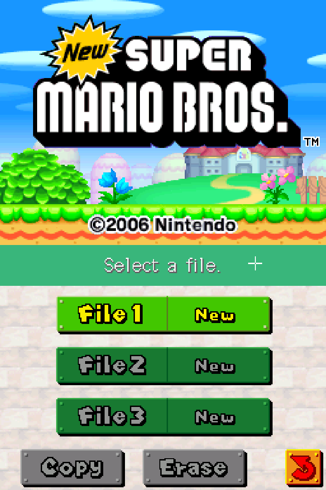
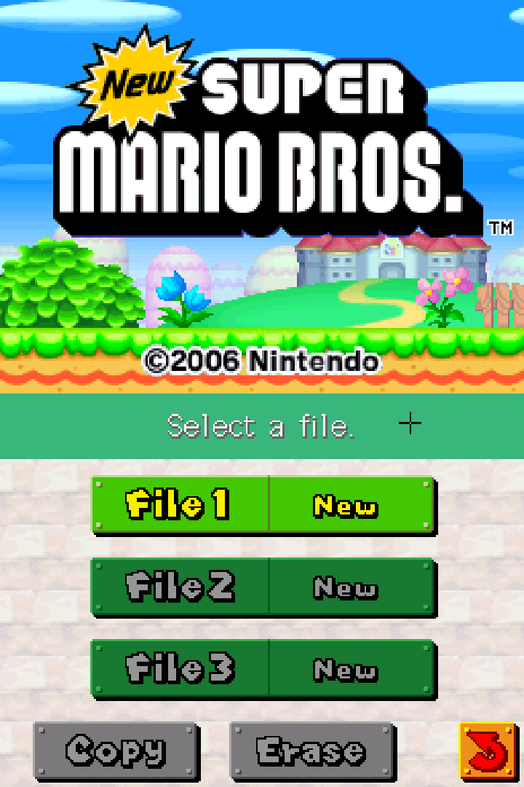
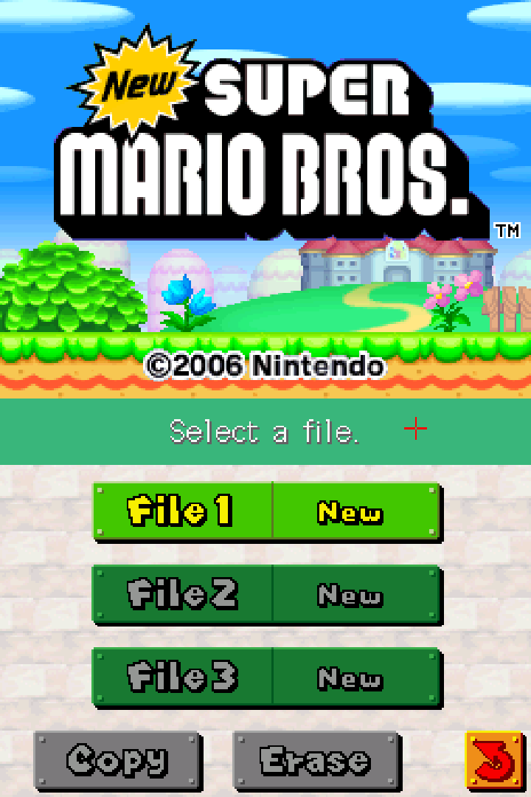
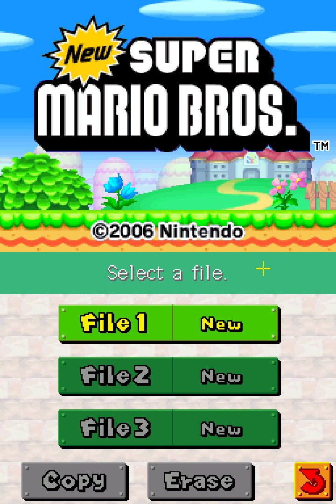

# Nintendo - DS (DeSmuME 2015)

## Background

Port of Desmume to libretro based on Desmume SVN circa 2015.

### Author/License

The DeSmuME 2015 core has been authored by

- YopYop156
- Zeromus

The DeSmuME 2015 core is licensed under

- [GPLv2](https://github.com/libretro/desmume2015/blob/master/desmume/COPYING)

A summary of the licenses behind RetroArch and its cores can be found [here](../development/licenses.md).

## Extensions

Content that can be loaded by the DeSmuME 2015 core have the following file extensions:

- .nds
- .bin

## Databases

RetroArch database(s) that are associated with the DeSmuME 2015 core:

- [Nintendo - Nintendo DS](https://github.com/libretro/libretro-database/blob/master/rdb/Nintendo%20-%20Nintendo%20DS.rdb)
- [Nintendo - Nintendo DS Decrypted](https://github.com/libretro/libretro-database/blob/master/rdb/Nintendo%20-%20Nintendo%20DS%20Decrypted.rdb)
- [Nintendo - Nintendo DS (Download Play)](https://github.com/libretro/libretro-database/blob/master/rdb/Nintendo%20-%20Nintendo%20DS%20(Download%20Play).rdb)

## Features

Frontend-level settings or features that the DeSmuME 2015 core respects.

| Feature           | Supported |
|-------------------|:---------:|
| Restart           | ✔         |
| Screenshots       | ✔         |
| Saves             | ✔         |
| States            | ✔         |
| Rewind            | ✔         |
| Netplay           | ✔ (Not Download Play, Link-Cable or Wi-Fi emulation)         |
| Core Options      | ✔         |
| RetroAchievements | ✔         |
| RetroArch Cheats  | ✔         |
| Native Cheats     | ✕         |
| Controls          | ✔         |
| Remapping         | ✔         |
| Multi-Mouse       | ✕         |
| Rumble            | ✕         |
| Sensors           | ✕         |
| Camera            | ✕         |
| Location          | ✕         |
| Subsystem         | ✕         |
| [Softpatching](../guides/softpatching.md) | ✕         |
| Disk Control      | ✕         |
| Username          | ✕         |
| Language          | ✕         |
| Crop Overscan     | ✕         |
| LEDs              | ✕         |

### Directories

The DeSmuME 2015 core's library name is 'DeSmuME 2015'

The DeSmuME 2015 core saves/loads to/from these directories.

**Frontend's Save directory**

| File  | Description            |
|:-----:|:----------------------:|
| *.dsv | Cartridge battery save |

**Frontend's State directory**

| File     | Description |
|:--------:|:-----------:|
| *.state# | State       |

### Geometry and timing

- The DeSmuME 2015 core's core provided FPS is 60
- The DeSmuME 2015 core's core provided sample rate is 44100 Hz
- The DeSmuME 2015 core's base width is dependent on the ['Screen layout' core option](#core-options).
- The DeSmuME 2015 core's base height is dependent on the ['Screen layout' core option](#core-options).
- The DeSmuME 2015 core's max width is dependent on the ['Screen layout' core option](#core-options).
- The DeSmuME 2015 core's max height is dependent on the ['Screen layout' core option](#core-options).
- The DeSmuME 2015 core's core provided aspect ratio is dependent on the ['Screen layout' core option](#core-options).

## Nickname

Changing the system nickname isn't currently supported by the DeSmuME 2015 core.

## Core options

The DeSmuME 2015 core has the following option(s) that can be tweaked from the core options menu. The default setting is bolded.

Settings with (Restart) means that core has to be closed for the new setting to be applied on next launch.

- **Internal resolution (restart)** [desmume_internal_resolution] (**256x192**|512x384|768x576|1024x768|1280x960|1536x1152|1792x1344|2048x1536|2304x1728|2560x1920)

	Self explanatory. Please note that the DeSmuME core is only software rendered.

??? note "Internal resolution - 256x192"
	

??? note "Internal resolution - 2560x1920"
	

- **CPU cores** [desmume_num_cores] (**1**|2|3|4)

	Configure how much CPU cores the DeSmuME core will use. Please note that, in general, DeSmuME benefits more from few fast CPUs than from many slow CPUs. For example, a dual-core 3.9GHz CPU will run DeSmuME much faster than a 12-core 1.6GHz CPU.

- **CPU mode** [desmume_cpu_mode] (**jit**|interpreter)

	Choose to run CPU emulation through the Interpreter engine or the JIT Dynamic Recomplier engine.

	Interpreter has better compatibility than JIT Dynamic Recompiler. Some games that fail when using JIT Dynamic Recompiler will work fine with Interpreter. The tradeoff here is that Interpreter has much lower performance than JIT Dynamic Recompiler.

	Please note that the default setting for this core option is dependent on your hardware. The JIT Dynamic Recompiler is not available on all hardware (e.g. Android devices).

- **JIT block size** [desmume_jit_block_size] (0 to 100 in increments of 1. **12 is default**.)

	This core option is only available when the 'CPU mode' core option to set to jit. You may need to tune the block size to prevent some games from breaking. 1 = most accurate, 100 = fastest.

- **Screen layout** [desmume_screens_layout] (**top/bottom**|bottom/top|left/right|right/left|top only|bottom only|quick switch|hybrid/top|hybrid/bottom)

	Self-explanatory.

??? note "Screen layout - top/bottom"
	

??? note "Screen layout - bottom/top"
	

??? note "Screen layout - left/right"
	

??? note "Screen layout - right/left"
	

??? note "Screen layout - top only"
	

??? note "Screen layout - bottom only"
	

??? note "Screen layout - hybrid/top"
	

- **Hybrid layout scale (restart)** [desmume_hybrid_layout_scale] (**1**|3)

	Self explanatory. The 'Screen layout' core option must be set to a hybrid setting for this to function properly.

??? note "Hybrid layout scale - 1"
	

??? note "Hybrid layout scale - 3"
	

- **Hybrid layout show both screen** [desmume_hybrid_showboth_screens] (**enabled**|disabled)

	Removes the small top screen when the 'Screen layout' core option is set to hybrid/top

	Removes the small bottom screen when the 'Screen layout' core option is set to hybrid/bottom

- **Hybrid layout cursor always on small screen** [desmume_hybrid_cursor_always_smallscreen] (**enabled**|disabled)

	Self explanatory.

	Disablng this allows you to use the stylus on the big bottom screen when the 'Screen layout' core option is set to hybrid/bottom.

- **Enable mouse/pointer** [desmume_pointer_mouse] (**enabled**|disabled)

	Enabling this allows inputs for the stylus.

- **Pointer type** [desmume_pointer_type] (**mouse**/touch)

	Setting this to mouse allows you to use mouse inputs for the stylus

	Setting this to touch allows you to use mouse/touch inputs for the stylus (e.g. Touch controls on Android devices).

- **Mouse Speed** [desmume_mouse_speed] (**1.0**|1.5|2.0|0.125|0.25|0.5)

	**The Pointer type core option must be set to mouse**

	Adjust mouse speed for the stylus.

- **Pointer Colour** [desmume_pointer_colour] (**white**|black|red|blue|yellow")

	Configure the color of the stylus pointer.

??? note "Pointer Colour - white"
	

??? note "Pointer Colour - black"
	

??? note "Pointer Colour - red"
	

??? note "Pointer Colour - blue"
	

??? note "Pointer Colour - yellow"
	

- **Pointer mode l-analog** [desmume_pointer_device_l] (**none**|emulated|absolute|pressed)

	Awaiting description.

- **Pointer mode r-analog** [desmume_pointer_device_r] (**none**|emulated|absolute|pressed)

	Awaiting description.

- **Emulated pointer deadzone percent** [desmume_pointer_device_deadzone] (**15**|20|25|30|35|0|5|10)

	Awaiting description.

- **Emulated pointer acceleration modifier percent** [desmume_pointer_device_acceleration_mod] (0 to 100 in increments of 1. **0 is default**.)

	Awaiting description.

- **Emulated stylus pressure modifier percent** [desmume_pointer_stylus_pressure] (0 to 100 in increments of 1. **50 is default**.)

	Configure the emulated pressure on the touchscreen from a stylus pressing on it.

- **Enable emulated stylus jitter** [desmume_pointer_stylus_jitter] (**disabled**|enabled)

	Emulate the tiny jitter from a human hand when holding a stylus; some games were accidentally dependent on this.

- **Load Game into Memory (restart)** [desmume_load_to_memory] (**disabled**|enabled)

	Loads the entire game into memory before startup. Will decrease in-game loading times at the cost of increased game startup times.

- **Enable Advanced Bus-Level Timing** [desmume_advanced_timing] (**enabled**|disabled)

	This will improve or fix some games but it is very performance demanding. Disable this if you want more speed.

- **Firmware language** [desmume_firmware_language] (**Auto**|English|Japanese|French|German|Italian|Spanish)

	Choose the language of the BIOS.

- **Frameskip** [desmume_frameskip] (**0**|1|2|3|4|5|6|7|8|9)

	Choose how much frames should be skipped to improve performance at the expense of visual smoothness.

	It is generally safe to choose 1 or 2 if you don't mind a slightly choppier game, in order to get a speedup.

	If screens seem stuck or screen flickering becomes unacceptable, pick a different frame skip value.

- **Screen Gap** [desmume_screens_gap] (0 to 100 in increments of 1. **0 is default.**)

	Self explanatory.

??? note "Screen Gap - 0"
	

??? note "Screen Gap - 100"
	

- **Enable Edgemark** [desmume_gfx_edgemark] (**enabled**|disabled)

	Awaiting description.

- **Enable Line Hack** [desmume_gfx_linehack] (**enabled**|disabled)

	Fixes some graphical bugs involving lines, but causes some other bugs. Not many games use lines.

- **Enable TXT Hack** [desmume_gfx_txthack] (**disabled**|enabled)

	Fixes text bugs in some games (e.g. Etrian Odyssey). You may need to toggle it off & on by scene.

- **Force Microphone Enable** [desmume_mic_force_enable] (**disabled**|enabled)

	Self-explanatory.

- **Microphone Simulation Settings** [desmume_mic_mode] (**internal**|sample|random|physical)

	Configure microphone input settings.

	With the internal setting, DeSmuME will use its internal noise sample for microphone input which works for many games that want you to blow on the mic.

	With the sample setting, you can supply your own microphone sample for microphone input. **This may not work currently in the DeSmuME core**.

	With the random setting, DeSmuME will use random whitenoise for microphone input which will work for games that require blowing but which don't work with the internal noise sample.

	With the physical setting, you can use your default recording device for microphone input. **This may not work currently in the DeSmuME core**.

## Controllers

The DeSmuME 2015 core supports the following device type(s) in the controls menu, bolded device types are the default for the specified user(s):

### User 1 device types

- None - Doesn't disable input. There's no reason to switch to this.
- **RetroPad** - Joypad - Stay on this.
- RetroPad w/Analog - Joypad - Same as RetroPad. There's no reason to switch to this.

### Other devices

- Stylus - Pointer or Mouse - The DesmuME 2015 core will emulate stylus inputs using the mouse API or the pointer API depending on what the ['Pointer type' core option](#core-options) is set to.

### Device tables

#### Joypad

| User 1 input descriptors | RetroPad Inputs                                | DeSmuME 2015 inputs |
|--------------------------|------------------------------------------------|---------------------|
| B                        |              | B                   |
| Y                        |              | Y                   |
| Select                   |         | Select              |
| Start                    |          | Start               |
| Up                       |        | Up                  |
| Down                     |      | Down                |
| Left                     |      | Left                |
| Right                    |     | Right               |
| A                        |              | A                   |
| X                        |              | X                   |
| L                        |             | L                   |
| R                        |             | R                   |
| Lid Close/Open           |             | Lid Close/Open      |
| Tap Stylus               |             | Tap Stylus          |
| Toggle Microphone        |             | Toggle Microphone   |
| Quick Screen Switch      |             | Quick Screen Switch |
|                          |  X  | [Pointer mode l-analog](#core-options) X |
|                          |  Y  | [Pointer mode l-analog](#core-options) Y |
|                          |  X | [Pointer mode r-analog](#core-options) X |
|                          |  Y | [Pointer mode r-analog](#core-options) Y |

#### Mouse

| RetroMouse Inputs                                     | DeSmuME 2015 inputs |
|-------------------------------------------------------|---------------------|
|  Mouse Cursor | Stylus              |
|  Mouse 1       | Stylus Press        |

#### Pointer

| RetroPointer Inputs                                                                                                      | DeSmuME 2015 inputs |
|--------------------------------------------------------------------------------------------------------------------------|---------------------|
|  or  Pointer Position | Stylus              |
|  or  Pointer Pressed            | Stylus Press        |

## Compatibility

| Game                                     | Issue                                                                                         |
|------------------------------------------|-----------------------------------------------------------------------------------------------|
| Alice in Wonderland 	                   | Needs JIT Block Size 8 or smaller to get past title screen.                                   |
| Golden Sun: Dark Dawn (Europe) 	           | Runs very slowly. Buggy sound.                                                            |
| Hotel Dusk: Room 215 	                   | Graphics glitches. Unintended "scanlines" appear on some screens.                             |
| Pokémon HeartGold (Europe) (Rev 10)        | Graphics glitches . Black pixels pop-ups in the top screen. Top screen goes black.          |
| Pokémon SoulSilver (Europe) (Rev 10)       | Graphics glitches. Black pixels pop-ups in the top screen. Top screen goes black.           |
| Puppy Palace (U) / My Puppy Shop (E)       | Crashes in menus.                                                                           |
| Rune Factory (U) 	                       | Random crashes.                                                                               |
| Rune Factory 2 (U) 	                       | Random crashes.                                                                           |
| Ultimate Mortal Kombat 3 	               | Runs very slowly.                                                                             |
| Yoshi Touch & Go 	                       | Runs very slowly.                                                                             |
| Yu-Gi-Oh! 5D's WORLD CHAMPIONSHIP 2010 (J) | Random crashes.                                                                             |

## External Links

- [Official DeSmuME Website](https://desmume.org/)
- [Official DeSmuME Github Repository](https://github.com/TASVideos/desmume)
- [Libretro DeSmuME 2015 Core info file](https://github.com/libretro/libretro-super/blob/master/dist/info/desmume2015_libretro.info)
- [Libretro DeSmuME 2015 Github Repository](https://github.com/libretro/desmume2015)
- [Report Libretro DeSmuME 2015 Core Issues Here](https://github.com/libretro/desmume2015/issues)

### See also

#### Nintendo - Nintendo DS (Download Play)

- [Nintendo - DS (DeSmuME)](desmume.md)
- [Nintendo - DS (melonDS 2021)](melonds.md)
- [Nintendo - DS (melonDS DS)](melonds_ds.md)

#### Nintendo - Nintendo DS Decrypted

- [Nintendo - DS (DeSmuME)](desmume.md)
- [Nintendo - DS (melonDS 2021)](melonds.md)
- [Nintendo - DS (melonDS DS)](melonds_ds.md)

#### Nintendo - Nintendo DS

- [Nintendo - DS (DeSmuME)](desmume.md)
- [Nintendo - DS (melonDS 2021)](melonds.md)
- [Nintendo - DS (melonDS DS)](melonds_ds.md)
