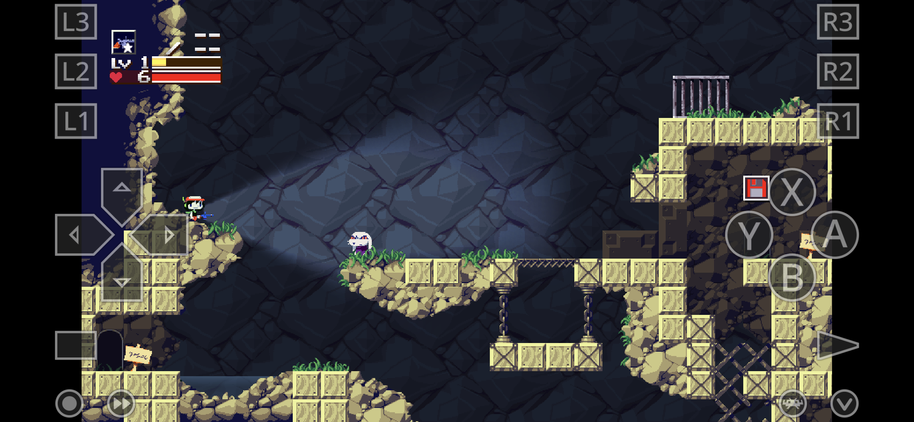
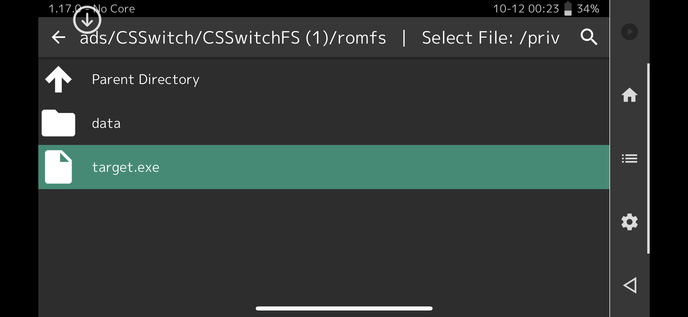

# doukutsu-rs

*This article primarily outlines the retroarch-specific features of this core. For a general feature-list and how-to for d-rs, please see the readme in the [Upstream Repository](https://github.com/doukutsu-rs/doukutsu-rs/).*

  

## Background

Doukutsu-rs *(often abbreviated d-rs)* is a modern and accurate re-implementation of the Cave Story Engine designed to be a drop-in replacement for all official and most fan ports, including:

- CS Freeware
- Cave Story+
- Cave Story Switch
- Cave Story Wiiware
- CSE2
- NXEngine-Evo

The engine adds other Quality-of-life features like 2-player local multiplayer, lighting effects, and smooth motion interpolation.

## Requirements

Currently, this core requires at least OpenGL 2 or OpenGLES 2 to run. On MacOS systems, it requires at least OpenGL 3 support.

Supported platforms:

- Windows
- Linux
- Mac OS *(at least openGL 3 required)*
- Android
- iOS

## How to start d-rs:

D-rs does not ship with Cave Story data. To run it, you can either supply your own datafiles or use the "Content Downloader" (for Freeware only).

For more information on how to get the files from your specific Cave Story install, see the [Upstream Repository readme](https://github.com/doukutsu-rs/doukutsu-rs/).

### Freeware
Freeware files can be obtained from the [tribute site](https://www.cavestory.org/download/cave-story.php) or via the retroarch Content Downloader, in a similar manner to the NXEngine core:

1. Go to RetroArch's main menu screen and select "Online Updater". From there, select "Content Downloader".
2. In the list, there should be a folder labeled `Cave Story`. Select it, then select the `Cave Story (En).zip` file. The file should be downloaded and extracted to Retroarch's `Downloads` directory.
3. Go back to RetroArch's main menu screen. Select "Load Content", then navigate to `Downloads/Cave Story (En)/` and select `Doukutsu.exe`.
4. If given the choice on what core to run, choose `Cave Story (drs)`.

The game should begin playing.

### Cave Story +

The process for Cave Story plus is largely the same, but you have to supply your own datafiles.

1. Grab your CS+ install and place it where you can navigate to it from retroarch.
2. Navigate to the CS+ folder and select the `CaveStory+.exe` file.
3. If given the choice on what core to run, choose `Cave Story (drs)`.

The game should begin playing.

### Cave Story + (Switch edition / Wiiware edition)

These versions of Cave Story don't have an executable bundled with the `data` folder. D-rs can load this just fine, but it needs to know *where* to find it, which requires the creation of a "dummy" executable next to the data folder.

  

1. Grab your CS-Switch or CS-Wiiware install and place it where you can navigate to it from retroarch.
2. In the folder that contains the `data` folder *(not INSIDE the data folder, but next to it)*, create an empty file with the `.exe` extension. Name doesn't matter, (example: `Target.exe`)
3. Navigate to the containing folder and select the target file you just made.
4. If given the choice on what core to run, choose `Cave Story (drs)`.

The game should begin playing.

## Extensions

**With the exception of Freeware cave story**, d-rs mainly uses the target file as a reference to figure out where the data folder is. *(since at the time of writing, retroarch can't load a folder directly through the GUI)* 

If the core is loading from Freeware for the first time, it will open the file in order to dump its internal assets into the `data` directory. After this, the executable isn't needed beyond use as a starting "target" for the core.

For CS+, Wiiware, or NXEngine, placing an empty "target" file in the same directory as the `data` folder with one of these extensions will load the game.

- .so
- .dll
- .exe

The info file source can be found here:
https://github.com/libretro/libretro-super/blob/master/dist/info/doukutsu_rs_libretro.info

## Frontend Features

| Feature           | Supported |
|-------------------|:---------:|
| Restart           | ✔         |
| Saves             | X         |
| States            | X         |
| Rewind            | X         |
| Netplay           | X         |
| Core Options      | ✔         |
| RetroAchievements | X         |
| RetroArch Cheats  | X         |
| Native Cheats     | ✔         |
| Controls          | ✔         |
| Remapping         | ✔         |
| Multi-Mouse       | X         |
| Rumble            | ✔         |
| Sensors           | X         |
| Camera            | X         |
| Location          | X         |
| Subsystem         | X         |
| [Softpatching](../guides/softpatching.md) | X         |
| Disk Control      | X         |
| Username          | X         |
| Language          | X         |
| Crop Overscan     | X         |
| LEDs              | X         |
| Fast Forward      | X         |
| Slow-mo           | ✔         |

## Directories

D-rs will modify the following files/folders:

- `~/data` - *(only with freeware)*, will be populated with Cave Story's internal assets the first time the game is launched (things like music and credit images).
- `~/user` - If this folder already exists (I.E. continuing a game that was started on another port of d-rs), d-rs will use this directory instead of `RetroArch/saves/d-rs`.
- `RetroArch/saves/d-rs` - game saves, internal settings, and operation logs will be stored in this folder.

## Geometry and timing

D-rs separates in-game time from screen refresh rate. The game can be either set to run at 50 TPS (mimicking Freeware CS) or 60 FPS (mimicking CS+).

Screen drawing varies depending on hardware capability, but is typically around 60 FPS.

Depending on the `Core Options` (see below), the game's screen ratio can be changed.

## Core options

- **Internal upscaling factor** - The size of the "screen" that the core thinks it's drawing to. Larger resolutions provide smoother visuals. For CS+, a minimum scale of x2 is needed to retain all image detail. `2x (CS+, default)|1x (freeware, fastest)|3x (smoother motion)|4x (smoothest motion)`,
- **Screen Ratio** - Shape of the "screen" that the core thinks it's drawing to. Original CS is 4:3, but d-rs supports widescreen. `4:3 (original)|16:9 (switch)|16:10|21:9`
- **Debug Outlines** - Draw onscreen markers to show where entities are and what they are colliding with. `Disabled|Enabled`
- **Show FPS** - Show in-game TPS and FPS. `Disabled|Enabled`
- **Show Debug GUI** - Show the IMGUI debug menu *(no real use at the moment; mouse input is disabled)*. `Disabled|Enabled`
- **GOD Mode (Invincibility)** - Player cannot take damage. `Disabled|Enabled`
- **Infinite Booster** - Gives the player the jetpack without a fuel limit. `Disabled|Enabled`
- **Noclip** - Allows the player to float through the map without tile or NPC collision. `Disabled|Enabled`
- **More Rust** - Turns Sue into the d-rs mascot ({ width="16" height="16" }). `Disabled|Enabled`

## User 1-2 device types

The d-rs core supports the following device type(s) in the controls menu, bolded device types are the default for the specified user(s):

- **Retropad (Port 1)** - Player 1 controls.
- **Retropad (Port 2)** - Player 2 controls.

These controls can be re-assigned in both the retroarch frontend and in the core itself.

## Rumble

If the frontend supports rumble and is paired with a controller that has the capability, d-rs will provide vibration feedback during screen shakes and other various in-game events.
Rumble can also be disabled within the core's settings menu.

## Joypad

*Note: These buttons can be re-bound in the frontend as well as within the core.*

| RetroPad Inputs                                | Input descriptors              |
|------------------------------------------------|--------------------------------|
|              | Shoot                          |
|              | Jump                           |
|              | Inventory/Cutscene Fast Forward|
|          | Pause                          |
|              | Show/Hide Map                  |
|        | Aim up                         |
|      | Interact/Aim down              |
|      | Move Left                      |
|     | Move Right                     |
|             | Previous Weapon                |
|             | Next Weapon                    |
|             | Strafe                         |
|             | Move (d-pad equivalent)        |

## External Links

- [Official doukutsu-rs source (GitHub)](https://github.com/doukutsu-rs/doukutsu-rs)
- [Official doukutsu-rs website](https://doukutsu-rs.github.io/)
---
- [Libretro port of d-rs (backend)](https://github.com/DrGlaucous/doukutsu-rs-nm/tree/retroarch-dev)
- [Libretro port of d-rs (interface layer)](https://github.com/DrGlaucous/doukutsu-rs-libretro/)
---
- [d-rs discord server](https://discord.gg/fbRsNNB)

## (Related cores)

- [NXEngine](nxengine.md)
