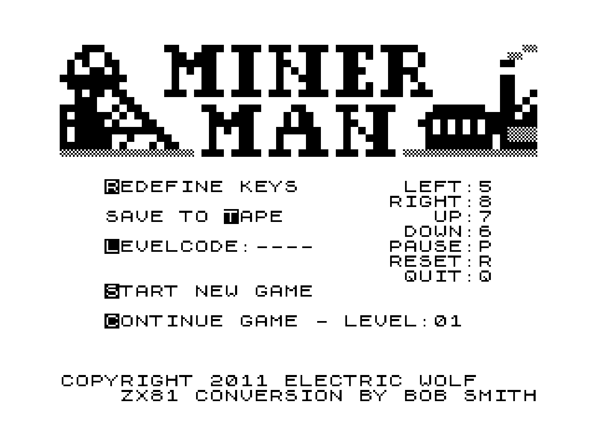
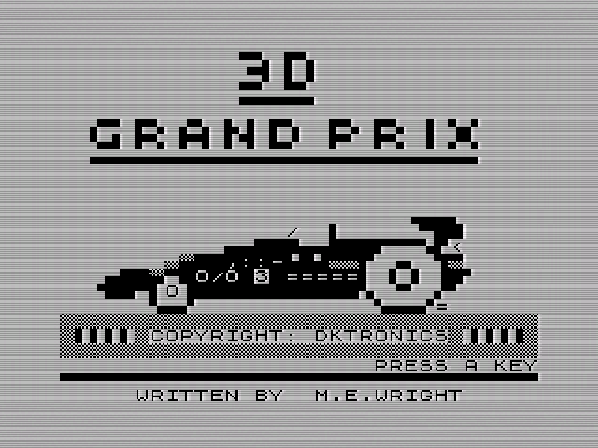
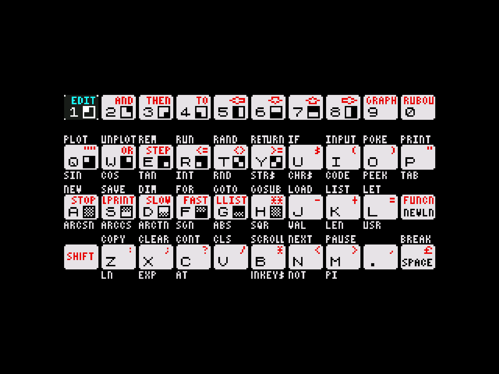

# ZX81 (EightyOne) *WIP*

## Background

81-libretro is an work in progress port of the EightyOne (a.k.a. THE Sinclair Emulator) to libretro. The classic ZX81 games are all over the Internet, but check the colorized folder for games with Chroma 81 support. There are also many original games for the Zeddy, check Bob's Stuff for some high quality games.

The EightyOne core has been authored by

- Michael D Wynne

The EightyOne core is licensed under

- [GPLv3](https://github.com/libretro/81-libretro/blob/master/LICENSE)

A summary of the licenses behind RetroArch and its cores can be found [here](../development/licenses.md).

EightyOne emulates a number of ZX80, ZX81, clones, and other computers based on the same hardware:

- Sinclair ZX80
- Sinclair ZX81
- Timex TS1000
- Timex TS1500
- Lambda 8300
- Ringo R470
- MicroDigital TK85
- Jupiter ACE

However, 81-libretro only emulates the Sinclair ZX81 with 16Kb RAM for now. Other machines will be added as time permits. Push requests are welcome.

The port correctly loads and runs some many games I have around in the p format. tzx format is also supported.

EightyOne also emulates some ZX Spectrum machines, but those were left out of this core on purpose.

## Extensions

Content that can be loaded by the EightyOne core have the following file extensions:

- .p
- .tzx
- .t81

## Databases

RetroArch database(s) that are associated with the EightyOne core:

- [Sinclair - ZX 81](https://github.com/libretro/libretro-database/blob/master/rdb/Sinclair%20-%20ZX%2081.rdb)

## Features

RetroArch-level settings or features that the EightyOne core respects.

| Feature           | Supported |
|-------------------|:---------:|
| Restart           | ✔         |
| Screenshots       | ✔         |
| Saves             | ✕         |
| States            | ✔         |
| Rewind            | ✔         |
| Netplay           | ✔         |
| Core Options      | ✔         |
| RetroAchievements | ✕         |
| RetroArch Cheats  | ✕         |
| Native Cheats     | ✕         |
| Controls          | ✔         |
| Remapping         | ✕         |
| Multi-Mouse       | ✕         |
| Rumble            | ✕         |
| Sensors           | ✕         |
| Camera            | ✕         |
| Location          | ✕         |
| Subsystem         | ✕         |
| [Softpatching](../guides/softpatching.md) | ✕         |
| Disk Control      | ✕         |
| Username          | ✕         |
| Language          | ✕         |
| Crop Overscan     | ✕         |
| LEDs              | ✕         |

### Directories

The EightyOne core's directory name is 'EightyOne'

The EightyOne core saves/loads to/from these directories.

**RetroArch's State directory**

- 'content-name'.state# (State)

### Geometry and timing

- The EightyOne core's core provided FPS is 50
- The EightyOne core's core provided sample rate is 44100 Hz
- The EightyOne core's core provided aspect ratio is (Ratio)

### Auto-configuration

Since configuring the core for each game can be a tedious task, the EightyOne core features auto-configuration. Games that support auto-configuration are listed in the [src/gamedb/gamedb.json file](https://github.com/libretro/81-libretro/blob/master/src/gamedb/gamedb.json), along with some information and the configuration required to play them.

Currently, there's no way to change the auto-configuration settings short of recompiling the core after making the changes. If you feel the provided auto-configuration could be better or has bugs, please open an [issue](https://github.com/libretro/81-libretro/issues).

### Colorization

Colorization works by loading a program prior to loading the game. This program will check if the Chroma 81 expansion is installed, and, if it is, configures the colors of the ZX81 characters, and then loads the original game, which runs unaware that it's playing with colors.

Since the EightyOne core can't load arbitrary programs from the file system, the colorization program and the game must exist in the same file.

## Core options

The EightyOne core has the following option(s) that can be tweaked from the core options menu. The default setting is bolded.

Settings with (Restart) means that core has to be closed for the new setting to be applied on next launch.

- **Tape Fast Load** (Off/**On**)

	Instantly loads files if enabled, or disable it to see the moving horizontal lines while the game loads.

- **8K-16K Contents** (**auto**/ROM shadow/RAM/dK'tronics 4K Graphics ROM + 4K RAM)

	Selects the contents of memory addresses between 8192 and 16383, a shadow copy of the ROM, 8K of RAM, or [dK'tronics 4K ROM plus 4K of RAM](http://www.fruitcake.plus.com/Sinclair/ZX81/Chroma/ChromaInterface_Software_CharacterSetROM.htm).

- **High Resolution** (**auto**/none/WRX)

	Enables WRX high resolution.

- **Emulate Chroma 81** (**auto**/Off/On)

	Enable the [Chroma 81](http://www.fruitcake.plus.com/Sinclair/ZX81/Chroma/ChromaInterface.htm) interface (colorization).

??? note "Emulate Chroma 81 - auto/On"
	

??? note "Emulate Chroma 81 - Off"
	

- **Video Presets** (**clean**/tv/noisy)

	Change how the video is emulated (if Chroma 81 is enabled, the video is set to "clean" regardless of this option).

??? note "Video Presets - clean"
	

??? note "Video Presets - tv"
	

??? note "Video Presets - noisy"
	

- **Sound emulation** (**auto**/none/Zon X-81)

	Enables sound emulation.

- **Joypad Left mapping** (**auto**/default/new line/shift/space/./0/1/2/3/4/5/6/7/8/9/a/b/c/d/e/f/g/h/i/j/k/l/m/n/o/p/q/r/s/t/u/v/w/x/y/z)

	Maps this joypad button to a keyboard key, defaults are the cursor keys for the directional pad and '0' to all the other buttons.

- **Joypad Right mapping** (**auto**/default/new line/shift/space/./0/1/2/3/4/5/6/7/8/9/a/b/c/d/e/f/g/h/i/j/k/l/m/n/o/p/q/r/s/t/u/v/w/x/y/z)

	Maps this joypad button to a keyboard key, defaults are the cursor keys for the directional pad and '0' to all the other buttons.

- **Joypad Up mapping** (**auto**/default/new line/shift/space/./0/1/2/3/4/5/6/7/8/9/a/b/c/d/e/f/g/h/i/j/k/l/m/n/o/p/q/r/s/t/u/v/w/x/y/z)

	Maps this joypad button to a keyboard key, defaults are the cursor keys for the directional pad and '0' to all the other buttons.

- **Joypad Down mapping** (**auto**/default/new line/shift/space/./0/1/2/3/4/5/6/7/8/9/a/b/c/d/e/f/g/h/i/j/k/l/m/n/o/p/q/r/s/t/u/v/w/x/y/z)

	Maps this joypad button to a keyboard key, defaults are the cursor keys for the directional pad and '0' to all the other buttons.

- **Joypad A button mapping** (**auto**/default/new line/shift/space/./0/1/2/3/4/5/6/7/8/9/a/b/c/d/e/f/g/h/i/j/k/l/m/n/o/p/q/r/s/t/u/v/w/x/y/z)

	Maps this joypad button to a keyboard key, defaults are the cursor keys for the directional pad and '0' to all the other buttons.

- **Joypad B button mapping** (**auto**/default/new line/shift/space/./0/1/2/3/4/5/6/7/8/9/a/b/c/d/e/f/g/h/i/j/k/l/m/n/o/p/q/r/s/t/u/v/w/x/y/z)

	Maps this joypad button to a keyboard key, defaults are the cursor keys for the directional pad and '0' to all the other buttons.

- **Joypad X button mapping** (**auto**/default/new line/shift/space/./0/1/2/3/4/5/6/7/8/9/a/b/c/d/e/f/g/h/i/j/k/l/m/n/o/p/q/r/s/t/u/v/w/x/y/z)

	Maps this joypad button to a keyboard key, defaults are the cursor keys for the directional pad and '0' to all the other buttons.

- **Joypad Y button mapping** (**auto**/default/new line/shift/space/./0/1/2/3/4/5/6/7/8/9/a/b/c/d/e/f/g/h/i/j/k/l/m/n/o/p/q/r/s/t/u/v/w/x/y/z)

	Maps this joypad button to a keyboard key, defaults are the cursor keys for the directional pad and '0' to all the other buttons.

- **Joypad L button mapping** (**auto**/default/new line/shift/space/./0/1/2/3/4/5/6/7/8/9/a/b/c/d/e/f/g/h/i/j/k/l/m/n/o/p/q/r/s/t/u/v/w/x/y/z)

	Maps this joypad button to a keyboard key, defaults are the cursor keys for the directional pad and '0' to all the other buttons.

- **Joypad R button mapping** (**auto**/default/new line/shift/space/./0/1/2/3/4/5/6/7/8/9/a/b/c/d/e/f/g/h/i/j/k/l/m/n/o/p/q/r/s/t/u/v/w/x/y/z)

	Maps this joypad button to a keyboard key, defaults are the cursor keys for the directional pad and '0' to all the other buttons.

- **Joypad L2 button mapping** (**auto**/default/new line/shift/space/./0/1/2/3/4/5/6/7/8/9/a/b/c/d/e/f/g/h/i/j/k/l/m/n/o/p/q/r/s/t/u/v/w/x/y/z)

	Maps this joypad button to a keyboard key, defaults are the cursor keys for the directional pad and '0' to all the other buttons.

- **Joypad R2 button mapping** (**auto**/default/new line/shift/space/./0/1/2/3/4/5/6/7/8/9/a/b/c/d/e/f/g/h/i/j/k/l/m/n/o/p/q/r/s/t/u/v/w/x/y/z)

	Maps this joypad button to a keyboard key, defaults are the cursor keys for the directional pad and '0' to all the other buttons.

- **Transparent Keyboard Overlay** (Off/**On**)

	If the keyboard overlay is transparent or opaque.

??? note "Transparent Keyboard Overlay - On"
	

??? note "Transparent Keyboard Overlay - Off"
	

- **Time to Release key in ms** (**100**/300/500/1000)

	How many milliseconds to wait before releasing the key pressed using the keyboard overlay.

## Controllers

The EightyOne core supports the following device type(s) in the controls menu, bolded device types are the default for the specified user(s):

### User 1 device types

- None - Input disabled.
- **RetroPad** - Joypad
- Cursor Joystick - Joypad -  Switch to this for joypad inputs.

### User 2 device types

- None - Input disabled.
- **RetroPad** - Joypad
- Sinclair Keyboard - Keyboard - Switch to this for keyboard inputs. Switch the User 1 device type to none if the correct keyboard inputs aren't being read.

### Controller tables

#### Joypad

!!! attention
	Use the Joypad mapping core options to configure the Cursor Joystick inputs.

| User 1 Remap descriptors      | RetroPad Inputs                              | Cursor Joystick          |
|-------------------------------|----------------------------------------------|--------------------------|
|                               |        | Joypad B button mapping  |
|                               |        | Joypad Y button mapping  |
|                               |         | Keyboard overlay         |
|                               |        | Joypad Up mapping        |
|                               |      | Joypad Down mapping      |
|                               |      | Joypad Left mapping      |
|                               |     | Joypad Right mapping     |
|                               |        | Joypad A button mapping  |
|                               |        | Joypad X button mapping  |
|                               |             | Joypad L button mapping  |
|                               |             | Joypad R button mapping  |
|                               |             | Joypad L2 button mapping |
|                               |             | Joypad R2 button mapping |

#### Keyboard

| RetroKeyboard Inputs         | Sinclair Keyboard  |
|------------------------------|--------------------|
| Keyboard Backspace           | VK_BACK            |
| Keyboard Tab                 | VK_TAB             |
| Keyboard Clear               | VK_CLEAR           |
| Keyboard Return              | VK_RETURN          |
| Keyboard Pause               | VK_PAUSE           |
| Keyboard Escape              | VK_ESCAPE          |
| Keyboard Space               | VK_SPACE           |
| Keyboard Comma ,             | VK_COMMA           |
| Keyboard Delete              | VK_DELETE          |
| Keyboard Keypad 0            | VK_NUMPAD0         |
| Keyboard Keypad 1            | VK_NUMPAD1         |
| Keyboard Keypad 2            | VK_NUMPAD2         |
| Keyboard Keypad 3            | VK_NUMPAD3         |
| Keyboard Keypad 4            | VK_NUMPAD4         |
| Keyboard Keypad 5            | VK_NUMPAD5         |
| Keyboard Keypad 6            | VK_NUMPAD6         |
| Keyboard Keypad 7            | VK_NUMPAD7         |
| Keyboard Keypad 8            | VK_NUMPAD8         |
| Keyboard Keypad 9            | VK_NUMPAD9         |
| Keyboard Keypad Period .     | VK_DECIMAL         |
| Keyboard Keypad Divide /     | VK_DIVIDE          |
| Keyboard Keypad Multiply *   | VK_MULTIPLY        |
| Keyboard Keypad Minus -      | VK_SUBTRACT        |
| Keyboard Keypad Plus +       | VK_ADD             |
| Keyboard Up                  | VK_UP              |
| Keyboard Down                | VK_DOWN            |
| Keyboard Right               | VK_RIGHT           |
| Keyboard Left                | VK_LEFT            |
| Keyboard Insert              | VK_INSERT          |
| Keyboard Home                | VK_HOME            |
| Keyboard End                 | VK_END             |
| Keyboard Page Up             | VK_PRIOR           |
| Keyboard Page Down           | VK_NEXT            |
| Keyboard F1                  | VK_F1              |
| Keyboard F2                  | VK_F2              |
| Keyboard F3                  | VK_F3              |
| Keyboard F4                  | VK_F4              |
| Keyboard F5                  | VK_F5              |
| Keyboard F6                  | VK_F6              |
| Keyboard F7                  | VK_F7              |
| Keyboard F8                  | VK_F8              |
| Keyboard F9                  | VK_F9              |
| Keyboard F10                 | VK_F10             |
| Keyboard F11                 | VK_F11             |
| Keyboard F12                 | VK_F12             |
| Keyboard F13                 | VK_F13             |
| Keyboard F14                 | VK_F14             |
| Keyboard F15                 | VK_F15             |
| Keyboard Num Lock            | VK_NUMLOCK         |
| Keyboard Caps Lock           | VK_CAPITAL         |
| Keyboard Scroll Lock         | VK_SCROLL          |
| Keyboard Right Shift         | VK_SHIFT           |
| Keyboard Left Shift          | VK_SHIFT           |
| Keyboard Right Control       | VK_CONTROL         |
| Keyboard Left Control        | VK_CONTROL         |
| Keyboard Right Alt           | VK_MENU            |
| Keyboard Left Alt            | VK_MENU            |
| Keyboard Print               | VK_SNAPSHOT        |

## External Links

- [Libretro EightyOne Core info file](https://github.com/libretro/libretro-super/blob/master/dist/info/81_libretro.info)
- [Libretro EightyOne Github Repository](https://github.com/libretro/81-libretro)
- [Report Libretro EightyOne Core Issues Here](https://github.com/libretro/81-libretro/issues)
- [Official EightyOne Sourceforge Repository]((https://sourceforge.net/projects/eightyone-sinclair-emulator/))