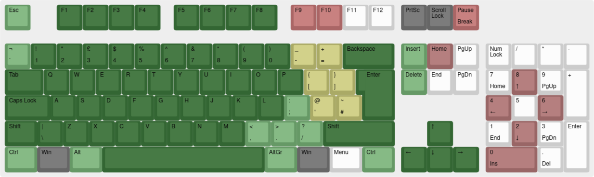
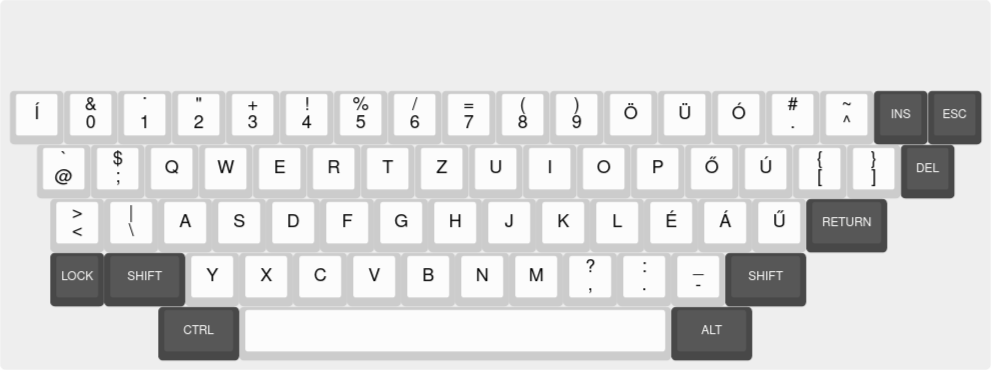

# Enterprise - 64/128 (ep128emu)

<iframe width="560" height="315" src="https://www.youtube-nocookie.com/embed/vpqkDRUgwpU" title="YouTube video player" frameborder="0" allow="accelerometer; autoplay; clipboard-write; encrypted-media; gyroscope; picture-in-picture" allowfullscreen></iframe>

## Background

Leverage the convenience of libretro/retroarch to emulate the Z80 based home computers that the original ep128emu supports - that is, Enterprise 64/128, Videoton TVC, Amstrad CPC and ZX Spectrum. Focus is on Enterprise and TVC.

The ep128emu core has been authored by:
- Istvan Varga (ep128emu)
- Zoltan Balogh (libretro core specific modifications)

The ep128emu core is licensed under [GPL2](https://github.com/libretro/ep128emu-core/blob/master/COPYING). A summary of the licenses behind RetroArch and its cores can be found [here](../development/licenses.md).

## Requirements

Since the emulated machines are 8-bit platforms from the 1980's, modern setups should have no problem emulating them. Tested on Raspberry Pi 2.

## Extensions

Content that can be loaded by the ep128emu core have the following file extensions:

- `.img` - Enterprise, CPC or TVC floppy disk image
- `.dsk` - Enterprise, CPC or TVC floppy disk image
- `.tap` - Enterprise or ZX Spectrum tape image
- `.dtf` - Enterprise compressed file
- `.cas` - Videoton TVC file format
- `.wav` - sound file interpreted as Enterprise tape
- `.tvcwav` - sound file interpreted as Videoton TVC tape
- `.cdt` - Amstrad CPC tape image
- `.tzx` - ZX Spectrum tape image
- `.bas`, `.com`, `.trn`, `.128`, `.` - common extensions for Enterprise executable files, including no extension

From version 1.1.0, emulator core is able to handle mono PCM WAV files with 1..8 bit depth as tape recordings. It is possible to enable libsndfile support during compilation, and then a wider range of formats are recognized, including MP3 if libsndfile version is at least 1.1. Using the `.wav` file extension will trigger the built-in RetroArch media player by default, it can be disabled under Settings / File Browser / Use Built-in Media Player. Rename `.wav` files to have `.tvcwav` extension to be interpreted as TVC tapes.

RetroArch database(s) that are associated with the ep128emu core:

- None yet

## Features

Frontend-level settings or features that the ep128emu core respects.

| Feature           | Supported |
|-------------------|:---------:|
| Restart           | ✔         |
| Saves             | ✔         |
| States            | ✔         |
| Rewind            | ✔         |
| Netplay           | -         |
| Core Options      | ✔         |
| RetroAchievements | ✕         |
| RetroArch Cheats  | ✔         |
| Native Cheats     | ✕         |
| Controls          | ✔         |
| Remapping         | -         |
| Multi-Mouse       | ✕         |
| Rumble            | ✕         |
| Sensors           | ✕         |
| Camera            | ✕         |
| Location          | ✕         |
| Subsystem         | ✕         |
| [Softpatching](../guides/softpatching.md) | ✕         |
| Disk Control      | ✔         |
| Username          | ✕         |
| Language          | ✕         |
| Crop Overscan     | ✕         |
| LEDs              | ✔         |

## Directories

The ep128emu core's library name is `ep128emu`. The ep128emu core saves/loads to/from these directories.

**Frontend's System directory**

| File         | Description |
|:------------:|:-----------:|
| ep128emu/rom/* |BIOS files are loaded from here |
| ep128emu/config/* |System-wide emulation configuration files |

## Geometry and timing

- The ep128emu core's core provided FPS is 50
- The ep128emu core's core provided sample rate is 44.1 kHz
- The ep128emu core's base width is 768
- The ep128emu core's base height is 288
- The ep128emu core's max width is 768
- The ep128emu core's max height is 576 (interlace mode)
- The ep128emu core's core provided aspect ratio is 4:3 (interlace mode)

The intelligent zoom function can reduce the apparent width/height, aspect ratio is also adjusted.

If there is LED driver configured in RetroArch, second LED should reflect disk activity state.

## Usage

Load any supported content file. Content type will be autodetected, and if possible, started. Content-specific [configuration file](https://github.com/libretro/ep128emu-core/blob/core/core/sample.ep128cfg) is also loaded if present. Without content, core starts with Enterprise 128 disk configuration.

In case of multi-disk (or multi-tape) games, use the Disk Control menu to add the subsequent images and switch between them. You can also use RetroArch's built-in memory analyzer to set up cheats.

Apart from disk/tape/fileIO differences, the core will adjust the emulated machine configuration in some cases:
- if content file has `.DTF` extension, ZozoTools BIOS will be used
- if content file name contains `[req brd-rom]`, German BIOS will be used
- if content file name contains `[req zrom]`, Hungarian language BIOS and EPDOS will be used
- if EP128_DISK_ISDOS (or EP64_DISK_ISDOS) type is supplied via configuration file, IS-DOS (CP/M flavor for Enterprise) will be used

## Core options

The ep128emu core has the following option(s) that can be tweaked from the core options menu. The default setting is bolded.
Settings with (Restart) means that core has to be closed for the new setting to be applied on next launch.

- Main thread wait (ms) (**0**|1|5|10) - forced sleep in main thread for lower CPU use
- High sound quality (**1**|0) - disable in case of performance problems
- Use accelerated SW framebuffer (**0**|1) - enable in case of performance problems (has some known bugs with interlace mode)
- Enable resolution changes (requires restart) (**1**|0)
- Border lines to keep when zooming in (**0**|2|4|8|10|20)
- System ROM version (EP only) (**Original**|Enhanced) - enhanced ROM contains faster memory test at startup
- User 1 Zoom button (**R3**|Start|Select|X|Y|A|B|L|R|L2|R2|L3)
- User 1 Info button (**L3**|R3|Start|Select|X|Y|A|B|L|R|L2|R2)
- User 1 Autofire for button (**None**|X|Y|A|B|L|R|L2|R2|L3|R3|Start|Select)
- User 1 Autofire repeat delay (**1**|2|4|8|16)

## Control device types

The emulated systems use several joystick types (all digital, with 1 fire button usually). Enterprise and TVC have a built-in joystick, and two external joystick connections. The ep128emu core supports device type changes in the controls menu. Change of the type updates the joypad and fire button mapping.

| Emulated machine | User 1 default joypad | User 2 default joypad | User 3 default joypad |
|------------------|-----------------------|-----------------------|-----------------------|
| Enterprise | Internal | External 1 | External 2 |
| TVC | Internal | External 1 | External 2 |
| CPC | External 1 | External 2 |  |
| ZX | Kempston | Sinclair 1 | Sinclair 2 |

- Core default - Joypad and fire button is mapped as default (see above)
- Internal Joystick - Joypad and fire button is mapped for internal joystick on Enterprise and TVC. On CPC it is mapped to cursor keys.
- External Joystick 1 / Kempston - Joypad and fire button is mapped for external joystick 1 (Kempston interface in case of ZX)
- External Joystick 2 - Joypad and fire button is mapped for external joystick 2
- Sinclair Joystick 1 - Joypad and fire button is mapped for Sinclair joystick 1. Only useful for ZX. Joystick inputs are emulated as keys: 1 (left), 2 (right), 3 (down), 4 (up), 5 (fire).
- Sinclair Joystick 2 - Joypad and fire button is mapped for Sinclair joystick 2. Only useful for ZX. Joystick inputs are emulated as keys: 6 (left), 7 (right), 8 (down), 9 (up) ,0 (fire).
- Protek Joystick - Joypad and fire button is mapped for Protek/AGF joystick. Only useful for ZX. Joystick inputs are emulated as keys: 5 (left), 6 (down), 7 (up), 8 (right) ,0 (fire).
- External Joystick 3..6 - Joypad and fire button is mapped for external joystick 3..6. Only useful for Enterprise, very rarely used.

## Joypad

| RetroPad Inputs                                | Default action for user 1 | Recommended override   for content-specific configuration |
|------------------------------------------------|--------------------------|---------------------------|
|       | Respective directions for:   Enterprise, TVC: Internal joystick   CPC: External joystick 1   ZX Spectrum: Kempston interface | |
|              | Enterprise, TVC: space (fire for internal joystick)   CPC: External joystick 1 fire   ZX Spectrum: Kempston joystick |                          |
|              | Enter                 |                          |
|              | CPC: External joystick 1 fire 2 | In-game key required for secondary action |
|              | -                 | In-game key required for other action (if any) |
|         | -                 | In-game key required to select the supported input method (if any) |
|          | -                 | In-game key required to start the game (if any) |
|             | Key 0 | In-game key required for other action (if any) |
|             | Key 1 | In-game key required for other action (if any) |
|             | Key 2 | In-game key required for other action (if any) |
|             | Key 3 | In-game key required for other action (if any) |
|             | Info display | - |
|             | Intelligent zoom | (Zoom is also available via keyboard F12) |

## Keyboard

### Enterprise 128

The ep128emu core takes the Enterprise UK keyboard as a basis:

Most mappings are straightforward positionally from an ISO UK keyboard:
- Dark green: natural mapping, both position and function matches nicely
- Light green: either position or function is slightly different
- Yellow: function is different
- Red: extra mapping
- Dark grey: keys intentionally reserved for RetroArch / OS functions

Exceptions are marked in the following table:

| RetroKeyboard Inputs         | Enterprise keyboard input |
|------------------------------|---------------------------|
| Keyboard F9                  | Hold                      |
| Keyboard F10                 | Stop                      |
| Keyboard Pause               | Stop                      |
| Keyboard Backquote `         | Escape (alternative mapping) |
| Keyboard Equals =            | ^ (caret)                 |
| Keyboard Backspace           | Erase                     |
| Keyboard Left Bracket [      | @ (at)                    |
| Keyboard Right Bracket ]     | [ (left bracket)          |
| Keyboard Quote '             | : (colon)                 |
| Keyboard Backslash \         | ] (right bracket) (shown as # in ISO map) |
| Keyboard Oem 102             | \\ (backslash)            |
| Keyboard Home                | \\ (alternative mapping)  |
| Keyboard Delete              | Del                       |
| Keyboard Insert              | Ins                       |
| Keyboard Keypad 0            | External joystick 1 fire  |
| Keyboard Keypad 2            | External joystick 1 down  |
| Keyboard Keypad 4            | External joystick 1 left  |
| Keyboard Keypad 6            | External joystick 1 right |
| Keyboard Keypad 8            | External joystick 1 up    |

### Videoton TVC

The Videoton TVC has a layout that is somewhat similar to ISO Hungarian layout:

Since TVC has several extra keys, but no function keys, F-row is used as replacement for those.

| RetroKeyboard Inputs         | TVC keyboard input        |
|------------------------------|---------------------------|
| Keyboard F1                  | @                         |
| Keyboard F2                  | ;                         |
| Keyboard F3                  | <                         |
| Keyboard F4                  | \                         |
| Keyboard F5                  | *                         |
| Keyboard F6                  | ^                         |
| Keyboard F7                  | [                         |
| Keyboard F8                  | ]                         |
| Keyboard F9                  | *                         |
| Keyboard F10                 | í                         |
| Keyboard Backquote `         | 0                         |
| Keyboard 0                   | ö                         |
| Keyboard Minus -             | ü                         |
| Keyboard Equals =            | ó                         |
| Keyboard Left Bracket [      | ő                         |
| Keyboard Right Bracket ]     | ú                         |
| Keyboard Semicolon ;         | é                         |
| Keyboard Quote '             | á                         |
| Keyboard Backslash \         | ű                         |
| Keyboard Oem 102             | í                         |
| Keyboard Home                | ű (alternative mapping)   |
| Keyboard Delete              | Del                       |
| Keyboard Insert              | Ins                       |
| Keyboard Keypad 0            | External joystick 1 fire  |
| Keyboard Keypad 2            | External joystick 1 down  |
| Keyboard Keypad 4            | External joystick 1 left  |
| Keyboard Keypad 6            | External joystick 1 right |
| Keyboard Keypad 8            | External joystick 1 up    |

### Amstrad CPC

The Amstrad CPC 464/664 and 6128 fit well to ISO UK layout, with only slight differences:

Function key row is mapped to Fn-array. Extra mappings are marked in the following table:

| RetroKeyboard Inputs         | CPC keyboard input        |
|------------------------------|---------------------------|
| Keyboard F1                  | Fn1                       |
| Keyboard F2                  | Fn2                       |
| Keyboard F3                  | Fn3                       |
| Keyboard F4                  | Fn4                       |
| Keyboard F5                  | Fn5                       |
| Keyboard F6                  | Fn6                       |
| Keyboard F7                  | Fn7                       |
| Keyboard F8                  | Fn8                       |
| Keyboard F9                  | Fn9                       |
| Keyboard F10                 | Fn0                       |
| Keyboard F11                 | Fn Dot (.)                |
| Keyboard Keypad Enter        | Fn Enter                  |
| Keyboard Oem 102             | \\                         |
| Keyboard Home                | \\ (alternative mapping)   |
| Keyboard Delete              | Del                       |
| Keyboard Insert              | Copy                      |
| Keyboard Left Alt            | Copy (alternative mapping) |
| Keyboard Right Alt           | Fn Dot (alternative mapping) |
| Keyboard Keypad 0            | External joystick 1 fire  |
| Keyboard Keypad Period .     | External joystick 1 fire 2 |
| Keyboard Keypad 2            | External joystick 1 down  |
| Keyboard Keypad 4            | External joystick 1 left  |
| Keyboard Keypad 6            | External joystick 1 right |
| Keyboard Keypad 8            | External joystick 1 up    |

## BIOS

Following "BIOS" files are used for emulation. Note: in usual 8-bit home computer terms, these are "ROM"s as they contain the original machine's read-only memory dumps.

From version 1.1.0, external BIOS files are optional.

| Filename          | Description                     | md5sum                           |
|:-----------------:|:-------------------------------:|:--------------------------------:|
| `exos21.rom` | Enterprise 128 Expandible OS 2.1   For EP128 | f36f24cbb87745fbd2714e4df881db09 |
| `basic21.rom` | Enterprise 128 BASIC Interpreter v2.1   For EP128 | e972fe42b398c9ff1d93ff014786aec6 |
| `exdos13.rom` | Enterprise 128 Disk Controller v1.3   For EP64/128 disk configs | ddff70c014d1958dc75378b6c9aab6f8 |
| `exos20.rom` | Enterprise 64 Expandible OS 2.0   For EP64 | 5ad3baaad3b5156d6b60b34229a676fb |
| `basic20.rom` | Enterprise 64 BASIC Interpreter v2.0   For EP64 | 8e18edce4a7acb2c33cc0ab18f988482 |
| `epfileio.rom` | Enterprise 128 Direct File I/O   For loading from host file (instead of disk or tape image) | a68ebcbc73a4d2178d755b7755bf18fe |
| `exos24uk.rom` | Enterprise 128 Expandible OS 2.4   Only for enhanced functions (fast memory test) | 55af78f877a21ca45eb2df68a74fcc60 |
| `hun.rom` | Enterprise 128 Hungarian language extension | 22167938f142c222f40992839aa21a06 |
| `epdos16f.rom` | Enterprise 128 EP-DOS | 6593dff00ab32a4b1fc084674ededf2b |
| `exdos14isdos10uk.rom` | Enterprise 128 IS-DOS (CP/M) | f91c4a507cc6895bdd9c43df4f021df3 |
| `brd.rom` | Enterprise 128 German language extension | 6af0402906944fd134004b85097c8524 |
| `zt19uk.rom` | Enterprise 128 ZozoTools extension   For loading from DTF files | 228540b6be83ae2acd7569c8ff0f91d0 |
| `tvc22_sys.rom` | Videoton TVC system BIOS   For TVC emulation | 8c54285f541930cde766069942bad0f2 |
| `tvc22_ext.rom` | Videoton TVC extension BIOS   For TVC emulation | 5ce95a26ceed5bec73995d83568da9cf |
| `tvcfileio.rom` | Videoton TVC Direct File I/O   For loading from host file (instead of disk or tape image) | a2cf86ba8e7fc58b242137fe59036832 |
| `tvc_dos12d.rom` | Videoton TVC disk BIOS   For TVC disk configs | 88dc7876d584f90e4106f91444ab23b7 |
| `cpc464.rom` | Amstrad CPC 464 BIOS   For CPC 464 | a993f85b88ac4350cf4d41554e87fe4f |
| `cpc664.rom` | Amstrad CPC 664 BIOS   For CPC 664 | 5a384a2310f472c7857888371c00ed66 |
| `cpc6128.rom` | Amstrad CPC 6128 BIOS   For CPC 6128 | b96280dc6c95a48857b4b8eb931533ae |
| `cpc_amsdos.rom` | Amstrad CPC AMSDOS BIOS   For CPC disk configs | 25629dfe870d097469c217b95fdc1c95 |
| `zx128.rom` | ZX Spectrum 128 BIOS   For ZX Spectrum 128 | 85fede415f4294cc777517d7eada482e |
| `zx48.rom` | ZX Spectrum 48 BIOS   For ZX Spectrum 16/48 | 4c42a2f075212361c3117015b107ff68 |

## Special emulation

Enterprise 128 has software extensions to emulate ZX Spectrum (48, 128) and Amstrad CPC. As a technical quirk, these emulators can be run in the ep128emu-core, creating a double emulation layer.

### SPEMU

- Obtain ROM version of SPEmu from the [EnterpriseForever forums](https://enterpriseforever.com/letoltesek-downloads/enterprise-software/).
- Place ROM files under RetroArch system directory: `system/ep128emu/roms/`
- Create a custom config file into RetroArch system directory called `system/ep128emu/config/enterprise.ep128cfg`:

    `machineDetailedType "EP128_TAPE"`
    `memory.ram.size 256`
    `memory.rom.40.file "spemu128.rom"`
    `memory.rom.40.offset 0`
    `memory.rom.41.file "spemu128.rom"`
    `memory.rom.41.offset 16384`
    `memory.rom.42.file "spemu128.rom"`
    `memory.rom.42.offset 32768`
    `tape.forceMotorOn Yes`

- Start ep128emu core without content
- Invoke the SPEmu extension with `:sp128`
- Choose Load tape
- Enter RetroArch Quick menu (F1), go to Disk Control, and select the `.tap` file containing the Spectrum program
- Later on, remember to remove the custom config file if you run into problems with regular Enterprise programs afterwards

### CPCEMU

- Obtain COM version of CPCEmu from the [EnterpriseForever forums](https://enterpriseforever.com/letoltesek-downloads/enterprise-software/).
- Start CPCEMU.COM the usual way (select the file in RetroArch and open it with ep128emu core)
- Once the blue screen has loaded, open quick menu (F1) go to Disk Control and select the file that needs to be loaded
- Continue, enable keyboard pass-through with Scroll Lock, and issue RUN command as needed
- It may be needed to change the control type to External 2 in Quick Menu / Controls

## External Links

- [Official ep128emu-core Repository](https://github.com/libretro/ep128emu-core)
- [Libretro ep128emu Core info file](https://github.com/libretro/libretro-super/blob/master/dist/info/ep128emu_core_libretro.info)
- [Report Libretro ep128emu Core Issues Here](https://github.com/libretro/ep128emu-core/issues)
- [Original ep128emu Implementation](https://github.com/istvan-v/ep128emu)
- [ep128.hu](http://www.ep128.hu/) - games for Enterprise
- [enterpriseforever.com](https://enterpriseforever.com/) - Enterprise community
- [tvc.homeserver.hu](http://tvc.homeserver.hu/) - TVC page (Hungarian only)
