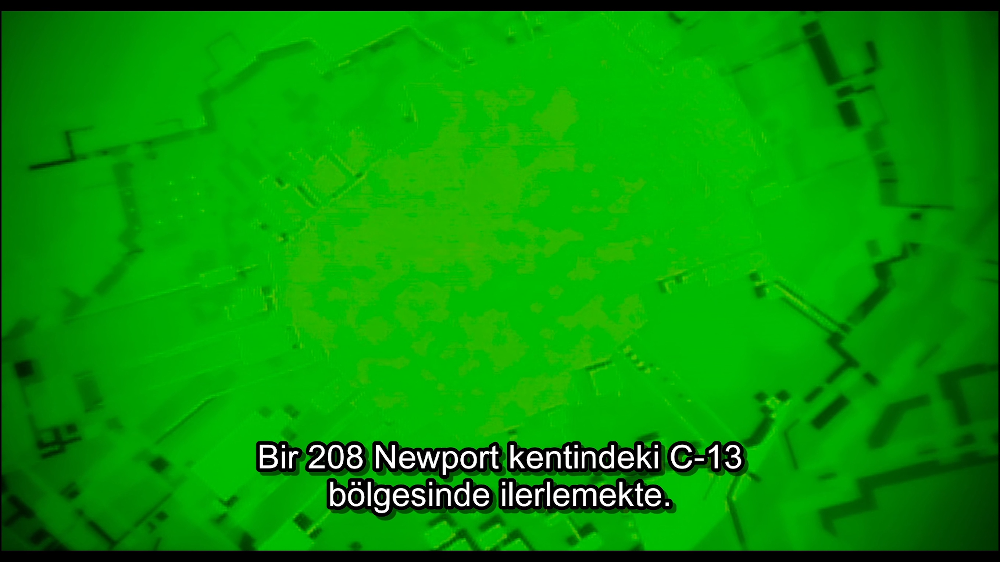

# FFmpeg

## Background

Video/music player implemented in libretro. FFmpeg can play video and audio files of different formats in RetroArch. If a video file has more than one audio input, FFmpeg can switch between them. If there is a hard coded subtitle file in the video file, FFmpeg can switch between them in the same way.

### Author/License

The FFmpeg core has been authored by

- Fabrice Bellard
- FFmpeg team

The FFmpeg core is licensed under

- [LGPLv2, GPLv2](https://github.com/libretro/FFmpeg/blob/master/LICENSE.md)

A summary of the licenses behind RetroArch and its cores can be found [here](../development/licenses.md).

## Experience

!!! important
	RetroArch and LibRetro do not share any copyrighted content. RetroArch does not download any video or audio files. It does not stream content you have on different platforms.

### Watching Movies with Subtitles

You can open video files in the following formats(see: [Extensions](../ffmpeg/#extensions)). If your video file in these formats has a subtitle file encoded with .SSA type, these subtitle files will appear automatically. External subtitles are currently not supported. The video files you have played will be added to the Videos section in the main menu.

??? note "Turkish subtitles encoded 95's Ghost in the Shell"
	

#### Setup

Watch the video below for details:

<iframe width="560" height="315" src="https://www.youtube-nocookie.com/embed/zget1P8ptho" frameborder="0" allow="accelerometer; autoplay; clipboard-write; encrypted-media; gyroscope; picture-in-picture" allowfullscreen></iframe>

### Listening to Music

You can open audio files in the following formats (see: [Extensions](../ffmpeg/#extensions)). In the example below, you can see and listen to an mp3 file running at the lowest settings. File quality will affect sound quality. The audio files you have played will be added to the Music section in the main menu.

??? note "Example"
	<video width="320" height="240" controls>
	  <source src="/image/core/ffmpeg/audio-preview.mp4" type="video/mp4">
	  <source src="/image/core/ffmpeg/audio-preview.ogg" type="video/ogg">
	Your browser does not support the video tag.
	</video>

#### Setup

Watch the video below for details:

<iframe width="560" height="315" src="https://www.youtube-nocookie.com/embed/5f6nWBpagaM" frameborder="0" allow="accelerometer; autoplay; clipboard-write; encrypted-media; gyroscope; picture-in-picture" allowfullscreen></iframe>

## Extensions

Content that can be loaded by the FFmpeg core have the following file extensions:

- .mkv
- .avi
- .f4v
- .f4f
- .3gp
- .ogm
- .flv
- .mp4
- .mp3
- .flac
- .ogg
- .m4a
- .webm
- .3g2
- .mov
- .wmv
- .mpg
- .mpeg
- .vob
- .asf
- .divx
- .m2p
- .m2ts
- .ps
- .ts
- .mxf
- .wma
- .wav

## Features

Frontend-level settings or features that the FFmpeg core respects.

| Feature           | Supported |
|-------------------|:---------:|
| Restart           | ✔         |
| Screenshots       | ✔         |
| [Shaders](../ffmpeg/#shaders)       | ✔         |
| Saves             | ✕         |
| States            | ✕         |
| Rewind            | ✕         |
| Netplay           | ✕         |
| Core Options      | ✔         |
| RetroAchievements | ✕         |
| RetroArch Cheats  | ✕         |
| Native Cheats     | ✕         |
| Controls          | ✔         |
| Remapping         | ✔         |
| Multi-Mouse       | ✕         |
| Rumble            | ✕         |
| Sensors           | ✕         |
| Camera            | ✕         |
| Location          | ✕         |
| Subsystem         | ✕         |
| [Softpatching](../guides/softpatching.md) | ✕         |
| Disk Control      | ✕         |
| Username          | ✕         |
| Language          | ✕         |
| Crop Overscan     | ✕         |
| LEDs              | ✕         |

### Directories

The FFmpeg core's directory name is 'FFmpeg'

### Geometry and timing

- The FFmpeg core's core provided FPS is dependant on the loaded media.
- The FFmpeg core's core provided sample rate is dependant on the loaded media.
- The FFmpeg core's core provided aspect ratio is dependant on the loaded media.

### Shaders

Shaders can improve your viewing quality as well as deliver the excitement of the 80s or 90s. In the example below you can see how a VHS shader can affect view quality. You can also provide more innovative watching possibilities by stacking shaders on top of each other.

??? note "VHSPro Shader"
	

## Core options

The FFmpeg core has the following option(s) that can be tweaked from the core options menu. The default setting is bolded.

Settings with (Restart) means that core has to be closed for the new setting to be applied on next launch.

- **Temporal Interpolation** [ffmpeg_temporal_interp] (**Off**/On)

	'Fake’ a higher framerate by using motion blur.

- **FFT Resolution** [ffmpeg_fft_resolution] (**1280x720**/1920x1080/2560x1440/3840x2160/640x360/320x180)

	Modify the resolution of the music visualizer.

??? note "FFT Resolution - 320x180"
	

??? note "FFT Resolution - 3840x2160"
	

- **FFT Multisample** [ffmpeg_fft_multisample] (**1x**/2x/4x)

	Modify the antialiasing of the music visualizer.

- **Colorspace** [ffmpeg_color_space] (**auto**/BT.70/BT.601/FCC/SMPTE240M)

	Choose [colorspaces](https://trac.ffmpeg.org/wiki/colorspace) from different broadcast regions/standards.

??? note "Colorspace"
	
	
	
	

## Controllers

The FFmpeg core supports the following device type(s) in the controls menu, bolded device types are the default for the specified user(s):

### User 1 device types

- None - Doesn't disable input.
- **RetroPad** - Joypad
- RetroPad w/Analog - Joypad - There's no reason to switch to this.

### Other controllers

- Mouse - The FFmpeg core allows Wheel Up and Wheel Down mouse inputs for seeking. This is always active, completely separate from the device types in the Controls menu and cannot be manually selected.

### Controller tables

#### Joypad

| User 1 Remap descriptors | RetroPad Inputs                                |
|--------------------------|------------------------------------------------|
| Seek +60 seconds         |        |
| Seek -60 seconds         |      |
| Seek -10 seconds         |      |
| Seek +10 seconds         |     |
| Cycle Audio Track        |             |
| Cycle Subtitle Track     |             |

#### Mouse

| RetroMouse Inputs                                   | FFmpeg Core Inputs        |
|-----------------------------------------------------|---------------------------|
| Wheel Up                                            | Seek +60 seconds          |
| Wheel Down                                          | Seek -60 seconds          |

## External Links

- [Official FFmpeg Website](https://www.ffmpeg.org/)
- [Official FFmpeg Repositories](https://www.ffmpeg.org/download.html#repositories)
- [Libretro FFmpeg Core info file](https://github.com/libretro/libretro-super/blob/master/dist/info/ffmpeg_libretro.info)
- [Internal Libretro FFmpeg Github Repository](https://github.com/libretro/RetroArch/tree/master/cores/libretro-ffmpeg)
- [Buildbot Libretro FFmpeg Github repository](https://github.com/libretro/FFmpeg)
- [Report Libretro FFmpeg Core Issues Here](https://github.com/libretro/RetroArch/issues)
- [Video Setup](https://www.youtube.com/watch?v=zget1P8ptho)
- [Audio Setup](https://www.youtube.com/watch?v=5f6nWBpagaM)
