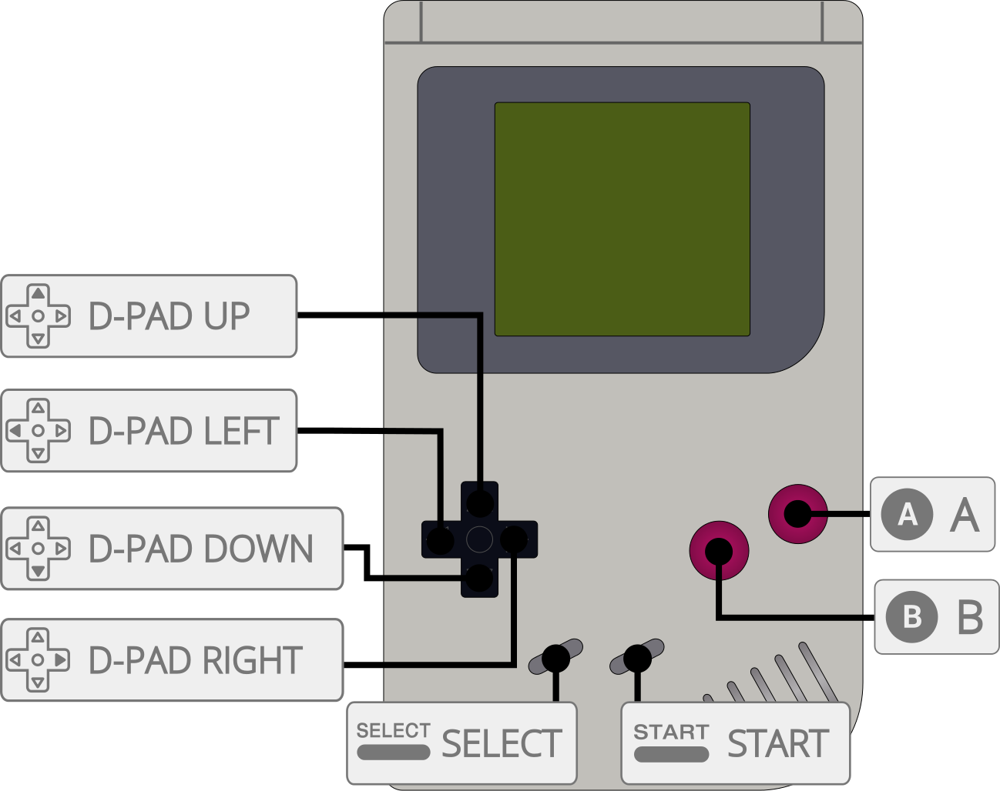

# Nintendo - Game Boy / Color (Gearboy)

## Background

Gearboy is an open source, cross-platform Nintendo Game Boy (DMG), Game Boy Color (GBC), and Super Game Boy (SGB) emulator written in C++.

- Accurate emulation with support for ROM-only cartridges and MBC1, MBC1M, MBC2, MBC3, MBC5, MBC6, MBC7, HuC-1, HuC-3, MMM01, Pocket Camera, TAMA5, Wisdom Tree, M161, Sachen MMC1/MMC2, PKJD, Bung/EMS, and Poke 2-in-1 mappers.
- Game Boy Color support.
- Super Game Boy support, including borders and color palettes.
- Game Link Cable support with two systems, independent controllers, configurable screens and audio, and two-ROM subsystem loading.
- Battery-backed RAM save support.
- Save states.
- Boot ROM (BIOS) support.
- Game Genie and GameShark cheat support.
- Supported platforms (libretro): Windows, Linux, macOS, Raspberry Pi, Android, iOS, tvOS, webOS, PlayStation Vita, PlayStation 3, Nintendo 3DS, Nintendo GameCube, Nintendo Wii, Nintendo WiiU, Nintendo Switch, Emscripten, Classic Mini systems (NES, SNES, C64, ...), OpenDingux, RetroFW and QNX.

The Gearboy core has been authored by:

- [Nacho Sanchez (drhelius)](https://github.com/drhelius)

The Gearboy core is licensed under:

- [GPLv3](https://github.com/drhelius/Gearboy/blob/master/LICENSE)

A summary of the licenses behind RetroArch and its cores can be found [here](../development/licenses.md).

## BIOS

Gearboy does not require boot ROM (BIOS) files, but they can be used optionally.

When enabled, a boot ROM runs as it does on original hardware. Invalid ROMs may fail to boot, and the selected boot ROM may enable hardware differences for systems such as Game Boy Pocket or Game Boy Advance.

Required or optional firmware files go in the frontend's system directory.

!!! attention
	Place boot ROM files in RetroArch's system directory, then enable the [DMG Bootrom](#core-options) or [GBC Bootrom](#core-options) core option.

| Filename     | Description                        | md5sum                           |
|:------------:|:----------------------------------:|:--------------------------------:|
| dmg_boot.bin | Game Boy boot ROM - Optional       | 32fbbd84168d3482956eb3c5051637f5 |
| cgb_boot.bin | Game Boy Color boot ROM - Optional | dbfce9db9deaa2567f6a84fde55f9680 |

## Extensions

Content that can be loaded by the Gearboy core have the following file extensions:

- .gb
- .dmg
- .gbc
- .cgb
- .sgb

RetroArch database(s) that are associated with the Gearboy core:

- [Nintendo - Game Boy](https://github.com/libretro/libretro-database/blob/master/rdb/Nintendo%20-%20Game%20Boy.rdb)
- [Nintendo - Game Boy Color](https://github.com/libretro/libretro-database/blob/master/rdb/Nintendo%20-%20Game%20Boy%20Color.rdb)

## Features

Frontend-level settings or features that the Gearboy core respects.

| Feature           | Supported |
|-------------------|:---------:|
| Restart           | ✔         |
| Screenshots       | ✔         |
| Saves             | ✔         |
| States            | ✔         |
| Rewind            | ✔         |
| Netplay           | ✔         |
| Core Options      | ✔         |
| [Memory Monitoring (achievements)](../guides/memorymonitoring.md) | ✔         |
| RetroArch Cheats - Game Genie | ✔         |
| RetroArch Cheats - GameShark | ✔         |
| Native Cheats     | ✕         |
| Controls          | ✔         |
| Remapping         | ✔         |
| Multi-Mouse       | ✕         |
| Rumble            | ✕         |
| Sensors           | ✔         |
| Camera            | ✕         |
| Location          | ✕         |
| Subsystem         | ✔         |
| [Softpatching](../guides/softpatching.md) | ✔         |
| Disk Control      | ✕         |
| Username          | ✕         |
| Language          | ✕         |
| Crop Overscan     | ✕         |
| LEDs              | ✕         |

Achievements are supported in single-player mode and disabled in linked sessions. In linked mode, the same enabled Game Genie and GameShark cheat entries apply to both Screen 1 and Screen 2, including when using the two-ROM subsystem.

### Directories

The Gearboy core's library name is 'Gearboy'

The Gearboy core saves/loads to/from these directories.

**Frontend's Save directory**

| File  | Description            |
|:-----:|:----------------------:|
| *.srm | Cartridge battery save |
| *.rtc | Real time clock save   |
| *.srm2 | Screen 2 cartridge battery save in linked mode |
| *.rtc2 | Screen 2 real time clock save in linked mode |

**Frontend's State directory**

| File     | Description |
|:--------:|:-----------:|
| *.state# | State       |

### Geometry and timing

- The Gearboy core's provided FPS is 59.7275005696
- The Gearboy core's provided sample rate is 44100 Hz
- The Gearboy core's base size is 160x144, or 256x224 when an SGB border is displayed
- Linked mode displays 320x144 horizontally, 160x288 vertically, or 160x144 when only one screen is selected
- The Gearboy core's max width is 320
- The Gearboy core's max height is 288
- The Gearboy core's provided aspect ratio is 10:9 for a single handheld screen, 8:7 with an SGB border, 20:9 for two horizontal screens, and 5:9 for two vertical screens

## Game Link Cable

Enable **Game Link Cable Enable (restart)**, choose **Close Content**, then load the ROM again to run two independent copies of the same ROM. Controller port 1 controls Screen 1, and controller port 2 controls Screen 2. Both machines continue running when only one screen is displayed. RetroArch's **Restart** action resets the existing machine or linked pair and preserves battery memory. It does not apply changes to Game Link Cable Enable; both enabling and disabling this option require **Close Content** followed by loading the ROM again.

To link different ROMs, load the **2 Player Game Boy Link** subsystem (`gb_link_2p`) and select a ROM for each screen. Selecting this subsystem enables linked mode regardless of the enable option. A command-line example is:

```sh
retroarch -L gearboy_libretro.so --subsystem gb_link_2p first.gb second.gb
```

Use the core library extension for your platform (`.dylib` on macOS or `.dll` on Windows). The subsystem can also load the same ROM into both slots.

Linked mode supports DMG and CGB games, including CGB fast serial and double-speed operation. Super Game Boy mode and borders are disabled while linking. Both machines run inside one core instance; this does not connect to desktop Gearboy link sessions.

### Linked saves

When loading a single ROM in linked mode, Screen 1 keeps its usual frontend-managed `.srm` and `.rtc` files. Screen 2 uses `<content name>.srm2` and `<content name>.rtc2` in the frontend's save directory, or alongside the ROM if no save directory is provided. Screen 2's files are restored when content loads and written when content unloads or the core shuts down. Content supplied without a path has no automatic Screen 2 battery filename.

The two-ROM subsystem exposes both cartridges' save RAM and RTC to the frontend. Screen 1 uses `.srm` and `.rtc`; Screen 2 uses `.srm2` and `.rtc2`. The separate extensions prevent the saves from overwriting each other when both slots load the same ROM.

Linked save states contain both machines, both screens, and serial transfers in progress. They use a separate format from single-player states. Save states are unavailable while a boot ROM is executing.

## Core options

The Gearboy core has the following options that can be tweaked from the core options menu. The default setting is bolded.

Settings marked (restart) require restarting the emulated hardware. **Game Link Cable Enable is an exception: use Close Content and load the ROM again. RetroArch's Restart action alone does not change the number of machines.**

- **Game Boy Model (restart)** [gearboy_model] (**Auto**|Game Boy DMG|Game Boy Advance)

	Select which hardware/model is emulated.

	- *Auto* selects the best hardware based on the ROM header.
    - *Game Boy DMG* forces original Game Boy hardware.
    - *Game Boy Advance* emulates Game Boy Advance hardware behavior when running Game Boy and Game Boy Color games. Game Boy Advance ROMs are not supported.

- **Mapper (restart)** [gearboy_mapper] (**Auto**|ROM Only|MBC 1|MBC 2|MBC 3|MBC 5|MBC 1 Multicart|HuC 1|HuC 3|MMM01|Camera|MBC 7|TAMA5|Wisdom Tree|M161|Sachen MMC1|Sachen MMC2|PKJD|Bung/EMS|Poke 2-in-1|MBC 6)

	Select which Memory Bank Controller (MBC or mapper) is emulated.

	- *Auto* selects the best mapper based on the ROM header.
    - *ROM Only* forces no MBC.
    - *MBC 1* forces MBC 1.
    - *MBC 2* forces MBC 2.
    - *MBC 3* forces MBC 3.
    - *MBC 5* forces MBC 5.
    - *MBC 1 Multicart* forces MBC 1 Multicart.
    - *HuC 1* forces HuC 1.
    - *HuC 3* forces HuC 3.
    - *MMM01* forces MMM01.
    - *Camera* forces the Pocket Camera mapper. Host-camera input is not supported.
    - *MBC 7* forces MBC 7.
    - *TAMA5* forces TAMA5.
	- *Wisdom Tree* forces the Wisdom Tree mapper.
	- *M161* forces the M161 mapper.
	- *Sachen MMC1* forces the Sachen MMC1 mapper.
	- *Sachen MMC2* forces the Sachen MMC2 mapper.
	- *PKJD* forces the PKJD mapper.
	- *Bung/EMS* forces the Bung/EMS flash cartridge mapper.
	- *Poke 2-in-1* forces the Poke 2-in-1 mapper.
	- *MBC 6* forces the MBC6 (Net de Get) mapper.

- **Super Game Boy (restart)** [gearboy_sgb] (**Enabled**|Disabled)

	Run compatible games in Super Game Boy mode. Disable this option to run them as standard Game Boy games. Linked mode always disables Super Game Boy mode.

- **Super Game Boy Border** [gearboy_sgb_border] (**Enabled**|Disabled)

	Display the Super Game Boy border around the game screen. Disable this option to show only the 160x144 game screen.

- **DMG Palette** [gearboy_palette] (**Original**|Sharp|B/W|Autumn|Soft|Slime)

	Select a color palette for Game Boy DMG games.

- **GBC Color Correction** [gearboy_color_correction] (**Disabled**|Enabled)

	Enables color correction for Game Boy Color games to simulate the original GBC LCD screen output.

- **No Sprite Limit** [gearboy_no_sprite_limit] (**Disabled**|Enabled)

	Remove the per-line sprite limit to reduce flickering. This may cause glitches in games that rely on the hardware limit.

- **DMG Bootrom (restart)** [gearboy_bootrom_dmg] (**Disabled**|Enabled)

	Enable or disable the original Game Boy bootrom. For this to work, the `dmg_boot.bin` file must exist in RetroArch's system directory.

- **GBC Bootrom (restart)** [gearboy_bootrom_gbc] (**Disabled**|Enabled)

	Enable or disable the Game Boy Color bootrom. For this to work, the `cgb_boot.bin` file must exist in RetroArch's system directory.

- **Allow Up+Down / Left+Right** [gearboy_up_down_allowed] (**Disabled**|Enabled)

	Allow pressing, quickly alternating, or holding both left and right, or up and down, at the same time. This may cause movement-based glitches in some games.

- **Tilt Source (MBC7)** [gearboy_tilt_source] (**Mouse**|Sensor|Analog Stick)

	Select the input source for MBC7 tilt controls. *Analog Stick* uses the left analog stick. *Sensor* requires a frontend and device that support accelerometer input.

- **Sensor Sensitivity X (MBC7)** [gearboy_sensor_sensitivity_x] (**5**|1-10)

	Set the horizontal sensitivity when using sensor input for MBC7 tilt controls.

- **Sensor Sensitivity Y (MBC7)** [gearboy_sensor_sensitivity_y] (**5**|1-10)

	Set the vertical sensitivity when using sensor input for MBC7 tilt controls.

- **Sensor Invert X (MBC7)** [gearboy_sensor_invert_x] (**Disabled**|Enabled)

	Invert the horizontal axis when using sensor input for MBC7 tilt controls.

- **Sensor Invert Y (MBC7)** [gearboy_sensor_invert_y] (**Disabled**|Enabled)

	Invert the vertical axis when using sensor input for MBC7 tilt controls.

- **Mouse Sensitivity X (MBC7)** [gearboy_mouse_sensitivity_x] (**5**|1-10)

	Set the horizontal sensitivity when using mouse input for MBC7 tilt controls.

- **Mouse Sensitivity Y (MBC7)** [gearboy_mouse_sensitivity_y] (**5**|1-10)

	Set the vertical sensitivity when using mouse input for MBC7 tilt controls.

- **Mouse Invert X (MBC7)** [gearboy_mouse_invert_x] (**Disabled**|Enabled)

	Invert the horizontal axis when using mouse input for MBC7 tilt controls.

- **Mouse Invert Y (MBC7)** [gearboy_mouse_invert_y] (**Disabled**|Enabled)

	Invert the vertical axis when using mouse input for MBC7 tilt controls.

- **Analog Sensitivity X (MBC7)** [gearboy_analog_sensitivity_x] (**5**|1-10)

	Set the horizontal sensitivity when using analog stick input for MBC7 tilt controls.

- **Analog Sensitivity Y (MBC7)** [gearboy_analog_sensitivity_y] (**5**|1-10)

	Set the vertical sensitivity when using analog stick input for MBC7 tilt controls.

- **Analog Invert X (MBC7)** [gearboy_analog_invert_x] (**Disabled**|Enabled)

	Invert the horizontal axis when using analog stick input for MBC7 tilt controls.

- **Analog Invert Y (MBC7)** [gearboy_analog_invert_y] (**Disabled**|Enabled)

	Invert the vertical axis when using analog stick input for MBC7 tilt controls.

- **Game Link Cable Enable (restart)** [gearboy_link_enable] (**Disabled**|Enabled)

	Run two linked Game Boy systems. Loading one ROM runs an independent copy on each screen. After changing this option, choose **Close Content** and load the ROM again; **Restart** alone is not sufficient. Use the [two-ROM subsystem](#game-link-cable) to load different ROMs.

- **Dual Screen Placement** [gearboy_link_placement] (**Horizontal**|Vertical)

	Arrange both screens side by side or one above the other. This setting changes immediately.

- **Dual Screen Switch** [gearboy_link_switch] (**Disabled**|Enabled)

	Swap the positions of the two screens. Controller assignments, screen selection and audio selection continue to refer to the original screen numbers.

- **Dual Screen Selection** [gearboy_link_screen] (**Both Screens**|Screen 1|Screen 2)

	Display both machines or only the selected screen. Both machines keep running.

- **Dual Screen Audio** [gearboy_link_audio] (**Screen 1**|Screen 2|Mix)

	Play audio from the selected machine, or mix both stereo outputs at half volume each.

## Joypad

The same mapping applies to both ports in linked mode. Port 1 controls Screen 1 and port 2 controls Screen 2, including after swapping or hiding screens. Single-player mode uses port 1.



| User 1 / User 2 input descriptors | RetroPad Inputs                             |
|--------------------------|---------------------------------------------|
| B                        |           |
| Select                   |      |
| Start                    |       |
| Up                       |     |
| Down                     |   |
| Left                     |   |
| Right                    |  |
| A                        |           |

## Compatibility

- [Gearboy Accuracy Tests](https://github.com/drhelius/Gearboy#accuracy-tests)

## External Links

- [Official Gearboy Github Repository](https://github.com/drhelius/Gearboy)
- [Libretro Gearboy Core info file](https://github.com/libretro/libretro-super/blob/master/dist/info/gearboy_libretro.info)
- [Report Libretro Gearboy Core Issues Here](https://github.com/drhelius/Gearboy/issues)

### See also

#### Nintendo - Game Boy (+ Color)

- [Nintendo - Game Boy / Color (Emux GB)](emux_gb.md)
- [Nintendo - Game Boy / Color (Gambatte)](gambatte.md)
- [Nintendo - Game Boy / Color (SameBoy)](sameboy.md)
- [Nintendo - Game Boy / Color (TGB Dual)](tgb_dual.md)
- [Nintendo - Game Boy Advance (mGBA)](mgba.md)
- [Nintendo - Game Boy Advance (VBA-M)](vba_m.md)
- [Nintendo - SNES / Famicom (higan Accuracy)](higan_accuracy.md)
- [Nintendo - SNES / Famicom (nSide Balanced)](nside_balanced.md)
- [Nintendo - SNES / Famicom (Mesen-S)](mesen-s.md)
