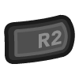

# Coleco - ColecoVision / ADAM (GearColeco)

## Background

Gearcoleco is an open source, cross-platform ColecoVision and Coleco ADAM emulator written in C++.

- Accurate Z80 core, including undocumented opcodes and behavior like R and MEMPTR registers.
- Accurate TMS9918 emulation and optional F18A v1.9 support.
- Support for ColecoVision Super Game Module (SGM), MegaCart, Activision and OCM cartridges.
- Coleco ADAM computer and cartridge modes, keyboard, Digital Data Pack and floppy disk support.
- Support for Super Action Controller (SAC), Wheel Controller and Roller Controller.
- Supported platforms (libretro): Windows, Linux, macOS, Raspberry Pi, Android, iOS, tvOS, webOS, PlayStation Vita, PlayStation 3, Nintendo 3DS, Nintendo GameCube, Nintendo Wii, Nintendo WiiU, Nintendo Switch, Emscripten, Classic Mini systems (NES, SNES, C64, ...), OpenDingux, RetroFW and QNX.

The Gearcoleco core has been authored by:

- [Nacho Sanchez (drhelius)](https://github.com/drhelius)

The Gearcoleco core is licensed under:

- [GPLv3](https://github.com/drhelius/Gearcoleco/blob/master/LICENSE)

A summary of the licenses behind RetroArch and its cores can be found [here](../development/licenses.md).

## BIOS

Gearcoleco requires a BIOS file to work.

Required or optional firmware files go in the frontend's system directory.

!!! attention
    Gearcoleco requires a ColecoVision BIOS. Place the following file in RetroArch's system directory.

| Filename | Description | Size | MD5 | CRC32 |
|:--------:|:-----------:|:----:|:---:|:-----:|
| colecovision.rom | ColecoVision OS-7 BIOS - Required | 8192 bytes | 2c66f5911e5b42b8ebe113403548eee7 | 3aa93ef3 |

The core also accepts `coleco.rom` or `os7.u2` for this same ColecoVision/ADAM OS-7 BIOS. Firmware can be placed in the system directory or its `gearcoleco` subdirectory.

ADAM mode requires the OS-7 BIOS above plus both of the following raw firmware images:

| Filename | Description | Size | MD5 | CRC32 |
|:--------:|:-----------:|:----:|:---:|:-----:|
| eos.rom | ADAM EOS - Required | 8192 bytes | 01df3140909f09aa9aac4f88890f676c | 05a37a34 |
| writer.rom | ADAM SmartWriter - Required | 32768 bytes | 4fe4f6800076ea3d897d4285653447bd | 58d86a2a |

SmartWriter may also be named `wp.rom` or `wp_r80.rom`.

## Extensions

Content that can be loaded by the Gearcoleco core have the following file extensions:

- .col
- .cv
- .bin
- .rom
- .zip
- .ddp
- .dsk
- .m3u

ADAM supports 256 KiB Digital Data Pack (`.ddp`) images and 160/320 KiB floppy disk (`.dsk`) images. An ADAM ZIP archive must contain exactly one valid media image. Playlists must contain only data packs or only disks; mixed media types are not supported.

RetroArch database(s) that are associated with the Gearcoleco core:

- [Coleco - ColecoVision](https://github.com/libretro/libretro-database/blob/master/rdb/Coleco%20-%20ColecoVision.rdb)

## Features

Frontend-level settings or features that the Gearcoleco core respects.

| Feature           | Supported |
|-------------------|:---------:|
| Restart           | ✔         |
| Screenshots       | ✔         |
| Saves             | ✔         |
| States            | ✔         |
| Rewind            | ✔         |
| Netplay           | ✔         |
| Core Options      | ✔         |
| [Memory Monitoring (achievements)](../guides/memorymonitoring.md) | ✔         |
| RetroArch Cheats  | ✕         |
| Native Cheats     | ✕         |
| Controls          | ✔         |
| Remapping         | ✔         |
| Multi-Mouse       | ✕         |
| Rumble            | ✕         |
| Sensors           | ✕         |
| Camera            | ✕         |
| Location          | ✕         |
| Subsystem         | ✔         |
| [Softpatching](../guides/softpatching.md) | ✔         |
| Disk Control      | ✔         |
| Username          | ✕         |
| Language          | ✕         |
| Crop Overscan     | ✔         |
| LEDs              | ✕         |

### Directories

The Gearcoleco core's library name is 'Gearcoleco'.

The Gearcoleco core saves/loads to/from these directories.

**Frontend's Save directory**

| File  | Description            |
|:-----:|:----------------------:|
| *.srm | Cartridge battery save |
| *.gearcoleco.ddp | ADAM data pack working copy, when writable media is enabled |
| *.gearcoleco.dsk | ADAM disk working copy, when writable media is enabled |

ADAM working-copy names include the content name, original image checksum and drive slot. The original content files are not overwritten.

**Frontend's State directory**

| File     | Description |
|:--------:|:-----------:|
| *.state# | State       |

### Geometry and timing

- The Gearcoleco core's provided FPS is approximately 59.92 for NTSC games and 50.16 for PAL games; ADAM uses NTSC timing
- The Gearcoleco core's provided sample rate is 44100 Hz
- The Gearcoleco core's base width is 256
- The Gearcoleco core's base height is 192
- F18A output can use a wider or taller active raster, depending on the video mode
- The Gearcoleco core's max width is 512
- The Gearcoleco core's max height is 288
- The Gearcoleco core uses square pixels by default (4:3 at 256x192); the ['Aspect Ratio' core option](#core-options) can override this

## Coleco ADAM

Load a `.ddp`, `.dsk`, ADAM `.zip` or `.m3u` file to start ADAM computer mode automatically. Starting the core without content also selects ADAM and opens SmartWriter when no bootable media is inserted. No-content startup requires frontend support. Cartridge files use ColecoVision by default; select *ADAM* in **Cartridge Hardware** to run a cartridge on ADAM hardware.

### Preparing multiple drives

The single optional **ADAM** subsystem (`adam`) lets you prepare several images before booting. It provides five slots, in this order:

1. Cartridge
2. Disk 1
3. Disk 2
4. Data Pack 1
5. Data Pack 2

Every slot is optional. Each drive accepts its own image or homogeneous M3U playlist. A cartridge alone starts cartridge mode; media or an empty setup starts computer mode. Older three-file subsystem launch configurations must be updated to this five-slot layout.

Normal content loading is sufficient for a single program or an M3U disk-swapping set. An M3U supplies alternative images for one drive; it does not automatically mount its entries in separate drives.

### Inserting and changing media

Select the target drive with **ADAM Disk Control Drive**, then use the frontend's disk controls to eject, add or select an image, and insert it. This also works after starting the core without content. Each drive keeps its own image list, and changing one drive leaves the others mounted. The default *Loaded media* target selects the primary content drive.

Inserting media does not reset the computer. To boot a newly inserted program, request **ADAM Computer Reset**. Computer boot checks Disk 1, Disk 2, Data Pack 1 and Data Pack 2 in order and starts SmartWriter if none contains bootable media. Use disk swapping without reset when a running application requests another disk.

Media is write protected by default. Set **ADAM Writable Media** to *Save-directory working copy* and reload the content to save changes in the frontend's save directory. This requires a save directory and a frontend file-system interface that supports writing; otherwise the media remains write protected.

ADAM save states validate the firmware, cartridge and mounted media, and restore the image selections for all four drives. Compatible older single-drive metadata remains supported. States from experimental ADAM versions before state format 108 must be recreated.

## Core options

The Gearcoleco core has the following options that can be tweaked from the core options menu. The default setting is bolded.

Settings with (restart) means that core has to be closed for the new setting to be applied on next launch.

- **Cartridge Hardware (restart)** [gearcoleco_cartridge_hardware] (**ColecoVision**|ADAM)

    Select the hardware used for cartridge ROMs. Disks, data packs, playlists and no-content startup always select ADAM automatically. The old Machine and ADAM Boot Mode options are no longer used.

- **ADAM Disk Control Drive** [gearcoleco_adam_disk_drive] (**Loaded media**|Disk 1|Disk 2|Data Pack 1|Data Pack 2)

    Select which drive the frontend's Disk Control menu operates. *Loaded media* selects the primary content drive. Other drives remain mounted when this option changes.

- **ADAM Computer Reset** [gearcoleco_adam_computer_reset] (**Idle**|Reset)

    Select *Reset* to boot the computer from mounted media, or start SmartWriter if none is bootable. Mounted images are retained. The option returns to *Idle* when supported by the frontend; otherwise select *Idle* before requesting another reset. The frontend's normal Reset action retains the current boot mode, including cartridge mode.

- **ADAM Writable Media (restart)** [gearcoleco_adam_writable_media] (**Disabled**|Save-directory working copy)

    Select whether ADAM media is write protected or saves changes to complete working copies in the frontend's save directory.

- **Refresh Rate (restart)** [gearcoleco_timing] (**Auto**|NTSC (60 Hz)|PAL (50 Hz))

    Select which refresh rate will be used in emulation.

    - *Auto* selects the best refresh rate based on the loaded ROM.
    - *NTSC (60 Hz)* selects NTSC timing.
    - *PAL (50 Hz)* selects PAL timing for ColecoVision cartridges. ADAM always uses NTSC timing.

- **Mapper (restart)** [gearcoleco_mapper] (**Auto**|Standard|MegaCart|Activision|OCM)

    Select the cartridge mapper. *Auto* detects the appropriate mapper from the loaded content. Change this only if a cartridge does not work correctly with automatic detection.

- **Video Chip (restart)** [gearcoleco_video_chip] (**Auto**|TMS9918A|F18A)

    Select the installed video chip. *Auto* uses TMS9918A unless the game database identifies the content as requiring F18A.

- **Aspect Ratio** [gearcoleco_aspect_ratio] (**1:1 PAR**|4:3 DAR|16:9 DAR|16:10 DAR)

    Select which aspect ratio will be presented by the core.

    - *1:1 PAR* selects an aspect ratio that produces square pixels.
    - *4:3 DAR* forces 4:3 aspect ratio.
    - *16:9 DAR* forces 16:9 aspect ratio.
    - *16:10 DAR* forces 16:10 aspect ratio.

- **Overscan** [gearcoleco_overscan] (**Disabled**|Top+Bottom|Full (284 width)|Full (320 width))

    Select which overscan (borders) will be used with TMS9918A. F18A uses its active logical raster without TMS overscan.

    - *Disabled* disables overscan.
    - *Top+Bottom* enables overscan for top and bottom.
    - *Full (284 width)* enables overscan for top, bottom, left and right (284 width).
    - *Full (320 width)* enables overscan for top, bottom, left and right (320 width).

- **Allow Up+Down / Left+Right** [gearcoleco_up_down_allowed] (**Disabled**|Enabled)

    Enable this option to press, quickly alternate, or hold both left and right, or up and down, at the same time.

    This may cause movement-based glitches in some games.

    It is best to keep this option disabled.

- **No Sprite Limit** [gearcoleco_no_sprite_limit] (**Disabled**|Enabled)

    Remove the per-line sprite limit.

    This may cause glitches in some games.

    It is best to keep this option disabled.

- **Spinner Support** [gearcoleco_spinners] (**Disabled**|Super Action Controller|Wheel Controller|Roller Controller)

    Select which spinner controller to emulate. Mouse movement controls the spinner. Mouse buttons map to the Left (Yellow) and Right (Red) buttons.

    - *Disabled* disables spinner support.
    - *Super Action Controller* enables spinner support for Super Action Controller.
    - *Wheel Controller* enables spinner support for Wheel Controller.
    - *Roller Controller* enables spinner support for Roller Controller.

- **Spinner Sensitivity** [gearcoleco_spinner_sensitivity] (**1**|1-10)

    Select the spinner sensitivity.

    - *1* is the lowest sensitivity.
    - *10* is the highest sensitivity.

### Joypad

| Coleco Controller                   | RetroPad Inputs                                |
|-------------------------------------|------------------------------------------------|
| Joystick Up                         |        |
| Joystick Down                       |      |
| Joystick Left                       |      |
| Joystick Right                      |     |
| Yellow (Left)                       |              |
| Red (Right)                         |              |
| Keypad 1                            |              |
| Keypad 2                            |              |
| Keypad 3                            |             |
| Keypad 4                            |             |
| Keypad 5                            |             |
| Keypad 6                            |             |
| Keypad 7                            |             |
| Keypad 8                            |             |
| Keypad *                            |          |
| Keypad #                            |         |
| Keypad 9                            |   Left Analog Y   |
| Keypad 0                            |   Left Analog X   |
| Purple                              |   Right Analog Y  |
| Blue                                |   Right Analog X  |

### ADAM Keyboard

ADAM uses the frontend's keyboard callback. Letters, digits, punctuation, Return, Backspace, Tab and arrow keys type normally unless reassigned to a special key. Shift, Control and Caps Lock retain their ADAM modifier functions.

The **ADAM Keyboard** core options configure the following bindings. Select *Unassigned* to disable a binding. Available host keys include F1-F15, letters, digits, punctuation, navigation keys and keypad Enter.

| ADAM key | Core option | Default host key |
|----------|-------------|------------------|
| SmartKey I | `gearcoleco_adam_key_smartkey1` | **F1** |
| SmartKey II | `gearcoleco_adam_key_smartkey2` | **F2** |
| SmartKey III | `gearcoleco_adam_key_smartkey3` | **F3** |
| SmartKey IV | `gearcoleco_adam_key_smartkey4` | **F4** |
| SmartKey V | `gearcoleco_adam_key_smartkey5` | **F5** |
| SmartKey VI | `gearcoleco_adam_key_smartkey6` | **F6** |
| Wild Card | `gearcoleco_adam_key_wildcard` | **F7** |
| Undo | `gearcoleco_adam_key_undo` | **F8** |
| ADAM Home | `gearcoleco_adam_key_home` | **F9** |
| Move / Copy | `gearcoleco_adam_key_move` | **INSERT** |
| Store / Fetch | `gearcoleco_adam_key_store` | **HOME** |
| Insert | `gearcoleco_adam_key_insert` | **DELETE** |
| Print | `gearcoleco_adam_key_print` | **END** |
| Clear | `gearcoleco_adam_key_clear` | **PAGEUP** |
| Delete | `gearcoleco_adam_key_delete` | **PAGEDOWN** |
| Escape / WP | `gearcoleco_adam_key_escape` | **ESCAPE** |

Reassigning a host key clears its previous ADAM special-key binding. Assigning a normal typing key to a special key replaces that key's typing function. Changes release held ADAM keys to prevent stuck input; the frontend stores the mappings as core options.

Configure the frontend's keyboard focus and hotkeys so the selected keys reach the core. These mappings do not change the frontend's own shortcuts.

## External Links

- [Official Gearcoleco Repository](https://github.com/drhelius/Gearcoleco)
- [Libretro Gearcoleco Core info file](https://github.com/libretro/libretro-super/blob/master/dist/info/gearcoleco_libretro.info)
- [Report Gearcoleco Core Issues Here](https://github.com/drhelius/Gearcoleco/issues)

### See also

- [ColecoVision/CreatiVision/My Vision (JollyCV)](jollycv.md)
- [MSX/SVI/ColecoVision/SG-1000 (blueMSX)](bluemsx.md)
