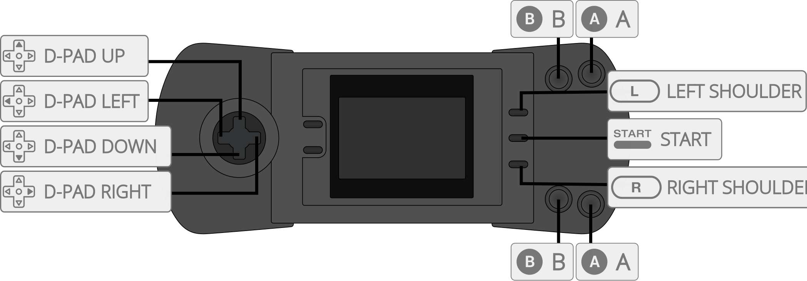

# Atari - Lynx (Gearlynx)

## Background

Gearlynx is an open source, cross-platform Atari Lynx emulator written in C++.

- Very accurate emulation supporting the entire commercial Atari Lynx catalog.
- Bank switching (BANK1 + AUDIN) and EEPROM support.
- Save files (EEPROM, NVRAM and persistent cartridge RAM).
- GameDrive and ElCheapoSD cartridge support.
- Configurable low-pass audio filter.
- Internal database for automatic ROM detection and hardware selection when `Auto` is selected.
- Supported platforms (libretro): Windows, Linux, macOS, Raspberry Pi, Android, iOS, tvOS, webOS, PlayStation Vita, PlayStation 3, Nintendo 3DS, Nintendo GameCube, Nintendo Wii, Nintendo WiiU, Nintendo Switch, Emscripten, Classic Mini systems (NES, SNES, C64, ...), OpenDingux, RetroFW and QNX.

The Gearlynx core has been authored by:

- [Nacho Sanchez (drhelius)](https://github.com/drhelius)

The Gearlynx core is licensed under:

- [GPLv3](https://github.com/drhelius/Gearlynx/blob/main/LICENSE)

A summary of the licenses behind RetroArch and its cores can be found [here](../development/licenses.md).

## BIOS

Gearlynx requires a BIOS to work.

Required firmware files go in the frontend's system directory.

!!! attention
	The Lynx boot ROM file is required for Gearlynx to function.

| Filename     | Description                  | Size      | md5sum                           |
|:------------:|:----------------------------:|:---------:|:--------------------------------:|
| lynxboot.img | Lynx Boot Image - Required   | 512 bytes | fcd403db69f54290b51035d82f835e7b |

The checksum above identifies the recommended original BIOS. Other 512-byte BIOS images can also be loaded.

## Extensions

Content that can be loaded by the Gearlynx core have the following file extensions:

- .lnx
- .lyx
- .o
- .bin

Supported formats include LNX and LNX2 cartridge headers, headerless cartridge images and BS93 homebrew executables. LNX2 images use the `.lnx` extension.

RetroArch database(s) that are associated with the Gearlynx core:

- [Atari - Lynx](https://github.com/libretro/libretro-database/blob/master/rdb/Atari%20-%20Lynx.rdb)

## Features

Frontend-level settings or features that the Gearlynx core respects.

| Feature           | Supported |
|-------------------|:---------:|
| Restart           | ✔         |
| Screenshots       | ✔         |
| Saves             | ✔         |
| States            | ✔         |
| Rewind            | ✔         |
| Run-Ahead         | ✔         |
| Netplay           | ✔         |
| Core Options      | ✔         |
| [Memory Monitoring (achievements)](../guides/memorymonitoring.md) | ✔         |
| RetroArch Cheats  | ✔         |
| Native Cheats     | ✕         |
| Controls          | ✔         |
| Remapping         | ✔         |
| Multi-Mouse       | ✕         |
| Rumble            | ✕         |
| Sensors           | ✕         |
| Camera            | ✕         |
| Location          | ✕         |
| Subsystem         | ✕         |
| [Softpatching](../guides/softpatching.md) | ✔         |
| Disk Control      | ✕         |
| Username          | ✕         |
| Language          | ✕         |
| Crop Overscan     | ✕         |
| LEDs              | ✕         |

### Directories

The Gearlynx core's library name is 'Gearlynx'.

The Gearlynx core saves/loads to/from these directories.

**Frontend's Save directory**

| File  | Description            |
|:-----:|:----------------------:|
| *.srm | EEPROM, NVRAM or LNX2 persistent cartridge RAM save |

**Frontend's State directory**

| File     | Description |
|:--------:|:-----------:|
| *.state# | State       |

### Geometry and timing

- The Gearlynx core reports a dynamic refresh rate based on each game's timer configuration
- The Gearlynx core's provided sample rate is 44100 Hz
- The Gearlynx core's base size is 160x102 in horizontal mode and 102x160 in vertical mode
- The Gearlynx core's max width is 160
- The Gearlynx core's max height is 160
- The Gearlynx core uses square pixels by default, including in vertical mode; the ['Aspect Ratio' core option](#core-options) can override this

## SD cartridges

GameDrive and ElCheapoSD use the loaded ROM's directory as the emulated SD card root. Place the files required by the cartridge in that directory and select the appropriate **Cartridge Hardware** option if automatic detection does not identify it.

SD cartridge access requires a frontend with VFS version 3 support and a content path that identifies the ROM directory. Write operations also require frontend write support and permission to write to the content directory. SD writes update files in that directory; these files are separate from the frontend-managed EEPROM, NVRAM or persistent cartridge RAM `.srm` save.

## Core options

The Gearlynx core has the following options that can be tweaked from the core options menu. The default setting is bolded.

Settings marked (restart) take effect after restarting or reloading the content.

- **Aspect Ratio** [gearlynx_aspect_ratio] (**1:1 PAR**|4:3 DAR|16:9 DAR|16:10 DAR)

	Select which aspect ratio will be presented by the core.

	- *1:1 PAR* selects an aspect ratio that produces square pixels.
	- *4:3 DAR* forces 4:3 aspect ratio.
	- *16:9 DAR* forces 16:9 aspect ratio.
	- *16:10 DAR* forces 16:10 aspect ratio.

	Fixed DAR settings retain their selected display ratio when the screen is rotated. Use *1:1 PAR* to preserve square pixels in vertical games.

- **Screen Rotation** [gearlynx_rotation] (**Auto**|Left|Right|Disabled|180)

	Rotates the screen display. This is useful since many Lynx games were designed to be played with the system held vertically. Directional controls are automatically remapped to follow the selected rotation.

	- *Auto* uses the cartridge header or game database, with horizontal orientation as the fallback.
	- *Left* rotates the screen 90 degrees counter-clockwise.
	- *Right* rotates the screen 90 degrees clockwise.
	- *Disabled* forces the screen to remain in standard horizontal orientation.
	- *180* rotates the screen upside down.

- **Console Type** [gearlynx_console_type] (**Auto**|Lynx I|Lynx II)

	Select the Atari Lynx console model to emulate. Reset or reload the content after changing the model.

	- *Auto* uses the cartridge header or game database, defaulting to Lynx II when no model is specified.
	- *Lynx I* forces emulation of the original Lynx model.
	- *Lynx II* forces emulation of the Lynx II model.

- **EEPROM Type (restart)** [gearlynx_eeprom_type] (**Auto**|None|93C46 - 128 B - 16-bit|93C46 - 128 B - 8-bit|93C56 - 256 B - 16-bit|93C56 - 256 B - 8-bit|93C66 - 512 B - 16-bit|93C66 - 512 B - 8-bit|93C76 - 1 KB - 16-bit|93C76 - 1 KB - 8-bit|93C86 - 2 KB - 16-bit|93C86 - 2 KB - 8-bit)

	Override the cartridge EEPROM capacity and organization. *Auto* uses the cartridge header or game database. Restart or reload the content to apply changes.

- **Cartridge Hardware (restart)** [gearlynx_cartridge_hardware] (**Auto**|Standard|GameDrive|ElCheapoSD)

	Override special cartridge hardware. *Auto* uses the cartridge header or game database. Restart or reload the content to apply changes.

- **Legacy Sprite Renderer** [gearlynx_legacy_sprite_renderer] (**Disabled**|Enabled)

	Use a simpler, faster Suzy sprite renderer. This is less accurate for mid-render interrupt effects used by some demos. It is best to keep this option disabled.

- **Audio Low-Pass Filter (Hz)** [gearlynx_lowpass_filter] (**3500**|500|1000|1500|2000|2500|3000|4000|4500|5000)

	Set the low-pass filter cutoff frequency to reduce high-frequency noise. Lower values produce a more muffled sound. The available range is 500-5000 Hz, with 3500 Hz as the default.

- **Audio Channel 0 Volume** [gearlynx_audio_ch0_volume] (**100**|0-200 in increments of 10)

	Set the volume for audio channel 0: 0 mutes it, 100 is the normal level and 200 doubles it.

- **Audio Channel 1 Volume** [gearlynx_audio_ch1_volume] (**100**|0-200 in increments of 10)

	Set the volume for audio channel 1: 0 mutes it, 100 is the normal level and 200 doubles it.

- **Audio Channel 2 Volume** [gearlynx_audio_ch2_volume] (**100**|0-200 in increments of 10)

	Set the volume for audio channel 2: 0 mutes it, 100 is the normal level and 200 doubles it.

- **Audio Channel 3 Volume** [gearlynx_audio_ch3_volume] (**100**|0-200 in increments of 10)

	Set the volume for audio channel 3: 0 mutes it, 100 is the normal level and 200 doubles it.

- **Allow Up+Down / Left+Right** [gearlynx_up_down_allowed] (**Disabled**|Enabled)

	Enable this option to press, quickly alternate, or hold both left and right, or up and down, at the same time.

	This may cause movement-based glitches in some games.

	It is best to keep this option disabled.

## Joypad

Port 1 accepts **Joypad Auto** or **Lynx Pad** with the mappings below. **Joypad Port Empty** disables controller input.

| User 1 input descriptors | RetroPad Inputs                             |
|--------------------------|---------------------------------------------|
| B                        |           |
| Pause                    |       |
| Up                       |     |
| Down                     |   |
| Left                     |   |
| Right                    |  |
| A                        |           |
| Option 1                 |          |
| Option 2                 |          |

## Compatibility

- [Gearlynx Hardware Tests](https://github.com/drhelius/lynx-tests)

## External Links

- [Official Gearlynx Github Repository](https://github.com/drhelius/Gearlynx)
- [Libretro Gearlynx Core info file](https://github.com/libretro/libretro-super/blob/master/dist/info/gearlynx_libretro.info)
- [Report Libretro Gearlynx Core Issues Here](https://github.com/drhelius/Gearlynx/issues)

### See also

#### Atari - Lynx

- [Atari - Lynx (Beetle Lynx)](beetle_lynx.md)
- [Atari - Lynx (Handy)](handy.md)
- [Atari - Lynx (Holani)](holani.md)
