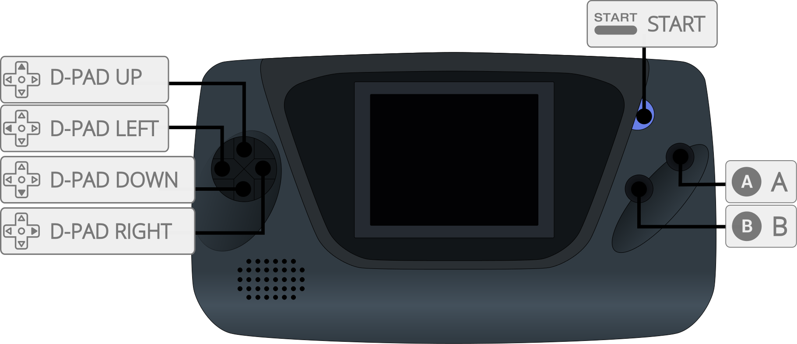
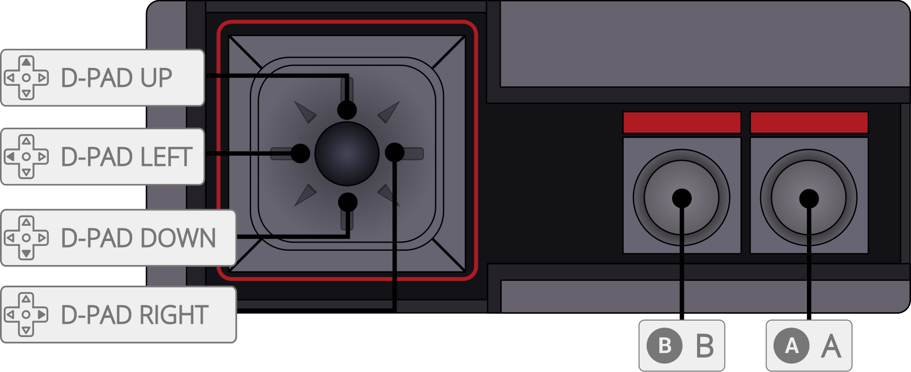
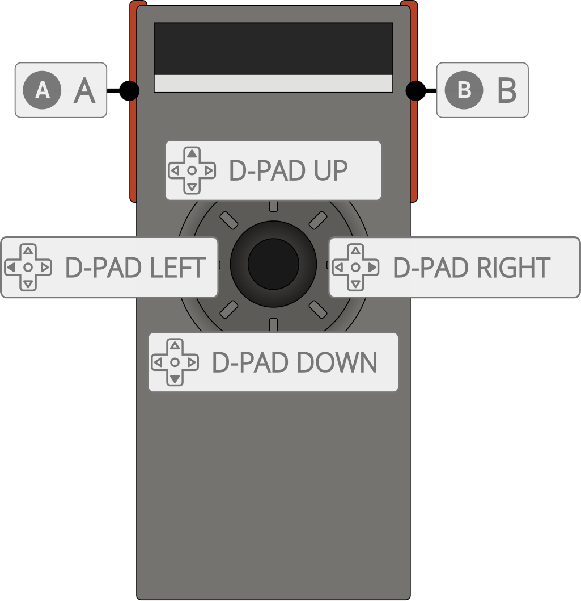

# Sega - MS/GG (Gearsystem)

## Background

Gearsystem is an open source, cross-platform Sega Master System, Game Gear, SG-1000, and Othello Multivision emulator written in C++.

- Very accurate emulation with support for ROM-only cartridges and Sega, Codemasters, Korean, MSX, Janggun, SG-1000, EEPROM, and multicart mappers.
- Automatic region detection: NTSC-JAP, NTSC-USA, PAL-EUR.
- Accurate VDP emulation, including timing and VDP specifics for SMS, SMS2, GG and TMS9918 modes.
- Support for YM2413 (OPLL) FM sound chip.
- Light Phaser, Paddle Control and Sports Pad support.
- Internal database for ROM detection.
- Battery-backed RAM save support.
- Game Genie and Pro Action Replay cheat support.
- Supported platforms (libretro): Windows, Linux, macOS, Raspberry Pi, Android, iOS, tvOS, webOS, PlayStation Vita, PlayStation 3, Nintendo 3DS, Nintendo GameCube, Nintendo Wii, Nintendo WiiU, Nintendo Switch, Emscripten, Classic Mini systems (NES, SNES, C64, ...), OpenDingux, RetroFW and QNX.

The Gearsystem core has been authored by

- [Nacho Sanchez (drhelius)](https://github.com/drhelius)

The Gearsystem core is licensed under

- [GPLv3](https://github.com/drhelius/Gearsystem/blob/master/LICENSE)

A summary of the licenses behind RetroArch and its cores can be found [here](../development/licenses.md).

## BIOS

Gearsystem does not require BIOS (boot ROM) files, but they can be used optionally.

When enabled, the BIOS runs as it does on original hardware. Invalid ROMs or ROMs for a different region or system may fail to boot. Disable the BIOS if this occurs.

Required or optional firmware files go in the frontend's system directory.

!!! attention
	 If you’d like to use any BIOS, you can place the following files in RetroArch's system directory. Then, you need to enable [Master System BIOS](#core-options) and/or [Game Gear BIOS](#core-options) core options for these BIOS files to be used.

| Filename     | Description                        | md5sum                           |
|:------------:|:----------------------------------:|:--------------------------------:|
| bios.sms     | Master System BIOS - Optional      | 840481177270d5642a14ca71ee72844c |
| bios.gg      | Game Gear BIOS - Optional          | 672e104c3be3a238301aceffc3b23fd6 |

## Extensions

Content that can be loaded by the Gearsystem core have the following file extensions:

- .sms
- .gg
- .sg
- .mv
- .bin
- .rom

RetroArch database(s) that are associated with the Gearsystem core:

- [Sega - Game Gear](https://github.com/libretro/libretro-database/blob/master/rdb/Sega%20-%20Game%20Gear.rdb)
- [Sega - Master System - Mark III](https://github.com/libretro/libretro-database/blob/master/rdb/Sega%20-%20Master%20System%20-%20Mark%20III.rdb)
- [Sega - SG-1000](https://github.com/libretro/libretro-database/blob/master/rdb/Sega%20-%20SG-1000.rdb)

## Features

Frontend-level settings or features that the Gearsystem core respects.

| Feature           | Supported |
|-------------------|:---------:|
| Restart           | ✔         |
| Screenshots       | ✔         |
| Saves             | ✔         |
| States            | ✔         |
| Rewind            | ✔         |
| Netplay           | ✔         |
| Core Options      | ✔         |
| [Memory Monitoring (achievements)](../guides/memorymonitoring.md) | ✔         |
| RetroArch Cheats - Game Genie  | ✔         |
| RetroArch Cheats - Pro Action Replay | ✔         |
| Native Cheats     | ✕         |
| Controls          | ✔         |
| Remapping         | ✔         |
| Multi-Mouse       | ✕         |
| Rumble            | ✕         |
| Sensors           | ✕         |
| Camera            | ✕         |
| Location          | ✕         |
| Subsystem         | ✕         |
| [Softpatching](../guides/softpatching.md) | ✔         |
| Disk Control      | ✕         |
| Username          | ✕         |
| Language          | ✕         |
| Crop Overscan     | ✔         |
| LEDs              | ✕         |

### Directories

The Gearsystem core's library name is 'Gearsystem'

The Gearsystem core saves/loads to/from these directories.

**Frontend's Save directory**

| File  | Description            |
|:-----:|:----------------------:|
| *.srm | Cartridge battery save |

**Frontend's State directory**

| File     | Description |
|:--------:|:-----------:|
| *.state# | State       |

### Geometry and timing

- The Gearsystem core's provided FPS is approximately 59.92 for NTSC games, 49.70 for PAL Master System games and 50.17 for PAL SG-1000 games
- The Gearsystem core's provided sample rate is 44100 Hz
- The Gearsystem core's base width is 256 for Master System / SG-1000 games and 160 for native Game Gear games; Game Gear SMS mode uses the Master System dimensions
- The Gearsystem core's base height is 192 for Master System / SG-1000 games (224 in extended mode) and 144 for native Game Gear games; overscan and left-bar cropping can change the output size
- The Gearsystem core's max width is 320
- The Gearsystem core's max height is 288
- The Gearsystem core uses square pixels by default (4:3 at 256x192 and 10:9 at 160x144); the ['Aspect Ratio' core option](#core-options) can override this

## Core options

The Gearsystem core has the following options that can be tweaked from the core options menu. The default setting is bolded.

Settings with (restart) means that core has to be closed for the new setting to be applied on next launch.

- **System (restart)** [gearsystem_system] (**Auto**|Master System / Mark III|Game Gear (2 ASIC)|Game Gear (2 ASIC) SMS Mode|Game Gear (1 ASIC)|Game Gear (1 ASIC) SMS Mode|SG-1000 / Multivision|SG-1000 II)

	Select the console type to emulate. 'Auto' automatically detects the appropriate system based on the loaded content.

    - *Auto* selects the best hardware based on the ROM.
    - *Master System / Mark III* forces original Master System / Mark III hardware.
    - *Game Gear (2 ASIC)* forces Game Gear hardware with 2 ASIC configuration.
    - *Game Gear (2 ASIC) SMS Mode* forces Game Gear in SMS compatibility mode (2 ASIC).
    - *Game Gear (1 ASIC)* forces Game Gear hardware with 1 ASIC configuration.
    - *Game Gear (1 ASIC) SMS Mode* forces Game Gear in SMS compatibility mode (1 ASIC).
    - *SG-1000 / Multivision* forces SG-1000 / Multivision hardware.
    - *SG-1000 II* forces SG-1000 II hardware.

- **Region (restart)** [gearsystem_region] (**Auto**|Master System Japan|Master System Export|Game Gear Japan|Game Gear Export|Game Gear International)

	Select which region is emulated.

    - *Auto* selects the best region based on the ROM.
    - *Master System Japan* forces Master System Japan region.
    - *Master System Export* forces Master System Export region.
    - *Game Gear Japan* forces Game Gear Japan region.
    - *Game Gear Export* forces Game Gear Export region.
    - *Game Gear International* forces Game Gear International region.

- **Mapper (restart)** [gearsystem_mapper] (**Auto**|ROM|SEGA|Codemasters|Korean|SG-1000|MSX|Janggun|Korean 2000 XOR 1F|Korean MSX 32KB 2000|Korean MSX SMS 8000|Korean SMS 32KB 2000|Korean MSX 8KB 0300|Korean 0000 XOR FF|Korean FFFF HiCom|Korean FFFE|Korean BFFC|Korean FFF3 FFFC|Korean MD FFF5|Korean MD FFF0|Jumbo Dahjee|EEPROM 93C46|Multi 4PAK All Action|Iratahack)

	Select which mapper (memory bank controller) is emulated. 'Auto' automatically detects the appropriate mapper based on the loaded content. Only change this if a game does not work correctly with the default setting.

    - *Auto* selects the best mapper based on the ROM.
    - *ROM* forces no mapper.
    - *SEGA* forces SEGA mapper.
    - *Codemasters* forces Codemasters mapper.
    - *Korean* forces Korean mapper.
    - *SG-1000* forces SG-1000 mapper.
    - *MSX* forces MSX mapper.
    - *Janggun* forces Janggun mapper.
    - *Korean 2000 XOR 1F* forces the Korean 2000 XOR 1F mapper.
    - *Korean MSX 32KB 2000* forces the Korean MSX 32KB 2000 mapper.
    - *Korean MSX SMS 8000* forces the Korean MSX SMS 8000 mapper.
    - *Korean SMS 32KB 2000* forces the Korean SMS 32KB 2000 mapper.
    - *Korean MSX 8KB 0300* forces the Korean MSX 8KB 0300 mapper.
    - *Korean 0000 XOR FF* forces the Korean 0000 XOR FF mapper.
    - *Korean FFFF HiCom* forces the Korean FFFF HiCom mapper.
    - *Korean FFFE* forces the Korean FFFE mapper.
    - *Korean BFFC* forces the Korean BFFC mapper.
    - *Korean FFF3 FFFC* forces the Korean FFF3 FFFC mapper.
    - *Korean MD FFF5* forces the Korean MD FFF5 mapper.
    - *Korean MD FFF0* forces the Korean MD FFF0 mapper.
    - *Jumbo Dahjee* forces the Jumbo Dahjee mapper.
    - *EEPROM 93C46* forces the EEPROM 93C46 mapper.
    - *Multi 4PAK All Action* forces the Multi 4PAK All Action mapper.
    - *Iratahack* forces the Iratahack mapper.

- **Refresh Rate (restart)** [gearsystem_timing] (**Auto**|NTSC (60 Hz)|PAL (50 Hz))

	Select which refresh rate will be used in emulation.

    - *Auto* selects the best refresh rate based on the ROM.
    - *NTSC (60 Hz)* selects NTSC timing.
    - *PAL (50 Hz)* selects PAL timing.

- **Aspect Ratio** [gearsystem_aspect_ratio] (**1:1 PAR**|4:3 DAR|16:9 DAR|16:10 DAR)

    Select which aspect ratio will be presented by the core.

    - *1:1 PAR* selects an aspect ratio that produces square pixels.
    - *4:3 DAR* forces 4:3 aspect ratio.
    - *16:9 DAR* forces 16:9 aspect ratio.
    - *16:10 DAR* forces 16:10 aspect ratio.

- **Overscan** [gearsystem_overscan] (**Disabled**|Top+Bottom|Full (284 width)|Full (320 width))

    Select which overscan (borders) will be used in emulation.

    - *Disabled* disables overscan.
    - *Top+Bottom* enables overscan for top and bottom.
    - *Full (284 width)* enables overscan for top, bottom, left and right (284 width).
    - *Full (320 width)* enables overscan for top, bottom, left and right (320 width).

- **Hide Left Bar (SMS only)** [gearsystem_hide_left_bar] (**No**|Auto|Always)

    Select when to hide the left bar in Master System games.

    - *No* never hides the left bar.
    - *Auto* hides the left bar when the bar is detected.
    - *Always* always hides the left bar even if no left bar is detected.

- **No Sprite Limit** [gearsystem_no_sprite_limit] (**Disabled**|Enabled)

    Remove the per-line sprite limit. This reduces flickering but may cause glitches in some games.

- **Master System BIOS (restart)** [gearsystem_bios_sms] (**Disabled**|Enabled)

    Enable or disable the Master System BIOS. The `bios.sms` file must exist in the frontend's system directory. When enabled, it runs as it does on original hardware, so invalid ROMs may fail to boot.

- **Game Gear BIOS (restart)** [gearsystem_bios_gg] (**Disabled**|Enabled)

    Enable or disable the Game Gear BIOS. The `bios.gg` file must exist in the frontend's system directory. When enabled, it runs as it does on original hardware, so invalid ROMs may fail to boot.

- **YM2413 (restart)** [gearsystem_ym2413] (**Auto**|Disabled)

	Enable or disable the YM2413 (OPLL) FM sound chip. 'Auto' enables the chip based on the loaded content. Some Master System games use this chip for enhanced music.

    - *Auto* selects the best option based on the ROM.
    - *Disabled* disables YM2413.

- **PSG Volume** [gearsystem_psg_volume] (**100**|0-200 in increments of 10)

	Set the volume of the PSG (SN76489). The value is a percentage from 0 to 200, where 100 is the default volume.

- **FM Volume** [gearsystem_fm_volume] (**100**|0-200 in increments of 10)

	Set the volume of the YM2413 (OPLL) FM sound chip. The value is a percentage from 0 to 200, where 100 is the default volume.

- **3D Glasses** [gearsystem_glasses] (**Both Eyes / OFF**|Left Eye|Right Eye)

	For games with 3D glasses support this option will let you choose to display only left or right eye.

    - *Both Eyes / OFF* is required for games with NO 3D support or if you want to display both eyes in 3D games.
    - *Left Eye* displays the left eye only.
    - *Right Eye* displays the right eye only.

- **Allow Up+Down / Left+Right** [gearsystem_up_down_allowed] (**Disabled**|Enabled)

    Enable this option to press, quickly alternate, or hold both left and right, or up and down, at the same time.

    This may cause movement-based glitches in some games.

    It is best to keep this option disabled.

- **Light Gun Input** [gearsystem_lightgun_input] (**Light Gun**|Touchscreen)

    Select which input will be used for Light Phaser games.

    - *Light Gun* - Selects mouse-controlled Light Gun input (devices will use [RetroLightgun](#light-gun) inputs).
    - *Touchscreen* - Selects a touchscreen input (devices will use [RetroPointer](#pointer) inputs instead).

- **Light Gun Crosshair** [gearsystem_lightgun_crosshair] (**Disabled**|Enabled)

    Enable or disable the crosshair for Light Phaser games.

- **Light Gun Crosshair Shape** [gearsystem_lightgun_shape] (**Cross**|Square)

    Select the shape of the crosshair for Light Phaser games.

- **Light Gun Crosshair Color** [gearsystem_lightgun_color] (**White**|Black|Red|Green|Blue|Yellow|Magenta|Cyan)

    Select the color of the crosshair for Light Phaser games.

- **Light Gun Crosshair Offset X** [gearsystem_lightgun_crosshair_offset_x] (**0**|-10 - 10)

    Set the horizontal pixel offset of the crosshair for calibration.

- **Light Gun Crosshair Offset Y** [gearsystem_lightgun_crosshair_offset_y] (**0**|-10 - 10)

    Set the vertical pixel offset of the crosshair for calibration.

- **Paddle Sensitivity** [gearsystem_paddle_sensitivity] (**1**|1-15)

    Set the sensitivity of the [Paddle Control](#mouse).

    - *1* is the lowest sensitivity.
    - *15* is the highest sensitivity.

- **Sports Pad Sensitivity** [gearsystem_sports_pad_sensitivity] (**8**|1-15)

    Set the sensitivity of the [Sports Pad](#sports-pad). Higher values produce faster trackball movement.

## Joypad

Select the emulated controller using the frontend's port device type. *Sports Pad* is available on ports 1 and 2; *Sega Light Phaser* and *Paddle Control* are available on port 1.

| RetroPad Inputs                                | SMS / GG Pad             |
|------------------------------------------------|--------------------------|
|        | Up                       |
|      | Down                     |
|      | Left                     |
|     | Right                    |
|              | 1                        |
|              | 2                        |
|          | Pause / Start            |
|         | Reset                    |

## Sports Pad

Select *Sports Pad* as the device type for the desired port. The left analog stick controls the trackball.

| RetroPad Inputs                                | Sports Pad               |
|------------------------------------------------|--------------------------|
|     | Trackball movement       |
|              | 1                        |
|              | 2                        |
|          | Pause                    |
|         | Reset                    |

## Light Gun

| RetroLightgun Inputs  | [Light Phaser](https://segaretro.org/Light_Phaser)      |
|-----------------------|---------------------------------------------------------|
|  Gun Crosshair | Light Phaser Crosshair |
| Gun Trigger                                            | Light Phaser Trigger   |

## Pointer

| RetroPointer Inputs   | [Light Phaser](https://segaretro.org/Light_Phaser)        |
|-----------------------|-----------------------------------------------------------|
|  or  Pointer Position | Light Phaser Crosshair                 |
|  Mouse 1   | Light Phaser Trigger          |

## Mouse

| RetroMouse Inputs                                     | [Paddle Control](https://segaretro.org/Paddle_Control)        |
|-------------------------------------------------------|-----------------|
|  Mouse Cursor | Paddle wheel |
|  Mouse 1       | Paddle button   |

## Compatibility

- [Gearsystem Accuracy Tests](https://github.com/drhelius/Gearsystem#accuracy-tests)

## External Links

- [Official Gearsystem Repository](https://github.com/drhelius/Gearsystem)
- [Libretro Gearsystem Core info file](https://github.com/libretro/libretro-super/blob/master/dist/info/gearsystem_libretro.info)
- [Report Libretro Gearsystem Core Issues Here](https://github.com/drhelius/Gearsystem/issues)

### See also

#### Sega - Game Gear

- [Sega - MS/GG/MD/CD (Genesis Plus GX)](genesis_plus_gx.md)

#### Sega - Master System - Mark III

- [Sega - Master System (Emux SMS)](emux_sms.md)
- [Sega - MS/GG/MD/CD (Genesis Plus GX)](genesis_plus_gx.md)
- [Sega - MS/MD/CD/32X (PicoDrive)](picodrive.md)

#### Sega - SG-1000

- [MSX/SVI/ColecoVision/SG-1000 (blueMSX)](bluemsx.md)
- [Sega - MS/GG/MD/CD (Genesis Plus GX)](genesis_plus_gx.md)
