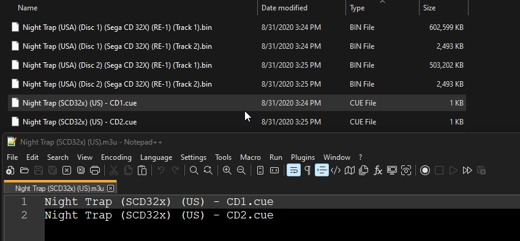
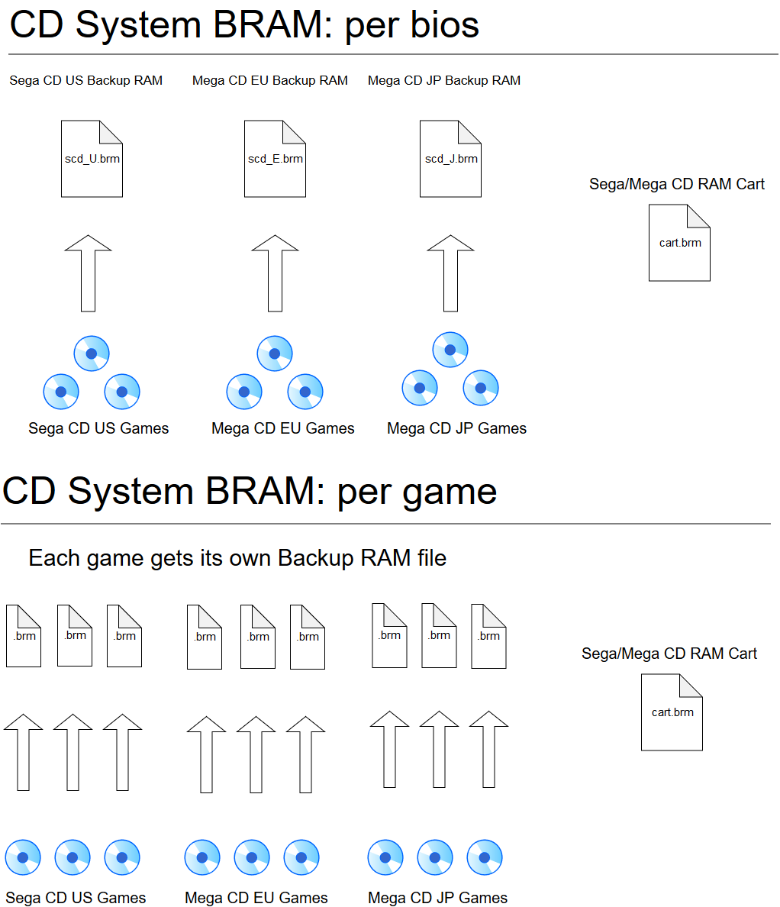
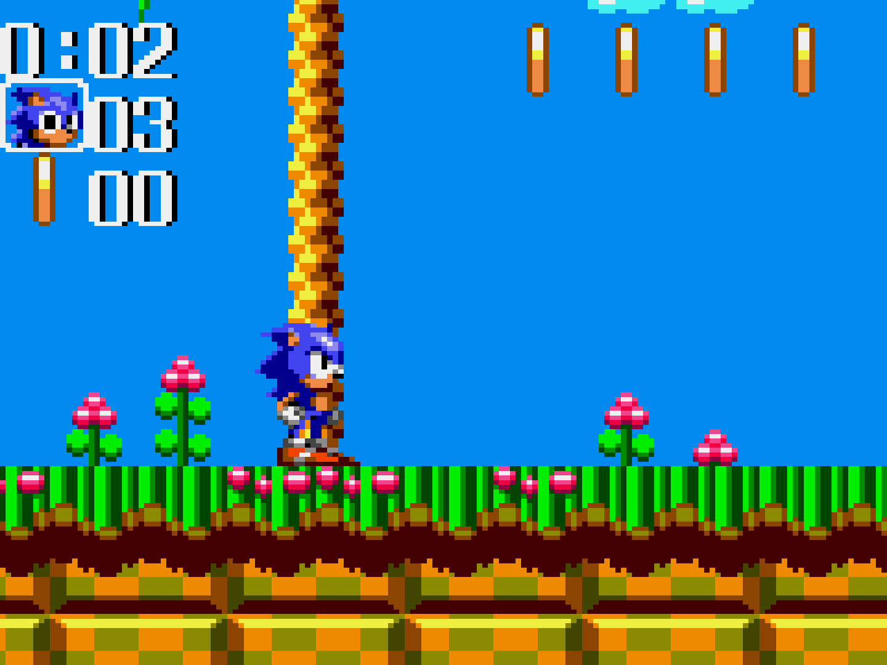
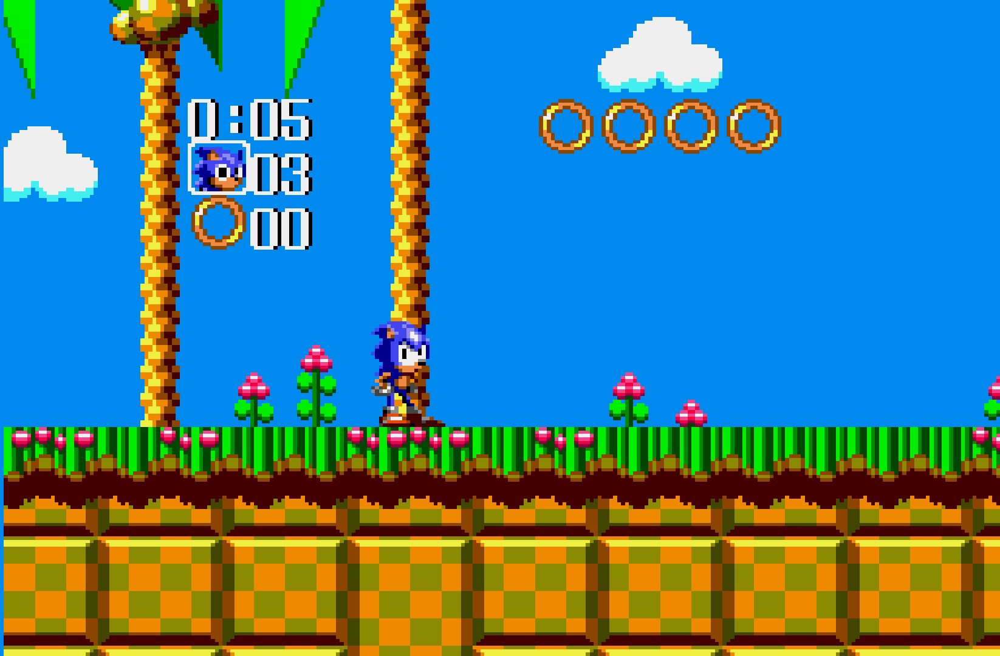
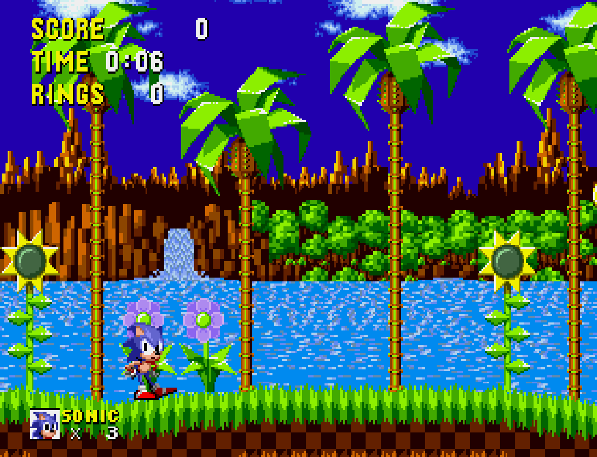
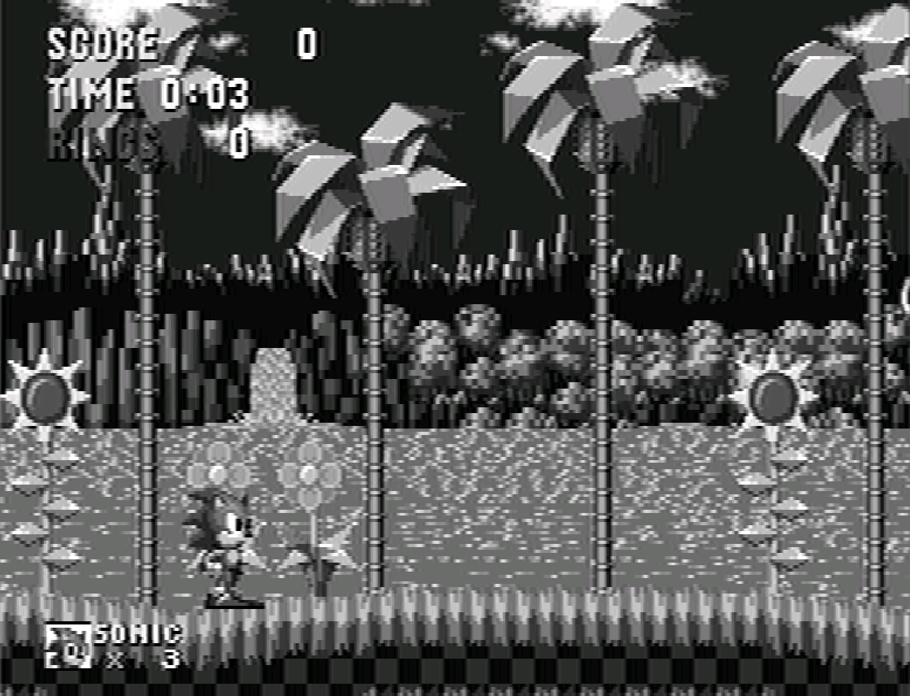
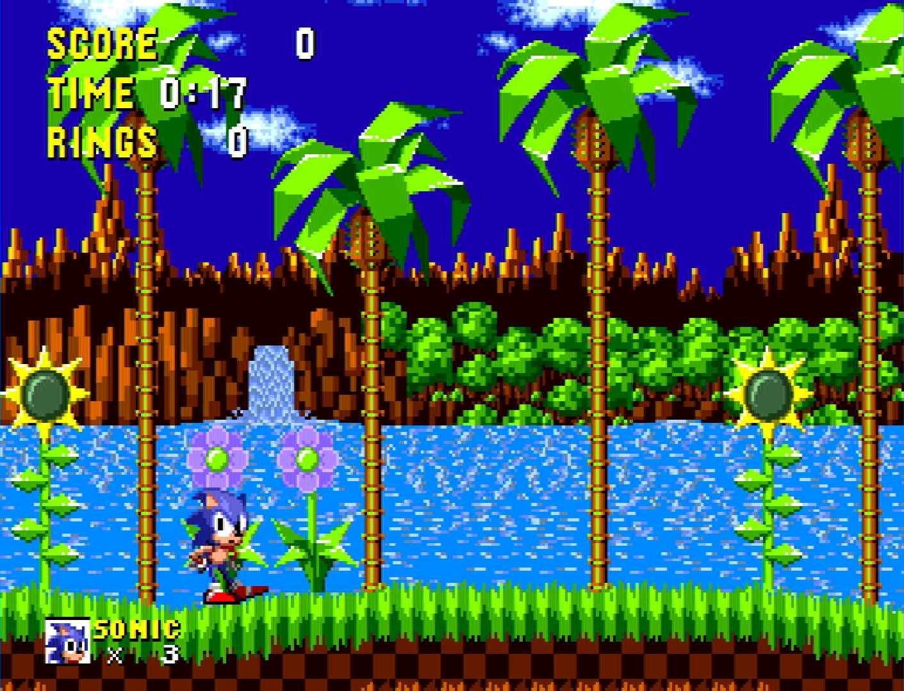
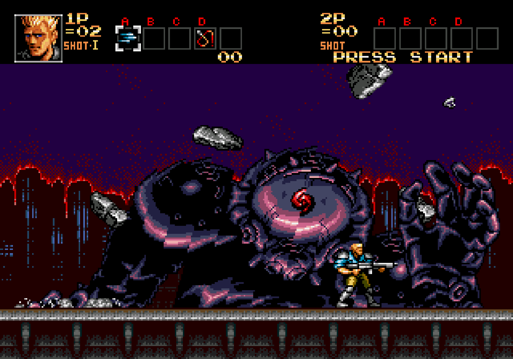
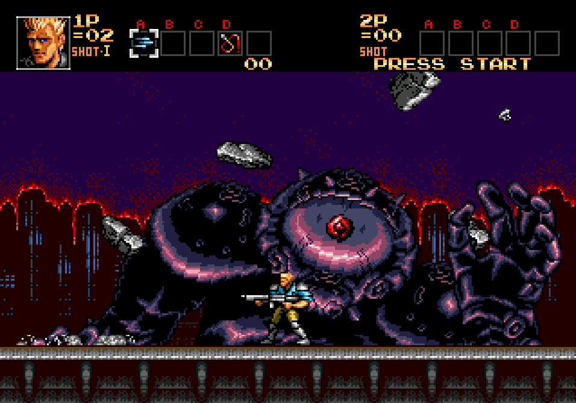

# Sega - MS/GG/MD/CD (Genesis Plus GX)

## Background

Genesis Plus GX is an open-source Sega 8/16 bit emulator developed by Eke-Eke which focuses on accuracy and portability. The source code, originally based on Genesis Plus 1.3 by Charles MacDonald, has been heavily modified & enhanced, with respect to initial goals and design, in order to improve the accuracy of emulation, implementing new [features](https://github.com/ekeeke/Genesis-Plus-GX/blob/master/wiki/Features.md) and adding support for [extra peripherals](https://github.com/ekeeke/Genesis-Plus-GX/blob/master/wiki/Features.md#support-for-various-peripherals), [cartridge & systems hardware](https://github.com/ekeeke/Genesis-Plus-GX/blob/master/wiki/Features.md#support-for-various-cartridges-extra-hardware) such as various lightguns, the FM Sound Unit and Lock-On cartridge technology.

Genesis Plus GX has [100% compatibility](https://github.com/ekeeke/Genesis-Plus-GX/blob/master/wiki/Compatibility.md) with Genesis / Mega Drive, Sega/Mega CD, Master System, Game Gear, SG-1000 & Pico released software (including all unlicensed or pirate known dumps), also emulating backwards compatibility modes when available. 

**Keep in mind that [32X games](https://segaretro.org/Sega_32X#List_of_games) are not supported.**

The Genesis Plus GX core has been authored by:

- Eke-Eke
- Charles McDonald

The Genesis Plus GX core is licensed under:

- [Non-commercial](https://github.com/libretro/Genesis-Plus-GX/blob/master/LICENSE.txt)

A summary of the licenses behind RetroArch and its cores can be found [here](../development/licenses.md).

## BIOS

[Required or optional firmware files](https://docs.libretro.com/library/bios/) go in the frontend's system directory:

!!! warning ""
    Please note that BIOS choice isn't locked to any specific revisions.
!!! warning ""
    BIOS files that are labeled (bootrom) and (lock-on) must have their corresponding [core option](#core-options) ('System bootrom' core option or 'Cartridge lock-on' core option) configured correctly in order for them to be loaded.

| Filename      | Description                                     | md5sum                           |
|:-------------:|:-----------------------------------------------:|:--------------------------------:|
| bios_MD.bin   | [MegaDrive startup ROM](https://segaretro.org/TradeMark_Security_System) (bootrom) - Optional | 45e298905a08f9cfb38fd504cd6dbc84 |
| bios_CD_E.bin | [MegaCD EU BIOS](https://segaretro.org/Sega_Mega-CD/Boot_ROM) - Required for MegaCD EU games   | e66fa1dc5820d254611fdcdba0662372 |
| bios_CD_U.bin | [SegaCD US BIOS](https://segaretro.org/Sega_Mega-CD/Boot_ROM) - Required for SegaCD US games   | 854b9150240a198070150e4566ae1290 |
| bios_CD_J.bin | [MegaCD JP BIOS](https://segaretro.org/Sega_Mega-CD/Boot_ROM) - Required for MegaCD JP games   | 278a9397d192149e84e820ac621a8edd |
| bios_E.sms    | [MasterSystem EU BIOS](https://segaretro.org/Sega_Master_System/Boot_ROM) (bootrom) - Optional       | 840481177270d5642a14ca71ee72844c |
| bios_U.sms    | [MasterSystem US BIOS](https://segaretro.org/Sega_Master_System/Boot_ROM) (bootrom) - Optional       | 840481177270d5642a14ca71ee72844c |
| bios_J.sms    | [MasterSystem JP BIOS](https://segaretro.org/Sega_Master_System/Boot_ROM) (bootrom) - Optional       | 24a519c53f67b00640d0048ef7089105 |
| bios.gg       | [GameGear BIOS](https://www.smspower.org/Development/BIOSes#GameGear) (bootrom) - Optional              | 672e104c3be3a238301aceffc3b23fd6 |
| sk.bin        | [Sonic & Knuckles ROM (lock-on)](https://segaretro.org/Sonic_%26_Knuckles/Technical_information) - Optional       | 4ea493ea4e9f6c9ebfccbdb15110367e |
| sk2chip.bin   | [Sonic & Knuckles UPMEM ROM]: [Link 1](https://emulation.gametechwiki.com/index.php/Sega_Genesis_emulators#Lock-On_Emulation); [Link 2](https://info.sonicretro.org/Knuckles_the_Echidna_in_Sonic_the_Hedgehog_2#Functioning) (lock-on) - Optional | b4e76e416b887f4e7413ba76fa735f16 |
| areplay.bin   | [Action Replay ROM](https://segaretro.org/Action_Replay) (lock-on) - Optional          | a0028b3043f9d59ceeb03da5b073b30d |
| ggenie.bin    | [Game Genie ROM (lock-on)](https://segaretro.org/Game_Genie_(Mega_Drive)) - Optional             | e8af7fe115a75c849f6aab3701e7799b |

## Extensions

Content that can be loaded by the Genesis Plus GX core have the following file extensions:

* .m3u
* .mdx
* .md
* .smd
* .gen
* .bin
* .cue
* .iso
* .chd
* .bms
* .sms
* .gg
* .sg
* .68k
* .sgd


RetroArch database(s) that are associated with the Genesis Plus GX core:

- [Sega - Game Gear](https://github.com/libretro/libretro-database/blob/master/rdb/Sega%20-%20Game%20Gear.rdb)
- [Sega - Master System - Mark III](https://github.com/libretro/libretro-database/blob/master/rdb/Sega%20-%20Master%20System%20-%20Mark%20III.rdb)
- [Sega - Mega-CD - Sega CD](https://github.com/libretro/libretro-database/blob/master/rdb/Sega%20-%20Mega-CD%20-%20Sega%20CD.rdb)
- [Sega - Mega Drive - Genesis](https://github.com/libretro/libretro-database/blob/master/rdb/Sega%20-%20Mega%20Drive%20-%20Genesis.rdb)
- [Sega - PICO](https://github.com/libretro/libretro-database/blob/master/rdb/Sega%20-%20PICO.rdb)
- [Sega - SG-1000](https://github.com/libretro/libretro-database/blob/master/rdb/Sega%20-%20SG-1000.rdb)

## Features

Frontend-level settings or features that the Genesis Plus GX core respects:

| Feature           | Supported |
|-------------------|:---------:|
| Restart           | ✔         |
| Saves             | ✔         |
| States            | ✔         |
| Rewind            | ✔         |
| Netplay           | ✔         |
| Core Options      | ✔         |
| RetroAchievements | ✔         |
| RetroArch Cheats  | ✔         |
| Native Cheats     | ✕         |
| Controls          | ✔         |
| Remapping         | ✔         |
| Multi-Mouse       | ✔         |
| Rumble            | ✕         |
| Sensors           | ✕         |
| Camera            | ✕         |
| Location          | ✕         |
| Subsystem         | ✕         |
| [Softpatching](../guides/softpatching.md) | ✕         |
| Disk Control      | ✔         |
| Username          | ✕         |
| Language          | ✔         |
| Crop Overscan*     | ✕         |
| LEDs              | ✔         |

\* Overscan cropping available via the 'Borders' core option instead of frontend-level settings

## Directories

The Genesis Plus GX core's library name is 'Genesis Plus GX'

The Genesis Plus GX core saves/loads to/from these directories:

**Frontend's Save directory**

| File         | Description                                                                          |
|:------------:|:------------------------------------------------------------------------------------:|
| *.srm        | [MS/GG/MD/Pico/SG-1000 Cartridge](https://segaretro.org/Cartridge) backup save                                          |
| cart.brm     | [Sega/Mega CD RAM Cart](https://segaretro.org/CD_BackUp_RAM_Cart)                                                                |
| scd_U.brm    | [Sega CD US Backup RAM](https://segaretro.org/Sega_Mega-CD/Technical_specifications#Memory) - When the [CD System BRAM core option](#system) is set to 'Per-BIOS'     |
| scd_E.brm    | [Mega CD EU Backup RAM](https://segaretro.org/Sega_Mega-CD/Technical_specifications#Memory) - When the [CD System BRAM core option](#system) is set to 'Per-BIOS'    |
| scd_J.brm    | [Mega CD JP Backup RAM](https://segaretro.org/Sega_Mega-CD/Technical_specifications#Memory) - When the [CD System BRAM core option](#system) is set to 'Per-BIOS'     |
| *.brm        | [Sega CD/MegaCD Backup RAM](https://segaretro.org/Sega_Mega-CD/Technical_specifications#Memory) - When the [CD System BRAM core option](#system) is set to 'Per-Game' |

**Frontend's State directory**

| File     | Description |
|:--------:|:-----------:|
| *.state# | State       |

## Geometry and timing

- The Genesis Plus GX core's provided FPS is dependent on the [loaded content](https://github.com/libretro/Genesis-Plus-GX/blob/master/libretro/libretro.c#L3027)
- The Genesis Plus GX core's provided sample rate is [44100 Hz](https://github.com/libretro/Genesis-Plus-GX/blob/master/libretro/libretro.c#L199)
- The Genesis Plus GX core's base width is dependent on the [loaded content](https://github.com/libretro/Genesis-Plus-GX/blob/master/libretro/libretro.c#L2999)
- The Genesis Plus GX core's base height is dependent on the [loaded content](https://github.com/libretro/Genesis-Plus-GX/blob/master/libretro/libretro.c#L3000)
- The Genesis Plus GX core's max width is dependent on the [loaded content](https://github.com/libretro/Genesis-Plus-GX/blob/master/libretro/libretro.c#L3001-L3029)
- The Genesis Plus GX core's max height is dependent on the [loaded content](https://github.com/libretro/Genesis-Plus-GX/blob/master/libretro/libretro.c#L3001-L3029)
- The Genesis Plus GX core's provided aspect ratio is dependent on the 'Core-provided aspect ratio' [core option](#video)

## Loading Sega CD games
When loading Sega CD games, Genesis Plus GX needs a cue-sheet that points to an image file. A cue sheet, or cue file, is a metadata file which describes how the tracks of a CD or DVD are laid out.

If you have e.g. `foo.bin`, you should create a text file and save it as `foo.cue`. If the Sega CD game is single-track, the cue file contents should look like this:

```
 FILE "foo.bin" BINARY
  TRACK 01 MODE1/2352
   INDEX 01 00:00:00
```

After that, you can load the `foo.cue` file in RetroArch with the Genesis Plus GX core.

!!! warning ""
    Certain Sega CD games are multi-track, so their .cue files might be more complicated.

Here's a cue file example done with Lunar - Eternal Blue (USA)


!!! warning ""
	For Sega-CD games, ISO + WAV, BIN + CUE and ISO + OGG formats are supported; ISO + MP3 is not supported. Audio files must be in the 16-bit stereo 44100Hz format. If using a cue sheet, WAV or OGG tracks should be denoted as AUDIO.

When loading ISO + WAV or ISO + OGG format games, the core will attempt to load a cue named the same as the iso first. If one is not found, the following audio track naming formats are accepted for a data track of "game.iso":

- game02.ogg
- game 02.ogg
- game-02.ogg
- game - 02.ogg
- game_02.ogg

### Loading Multiple Disk games

If foo is a multiple-disk Sega CD game, you should have .cue files for each one, e.g. `foo (Disc 1).cue`, `foo (Disc 2).cue`, `foo (Disc 3).cue`.

To take advantage of Genesis Plus GX's Disk Control feature for disk swapping, an index file (a m3u file) should be made.

Create a text file and save it as `foo.m3u`. Then enter your game's .cue files on it. The m3u file contents should look something like this:

`foo.m3u`
```
foo (Disc 1).cue
foo (Disc 2).cue
foo (Disc 3).cue
```

After that, you can load the `foo.m3u` file in RetroArch with the Genesis Plus GX core.

Here's a m3u example done with the Sega CD 32x version of Night Trap



!!! attention
	Adding multi-track games to a RetroArch playlist is recommended. (Manually add an entry a playlist that points to `foo.m3u`)

### Swapping Disks

Disks can be swapped through Quick Menu -> Disk Control in RetroArch.

If not using .m3u files, .cue files must be manually selected via the Load New Disk legacy feature.

If using .m3u files, disks can be swapped by selecting Eject Disk, changing the Current Disk Index to your desired disk, and finally selecting Insert Disk.

### CHD

Alternatively to using cue sheets with .bin/.iso files, you can convert your Sega CD games to .chd (MAME Compressed Hunks of Data) to reduce file sizes and neaten up your game folder.

To convert content to CHD format, use the chdman tool found inside the latest MAME distribution and point it to a .cue file, like so:

```
chdman createcd --input foo.cue --output foo.chd
```

!!! attention
	For multi-disc content, make an .m3u file that lists all the .chd files instead of .cue files (content must be added to playlists manually).

## Playing with MD+ / MSU-MD modes

Comparable to how MSU-1 modifcations can enhance SNES games; Mega Drive Plus / Genesis Plus (MD+) and MSU-MD (Mega SD flash cartridge) patches can be used to add CD quality level of audio to certain Sega Genesis and Mega Drive games via the emulated Sega CD hardware and its CDDA track functionality.

Regarding Genesis Plus GX's implementation of MD+ mode operation, all CD overlay commands (incl. cue loop commands) described in MegaSD dev manual (see referenced PDF at the end of this section) are supported except the ones that deal with opening/reading files from SD card (starting from command 1Ch) but afaik no MD+ hacks use these commands so far.

Since there is no way to auto-detect a MD+ patched ROM, MegaSD add-on emulation needs to be enabled in core options (through the newly added "CD add-on" core option). However, when "CD add-on" core option is set to Auto, if a cue file with same basename as loaded ROM file is found in same directory AND that cue file contains MegaSD specific keywords ("REM LOOP xxx", "REM NOLOOP",...), MegaSD CD overlay emulation will be automatically enabled (instead of full Sega/Mega CD hardware emulation).

By setting the "CD add-on" core option to "Sega/Mega CD", you can force Sega/Mega CD hardware emulation when any MD game (<8MB) is loaded even if there is no cue file found in loaded game directory (this can be useful for demos or homebrew games that want to use Mega CD extra hardware without necessarily having a loaded CD beforehand).

And by setting the "CD add-on" option to "None", Sega/Mega CD hardware emulation will be forced disabled, even if a cue file is found in loaded game directory or when the loaded game is known to have Sega/Mega CD support (like Pier Solar, Flux or Wonder Library). This emulates the behavior where there is no Sega/Mega CD unit attached.

Although no known games are using them, MegaSD extended SSF2 mapper and limited ROM write mapper (automatically enabled when respectively "SEGA SSF2" and "SEGA MEGASD" are found in loaded ROM header) are also emulated, according to the description in MegaSD dev manual. Note that MegaSD overlay will also automatically be enabled when these mappers are detected, no matter of the "CD Add-on" core option.

Please peruse the official MegaSD manual for further information: https://downloads.terraonion.com/public/MegaSD_DEV_Manual.pdf

Also, there's an useful reference wiki here for MSU-MD games/patches and its technical specifications here: https://arcadetv.github.io/msu-md-patches/

!!! attention
	Make sure that your files match what's specified in your MD+/MSU-MD cue file!

## Core options

The Genesis Plus GX core has the following options that can be tweaked from your frontend's core options menu or manually changed via core configuration files. Options are listed below in the following format:

Option Name [option_key] 

(setting1/setting2/...)

To manually change an option, search for that option's key in the core configuration file you want to edit and set it to your desired setting value, enclosed in quotations. For example, if you had set the CD-DA Volume to 50% and wanted to revert it to 100%, you would change genesis_plus_gx_cdda_volume = "50" to genesis_plus_gx_cdda_volume = "100". Manually editing core configuration files is typically unnecessary unless your frontend does not have a method for toggling options.

The default setting for each option will be highlighted in **bold**. Settings with (Restart) means that core has to be shut down for the new setting to be applied on next launch.

### System

Configure base hardware selection / region / BIOS / Sega CD save file parameters.
_________________

**System hardware** [genesis_plus_gx_system_hw]

Runs loaded content with a specific emulated console.

* **Auto [auto]** Loads the game with the most appropriate system based on the loaded [game's ROM information](https://github.com/libretro/Genesis-Plus-GX/blob/master/core/loadrom.c) like its ROM type, product code/version, checksum, size and region code.
* SG-1000 [sg-1000 II] - Loads game with the [SG-1000 console](https://segaretro.org/SG-1000).
* SG-1000 II + RAM Ext. [sg-1000 II + ram ext.] - Loads game with the [SG-1000 II console](https://segaretro.org/SG-1000_II) with a [RAM extension adapter](https://segaretro.org/8kB_RAM_Adapter).
* Mark III [mark-III] - Loads game with the [Mark III console](https://segaretro.org/Sega_Mark_III)
* Master System [master system] - Loads game with the [Master System console](https://segaretro.org/Sega_Master_System#Master_System)
* Master System II [master system II] - Loads game with the [Master System II console](https://segaretro.org/Sega_Master_System#Master_System_II)
* Game Gear [game gear] - Loads game with the [Game Gear handheld console](https://segaretro.org/Sega_Game_Gear)
* Mega Drive/Genesis [mega drive / genesis] - Loads game with the [Mega Drive/Genesis console](https://segaretro.org/Sega_Mega_Drive)

**System region** [genesis_plus_gx_region_detect]

Specify which region the system is from. For consoles other than the Game Gear, PAL is 50hz while NTSC is 60hz. Games may run faster or slower than normal if the incorrect region is selected.

* **Auto [auto]** - Changes the system's region to whatever is most appropriate for the game which is based on the loaded [game's ROM information](https://github.com/libretro/Genesis-Plus-GX/blob/master/core/loadrom.c) like its ROM type, product code/version, checksum, size and region code.
* NTSC-U [ntsc-u] - Changes the system's region to [NTSC-U](https://en.wikipedia.org/wiki/NTSC).
* PAL [pal] - Changes the system's region to [PAL](https://en.wikipedia.org/wiki/PAL_region).
* NTSC-J [ntsc-j] - Changes the system's region to [NTSC-J](https://en.wikipedia.org/wiki/NTSC-J).
 
**System Boot ROM** [genesis_plus_gx_bios] (**disabled**/enabled)

Use official BIOS/bootloader for emulated hardware, if present in RetroArch's system directory. Displays console-specific start-up sequence/animation, then runs loaded content. Look above at the [BIOS section](#bios) for supported BIOS types/files.

* **Off [disabled]** - Disables using the user supplied System Boot ROM.
* On [enabled] - Enables using the user supplied System Boot ROM.

**CD System BRAM** [genesis_plus_gx_system_bram]

When running Sega CD content, specifies whether to share a single save file between all games from a specific region (Per-BIOS) or to create a separate save file for each game (Per-Game). Note that the Sega CD has [limited internal storage](https://segaretro.org/Sega_Mega-CD/Technical_specifications#Memory), sufficient only for a handful of titles. To avoid running out of space, the 'Per-Game' setting is recommended.

* **Per-BIOS [per bios]** - All games from a specific region share a single save file.
* Per-Game [per game] - Creates a separate save file for each game.

??? note "*CD System BRAM diagram*"
	

**CD Backup Cart BRAM** [genesis_plus_gx_cart_bram]

When running Sega CD content, specifies whether to share a single backup [ram cart](https://segaretro.org/CD_BackUp_RAM_Cart) for all games (Per-Cart) or to create a separate backup ram cart for each game (Per-Game).

* **Per-Cart [per cart]** - All games share a single backup RAM cart.
* Per-Game [per game] - Creates a seperate backrup RAM cart for each game.

**CD add-on (MD mode) (Requires Restart)** [genesis_plus_gx_add_on]

Specify which add-on to use for CD audio playback with supported Mega Drive/Genesis games.

* **Auto [auto]** - Loads a CD game with the most appropriate CD add-on based on the loaded [game's ROM information](https://github.com/libretro/Genesis-Plus-GX/blob/master/core/loadrom.c) like its ROM type, product code/version, checksum, size and region code. (when "CD add-on" core option is set to Auto, if a cute file with same basename as loaded ROM file is found in same directory AND that cue file contains MegaSD specific keywords ("REM LOOP xxx", "REM NOLOOP",...), MegaSD CD overlay emulation will be automatically enabled (instead of full Sega/Mega CD hardware emulation))
* Sega/Mega CD [sega/mega cd] - Loads the game using the [Sega/Mega CD add-on](https://segaretro.org/Sega_Mega-CD). (this can be useful for demos or homebrew games that want to use Mega CD extra hardware without necessarily having a loaded CD beforehand since it forces Sega/Mega CD hardware emulation when any MD game (<8MB) is loaded even if there is no CUE file found in loaded game directory)
* MegaSD [megasd] - Loads the game using the [MegaSD FPGA cartridge](https://wiki.terraonion.com/index.php/MegaSD). Look at the # section for more information.
* None [none] - Disables loading a CD game with any CD add-on. (Sega/Mega CD hardware emulation will be forced disabled, even if a CUE file is found in loaded game directory or when the loaded game is known to have Sega/Mega CD support (like Pier Solar, Flux or Wonder Library). This emulates the behavior where there is no Sega/Mega CD unit attached.)

**Cartridge Lock-On** [genesis_plus_gx_lock_on]

Lock-On Technology is a Mega Drive/Genesis feature that allowed an older game to connect to the pass-through port of a special cartridge for extended or altered gameplay. This option specifies which type of special 'lock-on' cartridge to emulate. Look above at the [BIOS section](#bios) for supported BIOS types/files.

* **Off [disabled]**
* Game Genie [game genie] - Connects the loaded game to a [Gamie Genie](https://segaretro.org/Game_Genie_(Mega_Drive)).
* Action Replay (Pro) [action replay (pro)] - Connects the loaded game to an [Action Replay (Pro)](https://segaretro.org/Action_Replay).
* Sonic & Knuckles [sonic & knuckles)] - Connects the loaded game to [Sonic & Knuckles](https://info.sonicretro.org/Sonic_%26_Knuckles).

### Video

Configure aspect ratio / display cropping / video filter / frame skipping parameters.
_________________

**Core-Provided Aspect Ratio** [genesis_plus_gx_aspect_ratio]

Choose the preferred content aspect ratio. This will only apply when RetroArch's aspect ratio is set to 'Core provided' in the Video settings.

* **Auto [auto]** - Chooses the aspect ratio based on the loaded [game's ROM information](https://github.com/libretro/Genesis-Plus-GX/blob/master/core/loadrom.c) like its ROM type, product code/version, checksum, size and region code.
* NTSC PAR [NTSC PAR] - Sets the game's aspect ratio to NTSC PAR.
* PAL PAR [PAL PAR] - Sets the game's aspect ratio to PAL PAR.

**Borders** [genesis_plus_gx_overscan]

Enable this to display the overscan regions at the top/bottom and/or left/right of the screen. These would normally be hidden by the bezel around the edge of a standard-definition television.

* **Off [disabled]** - Disables displaying the game's overscan regions.
* Top/Bottom [top/bottom] - Enables displaying the game's Top and Bottom overscan regions.
* Left/Right [left/right] - Enables displaying the game's Left and Right overscan regions.
* Full [full] - Enables displaying the game's Top/Bottom and Left/Right overscan regions.

**Hide Master System Side Borders** [genesis_plus_gx_left_border]

Cuts off 8 pixels from either the left side of the screen, or both left and right sides when running Master System games.

* **Off [disabled]** - Disabling cutting off pixels from the screen of a Master System game.
* Left Border Only [left border] - Cuts off 8 pixels from the left side of the screen of a Master System game.
* Left & Right Borders [left & right borders] - Cuts off 8 pixels from the right side of the screen of a Master System game.

**Game Gear Extended Screen** [genesis_plus_gx_gg_extra]

Forces Game Gear titles to run in 'SMS' mode, with an increased resolution of 256x192. May show additional content, but typically displays a border of corrupt/unwanted image data.

??? note "*Off [disabled]*"
    

??? note "*On [enabled]*"
    

**Blargg NTSC Filter** [genesis_plus_gx_blargg_ntsc_filter] - Apply a video filter to mimic various NTSC TV signals.

??? note "*Disabled vs All Filters (video)*"
    https://youtu.be/buZPDyDzvPY

??? note "*Off [disabled]*"
    

??? note "*Monochrome [monochrome]*"
    

??? note "*Composite [composite]*"
    

??? note "*S-Video [svideo]*"
    

??? note "*RGB [rgb]*"
    

**LCD Ghosting Filter** [genesis_plus_gx_lcd_filter]

Apply an image 'ghosting' filter to mimic the display characteristics of the Game Gear and 'Genesis Nomad' LCD panels.

* **Off** [disabled] - Disables ghosting filter.
* On [enabled] - Enables ghosting filter.

??? note "*Disabled vs Enabled (video)*"
    https://youtu.be/Us13sJPEUD8

??? note "*Enabled*"
    

**Interlaced Mode 2 Output** [genesis_plus_gx_render]

Interlaced Mode 2 allows the Mega Drive/Genesis to output a double height (high resolution) 320x448 image by drawing alternate scanlines each frame (this is used by 'Sonic the Hedgehog 2' and 'Combat Cars' multiplayer modes). 'Single Field' mimics original hardware, producing each field (320x224) alternatively with flickering/interlacing artefacts. 'Double Field' simulates the interlaced display, which stabilises the image but causes mild blurring.

* **Single Field** [single field] - Sets Interlaced Mode 2 Output as Single Field.
* Double Field [double field] - Sets Interlaced Mode 2 Output as Double Field.

??? note "*Single Field vs Double Field (video)*"
    https://youtu.be/xZc58OSPj4Y

??? note "*Single Field*"
    

??? note "*Double Field*"
    

**Frameskip** [genesis_plus_gx_frameskip]

Skip frames to avoid audio buffer under-run (crackling). Improves performance at the expense of visual smoothness. 'Auto' skips frames when advised by the frontend. 'Manual' utilises the 'Frameskip Threshold (%)' setting.

* **Off [disabled]** - Disables frameskip.
* Auto [auto] - Automatically skips frames to avoid audio crackling.
* Manual [manual] - Allows the user to utilises the 'Frameskip Threshold' core option's set percentage to manually adjust frameskip.

**Frameskip Threshold (%)** [genesis_plus_gx_frameskip_threshold]

When the 'Frameskip' core option is set to 'Manual', specifies the audio buffer occupancy threshold (percentage) below which frames will be skipped. Higher values reduce the risk of crackling by causing frames to be dropped more frequently.

: 15% to 60% in increments of 3%, **33% is default**.

### Audio

Change audio device settings.
_________________

**Master System FM (YM2413)** [genesis_plus_gx_ym2413]

Enable emulation of the [FM Sound Unit](http://segaretro.org/FM_Sound_Unit) used by certain Sega Mark III/Master System games for enhanced audio output.

* **Auto [auto]** - Automatically enables emulation of FM Sound Unit based on the loaded [game's ROM information](https://github.com/libretro/Genesis-Plus-GX/blob/master/core/loadrom.c) like its ROM type, product code/version, checksum, size and region code.
* Off [disabled] - Manually disables emulation of FM Sound Unit.
* On [enabled] - Manually enables emulation of FM Sound Unit.

**Master System FM (YM2413) Core** - [genesis_plus_gx_ym2413_core]

Select method used to emulate the [FM Sound Unit](https://segaretro.org/FM_Sound_Unit) of the Sega Mark III/Master System. 'MAME' option is fast, and runs full speed on most systems. 'Nuked' option is cycle accurate, very high quality, and has substantial CPU requirements.

* **MAME [mame]** - Uses the MAME option for emulating the FM Sound Unit for Sega Mark III/Master System games which is fast and full speed for most games.
* Nuked [nuked] - Uses the Nuked option for emulating the FM Sound Unit for Sega Mark III/Master System games which is high quality but has substantial CPU requirements.

**Mega Drive/Genesis FM** [genesis_plus_gx_ym2612]

Select method used to emulate the FM synthesizer (main sound generator) of the Mega Drive/Genesis. 'MAME' options are fast, and run full speed on most systems. 'Nuked' options are cycle accurate, very high quality, and have substantial CPU requirements. The ['YM2612'](https://segaretro.org/YM2612) chip is used by the original Model 1 Mega Drive/Genesis. The ['YM3438'](https://segaretro.org/index.php?title=YM3438&redirect=no) is used in later Mega Drive/Genesis revisions.

* **MAME (YM2612) [mame (ym2612)]** - Selects MAME (YM2612) [original Model 1 Mega Drive/Genesis] as FM synthesizer method which is fast and fullspeed.
* MAME (ASIC YM3438) [mame (asic ym3438)] - Selects MAME (ASIC YM3438) [later Mega Drive/Genesis revisions] as FM synthesizer method which is fast and fullspeed.
* MAME (Enhanced YM3438) [mame (enhanced ym3438)] - Selects MAME (Enhanced YM3438) [later Mega Drive/Genesis revisions] as FM synthesizer method which is fast and fullspeed.
* Nuked (YM2612) [nuked (ym2612)] - Selects Nuked (YM2612) [original Model 1 Mega Drive/Genesis] as FM synthesizer method which is high quality but has high CPU requirements.
* Nuked (YM3438) [nuked (ym3438)] - Selects Nuked (YM3438) [later Mega Drive/Genesis revisions] FM synthesizer method which is fast but has high CPU requirements.

**Sound Output** [genesis_plus_gx_sound_output]

Select stereo or mono sound reproduction.

* **Stereo [stereo]** - Selects stereo output.
* Mono (mono) - Selects mono output.

**Audio Filter** [genesis_plus_gx_audio_filter]

Enable a low pass audio filter to better simulate the characteristic sound of a Model 1 Mega Drive/Genesis.

* **Off [disabled]** - Disables low pass audio filter.
* Low-Pass [low-pass] - Enables low pass audio filter.
* EQ [EQ] - Enables internal audio equalizer.

**Low-Pass Filter %** [genesis_plus_gx_lowpass_range]

Specify the cut-off frequency of the low-pass audio filter. A higher value increases the perceived 'strength' of the filter, since a wider range of the high frequency spectrum is attenuated. This core option requires the 'Audio Filter' core option to be set to 'Low-Pass".

* 5% to 95% in increments of 5. *60% is default**. 

**PSG Preamp Level** [genesis_plus_gx_psg_preamp]

Set the audio preamplifier level of the emulated SN76496 4-channel Programmable Sound Generator found in the [SG-1000](https://segaretro.org/SG-1000#Sound), [Sega Mark III](https://segaretro.org/Sega_Mark_III#Sound), [Master System](https://segaretro.org/Sega_Master_System/Technical_specifications#Audio), [Game Gear](https://segaretro.org/Sega_Game_Gear#Technical_specifications) and [Mega Drive/Genesis](https://segaretro.org/Sega_Mega_Drive/Technical_specifications#Audio).

* 0 to 200 in increments of 5. **150 is default**.

**FM Preamp Level** [genesis_plus_gx_fm_preamp]

Set the audio preamplifier level of the emulated [Mega Drive/Genesis FM sound synthesizer](https://segaretro.org/Sega_Mega_Drive/Technical_specifications#Audio) or [Sega Mark III/Master System FM Sound Unit](https://segaretro.org/FM_Sound_Unit).

* 0 to 200 in increments of 5. **100 is default**.

**CD-DA Volume** [genesis_plus_gx_cdda_volume]

Adjust the mixing volume of the emulated [CD audio](https://segaretro.org/Sega_Mega-CD/Technical_specifications#Audio) playback output.

* 0 to 100 in increments of 5. **100 is default**.

**PCM Volume** [genesis_plus_gx_pcm_volume] - Adjust the mixing volume of the emulated [Sega CD/Mega-CD RF5C164 PCM](https://segaretro.org/Sega_Mega-CD/Technical_specifications#Audio) sound generator output.

* 0 to 100 in increments of 5. **100 is default**.

**EQ Low** [genesis_plus_gx_audio_eq_low]

Adjust the low range band of the internal audio equalizer.

* 0 to 100 in increments of 5. **100 is default**.

**EQ Mid** [genesis_plus_gx_audio_eq_mid]

Adjust the mid range band of the internal audio equalizer.

* 0 to 100 in increments of 5. **100 is default**.

**EQ High** [genesis_plus_gx_audio_eq_high]

Adjust the high range band of the internal audio equalizer.

* 0 to 100 in increments of 5. **100 is default**.

### Input
_________________
Change light gun and/or mouse input settings.

**Light Gun Input** [genesis_plus_gx_gun_input]

Use a mouse-controlled 'Light Gun' or 'Touchscreen' input.

* **Light Gun [lightgun]** - Selects mouse-controlled 'Light Gun' input (devices will use [RetroLightgun](#lightgun) inputs).
* Touchscreen [touchscreen] - Allows the [MS Light Phaser, MD Menancer and MD Justifiers](#lightgun) device types to be controlled via touchscreen input (devices will use [RetroPointer](#pointer) inputs instead).

**Show Light Gun Crosshair** [genesis_plus_gx_gun_cursor]

Display light gun crosshairs when using the [MD Menacer, MD Justifiers and MS Light Phaser](#lightgun) input device types.

* **Off [disabled]** - Disables light gun crosshair for the aftermentioned input device types.
* On [enabled] - Enables light gun crosshair for the aftermentioned input device types.

??? note "*Disabled vs Enabled (video)*"
    https://www.youtube.com/watch?v=w6iYysbni2g

**Invert Mouse Y-Axis** [genesis_plus_gx_invert_mouse]

Inverts the Y-axis of the ['MD Mouse'](#mouse) input device type.

* **Off [disabled]** - Enables Y-Axis inversion for the 'MD Mouse' device type.
* On [enabled] - Disables Y-Axis inversion for the 'MD Mouse' device type.

### Emulation Hacks
_________________
Change processor overclocking and emulation accuracy settings that affect low-level performance and compatibility.

**Remove Per-Line Sprite Limit** [genesis_plus_gx_no_sprite_limit]

Removes the original sprite-per-scanline hardware limit. This reduces flickering but can cause visual glitches, as some games exploit the hardware limit to generate special effects.

* **Off [disabled]** - Keeps the per-line sprite limit.
* On [enabled] - Disables the per-line sprite limit.

??? note "*Disabled vs Enabled (video)*"
    https://youtu.be/IZp5epy-hBM

**Enhanced per-tile vertical scroll** [genesis_plus_gx_enhanced_vscroll]

Allows each individual cell to be scrolled vertically, instead of 16px 2-cell, by averaging out with the vscroll value of the neighbouring cell. This hack only applies to few games that use 2-cell vertical scroll mode.

* **Off [disabled]** - Enables enhanced per-tile vertical scrolling.
* On [enabled] - Disables enhanced per-tile vertical scrolling.

??? note "*Disabled*"
    

??? note "*Enabled [16]*"
    

**Enhanced per-tile vertical scroll limit** [genesis_plus_gx_enhanced_vscroll_limit]

Only is usable when the 'Enhanced per-tile vertical scroll' core option is enabled. Adjusts the limit of the vertical scroll enhancement. When the vscroll difference between neighbouring tiles is bigger than this limit, the enhancement is disabled.

* 2 to 16 in increments of 1. **8 is default**

**CPU Speed** [genesis_plus_gx_overclock]

Overclock the emulated CPU. Can reduce slowdown, but may cause glitches.

* 100% to 500% in increments of 25%. **100% is default.**

??? note "*!00% vs 200% (video)*"
    https://youtu.be/yE8qzwVuy5Q

**System Locks-Ups** [genesis_plus_gx_force_dtack]

Emulate system lock-ups that occur on real hardware when performing illegal address access. This should only be disabled when playing certain demos, homebrew and ROM hacks that rely on illegal behavior for correct operation.

* **On [enabled]** - Enables emulation of system lock-ups.
* Off [disabled] - Disables emulation of system lock-ups.

??? note "*Enabled vs Disabled (video)*"
    https://youtu.be/B1n1wQGzzYk

**68K Address Error** [genesis_plus_gx_addr_error]

The [Mega Drive/Genesis main CPU (Motorola 68000)](http://segaretro.org/M68000) generates an Address Error exception (crash) when attempting to perform unaligned memory access. Enabling this will simulate this behavior. It should only be disabled when playing ROM hacks, since these are typically developed using less accurate emulators and may rely on invalid RAM access for correct operation.

* **On [enabled]** - Enables simulation of 68K Address Error.
* Off [disabled] - Disables simulation of 68K Address Error.

??? note "*Enabled vs Disabled (video)*"
    https://youtu.be/zjBPz9QWRqI

??? note "*Enabled*"
    

**CD access time** [genesis_plus_gx_cd_latency]

Simulate [original CD hardware latency](https://segaretro.org/Sega_Mega-CD/Technical_specifications#Storage) when initiating a read or seeking to a specific location on loaded disc. This is required by a few CD games that crash if CD data is available too soon and also fixes CD audio desync issues in some games. Disabling this can be useful with [MD+ or MSU-MD games](https://emulation.gametechwiki.com/index.php/Sega_Genesis_emulators#Mega_Drive_Plus_.2F_Genesis_Plus_.2F_MSU-MD_modes) as it makes CD audio tracks loops more seamless.

* **On [enabled]** - Enables simulation of original CD hardware latency.
* Off [disabled] - Disables simulation of original CD hardware latency.

### Advanced Channel Volume Settings
_________________
Change the volume of individual hardware audio channels.

**Show Advanced Audio Volume Settings (Reopen menu)** [genesis_plus_gx_show_advanced_audio_settings]

Enable configuration of low-level audio channel parameters core options listed below. NOTE: Quick Menu must be toggled for this setting to take effect.

* **On [enabled]** - Enables configuration of low-level audio channel parameters.
* Off [disabled] - Disables configuration of low-level audio channel parameters.

**PSG Tone Channel 0 Volume %** [genesis_plus_gx_psg_channel_0_volume]

Adjust the volume of Channel 0 of the [PSG Tone](https://segaretro.org/Sega_Mega_Drive/Technical_specifications#Audio).

* 0% to 100% in increments of 10%. **100% is default**.

**PSG Tone Channel 1 Volume %** [genesis_plus_gx_psg_channel_1_volume]

Adjust the volume of Channel 1 of the [PSG Tone](https://segaretro.org/Sega_Mega_Drive/Technical_specifications#Audio).

* 0% to 100% in increments of 10%. **100% is default**.

**PSG Tone Channel 2 Volume %** [genesis_plus_gx_psg_channel_2_volume]

Adjust the volume of Channel 2 of the [PSG Tone](https://segaretro.org/Sega_Mega_Drive/Technical_specifications#Audio).

* 0% to 100% in increments of 10%. **100% is default**.

**PSG Tone Channel 3 Volume %** [genesis_plus_gx_psg_channel_3_volume]

Adjust the volume of Channel 3 of the [PSG Tone](https://segaretro.org/Sega_Mega_Drive/Technical_specifications#Audio).

* 0% to 100% in increments of 10%. **100% is default**.

**Mega Drive/Genesis FM Channel 0 Volume %** [genesis_plus_gx_md_channel_0_volume]

Adjust the volume of Channel 0 of the [Mega Drive/Genesis FM](https://segaretro.org/Sega_Mega_Drive/Technical_specifications#Audio). Only works with MAME FM emulators ('Mega Drive/Genesis FM' core option).

* 0% to 100% in increments of 10%. **100% is default**.

**Mega Drive/Genesis FM Channel 1 Volume %** [genesis_plus_gx_md_channel_1_volume]

Adjust the volume of Channel 1 of the [Mega Drive/Genesis FM](https://segaretro.org/Sega_Mega_Drive/Technical_specifications#Audio). Only works with MAME FM emulators ('Mega Drive/Genesis FM' core option).

* 0% to 100% in increments of 10%. **100% is default**.

**Mega Drive/Genesis FM Channel 2 Volume %** [genesis_plus_gx_md_channel_2_volume]

Adjust the volume of Channel 2 of the [Mega Drive/Genesis FM](https://segaretro.org/Sega_Mega_Drive/Technical_specifications#Audio). Only works with MAME FM emulators ('Mega Drive/Genesis FM' core option).

* 0% to 100% in increments of 10%. **100% is default**.

**Mega Drive/Genesis FM Channel 3 Volume %** [genesis_plus_gx_md_channel_3_volume]

Adjust the volume of Channel 3 of the [Mega Drive/Genesis FM](https://segaretro.org/Sega_Mega_Drive/Technical_specifications#Audio). Only works with MAME FM emulators ('Mega Drive/Genesis FM' core option).

* 0% to 100% in increments of 10%. **100% is default**.

**Mega Drive/Genesis FM Channel 4 Volume %** [genesis_plus_gx_md_channel_4_volume]

Adjust the volume of Channel 4 of the [Mega Drive/Genesis FM](https://segaretro.org/Sega_Mega_Drive/Technical_specifications#Audio). Only works with MAME FM emulators ('Mega Drive/Genesis FM' core option).

* 0% to 100% in increments of 10%. **100% is default**.

**Mega Drive/Genesis FM Channel 5 Volume %** [genesis_plus_gx_md_channel_5_volume]

Adjust the volume of Channel 5 of the [Mega Drive/Genesis FM](https://segaretro.org/Sega_Mega_Drive/Technical_specifications#Audio). Only works with MAME FM emulators ('Mega Drive/Genesis FM' core option).

* 0% to 100% in increments of 10%. **100% is default**.

**Master System FM (YM2413) Channel 0 Volume %** [genesis_plus_gx_sms_fm_channel_0_volume]

Adjust the volume of Channel 0 of the [Master System FM](https://segaretro.org/Sega_Master_System/Technical_specifications#Audio).

* 0% to 100% in increments of 10%. **100% is default**.

**Master System FM (YM2413) Channel 1 Volume %** [genesis_plus_gx_sms_fm_channel_1_volume]

Adjust the volume of Channel 1 of the [Master System FM](https://segaretro.org/Sega_Master_System/Technical_specifications#Audio).

* 0% to 100% in increments of 10%. **100% is default**.

**Master System FM (YM2413) Channel 2 Volume %** [genesis_plus_gx_sms_fm_channel_2_volume]

Adjust the volume of Channel 2 of the [Master System FM](https://segaretro.org/Sega_Master_System/Technical_specifications#Audio).

* 0% to 100% in increments of 10%. **100% is default**.

**Master System FM (YM2413) Channel 3 Volume %** [genesis_plus_gx_sms_fm_channel_3_volume]

Adjust the volume of Channel 3 of the [Master System FM](https://segaretro.org/Sega_Master_System/Technical_specifications#Audio).

* 0% to 100% in increments of 10%. **100% is default**.

**Master System FM (YM2413) Channel 4 Volume %** [genesis_plus_gx_sms_fm_channel_4_volume]

Adjust the volume of Channel 4 of the [Master System FM](https://segaretro.org/Sega_Master_System/Technical_specifications#Audio).

* 0% to 100% in increments of 10%. **100% is default**.

**Master System FM (YM2413) Channel 5 Volume %** [genesis_plus_gx_sms_fm_channel_5_volume]

Adjust  the volume of Channel 5 of the [Master System FM](https://segaretro.org/Sega_Master_System/Technical_specifications#Audio).

* 0% to 100% in increments of 10%. **100% is default**.

**Master System FM (YM2413) Channel 6 Volume %** [genesis_plus_gx_sms_fm_channel_6_volume]

Adjust the volume of Channel 6 of the [Master System FM](https://segaretro.org/Sega_Master_System/Technical_specifications#Audio).

* 0% to 100% in increments of 10%. **100% is default**.

**Master System FM (YM2413) Channel 7 Volume %** [genesis_plus_gx_sms_fm_channel_7_volume]

Adjust the volume of Channel 7 of the [Master System FM](https://segaretro.org/Sega_Master_System/Technical_specifications#Audio).

* 0% to 100% in increments of 10%. **100% is default**.

**Master System FM (YM2413) Channel 8 Volume %** [genesis_plus_gx_sms_fm_channel_8_volume]

Adjust the volume of Channel 8 of the [Master System FM](https://segaretro.org/Sega_Master_System/Technical_specifications#Audio).

* 0% to 100% in increments of 10%. **100% is default**.

## User 1 device types

The Genesis Plus GX core supports the following device type(s) in the controls menu, bolded device types are the default for the specified user(s):

- Joypad Port Empty - None - No device is connected; input is disabled.
- **Joypad Auto** - Joypad - Depending on the loaded [game's ROM information](https://github.com/libretro/Genesis-Plus-GX/blob/master/core/loadrom.c), the core will automatically emulate a MD Joypad 3 Button controller, or a MD Joypad 6 Button controller or a MS Joypad 2 Button controller.
- [MD Joypad 3 Button](https://segaretro.org/Control_Pad_(Mega_Drive)) - Joypad
- [MD Joypad 6 Button](https://segaretro.org/Six_Button_Control_Pad_(Mega_Drive)) - Joypad
- [MS Joypad 2 Button](https://segaretro.org/Control_Pad_(Master_System)) - Joypad - Also used for Game Gear.
- [MD Joypad 3 Button + 4-WayPlay](https://segaretro.org/4_Way_Play) - Joypad - Enables multitap for 4-WayPlay games.
- [MD Joypad 6 Button + 4-WayPlay](https://segaretro.org/4_Way_Play) - Joypad - Enables multitap for 4-WayPlay games.
- [MD Joypad 3 Button + Teamplayer](https://segaretro.org/Team_Player) - Joypad - Enables multitap for Teamplayer games.
- [MD Joypad 6 Button + Teamplayer](https://segaretro.org/Team_Player) - Joypad - Enables multitap for Teamplayer games.
- MS Joypad 2 Button + Master Tap - Joypad - Enables [Furrtek's Master Tap](https://www.smspower.org/Homebrew/BOoM-SMS) (unofficial mulitap device).
- [MS Light Phaser](https://segaretro.org/Light_Phaser) - Lightgun
- [MS Paddle Control](https://segaretro.org/Paddle_Control) - Analog
- [MS Sports Pad](https://segaretro.org/Sports_Pad) - Analog
- [MS Graphic Board](https://segaretro.org/Sega_Graphic_Board) - Pointer
- [MD XE-1AP](https://segaretro.org/XE-1_AP) - Analog
- [MD Mouse](https://segaretro.org/Sega_Mouse) - Mouse

## User 2 device types

- Joypad Port Empty - None - No device is connected; input is disabled.
- **Joypad Auto** - Joypad - Depending on the loaded [game's ROM information](https://github.com/libretro/Genesis-Plus-GX/blob/master/core/loadrom.c), the core will automatically emulate a MD Joypad 3 Button controller, or a MD Joypad 6 Button controller or a MS Joypad 2 Button controller.
- [MD Joypad 3 Button](https://segaretro.org/Control_Pad_(Mega_Drive)) - Joypad
- [MD Joypad 6 Button](https://segaretro.org/Six_Button_Control_Pad_(Mega_Drive)) - Joypad
- [MS Joypad 2 Button](https://segaretro.org/Control_Pad_(Master_System)) - Joypad - Also used for Game Gear.
- [MD Joypad 3 Button + 4-WayPlay](https://segaretro.org/4_Way_Play) - Joypad - Enables multitap for 4-WayPlay games.
- [MD Joypad 6 Button + 4-WayPlay](https://segaretro.org/4_Way_Play) - Joypad - Enables multitap for 4-WayPlay games.
- [MD Joypad 3 Button + Teamplayer](https://segaretro.org/Team_Player) - Joypad - Enables multitap for Teamplayer games.
- [MD Joypad 6 Button + Teamplayer](https://segaretro.org/Team_Player) - Joypad - Enables multitap for Teamplayer games.
- MS Joypad 2 Button + Master Tap - Joypad - Enables [Furrtek's Master Tap](https://www.smspower.org/Homebrew/BOoM-SMS) (unofficial mulitap device).
- [MD Menancer](https://segaretro.org/Menacer) - Lightgun
- [MD Justifiers](https://segaretro.org/The_Justifier)  - Lightgun
- [MS Light Phaser](https://segaretro.org/Light_Phaser) - Lightgun
- [MS Paddle Control](https://segaretro.org/Paddle_Control) - Analog
- [MS Sports Pad](https://segaretro.org/Sports_Pad) - Analog
- [MS Graphic Board](https://segaretro.org/Sega_Graphic_Board) - Pointer
- [MD XE-1AP](https://segaretro.org/XE-1_AP) - Analog
- [MD Mouse](https://segaretro.org/Sega_Mouse) - Mouse

## Other devices

- [PICO tablet](https://segaretro.org/Sega_Pico) - The Genesis Plus GX core can emulate PICO tablet inputs but this is done automatically; based on the loaded [game's ROM information](https://github.com/libretro/Genesis-Plus-GX/blob/master/core/loadrom.c) and cannot be manually selected as a device type.
- [Terebi Oekaki tablet](https://segaretro.org/Terebi_Oekaki) - The Genesis Plus GX core can emulate Terebi Oekaki table inputs but this is done automatically; based on the loaded [game's ROM information](https://github.com/libretro/Genesis-Plus-GX/blob/master/core/loadrom.c) and cannot be manually selected as a device type.

## Multitap

Activating multitap support in compatible games can be configured by the 4-WayPlay, Teamplayer or Master Tap device types for the [User 1](#user-1-device-types) and/or [User 2](#user-2-device-types) ports.

## Joypad

| RetroPad Inputs                                | User 1 - 8 input descriptors | [MD Joypad 3 Button](https://segaretro.org/Control_Pad_(Mega_Drive)) | [MD Joypad 6 Button](https://segaretro.org/Six_Button_Control_Pad_(Mega_Drive)) | [MS Joypad 2 Button](https://segaretro.org/Control_Pad_(Master_System)) | [MS Paddle Control](https://segaretro.org/Paddle_Control) | [MS Sports Pad](https://segaretro.org/Sports_Pad) | [MD XE-1AP](https://segaretro.org/XE-1_AP)     |
|------------------------------------------------|------------------------------|--------------------|--------------------|--------------------|-------------------|---------------|---------------|
|              | B                            | B                  | B                  | 1                  | 1                 | 1             | E2            |
|              | A                            | A                  | A                  |                    |                   |               | E1            |
|         | Mode                         |                    | Mode               |                    |                   |               | Select        |
|          | Start                        | Start              | Start              | Start              | Start             | Start         | Start         |
|        | D-Pad Up                     | D-Pad Up           | D-Pad Up           | D-Pad Up           |                   |               |               |
|      | D-Pad Down                   | D-Pad Down         | D-Pad Down         | D-Pad Down         |                   |               |               |
|      | D-Pad Left                   | D-Pad Left         | D-Pad Left         | D-Pad Left         |                   |               |               |
|     | D-Pad Right                  | D-Pad Right        | D-Pad Right        | D-Pad Right        |                   |               |               |
|              | C                            | C                  | C                  | 2                  |                   | 2             |               |
|              | Y                            |                    | Y                  |                    |                   |               |               |
|             | X                            |                    | X                  |                    |                   |               | C             |
|             | Z                            |                    | Z                  |                    |                   |               | A             |
|             |                              |                    |                    |                    |                   |               | D             |
|             |                              |                    |                    |                    |                   |               | B             |
|             |                              |                    |                    |                    |                   |               |               |
|             |                              |                    |                    |                    |                   |               |               |
|  X  |                              |                    |                    |                    | Paddle            | Trackball X   | Thumb-stick X |
|  Y  |                              |                    |                    |                    |                   | Trackball Y   | Thumb-stick Y |
|  X |                              |                    |                    |                    |                   |               | Slider Y      |
|  Y |                              |                    |                    |                    |                   |               | Slider X      |

## Mouse

| RetroMouse Inputs                                     | [MD Mouse](https://segaretro.org/Sega_Mouse)        |
|-------------------------------------------------------|-----------------|
|  Mouse Cursor | MD Mouse Cursor |
|  Mouse 1       | MD Mouse Left   |
|  Mouse 2      | MD Mouse Right  |
|  Mouse 3     | MD Mouse Start  |
| Wheel Down                                            | MD Mouse Center |

## Pointer

| RetroPointer Inputs                                                                                                    | [MS Graphic Board](https://segaretro.org/Sega_Graphic_Board)        |
|------------------------------------------------------------------------------------------------------------------------|-------------------------|
|  or  Pointer Position | MS Graphic Board Stylus |
|  Mouse 1                                                                        | MS Graphic Board Pen    |
|  Mouse 2                                                                       | MS Graphic Board Menu   |
|  Mouse 3                                                                      | MS Graphic Board Do     |

## Lightgun

| RetroLightgun Inputs                                   | [MD Menacer](https://segaretro.org/Menacer)           | [MD Justifier](https://segaretro.org/The_Justifier)           | [MS Light Phaser](https://segaretro.org/Light_Phaser)           |
|--------------------------------------------------------|----------------------|------------------------|---------------------------|
|  Gun Crosshair | MD Menacer Crosshair | MD Justifier Crosshair | MS Light Phaser Crosshair |
| Gun Trigger                                            | MD Menacer A         | MD Justifier A         | MS Light Phaser A         |
| Gun Aux A                                              | MD Menacer B         | MD Justifer B          | MS Light Phaser B         |
| Gun Aux B                                              | MD Menacer C         | MD Justifer C          | MS Light Phaser C         |
| Gun Start                                              | MD Menacer Start     | MD Justifer Start      | MS Light Phaser Start     |

## Other

| Inputs                                                                                                                   | [PICO tablet](https://segaretro.org/Sega_Pico)               | [Terebi Oekaki tablet](https://segaretro.org/Terebi_Oekaki)      |
|--------------------------------------------------------------------------------------------------------------------------|---------------------------|---------------------------|
|  or  Pointer Position | PICO tablet Stylus        | Terebi Oekaki tablet Stylus |
|  Mouse 1                                                                          | PICO tablet Pen           | Terebi Oekaki tablet Pen    |
|  Mouse 2                                                                         | PICO tablet Red           |                           |
|  Mouse 3                                                                        |                           | Terebo Oekaki tablet Start  |
| Wheel Up                                                                                                                 | PICO tablet Previous page |                           |
| Wheel Down                                                                                                               | PICO tablet Next page     |                           |
|                                                                                  | PICO tablet Up (White)    |                           |
|                                                                                | PICO tablet Down (Orange) |                           |
|                                                                                | PICO tablet Left (Purple) |                           |
|                                                                               | PICO tablet Right (Green) |                           |

## External Links

- [Official Genesis Plus GX Github Repository](https://github.com/ekeeke/Genesis-Plus-GX)
- [Libretro Genesis Plus GX Core Info File](https://github.com/libretro/libretro-super/blob/master/dist/info/genesis_plus_gx_libretro.info)
- [Libretro Genesis Plus GX Github Repository](https://github.com/libretro/Genesis-Plus-GX)
- [Report Libretro Genesis Plus GX Core Issues Here](https://github.com/libretro/Genesis-Plus-GX/issues)
- [Gameplay Videos Playlist on YouTube](https://www.youtube.com/playlist?list=PLRbgg4gk_0If0UWkhjPbRmWUBcGaRiPZt)

## Sega 8/16-bit cores

- [Sega - Master System (Emux SMS)](emux_sms.md)
- [Sega - MS/MD/CD/32X (PicoDrive)](picodrive.md)
- [Sega - MS/GG/SG-1000 (Gearsystem)](gearsystem.md)
- [MSX/SVI/ColecoVision/SG-1000 (blueMSX)](bluemsx.md)
