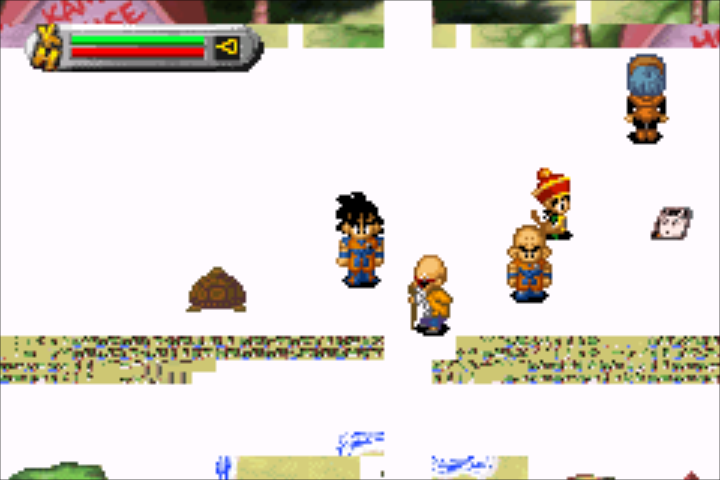

# Nintendo - Game Boy Advance (gpSP)

## Background

gpSP is a Game Boy Advance emulator based on notaz' fork of gpSP with additional codebase improvements.

### Author/License

The gpSP core has been authored by

- Exophase

The gpSP core is licensed under

- [GPLv2](https://github.com/libretro/gpsp/blob/master/COPYING)

A summary of the licenses behind RetroArch and its cores can be found [here](../development/licenses.md).

## Extensions

Content that can be loaded by the gpSP core have the following file extensions:

- .gba
- .bin

## Databases

RetroArch database(s) that are associated with the gpSP core:

- [Nintendo - Game Boy Advance](https://github.com/libretro/libretro-database/blob/master/rdb/Nintendo%20-%20Game%20Boy%20Advance.rdb)

## BIOS

Required or optional firmware files go in the frontend's system directory.

|   Filename    |    Description                    |              md5sum              |
|:-------------:|:---------------------------------:|:--------------------------------:|
| gba_bios.bin  | Game Boy Advance Image - Optional | a860e8c0b6d573d191e4ec7db1b1e4f6 |

## Features

Frontend-level settings or features that the gpSP core respects.

| Feature           | Supported |
|-------------------|:---------:|
| Restart           | ✔         |
| Screenshots       | ✔         |
| Saves             | ✔         |
| States            | ✔         |
| Rewind            | ✔         |
| Netplay           | ✕         |
| Core Options      | ✕         |
| RetroAchievements | ✔         |
| RetroArch Cheats  | ✔         |
| [RetroArch SaveRAM Autosave Interval support](https://github.com/libretro/RetroArch/issues/16323#issuecomment-1977792161) | ✕ |
| Native Cheats     | ✕         |
| Controls          | ✔         |
| Remapping         | ✔         |
| Multi-Mouse       | ✕         |
| Rumble            | ✕         |
| Sensors           | ✕         |
| Camera            | ✕         |
| Location          | ✕         |
| Subsystem         | ✕         |
| [Softpatching](../guides/softpatching.md) | ✕         |
| Disk Control      | ✕         |
| Username          | ✕         |
| Language          | ✕         |
| Crop Overscan     | ✕         |
| LEDs              | ✕         |

### Directories

The gpSP core's directory name is 'gpSP'

The gpSP core saves/loads to/from these directories.

**Frontend's Save directory**

- 'content-name'.srm (Cartridge battery save)

**Frontend's State directory**

- 'content-name'.state# (State)

### Geometry and timing

- The gpSP core's core provided FPS is 59.72750057
- The gpSP core's core provided sample rate is 65536 Hz
- The gpSP core's core provided aspect ratio is 3/2

## Controllers

The gpSP core supports the following device type(s) in the controls menu, bolded device types are the default for the specified user(s):

### User 1 device types

- None - Doesn't disable input.
- **RetroPad** - Joypad
- RetroPad w/Analog - Joypad - There's no reason to switch to this.

### Controller tables

#### Joypad

| User 1 Remap descriptors | RetroPad Inputs                           |
|--------------------------|-------------------------------------------|
| B                        |     |
| Select                   |      |
| Start                    |       |
| D-Pad Up                 |     |
| D-Pad Down               |   |
| D-Pad Left               |   |
| D-Pad Right              |  |
| A                        |     |

## Compatibility

| Game                                  | Issue                          |
|---------------------------------------|--------------------------------|
| ~~Activision Anthology~~               |~~Freezes when entering a game.~~|
| Banjo-Kazooie - Grunty's Revenge    |Black screen during developer logo. ~~Resets when Banjo leaves his house.~~|
| Boktai Trilogy                      |The solar sensor is not emulated. |
| ~~DemiKids - Light/Dark Version~~       |~~Crashes when entering a battle.~~ |
| ~~Digimon Racing (Europe)~~             |~~Freezes during the intro.~~   |
| Dragon Ball Z - The Legacy of Goku  |Graphics glitches. |
| Final Fantasy VI                    |Background/tiling order issues.  |
| ~~Game Boy Advance Video - Dragon Ball GT - Volume 1~~ |~~White screen.~~     |
| ~~Grand Theft Auto Advance~~            |~~Crashes after first dialog.~~      |
| Harry Potter - Quidditch World Cup  |Crashes when going ingame.       |
| Koro Koro Puzzle Happy Panechu!     |The tilt sensor is not emulated. |
| ~~Mario & Luigi - Superstar Saga~~      |~~Crashes when entering a battle.~~  |
| Phantasy Star Collection            |Phantasy Star 1 flickers - turn on Interframe Blending in core options to fix.|
| ~~R-Type III - The Third Lightning~~    |~~Softlocks at Irem startup screen.~~|
| ~~Rock 'n Roll Racing~~                 |~~Corrupted graphics, not playable.~~|
| ~~Rockman & Forte~~                     |~~Doesn't continue after GBA BIOS screen.~~|
| Sims 2, The - Pets |Graphics glitches. Heavy flickering, black objects. |
| Street Racing Syndicate             |Crashes afer pressing Start.|
| ~~Super Monkey Ball Jr.~~               |~~Softlocks at startup screen.~~|
| Super Street Fighter II Turbo/X Revival |Small graphics glitch. Selecting speed 'Turbo 1' and beyond on the character select screen makes the game speed window not fully visible. |
| ~~Tales of Phantasia (USA version)~~    |~~Softlocks during the introduction sequence (just before the small guy hits the tall guy in the right).~~|
| WarioWare: Twisted!                 |The tilt sensor is not emulated.|
| ~~Wolfenstein 3D~~                      |~~Softlocks at id Software startup screen.~~|
| Yoshi’s Universal Gravitation       |The tilt sensor is not emulated.|

??? note "(1)"
	

??? note "(2)"
	

??? note "(3)"
	

## External Links

- [Official gpSP Website](http://notaz.gp2x.de/other.php)
- [Official gpSP Github Repository](https://github.com/notaz/gpsp)
- [Libretro gpSP Core info file](https://github.com/libretro/libretro-super/blob/master/dist/info/gpsp_libretro.info)
- [Libretro gpSP Github Repository](https://github.com/libretro/gpsp)
- [Report Libretro gpSP Core Issues Here](https://github.com/libretro/gpsp/issues)
- [Gameplay Videos](https://www.youtube.com/playlist?list=PLRbgg4gk_0Iczn5l7AfS11JNbXUv5Widl)

### See also

#### Nintendo - Game Boy Advance

- [Nintendo - Game Boy Advance (Beetle GBA)](beetle_gba.md)
- [Nintendo - Game Boy Advance (Meteor)](meteor.md)
- [Nintendo - Game Boy Advance (mGBA)](mgba.md)
- [Nintendo - Game Boy Advance (TempGBA)](tempgba.md)
- [Nintendo - Game Boy Advance (VBA-M)](vba_m.md)
- [Nintendo - Game Boy Advance (VBA Next)](vba_next.md)
